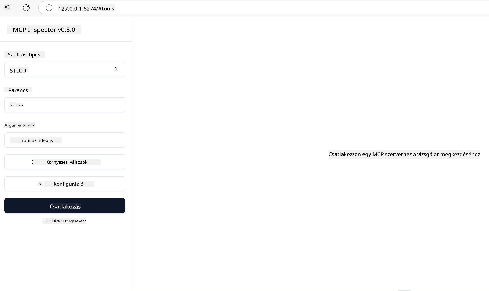

<!--
CO_OP_TRANSLATOR_METADATA:
{
  "original_hash": "717f34718a773f6cf52d8445e40a96bf",
  "translation_date": "2025-05-17T12:46:59+00:00",
  "source_file": "03-GettingStarted/07-testing/README.md",
  "language_code": "hu"
}
-->
## Tesztelés és Hibakeresés

Mielőtt elkezdené tesztelni az MCP szerverét, fontos megérteni a rendelkezésre álló eszközöket és a legjobb gyakorlatokat a hibakereséshez. Az eredményes tesztelés biztosítja, hogy a szerver a várt módon működjön, és segít gyorsan azonosítani és megoldani a problémákat. Az alábbi szakasz bemutatja az MCP implementáció érvényesítéséhez ajánlott megközelítéseket.

## Áttekintés

Ez a lecke azt tárgyalja, hogyan válasszuk ki a megfelelő tesztelési megközelítést és a leghatékonyabb tesztelési eszközt.

## Tanulási Célok

A lecke végére képes lesz:

- Leírni a különböző tesztelési megközelítéseket.
- Különböző eszközöket használni a kód hatékony teszteléséhez.

## MCP Szerverek Tesztelése

Az MCP eszközöket biztosít a szerverek teszteléséhez és hibakereséséhez:

- **MCP Inspector**: Parancssori eszköz, amely CLI eszközként és vizuális eszközként is futtatható.
- **Kézi tesztelés**: Használhat olyan eszközt, mint a curl, webes kérések futtatására, de bármely HTTP futtatására képes eszköz megfelelő.
- **Egységtesztelés**: Lehetséges a kedvenc tesztelési keretrendszer használata a szerver és kliens funkcióinak tesztelésére.

### MCP Inspector Használata

Korábbi leckékben már leírtuk ennek az eszköznek a használatát, de beszéljünk róla kicsit magas szinten. Ez egy Node.js-ben épített eszköz, amelyet a `npx` végrehajtásával használhat, amely ideiglenesen letölti és telepíti magát az eszközt, majd tisztítja magát, miután lefutott a kérése.

Az [MCP Inspector](https://github.com/modelcontextprotocol/inspector) segít:

- **Szerver Képességek Felfedezése**: Automatikusan felismeri a rendelkezésre álló erőforrásokat, eszközöket és promptokat
- **Eszköz Végrehajtás Tesztelése**: Próbáljon ki különböző paramétereket és lássa a válaszokat valós időben
- **Szerver Metaadatok Megtekintése**: Vizsgálja meg a szerver információit, sémákat és konfigurációkat

Az eszköz tipikus futtatása így néz ki:

```bash
npx @modelcontextprotocol/inspector node build/index.js
```

A fenti parancs elindítja az MCP-t és annak vizuális felületét, valamint egy helyi webes felületet indít el a böngészőjében. Várhatóan egy irányítópultot fog látni, amely megjeleníti a regisztrált MCP szervereket, azok rendelkezésre álló eszközeit, erőforrásait és promptjait. A felület lehetővé teszi az eszköz végrehajtás interaktív tesztelését, a szerver metaadatainak vizsgálatát és a valós idejű válaszok megtekintését, megkönnyítve az MCP szerver implementációk érvényesítését és hibakeresését.

Így nézhet ki: 

Az eszközt CLI módban is futtathatja, ebben az esetben hozzáadja a `--cli` attribútumot. Íme egy példa az eszköz "CLI" módban történő futtatására, amely felsorolja az összes eszközt a szerveren:

```sh
npx @modelcontextprotocol/inspector --cli node build/index.js --method tools/list
```

### Kézi Tesztelés

Az inspector eszköz futtatása mellett a szerver képességek tesztelésére egy hasonló megközelítés az, hogy futtatunk egy HTTP használatára képes klienst, például curl.

A curl segítségével közvetlenül tesztelheti az MCP szervereket HTTP kérésekkel:

```bash
# Example: Test server metadata
curl http://localhost:3000/v1/metadata

# Example: Execute a tool
curl -X POST http://localhost:3000/v1/tools/execute \
  -H "Content-Type: application/json" \
  -d '{"name": "calculator", "parameters": {"expression": "2+2"}}'
```

Ahogy a curl használatából látszik, POST kérést használ, hogy egy eszközt hívjon meg a nevéből és paramétereiből álló payload segítségével. Használja a legjobban megfelelő megközelítést. Általában a CLI eszközök gyorsabbak a használatra és szkriptekbe illeszthetők, ami hasznos lehet egy CI/CD környezetben.

### Egységtesztelés

Hozzon létre egységteszteket az eszközeihez és erőforrásaihoz, hogy biztosítsa, megfelelően működnek. Íme néhány példa tesztkód.

```python
import pytest

from mcp.server.fastmcp import FastMCP
from mcp.shared.memory import (
    create_connected_server_and_client_session as create_session,
)

# Mark the whole module for async tests
pytestmark = pytest.mark.anyio


async def test_list_tools_cursor_parameter():
    """Test that the cursor parameter is accepted for list_tools.

    Note: FastMCP doesn't currently implement pagination, so this test
    only verifies that the cursor parameter is accepted by the client.
    """

 server = FastMCP("test")

    # Create a couple of test tools
    @server.tool(name="test_tool_1")
    async def test_tool_1() -> str:
        """First test tool"""
        return "Result 1"

    @server.tool(name="test_tool_2")
    async def test_tool_2() -> str:
        """Second test tool"""
        return "Result 2"

    async with create_session(server._mcp_server) as client_session:
        # Test without cursor parameter (omitted)
        result1 = await client_session.list_tools()
        assert len(result1.tools) == 2

        # Test with cursor=None
        result2 = await client_session.list_tools(cursor=None)
        assert len(result2.tools) == 2

        # Test with cursor as string
        result3 = await client_session.list_tools(cursor="some_cursor_value")
        assert len(result3.tools) == 2

        # Test with empty string cursor
        result4 = await client_session.list_tools(cursor="")
        assert len(result4.tools) == 2
    
```

Az előző kód a következőket teszi:

- Kihasználja a pytest keretrendszert, amely lehetővé teszi, hogy teszteket hozzon létre függvényekként és assert állításokat használjon.
- Létrehoz egy MCP szervert két különböző eszközzel.
- Az `assert` állítást használja annak ellenőrzésére, hogy bizonyos feltételek teljesülnek.

Tekintse meg a [teljes fájlt itt](https://github.com/modelcontextprotocol/python-sdk/blob/main/tests/client/test_list_methods_cursor.py)

Az előző fájl alapján saját szerverét tesztelheti, hogy biztosítsa, a képességek a várt módon jönnek létre.

Minden főbb SDK hasonló tesztelési szekcióval rendelkezik, így alkalmazkodhat a választott futási környezethez.

## Minták

- [Java Számológép](../samples/java/calculator/README.md)
- [.Net Számológép](../../../../03-GettingStarted/samples/csharp)
- [JavaScript Számológép](../samples/javascript/README.md)
- [TypeScript Számológép](../samples/typescript/README.md)
- [Python Számológép](../../../../03-GettingStarted/samples/python)

## További Források

- [Python SDK](https://github.com/modelcontextprotocol/python-sdk)

## Mi következik

- Következő: [Telepítés](/03-GettingStarted/08-deployment/README.md)

**Jogi nyilatkozat**:  
Ezt a dokumentumot az AI fordítószolgáltatás, a [Co-op Translator](https://github.com/Azure/co-op-translator) segítségével fordítottuk le. Bár törekszünk a pontosságra, kérjük, vegye figyelembe, hogy az automatikus fordítások tartalmazhatnak hibákat vagy pontatlanságokat. Az eredeti dokumentum az eredeti nyelvén tekintendő hiteles forrásnak. Kritikus információk esetén javasolt a professzionális emberi fordítás. Nem vállalunk felelősséget a fordítás használatából eredő félreértésekért vagy félremagyarázásokért.