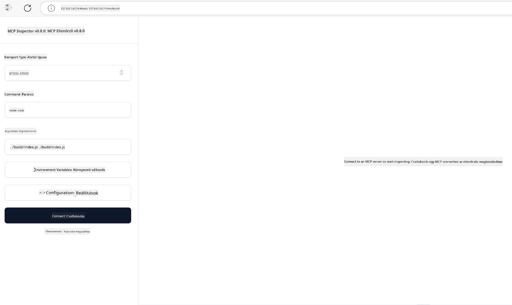

<!--
CO_OP_TRANSLATOR_METADATA:
{
  "original_hash": "4e34e34e84f013e73c7eaa6d09884756",
  "translation_date": "2025-07-13T22:03:08+00:00",
  "source_file": "03-GettingStarted/08-testing/README.md",
  "language_code": "hu"
}
-->
## Tesztelés és Hibakeresés

Mielőtt elkezdenéd tesztelni az MCP szerveredet, fontos megérteni a rendelkezésre álló eszközöket és a hibakeresés legjobb gyakorlatait. A hatékony tesztelés biztosítja, hogy a szerver a várakozásoknak megfelelően működjön, és segít gyorsan azonosítani és megoldani a problémákat. A következő részben ajánlott módszereket ismertetünk az MCP megvalósításának ellenőrzésére.

## Áttekintés

Ebben a leckében azt tárgyaljuk, hogyan válaszd ki a megfelelő tesztelési megközelítést és a leghatékonyabb tesztelő eszközt.

## Tanulási célok

A lecke végére képes leszel:

- Leírni a különböző tesztelési megközelítéseket.
- Különböző eszközöket használni a kód hatékony teszteléséhez.

## MCP szerverek tesztelése

Az MCP eszközöket biztosít a szerverek teszteléséhez és hibakereséséhez:

- **MCP Inspector**: Parancssori eszköz, amely futtatható CLI-ként és vizuális eszközként is.
- **Kézi tesztelés**: Használhatsz például curl-t webkérések futtatásához, de bármilyen HTTP-képes eszköz megfelel.
- **Egységtesztelés**: Használhatod a kedvenc tesztelési keretrendszeredet a szerver és kliens funkcióinak tesztelésére.

### MCP Inspector használata

Ezt az eszközt korábbi leckékben már bemutattuk, de most egy kicsit átfogóbb képet adunk róla. Ez egy Node.js-ben készült eszköz, amelyet az `npx` futtatható fájl segítségével használhatsz. Ez az eszköz ideiglenesen letölti és telepíti magát, majd a futtatás után eltávolítja magát.

Az [MCP Inspector](https://github.com/modelcontextprotocol/inspector) segít neked:

- **Szerver képességek felfedezése**: Automatikusan felismeri az elérhető erőforrásokat, eszközöket és promptokat
- **Eszközök futtatásának tesztelése**: Különböző paraméterek kipróbálása és válaszok valós idejű megtekintése
- **Szerver metaadatainak megtekintése**: Szerver információk, sémák és konfigurációk vizsgálata

Egy tipikus futtatás így néz ki:

```bash
npx @modelcontextprotocol/inspector node build/index.js
```

A fenti parancs elindít egy MCP-t és annak vizuális felületét, majd megnyit egy helyi webes felületet a böngésződben. Egy irányítópultot láthatsz, amely megjeleníti a regisztrált MCP szervereidet, azok elérhető eszközeit, erőforrásait és promptjait. Az interfész lehetővé teszi az eszközök interaktív tesztelését, a szerver metaadatainak vizsgálatát és a valós idejű válaszok megtekintését, megkönnyítve ezzel az MCP szerver implementációk ellenőrzését és hibakeresését.

Így nézhet ki: 

Az eszközt CLI módban is futtathatod, ehhez add hozzá a `--cli` kapcsolót. Íme egy példa a CLI módban történő futtatásra, amely listázza a szerveren található összes eszközt:

```sh
npx @modelcontextprotocol/inspector --cli node build/index.js --method tools/list
```

### Kézi tesztelés

Az inspector eszköz futtatása mellett egy másik hasonló megközelítés, ha egy HTTP-képes klienssel, például curl-lel teszteled a szervert.

Curl segítségével közvetlenül HTTP kérésekkel tesztelheted az MCP szervereket:

```bash
# Example: Test server metadata
curl http://localhost:3000/v1/metadata

# Example: Execute a tool
curl -X POST http://localhost:3000/v1/tools/execute \
  -H "Content-Type: application/json" \
  -d '{"name": "calculator", "parameters": {"expression": "2+2"}}'
```

Ahogy a fenti curl használatból látható, egy POST kérést használsz az eszköz meghívására, amelynek terhelése az eszköz nevét és paramétereit tartalmazza. Válaszd azt a módszert, amelyik neked a legkényelmesebb. A CLI eszközök általában gyorsabbak és könnyen automatizálhatók, ami hasznos lehet CI/CD környezetben.

### Egységtesztelés

Készíts egységteszteket az eszközeidhez és erőforrásaidhoz, hogy biztosítsd azok megfelelő működését. Íme egy példa tesztkód.

```python
import pytest

from mcp.server.fastmcp import FastMCP
from mcp.shared.memory import (
    create_connected_server_and_client_session as create_session,
)

# Mark the whole module for async tests
pytestmark = pytest.mark.anyio


async def test_list_tools_cursor_parameter():
    """Test that the cursor parameter is accepted for list_tools.

    Note: FastMCP doesn't currently implement pagination, so this test
    only verifies that the cursor parameter is accepted by the client.
    """

 server = FastMCP("test")

    # Create a couple of test tools
    @server.tool(name="test_tool_1")
    async def test_tool_1() -> str:
        """First test tool"""
        return "Result 1"

    @server.tool(name="test_tool_2")
    async def test_tool_2() -> str:
        """Second test tool"""
        return "Result 2"

    async with create_session(server._mcp_server) as client_session:
        # Test without cursor parameter (omitted)
        result1 = await client_session.list_tools()
        assert len(result1.tools) == 2

        # Test with cursor=None
        result2 = await client_session.list_tools(cursor=None)
        assert len(result2.tools) == 2

        # Test with cursor as string
        result3 = await client_session.list_tools(cursor="some_cursor_value")
        assert len(result3.tools) == 2

        # Test with empty string cursor
        result4 = await client_session.list_tools(cursor="")
        assert len(result4.tools) == 2
    
```

A fenti kód a következőket teszi:

- A pytest keretrendszert használja, amely lehetővé teszi, hogy teszteket függvényekként hozz létre és assert állításokat alkalmazz.
- Létrehoz egy MCP szervert két különböző eszközzel.
- Az `assert` állításokkal ellenőrzi, hogy bizonyos feltételek teljesülnek.

Nézd meg a [teljes fájlt itt](https://github.com/modelcontextprotocol/python-sdk/blob/main/tests/client/test_list_methods_cursor.py)

A fenti fájl alapján tesztelheted a saját szerveredet, hogy megbizonyosodj arról, hogy a képességek a megfelelő módon jönnek létre.

Minden jelentősebb SDK hasonló tesztelési részekkel rendelkezik, így könnyen igazíthatod a választott futtatókörnyezetedhez.

## Példák

- [Java Calculator](../samples/java/calculator/README.md)
- [.Net Calculator](../../../../03-GettingStarted/samples/csharp)
- [JavaScript Calculator](../samples/javascript/README.md)
- [TypeScript Calculator](../samples/typescript/README.md)
- [Python Calculator](../../../../03-GettingStarted/samples/python)

## További források

- [Python SDK](https://github.com/modelcontextprotocol/python-sdk)

## Mi következik

- Következő: [Deployment](../09-deployment/README.md)

**Jogi nyilatkozat**:  
Ez a dokumentum az AI fordító szolgáltatás, a [Co-op Translator](https://github.com/Azure/co-op-translator) segítségével készült. Bár a pontosságra törekszünk, kérjük, vegye figyelembe, hogy az automatikus fordítások hibákat vagy pontatlanságokat tartalmazhatnak. Az eredeti dokumentum az anyanyelvén tekintendő hiteles forrásnak. Kritikus információk esetén professzionális emberi fordítást javaslunk. Nem vállalunk felelősséget az ebből a fordításból eredő félreértésekért vagy téves értelmezésekért.