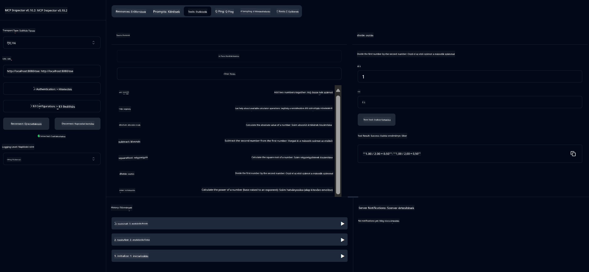

<!--
CO_OP_TRANSLATOR_METADATA:
{
  "original_hash": "13231e9951b68efd9df8c56bd5cdb27e",
  "translation_date": "2025-07-13T22:30:19+00:00",
  "source_file": "03-GettingStarted/samples/java/calculator/README.md",
  "language_code": "hu"
}
-->
# Basic Calculator MCP Service

Ez a szolgáltatás alapvető számológép műveleteket biztosít a Model Context Protocol (MCP) segítségével, Spring Boot és WebFlux transport használatával. Egyszerű példaként készült kezdők számára, akik az MCP implementációkat tanulják.

További információkért lásd a [MCP Server Boot Starter](https://docs.spring.io/spring-ai/reference/api/mcp/mcp-server-boot-starter-docs.html) referencia dokumentációt.

## Áttekintés

A szolgáltatás bemutatja:
- SSE (Server-Sent Events) támogatását
- Automatikus eszközregisztrációt a Spring AI `@Tool` annotációjával
- Alapvető számológép funkciókat:
  - Összeadás, kivonás, szorzás, osztás
  - Hatványozás és négyzetgyök számítás
  - Maradékos osztás (modulus) és abszolút érték
  - Segítség funkció a műveletek leírásához

## Jellemzők

Ez a számológép szolgáltatás a következő képességeket kínálja:

1. **Alapvető aritmetikai műveletek**:
   - Két szám összeadása
   - Egy szám kivonása egy másikból
   - Két szám szorzása
   - Egy szám osztása egy másikkal (nullával való osztás ellenőrzéssel)

2. **Haladó műveletek**:
   - Hatványozás (alap emelése kitevőre)
   - Négyzetgyök számítás (negatív szám ellenőrzéssel)
   - Maradékos osztás (modulus) számítása
   - Abszolút érték számítása

3. **Segítség rendszer**:
   - Beépített segítség funkció, amely elmagyarázza az összes elérhető műveletet

## A szolgáltatás használata

A szolgáltatás a következő API végpontokat teszi elérhetővé az MCP protokollon keresztül:

- `add(a, b)`: Két szám összeadása
- `subtract(a, b)`: A második szám kivonása az elsőből
- `multiply(a, b)`: Két szám szorzása
- `divide(a, b)`: Az első szám osztása a másodikkal (nulla ellenőrzéssel)
- `power(base, exponent)`: Hatvány számítása
- `squareRoot(number)`: Négyzetgyök számítása (negatív szám ellenőrzéssel)
- `modulus(a, b)`: Maradék számítása osztáskor
- `absolute(number)`: Abszolút érték számítása
- `help()`: Információk az elérhető műveletekről

## Teszt kliens

Egy egyszerű teszt kliens megtalálható a `com.microsoft.mcp.sample.client` csomagban. A `SampleCalculatorClient` osztály bemutatja a számológép szolgáltatás elérhető műveleteit.

## A LangChain4j kliens használata

A projekt tartalmaz egy LangChain4j példaklienset a `com.microsoft.mcp.sample.client.LangChain4jClient` osztályban, amely bemutatja, hogyan lehet integrálni a számológép szolgáltatást a LangChain4j-vel és GitHub modellekkel:

### Előfeltételek

1. **GitHub token beállítása**:
   
   A GitHub AI modellek (például phi-4) használatához szükséged van egy GitHub személyes hozzáférési tokenre:

   a. Lépj be a GitHub fiókod beállításaiba: https://github.com/settings/tokens
   
   b. Kattints a "Generate new token" → "Generate new token (classic)" gombra
   
   c. Adj a tokennek egy beszédes nevet
   
   d. Válaszd ki a következő jogosultságokat:
      - `repo` (Teljes hozzáférés privát tárolókhoz)
      - `read:org` (Szervezet és csapat tagság olvasása, szervezeti projektek olvasása)
      - `gist` (Gist-ek létrehozása)
      - `user:email` (Felhasználói email címek elérése (csak olvasás))
   
   e. Kattints a "Generate token" gombra, majd másold ki az új tokent
   
   f. Állítsd be környezeti változóként:
      
      Windows alatt:
      ```
      set GITHUB_TOKEN=your-github-token
      ```
      
      macOS/Linux alatt:
      ```bash
      export GITHUB_TOKEN=your-github-token
      ```

   g. Tartós beállításhoz add hozzá a rendszer környezeti változóihoz

2. Add hozzá a LangChain4j GitHub függőséget a projektedhez (már benne van a pom.xml-ben):
   ```xml
   <dependency>
       <groupId>dev.langchain4j</groupId>
       <artifactId>langchain4j-github</artifactId>
       <version>${langchain4j.version}</version>
   </dependency>
   ```

3. Győződj meg róla, hogy a számológép szerver fut a `localhost:8080` címen

### A LangChain4j kliens futtatása

Ez a példa bemutatja:
- Kapcsolódást a számológép MCP szerverhez SSE transporton keresztül
- LangChain4j használatát egy chat bot létrehozásához, amely a számológép műveleteit használja
- Integrációt a GitHub AI modellekkel (jelenleg a phi-4 modellel)

A kliens a következő mintakéréseket küldi a működés bemutatására:
1. Két szám összegének kiszámítása
2. Egy szám négyzetgyökének meghatározása
3. Segítség kérése az elérhető számológép műveletekről

Futtasd a példát, és nézd meg a konzol kimenetet, hogy az AI modell hogyan használja a számológép eszközöket a válaszadáshoz.

### GitHub modell konfiguráció

A LangChain4j kliens a GitHub phi-4 modelljét használja az alábbi beállításokkal:

```java
ChatLanguageModel model = GitHubChatModel.builder()
    .apiKey(System.getenv("GITHUB_TOKEN"))
    .timeout(Duration.ofSeconds(60))
    .modelName("phi-4")
    .logRequests(true)
    .logResponses(true)
    .build();
```

Ha más GitHub modelleket szeretnél használni, egyszerűen módosítsd a `modelName` paramétert egy másik támogatott modellre (pl. "claude-3-haiku-20240307", "llama-3-70b-8192" stb.).

## Függőségek

A projekt a következő kulcsfontosságú függőségeket igényli:

```xml
<!-- For MCP Server -->
<dependency>
    <groupId>org.springframework.ai</groupId>
    <artifactId>spring-ai-starter-mcp-server-webflux</artifactId>
</dependency>

<!-- For LangChain4j integration -->
<dependency>
    <groupId>dev.langchain4j</groupId>
    <artifactId>langchain4j-mcp</artifactId>
    <version>${langchain4j.version}</version>
</dependency>

<!-- For GitHub models support -->
<dependency>
    <groupId>dev.langchain4j</groupId>
    <artifactId>langchain4j-github</artifactId>
    <version>${langchain4j.version}</version>
</dependency>
```

## A projekt építése

A projekt Maven használatával építhető:
```bash
./mvnw clean install -DskipTests
```

## A szerver indítása

### Java használatával

```bash
java -jar target/calculator-server-0.0.1-SNAPSHOT.jar
```

### MCP Inspector használata

Az MCP Inspector egy hasznos eszköz az MCP szolgáltatásokkal való interakcióhoz. A számológép szolgáltatás használatához:

1. **Telepítsd és indítsd el az MCP Inspectort** egy új terminál ablakban:
   ```bash
   npx @modelcontextprotocol/inspector
   ```

2. **Nyisd meg a webes felületet** a megjelenő URL-re kattintva (általában http://localhost:6274)

3. **Állítsd be a kapcsolatot**:
   - Válaszd a "SSE" transport típust
   - Állítsd be az URL-t a futó szerver SSE végpontjára: `http://localhost:8080/sse`
   - Kattints a "Connect" gombra

4. **Használd az eszközöket**:
   - Kattints a "List Tools" gombra az elérhető számológép műveletek megtekintéséhez
   - Válassz ki egy eszközt, majd kattints a "Run Tool" gombra a művelet végrehajtásához



### Docker használata

A projekt tartalmaz egy Dockerfile-t konténeres telepítéshez:

1. **Építsd meg a Docker képet**:
   ```bash
   docker build -t calculator-mcp-service .
   ```

2. **Futtasd a Docker konténert**:
   ```bash
   docker run -p 8080:8080 calculator-mcp-service
   ```

Ez a következőket teszi:
- Többlépcsős Docker képet épít Maven 3.9.9 és Eclipse Temurin 24 JDK használatával
- Optimalizált konténer képet hoz létre
- Kiszolgálót a 8080-as porton teszi elérhetővé
- Elindítja az MCP számológép szolgáltatást a konténerben

A szolgáltatás elérhető lesz a `http://localhost:8080` címen, amint a konténer fut.

## Hibakeresés

### Gyakori problémák a GitHub tokennel kapcsolatban

1. **Token jogosultsági problémák**: Ha 403 Forbidden hibát kapsz, ellenőrizd, hogy a token megfelelő jogosultságokkal rendelkezik az előfeltételek szerint.

2. **Token hiánya**: Ha "No API key found" hiba jelenik meg, győződj meg róla, hogy a GITHUB_TOKEN környezeti változó helyesen van beállítva.

3. **Korlátozások (Rate limiting)**: A GitHub API-nak vannak használati korlátai. Ha 429-es hibát kapsz, várj néhány percet, majd próbáld újra.

4. **Token lejárata**: A GitHub tokenek lejárhatnak. Ha hitelesítési hibákat tapasztalsz idővel, generálj új tokent és frissítsd a környezeti változót.

Ha további segítségre van szükséged, nézd meg a [LangChain4j dokumentációt](https://github.com/langchain4j/langchain4j) vagy a [GitHub API dokumentációt](https://docs.github.com/en/rest).

**Jogi nyilatkozat**:  
Ez a dokumentum az AI fordító szolgáltatás, a [Co-op Translator](https://github.com/Azure/co-op-translator) segítségével készült. Bár a pontosságra törekszünk, kérjük, vegye figyelembe, hogy az automatikus fordítások hibákat vagy pontatlanságokat tartalmazhatnak. Az eredeti dokumentum az anyanyelvén tekintendő hiteles forrásnak. Kritikus információk esetén professzionális emberi fordítást javaslunk. Nem vállalunk felelősséget a fordítás használatából eredő félreértésekért vagy téves értelmezésekért.