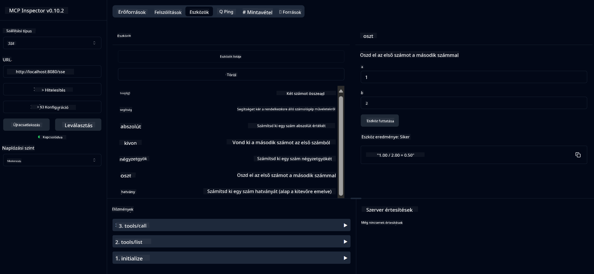

<!--
CO_OP_TRANSLATOR_METADATA:
{
  "original_hash": "13231e9951b68efd9df8c56bd5cdb27e",
  "translation_date": "2025-05-17T13:16:34+00:00",
  "source_file": "03-GettingStarted/samples/java/calculator/README.md",
  "language_code": "hu"
}
-->
# Alap Kalkulátor MCP Szolgáltatás

Ez a szolgáltatás alapvető kalkulátor műveleteket biztosít a Model Context Protocol (MCP) segítségével Spring Boot és WebFlux szállítással. Egyszerű példaként szolgál kezdők számára, akik az MCP megvalósításokkal ismerkednek.

További információért lásd az [MCP Server Boot Starter](https://docs.spring.io/spring-ai/reference/api/mcp/mcp-server-boot-starter-docs.html) referenciadokumentációt.

## Áttekintés

A szolgáltatás bemutatja:
- Támogatás SSE-hez (Server-Sent Events)
- Automatikus eszközregisztráció a Spring AI `@Tool` annotációjával
- Alapvető kalkulátor funkciók:
  - Összeadás, kivonás, szorzás, osztás
  - Hatványozás és négyzetgyök
  - Maradék és abszolút érték
  - Segítség funkció a műveletek leírásához

## Funkciók

Ez a kalkulátor szolgáltatás a következő képességeket kínálja:

1. **Alapvető aritmetikai műveletek**:
   - Két szám összeadása
   - Egy szám kivonása a másikból
   - Két szám szorzása
   - Egy szám osztása a másikkal (nullával való osztás ellenőrzése)

2. **Haladó műveletek**:
   - Hatványozás (alap emelése kitevőre)
   - Négyzetgyök számítása (negatív szám ellenőrzése)
   - Maradék számítása
   - Abszolút érték számítása

3. **Segítség rendszer**:
   - Beépített segítség funkció, amely elmagyarázza az összes elérhető műveletet

## A szolgáltatás használata

A szolgáltatás a következő API végpontokat teszi elérhetővé az MCP protokollon keresztül:

- `add(a, b)`: Két szám összeadása
- `subtract(a, b)`: A második szám kivonása az elsőből
- `multiply(a, b)`: Két szám szorzása
- `divide(a, b)`: Az első szám osztása a másodikkal (nullával való ellenőrzés)
- `power(base, exponent)`: Egy szám hatványának kiszámítása
- `squareRoot(number)`: Négyzetgyök számítása (negatív szám ellenőrzése)
- `modulus(a, b)`: Maradék számítása osztáskor
- `absolute(number)`: Abszolút érték számítása
- `help()`: Információ az elérhető műveletekről

## Teszt kliens

Egyszerű teszt kliens található a `com.microsoft.mcp.sample.client` csomagban. A `SampleCalculatorClient` osztály bemutatja a kalkulátor szolgáltatás elérhető műveleteit.

## LangChain4j Kliens használata

A projekt tartalmaz egy LangChain4j példaklienst a `com.microsoft.mcp.sample.client.LangChain4jClient` csomagban, amely bemutatja, hogyan lehet integrálni a kalkulátor szolgáltatást a LangChain4j és GitHub modellekkel:

### Előfeltételek

1. **GitHub Token Beállítása**:
   
   A GitHub AI modellek (például phi-4) használatához GitHub személyes hozzáférési tokenre van szükség:

   a. Menj a GitHub fiókod beállításaihoz: https://github.com/settings/tokens
   
   b. Kattints a "Generate new token" → "Generate new token (classic)" lehetőségre
   
   c. Adj a tokennek egy leíró nevet
   
   d. Válaszd ki a következő jogosultságokat:
      - `repo` (Teljes ellenőrzés a privát repozitóriumok felett)
      - `read:org` (Org és csapat tagság olvasása, org projektek olvasása)
      - `gist` (Gist-ek létrehozása)
      - `user:email` (Felhasználói email címek elérése (csak olvasható))
   
   e. Kattints a "Generate token" gombra és másold ki az új tokened
   
   f. Állítsd be környezeti változóként:
      
      Windows esetén:
      ```
      set GITHUB_TOKEN=your-github-token
      ```
      
      macOS/Linux esetén:
      ```bash
      export GITHUB_TOKEN=your-github-token
      ```

   g. Állandó beállításhoz add hozzá a környezeti változóidhoz a rendszerbeállításokban

2. Add hozzá a LangChain4j GitHub függőséget a projektedhez (már szerepel a pom.xml-ben):
   ```xml
   <dependency>
       <groupId>dev.langchain4j</groupId>
       <artifactId>langchain4j-github</artifactId>
       <version>${langchain4j.version}</version>
   </dependency>
   ```

3. Bizonyosodj meg róla, hogy a kalkulátor szerver fut a `localhost:8080` címen

### A LangChain4j Kliens futtatása

Ez a példa bemutatja:
- Kapcsolódás a kalkulátor MCP szerverhez SSE szállításon keresztül
- LangChain4j használata chat bot létrehozására, amely kihasználja a kalkulátor műveleteit
- Integráció a GitHub AI modellekkel (jelenleg a phi-4 modell használata)

A kliens a következő mintakérdéseket küldi a funkcionalitás bemutatására:
1. Két szám összegének kiszámítása
2. Egy szám négyzetgyökének megtalálása
3. Segítség információ kérése az elérhető kalkulátor műveletekről

Futtasd a példát és nézd meg a konzol kimenetét, hogy láthasd, hogyan használja az AI modell a kalkulátor eszközöket a kérdések megválaszolására.

### GitHub Modell Konfiguráció

A LangChain4j kliens úgy van beállítva, hogy a GitHub phi-4 modellt használja a következő beállításokkal:

```java
ChatLanguageModel model = GitHubChatModel.builder()
    .apiKey(System.getenv("GITHUB_TOKEN"))
    .timeout(Duration.ofSeconds(60))
    .modelName("phi-4")
    .logRequests(true)
    .logResponses(true)
    .build();
```

Más GitHub modellek használatához egyszerűen módosítsd a `modelName` paramétert egy másik támogatott modellre (pl. "claude-3-haiku-20240307", "llama-3-70b-8192", stb.).

## Függőségek

A projekt a következő kulcsfontosságú függőségeket igényli:

```xml
<!-- For MCP Server -->
<dependency>
    <groupId>org.springframework.ai</groupId>
    <artifactId>spring-ai-starter-mcp-server-webflux</artifactId>
</dependency>

<!-- For LangChain4j integration -->
<dependency>
    <groupId>dev.langchain4j</groupId>
    <artifactId>langchain4j-mcp</artifactId>
    <version>${langchain4j.version}</version>
</dependency>

<!-- For GitHub models support -->
<dependency>
    <groupId>dev.langchain4j</groupId>
    <artifactId>langchain4j-github</artifactId>
    <version>${langchain4j.version}</version>
</dependency>
```

## A projekt építése

Építsd meg a projektet Maven használatával:
```bash
./mvnw clean install -DskipTests
```

## A szerver futtatása

### Java használatával

```bash
java -jar target/calculator-server-0.0.1-SNAPSHOT.jar
```

### MCP Inspector használatával

Az MCP Inspector hasznos eszköz az MCP szolgáltatásokkal való interakcióhoz. Ennek a kalkulátor szolgáltatásnak a használatához:

1. **Telepítsd és futtasd az MCP Inspectort** egy új terminál ablakban:
   ```bash
   npx @modelcontextprotocol/inspector
   ```

2. **Érd el a webes felületet** az alkalmazás által megjelenített URL-re kattintva (általában http://localhost:6274)

3. **Konfiguráld a kapcsolatot**:
   - Állítsd be a szállítási típust "SSE"-re
   - Állítsd be az URL-t a futó szerver SSE végpontjára: `http://localhost:8080/sse`
   - Kattints a "Connect" gombra

4. **Használd az eszközöket**:
   - Kattints a "List Tools" gombra az elérhető kalkulátor műveletek megtekintéséhez
   - Válassz ki egy eszközt és kattints a "Run Tool" gombra a művelet végrehajtásához



### Docker használatával

A projekt tartalmaz egy Dockerfile-t konténeres telepítéshez:

1. **Építsd meg a Docker képet**:
   ```bash
   docker build -t calculator-mcp-service .
   ```

2. **Futtasd a Docker konténert**:
   ```bash
   docker run -p 8080:8080 calculator-mcp-service
   ```

Ez a következőket teszi:
- Több szakaszos Docker képet épít Maven 3.9.9 és Eclipse Temurin 24 JDK-val
- Optimalizált konténer képet hoz létre
- A szolgáltatást a 8080-as porton teszi elérhetővé
- A MCP kalkulátor szolgáltatást a konténerben indítja el

A szolgáltatás elérhető lesz a `http://localhost:8080` címen, amint a konténer fut.

## Hibaelhárítás

### Gyakori problémák a GitHub tokennel

1. **Token jogosultsági problémák**: Ha 403 Forbidden hibát kapsz, ellenőrizd, hogy a tokened rendelkezik-e a megfelelő jogosultságokkal, ahogy az előfeltételeknél le van írva.

2. **Token nem található**: Ha "No API key found" hibát kapsz, győződj meg róla, hogy a GITHUB_TOKEN környezeti változó megfelelően van beállítva.

3. **Sebességkorlátozás**: A GitHub API sebességkorlátozásokkal rendelkezik. Ha sebességkorlátozási hibát kapsz (429-es státuszkód), várj néhány percet, mielőtt újra próbálkozol.

4. **Token lejárata**: A GitHub tokenek lejárhatnak. Ha hitelesítési hibákat kapsz egy idő után, generálj új tokent és frissítsd a környezeti változódat.

Ha további segítségre van szükséged, nézd meg a [LangChain4j dokumentációt](https://github.com/langchain4j/langchain4j) vagy a [GitHub API dokumentációt](https://docs.github.com/en/rest).

**Felelősség kizárása**:  
Ezt a dokumentumot az [Co-op Translator](https://github.com/Azure/co-op-translator) AI fordítószolgáltatás segítségével fordították le. Bár törekszünk a pontosságra, kérjük, vegye figyelembe, hogy az automatikus fordítások hibákat vagy pontatlanságokat tartalmazhatnak. Az eredeti dokumentum anyanyelvén tekintendő hiteles forrásnak. Kritikus információk esetén professzionális emberi fordítás javasolt. Nem vállalunk felelősséget a fordítás használatából eredő félreértésekért vagy félreértelmezésekért.