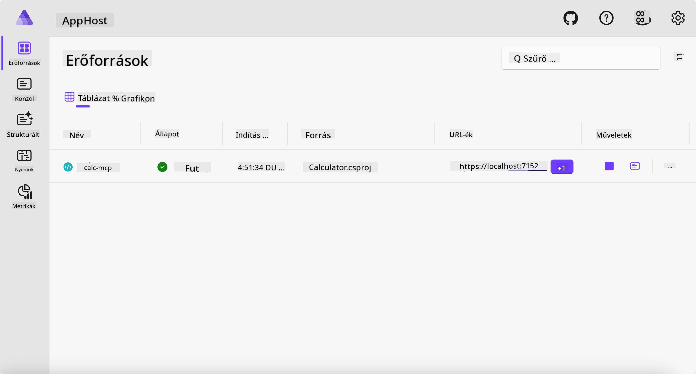
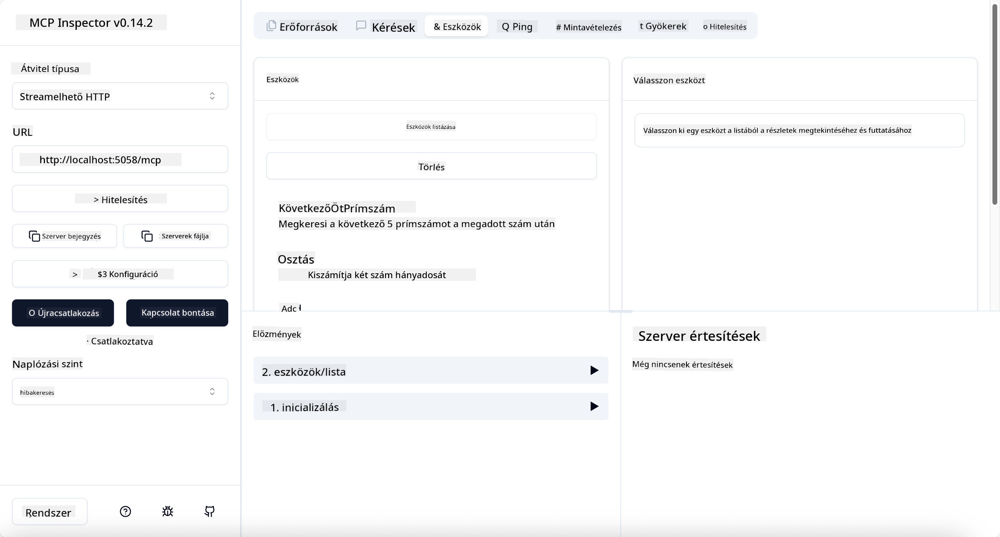
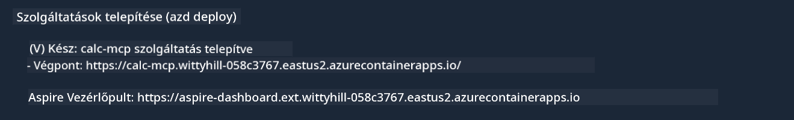

<!--
CO_OP_TRANSLATOR_METADATA:
{
  "original_hash": "0bc7bd48f55f1565f1d95ccb2c16f728",
  "translation_date": "2025-07-13T23:09:10+00:00",
  "source_file": "04-PracticalImplementation/samples/csharp/README.md",
  "language_code": "hu"
}
-->
# Minta

Az előző példa bemutatja, hogyan használhatunk egy helyi .NET projektet a `stdio` típussal. És hogyan futtathatjuk a szervert helyben egy konténerben. Ez sok helyzetben jó megoldás. Ugyanakkor hasznos lehet, ha a szerver távolról, például egy felhő környezetben fut. Itt jön képbe a `http` típus.

Ha megnézzük a megoldást a `04-PracticalImplementation` mappában, az sokkal bonyolultabbnak tűnhet, mint az előző. De valójában nem az. Ha alaposan megnézed a `src/Calculator` projektet, látni fogod, hogy nagyjából ugyanaz a kód, mint az előző példában. Az egyetlen különbség, hogy egy másik könyvtárat, a `ModelContextProtocol.AspNetCore`-t használjuk az HTTP kérések kezelésére. És a `IsPrime` metódust priváttá tesszük, hogy megmutassuk, hogy lehetnek privát metódusok a kódban. A többi kód ugyanaz, mint korábban.

A többi projekt a [.NET Aspire](https://learn.microsoft.com/dotnet/aspire/get-started/aspire-overview) része. A .NET Aspire jelenléte a megoldásban javítja a fejlesztői élményt fejlesztés és tesztelés közben, valamint segít az observabilitásban. Nem kötelező a szerver futtatásához, de jó gyakorlat, ha benne van a megoldásban.

## Indítsd el a szervert helyben

1. VS Code-ból (a C# DevKit kiterjesztéssel) navigálj a `04-PracticalImplementation/samples/csharp` könyvtárba.
1. Futtasd a következő parancsot a szerver indításához:

   ```bash
    dotnet watch run --project ./src/AppHost
   ```

1. Amikor egy webböngésző megnyitja a .NET Aspire irányítópultot, jegyezd meg az `http` URL-t. Valami ilyesminek kell lennie: `http://localhost:5058/`.

   

## Streamable HTTP tesztelése az MCP Inspectorral

Ha Node.js 22.7.5 vagy újabb verziód van, használhatod az MCP Inspectort a szerver tesztelésére.

Indítsd el a szervert, majd futtasd a következő parancsot egy terminálban:

```bash
npx @modelcontextprotocol/inspector http://localhost:5058
```



- Válaszd ki a `Streamable HTTP`-t a Transport típusnál.
- Az Url mezőbe írd be a korábban megjegyzett szerver URL-jét, és toldd meg `/mcp`-vel. Ez legyen `http` (nem `https`), például `http://localhost:5058/mcp`.
- Kattints a Connect gombra.

Az Inspector egyik előnye, hogy jól láthatóvá teszi, mi történik.

- Próbáld meg lekérdezni az elérhető eszközöket
- Próbálj ki néhányat, működniük kell ugyanúgy, mint korábban.

## MCP szerver tesztelése GitHub Copilot Chattel VS Code-ban

A Streamable HTTP használatához a GitHub Copilot Chattel módosítsd a korábban létrehozott `calc-mcp` szerver konfigurációját így:

```jsonc
// .vscode/mcp.json
{
  "servers": {
    "calc-mcp": {
      "type": "http",
      "url": "http://localhost:5058/mcp"
    }
  }
}
```

Végezz néhány tesztet:

- Kérdezd meg: „3 prímszám 6780 után”. Figyeld meg, hogy a Copilot az új `NextFivePrimeNumbers` eszközt használja, és csak az első 3 prímszámot adja vissza.
- Kérdezd meg: „7 prímszám 111 után”, hogy lásd, mi történik.
- Kérdezd meg: „Johnnak 24 nyalókája van, és mindet el akarja osztani a 3 gyereke között. Hány nyalókát kap egy gyerek?”, hogy lásd, mi történik.

## Szerver telepítése Azure-ra

Telepítsük a szervert Azure-ra, hogy többen használhassák.

Egy terminálban navigálj a `04-PracticalImplementation/samples/csharp` mappába, és futtasd a következő parancsot:

```bash
azd up
```

A telepítés befejezése után ilyesmi üzenetet kell látnod:



Másold ki az URL-t, és használd az MCP Inspectorban és a GitHub Copilot Chatben.

```jsonc
// .vscode/mcp.json
{
  "servers": {
    "calc-mcp": {
      "type": "http",
      "url": "https://calc-mcp.gentleriver-3977fbcf.australiaeast.azurecontainerapps.io/mcp"
    }
  }
}
```

## Mi következik?

Különböző transport típusokat és tesztelő eszközöket próbáltunk ki. Telepítettük az MCP szervert Azure-ra is. De mi van akkor, ha a szervernek privát erőforrásokhoz kell hozzáférnie? Például egy adatbázishoz vagy egy privát API-hoz? A következő fejezetben megnézzük, hogyan javíthatjuk a szerver biztonságát.

**Jogi nyilatkozat**:  
Ez a dokumentum az AI fordító szolgáltatás, a [Co-op Translator](https://github.com/Azure/co-op-translator) segítségével készült. Bár a pontosságra törekszünk, kérjük, vegye figyelembe, hogy az automatikus fordítások hibákat vagy pontatlanságokat tartalmazhatnak. Az eredeti dokumentum az anyanyelvén tekintendő hiteles forrásnak. Fontos információk esetén professzionális emberi fordítást javaslunk. Nem vállalunk felelősséget a fordítás használatából eredő félreértésekért vagy téves értelmezésekért.