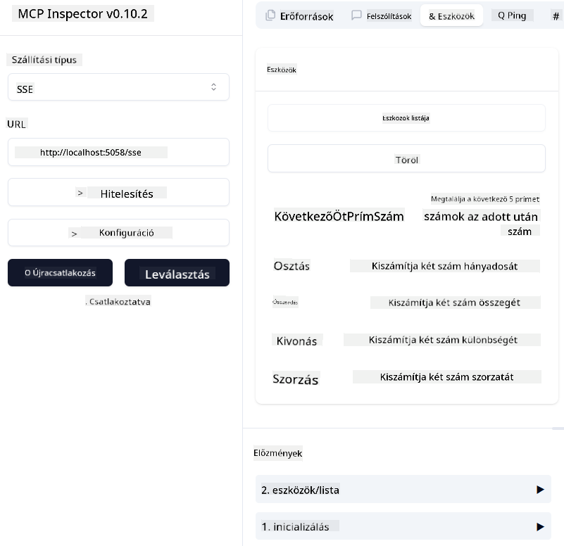

<!--
CO_OP_TRANSLATOR_METADATA:
{
  "original_hash": "5020a3e1a1c7f30c00f9e37f1fa208e3",
  "translation_date": "2025-05-17T14:11:35+00:00",
  "source_file": "04-PracticalImplementation/samples/csharp/README.md",
  "language_code": "hu"
}
-->
# Minta

Az előző példa bemutatja, hogyan lehet egy helyi .NET projektet használni a `sdio` típusúval. És hogyan futtathatjuk a szervert helyileg egy konténerben. Ez számos helyzetben jó megoldás. Azonban hasznos lehet, ha a szerver távolról fut, például felhőben. Itt jön képbe a `http` típus.

Ha megnézzük a megoldást a `04-PracticalImplementation` mappában, sokkal bonyolultabbnak tűnhet, mint az előző. De valójában nem az. Ha alaposan megnézzük a `src/mcpserver/mcpserver.csproj` projektet, láthatjuk, hogy nagyrészt ugyanaz a kód, mint az előző példában. Az egyetlen különbség, hogy egy másik könyvtárat `ModelContextProtocol.AspNetCore` használunk az HTTP kérések kezelésére. És megváltoztatjuk a `IsPrime` metódust, hogy privát legyen, csak azért, hogy megmutassuk, hogy lehetnek privát metódusok a kódban. A többi kód ugyanaz, mint korábban.

A többi projekt a [.NET Aspire](https://learn.microsoft.com/dotnet/aspire/get-started/aspire-overview) része. A .NET Aspire jelenléte a megoldásban javítja a fejlesztői élményt a fejlesztés és tesztelés során, valamint segít az átláthatóságban. Nem szükséges a szerver futtatásához, de jó gyakorlat, ha benne van a megoldásban.

## A szerver helyi indítása

1. VS Code-ból (a C# DevKit kiterjesztéssel) nyissa meg a `04-PracticalImplementation\samples\csharp\src\Calculator-chap4.sln` megoldást.
2. Nyomja meg a `F5` gombot a szerver indításához. Ekkor el kell indulnia egy webböngészőnek a .NET Aspire műszerfalával.

vagy

1. Terminálból navigáljon a `04-PracticalImplementation\samples\csharp\src` mappába
2. Hajtsa végre a következő parancsot a szerver indításához:
   ```bash
    dotnet run --project .\AppHost
   ```

3. A műszerfalon jegyezze fel a `http` URL-t. Valami ilyesminek kell lennie: `http://localhost:5058/`.

## Test `SSE` a ModelContext Protocol Inspectorral

Ha van Node.js 22.7.5 vagy magasabb, használhatja a ModelContext Protocol Inspectort a szerver teszteléséhez.

Indítsa el a szervert, és futtassa a következő parancsot egy terminálban:

```bash
npx @modelcontextprotocol/inspector@latest
```



- Válassza ki az `SSE` as the Transport type. SSE stand for Server-Sent Events. 
- In the Url field, enter the URL of the server noted earlier,and append `/sse`-t. Ennek `http`-nak kell lennie (nem `https`) something like `http://localhost:5058/sse`.
- select the Connect button.

A nice thing about the Inspector is that it provide a nice visibility on what is happening.

- Try listing the availables tools
- Try some of them, it should works just like before.


## Test `SSE` with Github Copilot Chat in VS Code

To use the `SSE` transport with Github Copilot Chat, change the configuration of the `mcp-calc` szerver, ami korábban készült, hogy így nézzen ki:

```json
"mcp-calc": {
    "type": "sse",
    "url": "http://localhost:5058/sse"
}
```

Végezzen néhány tesztet:
- Kérje a 3 prímszámot 6780 után. Jegyezze meg, hogyan használja a Copilot az új eszközöket `NextFivePrimeNumbers`, és csak az első 3 prímszámot adja vissza.
- Kérje a 7 prímszámot 111 után, hogy lássa, mi történik.

# A szerver telepítése Azure-ra

Telepítsük a szervert Azure-ra, hogy több ember használhassa.

Terminálból navigáljon a `04-PracticalImplementation\samples\csharp\src` mappába, és futtassa a következő parancsot:

```bash
azd init
```

Ez néhány fájlt hoz létre helyileg az Azure erőforrások konfigurációjának és az infrastruktúra mint kód (IaC) mentéséhez.

Ezután futtassa a következő parancsot a szerver Azure-ra telepítéséhez:

```bash
azd up
```

Amint a telepítés befejeződik, egy ilyen üzenetet kell látnia:


Navigáljon az Aspire műszerfalra, és jegyezze fel az `HTTP` URL-t, hogy használhassa a MCP Inspectorban és a Github Copilot Chatben.

## Mi a következő lépés?

Különböző szállítási típusokat és tesztelő eszközöket próbáltunk ki, valamint telepítettük az MCP szerverünket Azure-ra. De mi van, ha a szerverünknek privát erőforrásokhoz kell hozzáférnie? Például egy adatbázishoz vagy egy privát API-hoz? A következő fejezetben megnézzük, hogyan javíthatjuk a szerverünk biztonságát.

**Felelősségi nyilatkozat**:  
Ezt a dokumentumot az AI fordítási szolgáltatás [Co-op Translator](https://github.com/Azure/co-op-translator) segítségével fordították le. Bár igyekszünk pontosságra törekedni, kérjük, vegye figyelembe, hogy az automatikus fordítások hibákat vagy pontatlanságokat tartalmazhatnak. Az eredeti dokumentum a saját nyelvén tekintendő hiteles forrásnak. Kritikus információk esetén ajánlott a professzionális emberi fordítás. Nem vállalunk felelősséget semmilyen félreértésért vagy félremagyarázásért, amely a fordítás használatából ered.