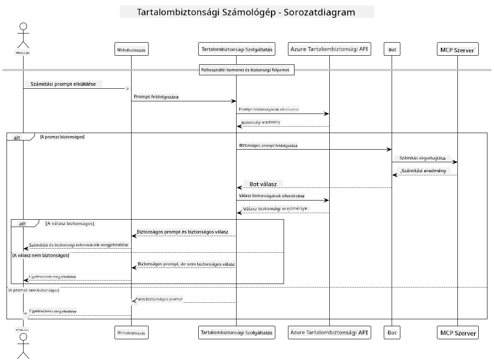

<!--
CO_OP_TRANSLATOR_METADATA:
{
  "original_hash": "e5ea5e7582f70008ea9bec3b3820f20a",
  "translation_date": "2025-07-13T23:19:21+00:00",
  "source_file": "04-PracticalImplementation/samples/java/containerapp/README.md",
  "language_code": "hu"
}
-->
## Rendszerarchitektúra

Ez a projekt egy webalkalmazást mutat be, amely tartalombiztonsági ellenőrzést végez, mielőtt a felhasználói kéréseket a Model Context Protocol (MCP) segítségével egy számológép szolgáltatásnak továbbítaná.



### Működése

1. **Felhasználói bevitel**: A felhasználó egy számítási kérést ad meg a webes felületen  
2. **Tartalombiztonsági szűrés (bemenet)**: A kérést az Azure Content Safety API elemzi  
3. **Biztonsági döntés (bemenet)**:  
   - Ha a tartalom biztonságos (minden kategóriában súlyosság < 2), továbbítódik a számológéphez  
   - Ha a tartalom potenciálisan károsnak minősül, a folyamat leáll, és figyelmeztetés jelenik meg  
4. **Számológép integráció**: A biztonságos tartalmat a LangChain4j dolgozza fel, amely kommunikál az MCP számológép szerverrel  
5. **Tartalombiztonsági szűrés (kimenet)**: A bot válaszát az Azure Content Safety API elemzi  
6. **Biztonsági döntés (kimenet)**:  
   - Ha a bot válasza biztonságos, megjelenik a felhasználónak  
   - Ha a bot válasza potenciálisan káros, figyelmeztetésre cserélődik  
7. **Válasz**: Az eredmények (ha biztonságosak) megjelennek a felhasználónak, mindkét biztonsági elemzéssel együtt

## Model Context Protocol (MCP) használata számológép szolgáltatásokkal

Ez a projekt bemutatja, hogyan lehet a Model Context Protocol-t (MCP) használni számológép MCP szolgáltatások hívására LangChain4j-ből. A megvalósítás egy helyi MCP szervert használ, amely a 8080-as porton fut, és számológép műveleteket biztosít.

### Azure Content Safety szolgáltatás beállítása

A tartalombiztonsági funkciók használata előtt létre kell hoznod egy Azure Content Safety szolgáltatás erőforrást:

1. Jelentkezz be az [Azure Portal](https://portal.azure.com) oldalra  
2. Kattints a „Create a resource” gombra, és keresd meg a „Content Safety” szolgáltatást  
3. Válaszd ki a „Content Safety” lehetőséget, majd kattints a „Create” gombra  
4. Adj meg egy egyedi nevet az erőforrásodnak  
5. Válaszd ki az előfizetésedet és az erőforráscsoportot (vagy hozz létre újat)  
6. Válassz egy támogatott régiót (részletekért lásd a [Region availability](https://azure.microsoft.com/en-us/global-infrastructure/services/?products=cognitive-services) oldalt)  
7. Válassz megfelelő árképzési szintet  
8. Kattints a „Create” gombra az erőforrás telepítéséhez  
9. A telepítés befejezése után kattints a „Go to resource” gombra  
10. A bal oldali menüben, a „Resource Management” alatt válaszd a „Keys and Endpoint” lehetőséget  
11. Másold ki az egyik kulcsot és az endpoint URL-t a következő lépéshez

### Környezeti változók beállítása

Állítsd be a `GITHUB_TOKEN` környezeti változót a GitHub modellek hitelesítéséhez:  
```sh
export GITHUB_TOKEN=<your_github_token>
```

A tartalombiztonsági funkciókhoz állítsd be:  
```sh
export CONTENT_SAFETY_ENDPOINT=<your_content_safety_endpoint>
export CONTENT_SAFETY_KEY=<your_content_safety_key>
```

Ezeket a környezeti változókat az alkalmazás használja az Azure Content Safety szolgáltatás hitelesítéséhez. Ha ezek a változók nincsenek beállítva, az alkalmazás helykitöltő értékeket használ a bemutatóhoz, de a tartalombiztonsági funkciók nem fognak megfelelően működni.

### A számológép MCP szerver indítása

A kliens futtatása előtt el kell indítanod a számológép MCP szervert SSE módban a localhost:8080 címen.

## Projekt leírása

Ez a projekt bemutatja a Model Context Protocol (MCP) integrációját a LangChain4j-vel számológép szolgáltatások hívásához. Főbb jellemzők:

- MCP használata számológép szolgáltatáshoz alapvető matematikai műveletekhez  
- Kétszintű tartalombiztonsági ellenőrzés a felhasználói kéréseken és a bot válaszain  
- Integráció a GitHub gpt-4.1-nano modelljével LangChain4j-n keresztül  
- Server-Sent Events (SSE) használata az MCP kommunikációhoz

## Tartalombiztonsági integráció

A projekt átfogó tartalombiztonsági funkciókat tartalmaz, hogy biztosítsa, hogy a felhasználói bemenetek és a rendszer válaszai egyaránt mentesek legyenek káros tartalmaktól:

1. **Bemeneti szűrés**: Minden felhasználói kérés elemzésre kerül káros tartalmi kategóriák, például gyűlöletbeszéd, erőszak, önkárosítás és szexuális tartalom szempontjából, mielőtt feldolgozásra kerülne.  

2. **Kimeneti szűrés**: Még potenciálisan nem cenzúrázott modellek használata esetén is a rendszer minden generált választ ugyanazon tartalombiztonsági szűrőkön futtat, mielőtt megjelenítené azokat a felhasználónak.

Ez a kétszintű megközelítés garantálja, hogy a rendszer biztonságos marad, függetlenül attól, melyik AI modellt használják, megvédve a felhasználókat mind a káros bemenetektől, mind a potenciálisan problémás AI által generált válaszoktól.

## Webes kliens

Az alkalmazás egy felhasználóbarát webes felületet tartalmaz, amely lehetővé teszi a felhasználók számára, hogy interakcióba lépjenek a Content Safety Calculator rendszerrel:

### Webes felület jellemzői

- Egyszerű, intuitív űrlap számítási kérések megadásához  
- Kétszintű tartalombiztonsági ellenőrzés (bemenet és kimenet)  
- Valós idejű visszajelzés a kérés és a válasz biztonságosságáról  
- Színkódolt biztonsági jelzések az egyszerű értelmezéshez  
- Tiszta, reszponzív dizájn, amely különböző eszközökön is jól működik  
- Példák biztonságos kérésekre a felhasználók segítéséhez

### A webes kliens használata

1. Indítsd el az alkalmazást:  
   ```sh
   mvn spring-boot:run
   ```

2. Nyisd meg a böngészőt, és navigálj a `http://localhost:8087` címre

3. Írj be egy számítási kérést a megadott szövegmezőbe (pl. „Számold ki 24,5 és 17,3 összegét”)

4. Kattints a „Submit” gombra a kérés feldolgozásához

5. Tekintsd meg az eredményeket, amelyek tartalmazzák:  
   - A kérés tartalombiztonsági elemzését  
   - A kiszámított eredményt (ha a kérés biztonságos volt)  
   - A bot válaszának tartalombiztonsági elemzését  
   - Bármilyen biztonsági figyelmeztetést, ha a bemenet vagy a kimenet problémás volt

A webes kliens automatikusan kezeli mindkét tartalombiztonsági ellenőrzési folyamatot, biztosítva, hogy minden interakció biztonságos és megfelelő legyen, függetlenül attól, melyik AI modellt használják.

**Jogi nyilatkozat**:  
Ez a dokumentum az AI fordító szolgáltatás, a [Co-op Translator](https://github.com/Azure/co-op-translator) segítségével készült. Bár a pontosságra törekszünk, kérjük, vegye figyelembe, hogy az automatikus fordítások hibákat vagy pontatlanságokat tartalmazhatnak. Az eredeti dokumentum az anyanyelvén tekintendő hiteles forrásnak. Fontos információk esetén szakmai, emberi fordítást javaslunk. Nem vállalunk felelősséget a fordítás használatából eredő félreértésekért vagy téves értelmezésekért.