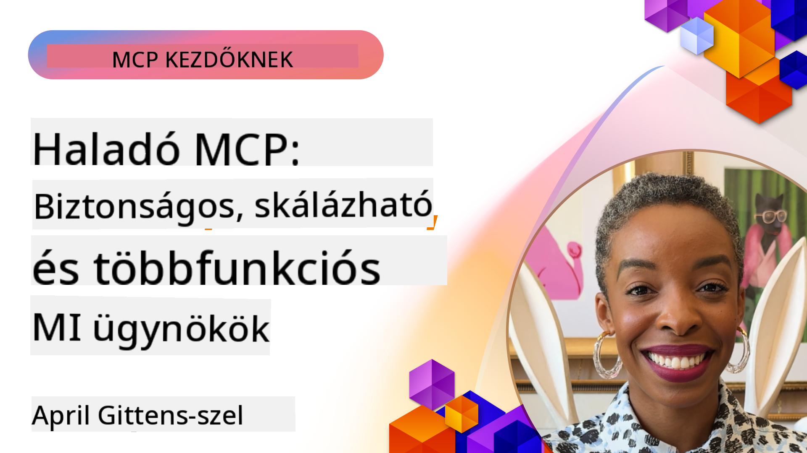

<!--
CO_OP_TRANSLATOR_METADATA:
{
  "original_hash": "d204bc94ea6027d06a703b21b711ca57",
  "translation_date": "2025-08-19T15:00:31+00:00",
  "source_file": "05-AdvancedTopics/README.md",
  "language_code": "hu"
}
-->
# Haladó témák az MCP-ben

_(Kattints a fenti képre a leckéhez tartozó videó megtekintéséhez)_

Ez a fejezet a Model Context Protocol (MCP) megvalósításának haladó témáit tárgyalja, beleértve a multimodális integrációt, a skálázhatóságot, a biztonsági bevált gyakorlatokat és a vállalati integrációt. Ezek a témák kulcsfontosságúak a robusztus és éles környezetre kész MCP alkalmazások fejlesztéséhez, amelyek megfelelnek a modern AI rendszerek igényeinek.

## Áttekintés

Ez a lecke a Model Context Protocol megvalósításának haladó koncepcióit vizsgálja, különös tekintettel a multimodális integrációra, a skálázhatóságra, a biztonsági bevált gyakorlatokra és a vállalati integrációra. Ezek a témák elengedhetetlenek az olyan éles környezetre szánt MCP alkalmazások építéséhez, amelyek képesek kezelni a vállalati környezetek összetett követelményeit.

## Tanulási célok

A lecke végére képes leszel:

- Multimodális képességeket megvalósítani MCP keretrendszerekben
- Skálázható MCP architektúrákat tervezni nagy igénybevételű helyzetekre
- Alkalmazni az MCP biztonsági elveivel összhangban lévő biztonsági bevált gyakorlatokat
- MCP-t integrálni vállalati AI rendszerekkel és keretrendszerekkel
- Optimalizálni a teljesítményt és a megbízhatóságot éles környezetben

## Leckék és mintaprojektek

| Link | Cím | Leírás |
|------|-------|-------------|
| [5.1 Integráció az Azure-ral](./mcp-integration/README.md) | Integráció az Azure-ral | Tanuld meg, hogyan integrálhatod MCP szerveredet az Azure-on |
| [5.2 Multimodális minta](./mcp-multi-modality/README.md) | MCP multimodális minták | Minták hang, kép és multimodális válaszokhoz |
| [5.3 MCP OAuth2 minta](../../../05-AdvancedTopics/mcp-oauth2-demo) | MCP OAuth2 demó | Minimalista Spring Boot alkalmazás, amely bemutatja az OAuth2-t MCP-vel, mind engedélyezési, mind erőforrás-szerverként. Bemutatja a biztonságos tokenkibocsátást, védett végpontokat, Azure Container Apps telepítést és API Management integrációt. |
| [5.4 Gyökérkontekstuk](./mcp-root-contexts/README.md) | Gyökérkontekstuk | Tudj meg többet a gyökérkontekstukról és azok megvalósításáról |
| [5.5 Útvonalkezelés](./mcp-routing/README.md) | Útvonalkezelés | Ismerd meg a különböző útvonalkezelési típusokat |
| [5.6 Mintavételezés](./mcp-sampling/README.md) | Mintavételezés | Tanuld meg, hogyan dolgozz a mintavételezéssel |
| [5.7 Skálázás](./mcp-scaling/README.md) | Skálázás | Tudj meg többet a skálázásról |
| [5.8 Biztonság](./mcp-security/README.md) | Biztonság | Biztosítsd MCP szerveredet |
| [5.9 Webkeresési minta](./web-search-mcp/README.md) | Webkeresési MCP | Python MCP szerver és kliens, amely integrálódik a SerpAPI-val valós idejű webes, hírek, termékkeresés és kérdés-válasz funkciókhoz. Bemutatja a többeszközös koordinációt, külső API integrációt és robusztus hibakezelést. |
| [5.10 Valós idejű adatfolyam](./mcp-realtimestreaming/README.md) | Adatfolyam | A valós idejű adatfolyam elengedhetetlenné vált a mai adatvezérelt világban, ahol a vállalkozásoknak és alkalmazásoknak azonnali hozzáférésre van szükségük az információkhoz a megfelelő döntések meghozatalához. |
| [5.11 Valós idejű webkeresés](./mcp-realtimesearch/README.md) | Webkeresés | Hogyan alakítja át az MCP a valós idejű webkeresést azáltal, hogy szabványosított megközelítést biztosít a kontextuskezeléshez AI modellek, keresőmotorok és alkalmazások között. |
| [5.12 Entra ID hitelesítés Model Context Protocol szerverekhez](./mcp-security-entra/README.md) | Entra ID hitelesítés | A Microsoft Entra ID robusztus, felhőalapú identitás- és hozzáférés-kezelési megoldást kínál, amely segít biztosítani, hogy csak az engedélyezett felhasználók és alkalmazások férjenek hozzá MCP szerveredhez. |
| [5.13 Azure AI Foundry ügynök integráció](./mcp-foundry-agent-integration/README.md) | Azure AI Foundry integráció | Tanuld meg, hogyan integrálhatod Model Context Protocol szervereidet az Azure AI Foundry ügynökeivel, lehetővé téve az erőteljes eszközkoordinációt és a vállalati AI képességeket szabványosított külső adatforrás-kapcsolatokkal. |
| [5.14 Kontextusmérnökség](./mcp-contextengineering/README.md) | Kontextusmérnökség | A kontextusmérnökségi technikák jövőbeli lehetőségei MCP szerverekhez, beleértve a kontextusoptimalizálást, a dinamikus kontextuskezelést és a hatékony promptmérnökségi stratégiákat MCP keretrendszerekben. |

## További hivatkozások

A legfrissebb információkért az MCP haladó témáiról lásd:
- [MCP Dokumentáció](https://modelcontextprotocol.io/)
- [MCP Specifikáció](https://spec.modelcontextprotocol.io/)
- [GitHub Repository](https://github.com/modelcontextprotocol)

## Főbb tanulságok

- A multimodális MCP megvalósítások kiterjesztik az AI képességeit a szövegfeldolgozáson túlra
- A skálázhatóság elengedhetetlen a vállalati telepítésekhez, és horizontális és vertikális skálázással kezelhető
- Átfogó biztonsági intézkedések védik az adatokat és biztosítják a megfelelő hozzáférés-ellenőrzést
- A vállalati integráció olyan platformokkal, mint az Azure OpenAI és a Microsoft AI Foundry, növeli az MCP képességeit
- A haladó MCP megvalósítások optimalizált architektúrákból és gondos erőforrás-kezelésből profitálnak

## Gyakorlat

Tervezd meg egy vállalati szintű MCP megvalósítását egy konkrét felhasználási esetre:

1. Határozd meg a felhasználási eseted multimodális követelményeit
2. Vázold fel az érzékeny adatok védelméhez szükséges biztonsági kontrollokat
3. Tervezd meg a változó terhelést kezelni képes skálázható architektúrát
4. Tervezz integrációs pontokat vállalati AI rendszerekkel
5. Dokumentáld a lehetséges teljesítménybeli szűk keresztmetszeteket és azok enyhítési stratégiáit

## További források

- [Azure OpenAI Dokumentáció](https://learn.microsoft.com/en-us/azure/ai-services/openai/)
- [Microsoft AI Foundry Dokumentáció](https://learn.microsoft.com/en-us/ai-services/)

---

## Mi következik

- [5.1 MCP Integráció](./mcp-integration/README.md)

**Felelősségkizárás**:  
Ez a dokumentum az [Co-op Translator](https://github.com/Azure/co-op-translator) AI fordítási szolgáltatás segítségével készült. Bár törekszünk a pontosságra, kérjük, vegye figyelembe, hogy az automatikus fordítások hibákat vagy pontatlanságokat tartalmazhatnak. Az eredeti dokumentum az eredeti nyelvén tekintendő hiteles forrásnak. Kritikus információk esetén javasolt a professzionális, emberi fordítás igénybevétele. Nem vállalunk felelősséget a fordítás használatából eredő félreértésekért vagy téves értelmezésekért.