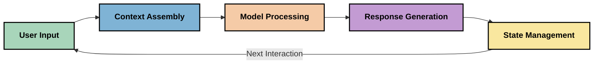
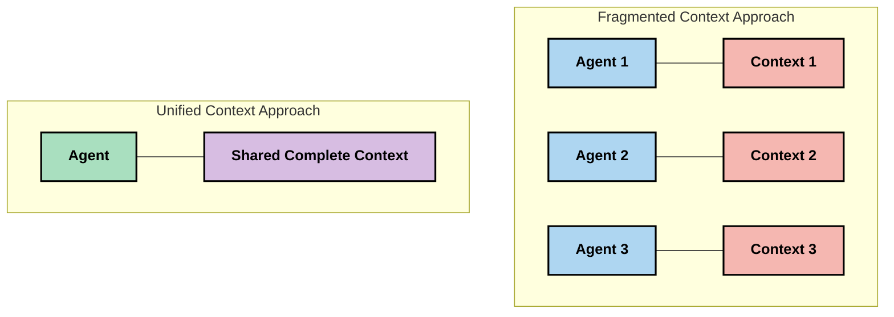
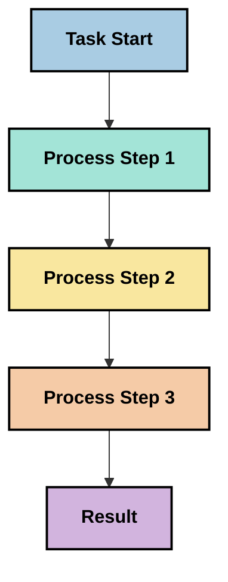
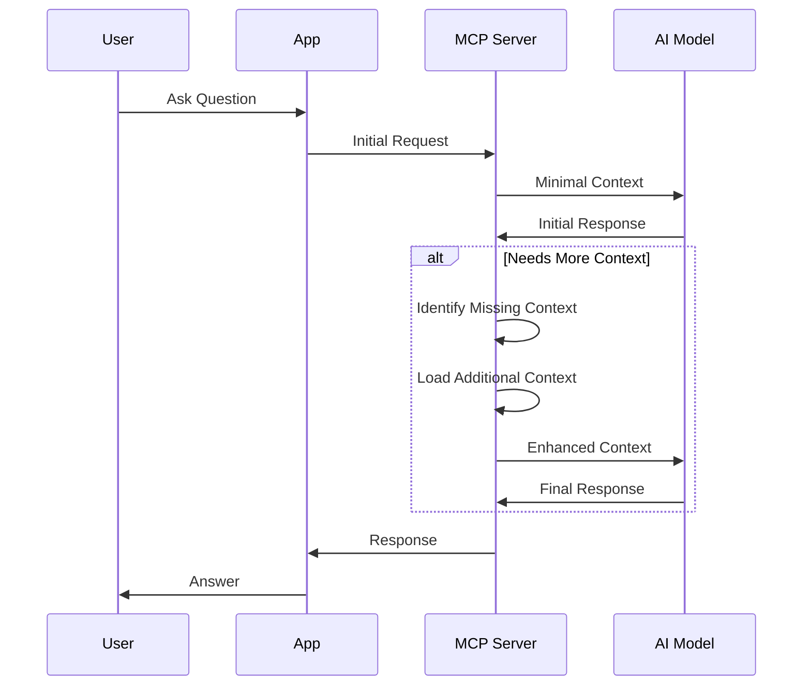
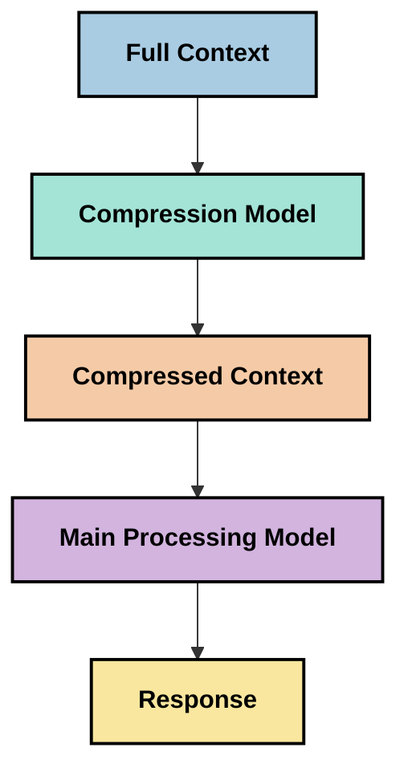

<!--
CO_OP_TRANSLATOR_METADATA:
{
  "original_hash": "5762e8e74dd99d8b7dbb31e69a82561e",
  "translation_date": "2025-07-17T13:14:20+00:00",
  "source_file": "05-AdvancedTopics/mcp-contextengineering/README.md",
  "language_code": "hu"
}
-->
# Kontextusmérnökség: Egy feltörekvő fogalom az MCP ökoszisztémában

## Áttekintés

A kontextusmérnökség egy újonnan kialakuló fogalom az MI területén, amely azt vizsgálja, hogyan strukturálódik, kerül átadásra és tartósan kezelhető az információ a kliens és az MI szolgáltatások közötti interakciók során. Ahogy a Model Context Protocol (MCP) ökoszisztéma fejlődik, egyre fontosabbá válik a kontextus hatékony kezelése. Ez a modul bevezeti a kontextusmérnökség fogalmát, és feltérképezi annak lehetséges alkalmazásait az MCP megvalósításokban.

## Tanulási célok

A modul végére képes leszel:

- Megérteni a kontextusmérnökség kialakuló fogalmát és annak potenciális szerepét az MCP alkalmazásokban
- Azonosítani a kontextuskezelés kulcsfontosságú kihívásait, amelyeket az MCP protokoll tervezése kezel
- Felfedezni technikákat a modell teljesítményének javítására jobb kontextuskezeléssel
- Megfontolni megközelítéseket a kontextus hatékonyságának mérésére és értékelésére
- Alkalmazni ezeket az új fogalmakat az MI élmények fejlesztésére az MCP keretrendszeren keresztül

## Bevezetés a kontextusmérnökségbe

A kontextusmérnökség egy újonnan kialakuló terület, amely az információáramlás szándékos tervezésére és kezelésére fókuszál a felhasználók, alkalmazások és MI modellek között. Ellentétben a már jól ismert promptmérnökséggel, a kontextusmérnökség még formálódik a szakemberek munkája során, akik az MI modellek számára a megfelelő információt a megfelelő időben biztosítják.

Ahogy a nagy nyelvi modellek (LLM-ek) fejlődtek, a kontextus jelentősége egyre nyilvánvalóbbá vált. A kontextus minősége, relevanciája és szerkezete közvetlenül befolyásolja a modell kimeneteit. A kontextusmérnökség ezt a kapcsolatot vizsgálja, és hatékony kontextuskezelési elveket kíván kidolgozni.

> „2025-ben a modellek rendkívül intelligensek lesznek. De még a legokosabb ember sem tudja hatékonyan végezni a munkáját a feladat kontextusa nélkül... A 'kontextusmérnökség' a promptmérnökség következő szintje. Arról szól, hogy ezt automatikusan, dinamikus rendszerben végezzük.” — Walden Yan, Cognition AI

A kontextusmérnökség magában foglalhatja:

1. **Kontextus kiválasztása**: Meghatározni, mely információk relevánsak egy adott feladathoz
2. **Kontextus szervezése**: Az információk rendszerezése a modell jobb megértése érdekében
3. **Kontextus átadása**: Optimalizálni, hogyan és mikor kerül az információ a modellekhez
4. **Kontextus fenntartása**: A kontextus állapotának és fejlődésének kezelése időben
5. **Kontextus értékelése**: A kontextus hatékonyságának mérése és javítása

Ezek a fókuszterületek különösen relevánsak az MCP ökoszisztéma számára, amely szabványosított módot kínál az alkalmazásoknak a kontextus LLM-ekhez történő biztosítására.

## A kontextus útjának nézőpontja

A kontextusmérnökség egyik szemléltető módja, ha nyomon követjük az információ útját egy MCP rendszerben:



### A kontextus útjának kulcsfontosságú szakaszai:

1. **Felhasználói bemenet**: Nyers információ a felhasználótól (szöveg, képek, dokumentumok)
2. **Kontextus összeállítása**: A felhasználói bemenet, a rendszer kontextusa, a beszélgetési előzmények és egyéb lekért információk egyesítése
3. **Modell feldolgozás**: Az MI modell feldolgozza az összeállított kontextust
4. **Válaszgenerálás**: A modell a megadott kontextus alapján hoz létre kimeneteket
5. **Állapotkezelés**: A rendszer frissíti belső állapotát az interakció alapján

Ez a nézőpont kiemeli a kontextus dinamikus természetét az MI rendszerekben, és fontos kérdéseket vet fel az információ kezelésének legjobb módjáról minden szakaszban.

## A kontextusmérnökség kialakuló elvei

Ahogy a kontextusmérnökség formálódik, néhány korai elv kezd kirajzolódni a szakemberek munkája alapján. Ezek az elvek segíthetnek az MCP megvalósítási döntések irányításában:

### Elv 1: A kontextust teljes egészében osszuk meg

A kontextust a rendszer összes komponense között teljes egészében kell megosztani, nem szabad töredezetten több ügynök vagy folyamat között szétosztani. Ha a kontextus széttöredezik, az egyik rendszerrészben hozott döntések ellentmondásba kerülhetnek a másikban hozottakkal.



Az MCP alkalmazásokban ez azt jelenti, hogy olyan rendszereket kell tervezni, ahol a kontextus zökkenőmentesen áramlik az egész folyamaton keresztül, nem pedig elkülönítve.

### Elv 2: Ismerjük fel, hogy a műveletek implicit döntéseket hordoznak

Minden modell által végrehajtott művelet implicit döntéseket tartalmaz arról, hogyan értelmezi a kontextust. Ha több komponens különböző kontextusokon dolgozik, ezek az implicit döntések ellentmondásokat okozhatnak, ami következetlen eredményekhez vezet.

Ennek az elvnek fontos következményei vannak az MCP alkalmazásokra:
- Előnyben részesíteni a komplex feladatok lineáris feldolgozását a párhuzamos végrehajtással szemben, ahol a kontextus töredezett
- Biztosítani, hogy minden döntési pont hozzáférjen ugyanahhoz a kontextuális információhoz
- Olyan rendszereket tervezni, ahol a későbbi lépések látják az előző döntések teljes kontextusát

### Elv 3: Egyensúlyozzuk a kontextus mélységét az ablak korlátokkal

Ahogy a beszélgetések és folyamatok hosszabbá válnak, a kontextusablakok előbb-utóbb megtelnek. A hatékony kontextusmérnökség olyan megközelítéseket keres, amelyek kezelik ezt a feszültséget a teljes körű kontextus és a technikai korlátok között.

Feltérképezett megközelítések lehetnek:
- Kontextus tömörítés, amely megőrzi a lényeges információkat, miközben csökkenti a tokenhasználatot
- Kontextus progresszív betöltése a relevancia alapján
- Korábbi interakciók összefoglalása, miközben megőrzik a kulcsfontosságú döntéseket és tényeket

## Kontextus kihívások és az MCP protokoll tervezése

A Model Context Protocol (MCP) úgy lett megtervezve, hogy figyelembe vegye a kontextuskezelés egyedi kihívásait. Ezek megértése segít megvilágítani az MCP protokoll tervezésének kulcsfontosságú aspektusait:

### Kihívás 1: Kontextusablak korlátok  
A legtöbb MI modellnek fix méretű kontextusablaka van, ami korlátozza, mennyi információt képes egyszerre feldolgozni.

**MCP tervezési válasz:**  
- A protokoll támogatja a strukturált, erőforrás-alapú kontextust, amely hatékonyan hivatkozható  
- Az erőforrások lapozhatók és progresszíven tölthetők be

### Kihívás 2: Relevancia meghatározása  
Nehéz eldönteni, mely információk a legrelevánsabbak a kontextusba való bevonáshoz.

**MCP tervezési válasz:**  
- Rugalmas eszközök dinamikus információlekéréshez szükség szerint  
- Strukturált promptok a konzisztens kontextus szervezéshez

### Kihívás 3: Kontextus állandósága  
Az interakciók közötti állapotkezelés gondos nyomon követést igényel.

**MCP tervezési válasz:**  
- Szabványosított munkamenet-kezelés  
- Egyértelműen definiált interakciós minták a kontextus fejlődéséhez

### Kihívás 4: Többmodalitású kontextus  
Különböző adatfajták (szöveg, képek, strukturált adatok) eltérő kezelést igényelnek.

**MCP tervezési válasz:**  
- A protokoll támogatja a különféle tartalomtípusokat  
- Többmodalitású információk szabványosított ábrázolása

### Kihívás 5: Biztonság és adatvédelem  
A kontextus gyakran érzékeny információkat tartalmaz, amelyeket védeni kell.

**MCP tervezési válasz:**  
- Egyértelmű határok a kliens és a szerver felelősségei között  
- Helyi feldolgozási lehetőségek az adatvédelmi kockázatok minimalizálására

E kihívások megértése és az MCP válaszai alapot nyújtanak a fejlettebb kontextusmérnökségi technikák feltérképezéséhez.

## Feltörekvő kontextusmérnökségi megközelítések

Ahogy a kontextusmérnökség fejlődik, több ígéretes megközelítés is megjelenik. Ezek a jelenlegi gondolkodást tükrözik, nem pedig bevett gyakorlatokat, és valószínűleg tovább fejlődnek az MCP megvalósítások tapasztalatai alapján.

### 1. Egyszálú lineáris feldolgozás

A kontextus szétosztását alkalmazó többügynökös architektúrákkal szemben egyes szakemberek azt tapasztalják, hogy az egyszálú lineáris feldolgozás következetesebb eredményeket hoz. Ez összhangban áll az egységes kontextus fenntartásának elvével.



Bár ez a megközelítés kevésbé tűnhet hatékonynak a párhuzamos feldolgozáshoz képest, gyakran koherensebb és megbízhatóbb eredményeket produkál, mert minden lépés a korábbi döntések teljes megértésére épül.

### 2. Kontextus darabolása és priorizálása

Nagy kontextusok kisebb, kezelhető darabokra bontása és a legfontosabb részek kiválasztása.

```python
# Conceptual Example: Context Chunking and Prioritization
def process_with_chunked_context(documents, query):
    # 1. Break documents into smaller chunks
    chunks = chunk_documents(documents)
    
    # 2. Calculate relevance scores for each chunk
    scored_chunks = [(chunk, calculate_relevance(chunk, query)) for chunk in chunks]
    
    # 3. Sort chunks by relevance score
    sorted_chunks = sorted(scored_chunks, key=lambda x: x[1], reverse=True)
    
    # 4. Use the most relevant chunks as context
    context = create_context_from_chunks([chunk for chunk, score in sorted_chunks[:5]])
    
    # 5. Process with the prioritized context
    return generate_response(context, query)
```

A fenti példa azt szemlélteti, hogyan bonthatunk nagy dokumentumokat kezelhető részekre, és választhatjuk ki csak a legrelevánsabbakat a kontextushoz. Ez segíthet a kontextusablak korlátain belül maradni, miközben nagy tudásbázisokat használunk.

### 3. Progresszív kontextus betöltés

A kontextus szükség szerinti, fokozatos betöltése, nem egyszerre.



A progresszív betöltés minimális kontextussal indul, és csak akkor bővül, ha szükséges. Ez jelentősen csökkentheti a tokenhasználatot egyszerű lekérdezések esetén, miközben megőrzi a komplex kérdések kezelésének képességét.

### 4. Kontextus tömörítés és összefoglalás

A kontextus méretének csökkentése a lényeges információk megőrzése mellett.



A kontextus tömörítés fókuszpontjai:  
- Ismétlődő információk eltávolítása  
- Hosszú tartalmak összefoglalása  
- Kulcsfontosságú tények és részletek kivonása  
- Kritikus kontextuselemek megőrzése  
- Tokenhatékonyság optimalizálása

Ez a megközelítés különösen értékes lehet hosszú beszélgetések fenntartásához a kontextusablakokon belül vagy nagy dokumentumok hatékony feldolgozásához. Egyes szakemberek speciális modelleket használnak kifejezetten a kontextus tömörítésére és a beszélgetési előzmények összefoglalására.

## Feltáró kontextusmérnökségi megfontolások

Ahogy felfedezzük a kontextusmérnökség kialakuló területét, több megfontolandó szempont is felmerül az MCP megvalósítások során. Ezek nem előíró jellegű legjobb gyakorlatok, hanem inkább olyan területek, amelyek felfedezése javulást hozhat az adott felhasználási esetben.

### Gondold át a kontextus céljait

Mielőtt bonyolult kontextuskezelési megoldásokat vezetnél be, világosan fogalmazd meg, mit szeretnél elérni:  
- Milyen konkrét információkra van szüksége a modellnek a sikerhez?  
- Mely információk elengedhetetlenek, és melyek kiegészítő jellegűek?  
- Milyen teljesítménykorlátokkal dolgozol (késleltetés, tokenlimit, költségek)?

### Fedezd fel a rétegzett kontextus megközelítéseket

Egyes szakemberek sikeresnek találják a kontextus fogalmi rétegekbe rendezését:  
- **Alapréteg**: Az alapvető információk, amelyekre a modellnek mindig szüksége van  
- **Helyzeti réteg**: A jelenlegi interakcióhoz kapcsolódó kontextus  
- **Támogató réteg**: További információk, amelyek hasznosak lehetnek  
- **Tartalék réteg**: Csak szükség esetén elérhető információk

### Vizsgáld meg a lekérdezési stratégiákat

A kontextus hatékonysága gyakran attól függ, hogyan szerzed be az információt:  
- Szemantikus keresés és beágyazások a fogalmilag releváns információk megtalálásához  
- Kulcsszavas keresés konkrét tényekhez  
- Hibrid megközelítések, amelyek több lekérdezési módszert kombinálnak  
- Metaadat szűrés kategóriák, dátumok vagy források alapján a keresési terület szűkítéséhez

### Kísérletezz a kontextus koherenciájával

A kontextus szerkezete és áramlása befolyásolhatja a modell megértését:  
- Kapcsolódó információk csoportosítása  
- Következetes formázás és szervezés alkalmazása  
- Logikus vagy időrendi sorrend fenntartása, ahol indokolt  
- Ellentmondó információk kerülése

### Mérlegeld a többügynökös architektúrák kompromisszumait

Bár a többügynökös architektúrák népszerűek sok MI keretrendszerben, jelentős kihívásokat jelentenek a kontextuskezelésben:  
- A kontextus töredezettsége következetlen döntésekhez vezethet az ügynökök között  
- A párhuzamos feldolgozás konfliktusokat okozhat, amelyeket nehéz összeegyeztetni  
- Az ügynökök közötti kommunikációs többletterhelés ellensúlyozhatja a teljesítményjavulást  
- Összetett állapotkezelés szükséges a koherencia fenntartásához

Sok esetben egyetlen ügynök átfogó kontextuskezeléssel megbízhatóbb eredményeket hozhat, mint több specializált ügynök töredezett kontextussal.

### Fejlessz ki értékelési módszereket

A kontextusmérnökség folyamatos fejleszt
- [Model Context Protocol Weboldal](https://modelcontextprotocol.io/)
- [Model Context Protocol Specifikáció](https://github.com/modelcontextprotocol/modelcontextprotocol)
- [MCP Dokumentáció](https://modelcontextprotocol.io/docs)
- [MCP C# SDK](https://github.com/modelcontextprotocol/csharp-sdk)
- [MCP Python SDK](https://github.com/modelcontextprotocol/python-sdk)
- [MCP TypeScript SDK](https://github.com/modelcontextprotocol/typescript-sdk)
- [MCP Inspector](https://github.com/modelcontextprotocol/inspector) - Vizualizációs tesztelő eszköz MCP szerverekhez

### Kontextus Mérnöki Cikkek
- [Ne építs többügynökös rendszert: A kontextus mérnökség alapelvei](https://cognition.ai/blog/dont-build-multi-agents) - Walden Yan gondolatai a kontextus mérnökség alapelveiről
- [Gyakorlati útmutató ügynökök építéséhez](https://cdn.openai.com/business-guides-and-resources/a-practical-guide-to-building-agents.pdf) - Az OpenAI útmutatója hatékony ügynöktervezéshez
- [Hatékony ügynökök fejlesztése](https://www.anthropic.com/engineering/building-effective-agents) - Az Anthropic megközelítése az ügynökfejlesztésben

### Kapcsolódó Kutatások
- [Dinamikus lekérdezés-alapú kiegészítés nagy nyelvi modellekhez](https://arxiv.org/abs/2310.01487) - Kutatás a dinamikus lekérdezési módszerekről
- [Elveszve a közepén: Hogyan használják a nyelvi modellek a hosszú kontextusokat](https://arxiv.org/abs/2307.03172) - Fontos kutatás a kontextusfeldolgozási mintákról
- [Hierarchikus, szöveg által vezérelt képgenerálás CLIP latensekkel](https://arxiv.org/abs/2204.06125) - DALL-E 2 tanulmány a kontextus struktúrálásáról
- [A kontextus szerepének vizsgálata nagy nyelvi modellek architektúrájában](https://aclanthology.org/2023.findings-emnlp.124/) - Friss kutatás a kontextus kezeléséről
- [Többügynökös együttműködés: Áttekintés](https://arxiv.org/abs/2304.03442) - Kutatás a többügynökös rendszerekről és kihívásaikról

### További Források
- [Kontextusablak optimalizálási technikák](https://learn.microsoft.com/en-us/azure/ai-services/openai/concepts/context-window)
- [Fejlett RAG technikák](https://www.microsoft.com/en-us/research/blog/retrieval-augmented-generation-rag-and-frontier-models/)
- [Semantic Kernel dokumentáció](https://github.com/microsoft/semantic-kernel)
- [AI eszköztár kontextuskezeléshez](https://github.com/microsoft/aitoolkit)

## Mi következik
- [6. Közösségi hozzájárulások](../../06-CommunityContributions/README.md)

**Jogi nyilatkozat**:  
Ez a dokumentum az AI fordító szolgáltatás, a [Co-op Translator](https://github.com/Azure/co-op-translator) segítségével készült. Bár a pontosságra törekszünk, kérjük, vegye figyelembe, hogy az automatikus fordítások hibákat vagy pontatlanságokat tartalmazhatnak. Az eredeti dokumentum az anyanyelvén tekintendő hiteles forrásnak. Kritikus információk esetén professzionális emberi fordítást javaslunk. Nem vállalunk felelősséget a fordítás használatából eredő félreértésekért vagy téves értelmezésekért.