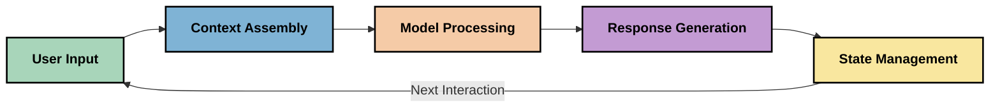
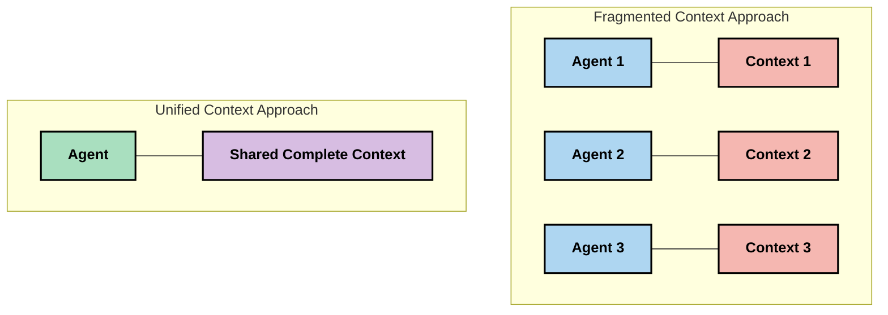
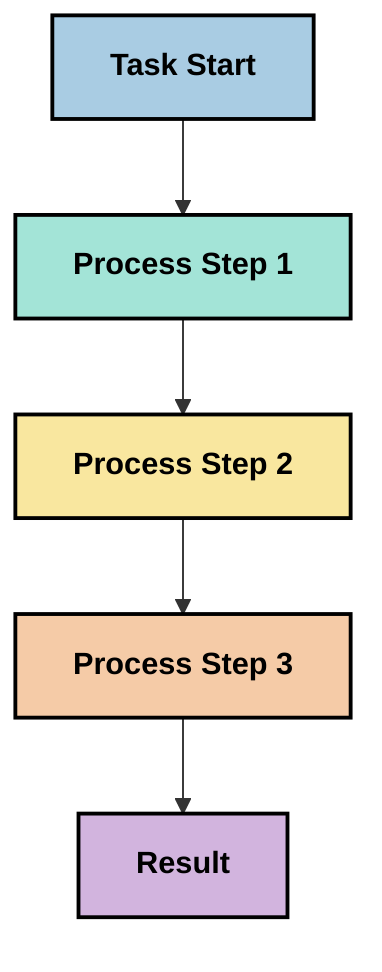
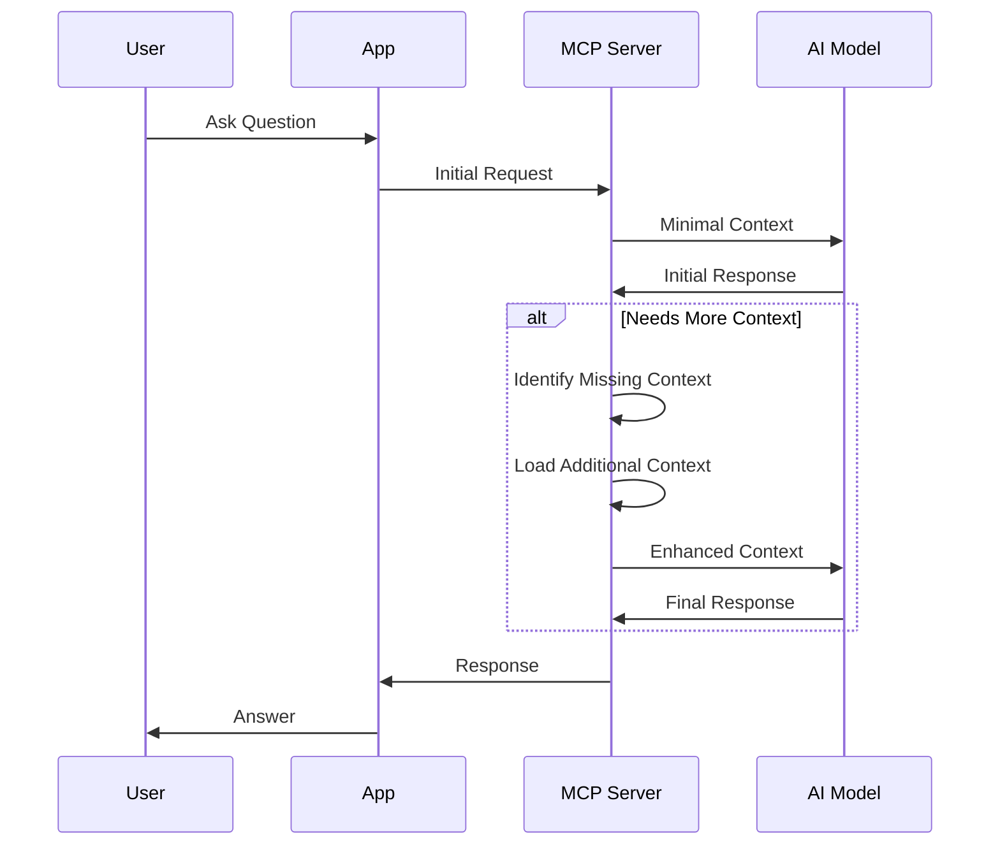
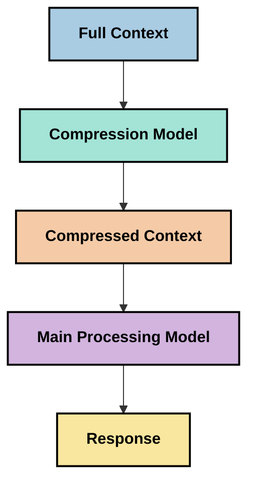

<!--
CO_OP_TRANSLATOR_METADATA:
{
  "original_hash": "fd169ca3071b81b5ee282e194bc823df",
  "translation_date": "2025-09-15T20:59:02+00:00",
  "source_file": "05-AdvancedTopics/mcp-contextengineering/README.md",
  "language_code": "hu"
}
-->
# Kontextusmérnökség: Egy feltörekvő fogalom az MCP ökoszisztémában

## Áttekintés

A kontextusmérnökség egy új fogalom az AI területén, amely azt vizsgálja, hogyan strukturáljuk, továbbítjuk és tartjuk fenn az információt az ügyfelek és AI szolgáltatások közötti interakciók során. Ahogy a Model Context Protocol (MCP) ökoszisztéma fejlődik, egyre fontosabbá válik a kontextus hatékony kezelése. Ez a modul bemutatja a kontextusmérnökség fogalmát, és feltárja annak lehetséges alkalmazásait az MCP implementációkban.

## Tanulási célok

A modul végére képes leszel:

- Megérteni a kontextusmérnökség feltörekvő fogalmát és annak lehetséges szerepét az MCP alkalmazásokban
- Azonosítani a kontextuskezelés kulcsfontosságú kihívásait, amelyeket az MCP protokoll tervezése kezel
- Felfedezni technikákat a modell teljesítményének javítására a kontextuskezelés révén
- Megfontolni megközelítéseket a kontextus hatékonyságának mérésére és értékelésére
- Alkalmazni ezeket a feltörekvő fogalmakat az AI élmények javítására az MCP keretrendszer segítségével

## Bevezetés a kontextusmérnökségbe

A kontextusmérnökség egy új fogalom, amely az információáramlás tudatos tervezésére és kezelésére összpontosít a felhasználók, alkalmazások és AI modellek között. Ellentétben az olyan megalapozott területekkel, mint a prompt mérnökség, a kontextusmérnökséget még mindig a gyakorlati szakemberek határozzák meg, miközben azon dolgoznak, hogy megoldják az AI modellek számára megfelelő információ biztosításának egyedi kihívásait.

Ahogy a nagy nyelvi modellek (LLM-ek) fejlődtek, a kontextus fontossága egyre nyilvánvalóbbá vált. Az általunk biztosított kontextus minősége, relevanciája és struktúrája közvetlen hatással van a modell kimeneteire. A kontextusmérnökség ezt a kapcsolatot vizsgálja, és elveket keres a hatékony kontextuskezeléshez.

> "2025-ben a modellek rendkívül intelligensek. De még a legokosabb ember sem tudja hatékonyan elvégezni a munkáját anélkül, hogy tisztában lenne azzal, mit kérnek tőle... A 'kontextusmérnökség' a prompt mérnökség következő szintje. Arról szól, hogy ezt automatikusan végezzük egy dinamikus rendszerben." — Walden Yan, Cognition AI

A kontextusmérnökség magában foglalhatja:

1. **Kontextus kiválasztása**: Annak meghatározása, hogy mely információ releváns egy adott feladathoz
2. **Kontextus strukturálása**: Az információ szervezése a modell megértésének maximalizálása érdekében
3. **Kontextus továbbítása**: Az információ küldésének optimalizálása, hogy mikor és hogyan érkezzen a modellekhez
4. **Kontextus fenntartása**: A kontextus állapotának és fejlődésének kezelése idővel
5. **Kontextus értékelése**: A kontextus hatékonyságának mérése és javítása

Ezek a fókuszterületek különösen relevánsak az MCP ökoszisztéma számára, amely szabványosított módot kínál az alkalmazások számára, hogy kontextust biztosítsanak az LLM-eknek.

## A kontextus útja perspektíva

A kontextusmérnökséget úgy is elképzelhetjük, hogy nyomon követjük az információ útját egy MCP rendszeren keresztül:



### A kontextus útjának kulcsfontosságú szakaszai:

1. **Felhasználói bemenet**: Nyers információ a felhasználótól (szöveg, képek, dokumentumok)
2. **Kontextus összeállítása**: A felhasználói bemenet kombinálása a rendszer kontextusával, beszélgetési előzményekkel és más visszakeresett információkkal
3. **Modell feldolgozása**: Az AI modell feldolgozza az összeállított kontextust
4. **Válasz generálása**: A modell kimenetet hoz létre a biztosított kontextus alapján
5. **Állapotkezelés**: A rendszer frissíti belső állapotát az interakció alapján

Ez a perspektíva kiemeli a kontextus dinamikus természetét az AI rendszerekben, és fontos kérdéseket vet fel arról, hogyan lehet a legjobban kezelni az információt minden szakaszban.

## Feltörekvő elvek a kontextusmérnökségben

Ahogy a kontextusmérnökség területe formálódik, néhány korai elv kezd körvonalazódni a gyakorlati szakemberek körében. Ezek az elvek segíthetnek az MCP implementációs döntések informálásában:

### Elv 1: Ossza meg a kontextust teljesen

A kontextust teljesen meg kell osztani a rendszer minden komponense között, nem pedig szétaprózva több ügynök vagy folyamat között. Ha a kontextus szétosztott, a rendszer egyik részében hozott döntések ütközhetnek a máshol hozott döntésekkel.



Az MCP alkalmazásokban ez azt sugallja, hogy olyan rendszereket kell tervezni, ahol a kontextus zökkenőmentesen áramlik az egész folyamaton keresztül, nem pedig szétaprózva.

### Elv 2: Ismerje fel, hogy a cselekvések implicit döntéseket hordoznak

Minden modell által végrehajtott cselekvés magában foglalja az implicit döntéseket arról, hogyan értelmezi a kontextust. Ha több komponens különböző kontextusokon cselekszik, ezek az implicit döntések ütközhetnek, ami következetlen eredményekhez vezethet.

Ez az elv fontos következményekkel jár az MCP alkalmazásokra nézve:
- Részesítse előnyben a komplex feladatok lineáris feldolgozását a párhuzamos végrehajtással szemben, amely szétaprózott kontextust használ
- Biztosítsa, hogy minden döntési pont hozzáférjen ugyanahhoz a kontextuális információhoz
- Tervezzen olyan rendszereket, ahol a későbbi lépések láthatják a korábbi döntések teljes kontextusát

### Elv 3: Egyensúlyozza a kontextus mélységét az ablakkorlátokkal

Ahogy a beszélgetések és folyamatok hosszabbá válnak, a kontextusablakok végül túlcsordulnak. A hatékony kontextusmérnökség olyan megközelítéseket vizsgál, amelyek kezelik ezt a feszültséget a teljes kontextus és a technikai korlátok között.

Lehetséges megközelítések, amelyeket vizsgálnak:
- Kontextus tömörítése, amely megőrzi a lényeges információkat, miközben csökkenti a tokenhasználatot
- Kontextus progresszív betöltése az aktuális igények relevanciája alapján
- Korábbi interakciók összefoglalása, miközben megőrzi a kulcsfontosságú döntéseket és tényeket

## Kontextus kihívások és MCP protokoll tervezés

A Model Context Protocol (MCP) tervezésekor figyelembe vették a kontextuskezelés egyedi kihívásait. Ezeknek a kihívásoknak a megértése segít megmagyarázni az MCP protokoll tervezésének kulcsfontosságú aspektusait:

### Kihívás 1: Kontextusablak korlátai
A legtöbb AI modellnek fix kontextusablak mérete van, amely korlátozza, hogy egyszerre mennyi információt tud feldolgozni.

**MCP tervezési válasz:**
- A protokoll támogatja a strukturált, erőforrás-alapú kontextust, amely hatékonyan hivatkozható
- Az erőforrások lapozhatók és progresszíven betölthetők

### Kihívás 2: Relevancia meghatározása
Nehéz meghatározni, hogy mely információk a legrelevánsabbak a kontextusba való beillesztéshez.

**MCP tervezési válasz:**
- Rugalmas eszközök lehetővé teszik az információ dinamikus visszakeresését az igények alapján
- Strukturált promptok biztosítják a kontextus következetes szervezését

### Kihívás 3: Kontextus tartóssága
Az interakciók közötti állapotkezelés gondos kontextuskövetést igényel.

**MCP tervezési válasz:**
- Szabványosított munkamenet-kezelés
- Egyértelműen meghatározott interakciós minták a kontextus fejlődéséhez

### Kihívás 4: Többmódú kontextus
A különböző típusú adatok (szöveg, képek, strukturált adatok) eltérő kezelést igényelnek.

**MCP tervezési válasz:**
- A protokoll tervezése különböző tartalomtípusokat támogat
- Többmódú információ szabványosított reprezentációja

### Kihívás 5: Biztonság és adatvédelem
A kontextus gyakran érzékeny információkat tartalmaz, amelyeket védeni kell.

**MCP tervezési válasz:**
- Egyértelmű határok az ügyfél és a szerver felelősségei között
- Helyi feldolgozási lehetőségek az adatok kitettségének minimalizálása érdekében

Ezeknek a kihívásoknak a megértése és az MCP által kínált megoldások alapot nyújtanak a fejlettebb kontextusmérnökségi technikák felfedezéséhez.

## Feltörekvő kontextusmérnökségi megközelítések

Ahogy a kontextusmérnökség területe fejlődik, számos ígéretes megközelítés jelenik meg. Ezek a jelenlegi gondolkodást képviselik, nem pedig megalapozott legjobb gyakorlatokat, és valószínűleg tovább fejlődnek, ahogy több tapasztalatot szerzünk az MCP implementációkkal.

### 1. Egyszálú lineáris feldolgozás

A kontextust szétosztó többügynökös architektúrákkal szemben néhány szakember azt tapasztalja, hogy az egyszálú lineáris feldolgozás következetesebb eredményeket hoz. Ez összhangban áll az egységes kontextus fenntartásának elvével.



Bár ez a megközelítés kevésbé hatékonynak tűnhet, mint a párhuzamos feldolgozás, gyakran koherensebb és megbízhatóbb eredményeket hoz, mivel minden lépés a korábbi döntések teljes megértésére épül.

### 2. Kontextus darabolása és prioritás meghatározása

Nagy kontextusok kezelhető darabokra bontása és a legfontosabb elemek kiválasztása.

```python
# Conceptual Example: Context Chunking and Prioritization
def process_with_chunked_context(documents, query):
    # 1. Break documents into smaller chunks
    chunks = chunk_documents(documents)
    
    # 2. Calculate relevance scores for each chunk
    scored_chunks = [(chunk, calculate_relevance(chunk, query)) for chunk in chunks]
    
    # 3. Sort chunks by relevance score
    sorted_chunks = sorted(scored_chunks, key=lambda x: x[1], reverse=True)
    
    # 4. Use the most relevant chunks as context
    context = create_context_from_chunks([chunk for chunk, score in sorted_chunks[:5]])
    
    # 5. Process with the prioritized context
    return generate_response(context, query)
```

A fenti koncepció bemutatja, hogyan lehet nagy dokumentumokat kezelhető darabokra bontani, és csak a legrelevánsabb részeket kiválasztani a kontextushoz. Ez a megközelítés segíthet a kontextusablak korlátain belül maradni, miközben nagy tudásbázisokat használunk.

### 3. Progresszív kontextus betöltés

A kontextus fokozatos betöltése szükség szerint, nem pedig egyszerre.



A progresszív kontextus betöltés minimális kontextussal kezdődik, és csak akkor bővül, ha szükséges. Ez jelentősen csökkentheti a tokenhasználatot egyszerű lekérdezések esetén, miközben megőrzi a képességet komplex kérdések kezelésére.

### 4. Kontextus tömörítés és összefoglalás

A kontextus méretének csökkentése, miközben megőrzi a lényeges információkat.



A kontextus tömörítés az alábbiakra összpontosít:
- Redundáns információk eltávolítása
- Hosszú tartalom összefoglalása
- Kulcsfontosságú tények és részletek kiemelése
- Kritikus kontextuselemek megőrzése
- Tokenhatékonyság optimalizálása

Ez a megközelítés különösen értékes lehet hosszú beszélgetések kontextusablakon belüli fenntartásához vagy nagy dokumentumok hatékony feldolgozásához. Néhány szakember speciális modelleket használ kifejezetten a kontextus tömörítésére és a beszélgetési előzmények összefoglalására.

## Felfedező kontextusmérnökségi megfontolások

Ahogy a kontextusmérnökség feltörekvő területét vizsgáljuk, számos megfontolás érdemes figyelembe venni az MCP implementációkkal való munka során. Ezek nem előíró legjobb gyakorlatok, hanem olyan területek, amelyek javulást hozhatnak az adott felhasználási esetben.

### Határozza meg kontextus céljait

Mielőtt bonyolult kontextuskezelési megoldásokat valósítana meg, világosan fogalmazza meg, mit szeretne elérni:
- Milyen konkrét információkra van szüksége a modellnek a sikerhez?
- Mely információk lényegesek, és melyek kiegészítő jellegűek?
- Milyen teljesítménykorlátai vannak (késleltetés, tokenkorlátok, költségek)?

### Rétegezett kontextus megközelítések vizsgálata

Néhány szakember sikerrel alkalmaz kontextust, amelyet fogalmi rétegekbe rendeznek:
- **Alapréteg**: Lényeges információ, amelyre a modellnek mindig szüksége van
- **Helyzeti réteg**: Az aktuális interakcióhoz kapcsolódó kontextus
- **Támogató réteg**: További információ, amely hasznos lehet
- **Tartalék réteg**: Csak szükség esetén elérhető információ

### Visszakeresési stratégiák vizsgálata

A kontextus hatékonysága gyakran attól függ, hogyan keresünk információt:
- Szemantikai keresés és beágyazások a fogalmilag releváns információk megtalálásához
- Kulcsszó-alapú keresés konkrét tények részleteihez
- Hibrid megközelítések, amelyek több visszakeresési módszert kombinálnak
- Metaadat-szűrés a hatókör szűkítéséhez kategóriák, dátumok vagy források alapján

### Kontextus koherencia kísérletezése

A kontextus struktúrája és áramlása befolyásolhatja a modell megértését:
- Kapcsolódó információk csoportosítása
- Következetes formázás és szervezés használata
- Logikai vagy időrendi sorrend fenntartása, ahol megfelelő
- Ellentmondásos információk elkerülése

### Többügynökös architektúrák kompromisszumainak mérlegelése

Bár a többügynökös architektúrák népszerűek sok AI keretrendszerben, jelentős kihívásokat jelentenek a kontextuskezelés szempontjából:
- A kontextus szétaprózódása következetlen döntésekhez vezethet az ügynökök között
- A párhuzamos feldolgozás konfliktusokat idézhet elő, amelyeket nehéz összehangolni
- Az ügynökök közötti kommunikációs többlet ellensúlyozhatja a teljesítményjavulást
- Összetett állapotkezelés szükséges a koherencia fenntartásához

Sok esetben egy együgynökös megközelítés átfog
- [Model Context Protocol Weboldal](https://modelcontextprotocol.io/)
- [Model Context Protocol Specifikáció](https://github.com/modelcontextprotocol/modelcontextprotocol)
- [MCP Dokumentáció](https://modelcontextprotocol.io/docs)
- [MCP C# SDK](https://github.com/modelcontextprotocol/csharp-sdk)
- [MCP Python SDK](https://github.com/modelcontextprotocol/python-sdk)
- [MCP TypeScript SDK](https://github.com/modelcontextprotocol/typescript-sdk)
- [MCP Inspector](https://github.com/modelcontextprotocol/inspector) - Vizualizációs tesztelő eszköz MCP szerverekhez

### Kontextusmérnöki cikkek
- [Ne építs többügynökös rendszert: Kontextusmérnöki alapelvek](https://cognition.ai/blog/dont-build-multi-agents) - Walden Yan gondolatai a kontextusmérnöki alapelvekről
- [Gyakorlati útmutató ügynökök építéséhez](https://cdn.openai.com/business-guides-and-resources/a-practical-guide-to-building-agents.pdf) - OpenAI útmutatója hatékony ügynöktervezéshez
- [Hatékony ügynökök építése](https://www.anthropic.com/engineering/building-effective-agents) - Anthropic megközelítése az ügynökfejlesztéshez

### Kapcsolódó kutatások
- [Dinamikus visszakeresés bővítése nagy nyelvi modellekhez](https://arxiv.org/abs/2310.01487) - Kutatás a dinamikus visszakeresési megközelítésekről
- [Elveszve a közepén: Hogyan használják a nyelvi modellek a hosszú kontextusokat](https://arxiv.org/abs/2307.03172) - Fontos kutatás a kontextusfeldolgozási mintákról
- [Hierarchikus szöveg-alapú képgenerálás CLIP latensekkel](https://arxiv.org/abs/2204.06125) - DALL-E 2 tanulmány kontextusstruktúrázási betekintésekkel
- [A kontextus szerepének vizsgálata nagy nyelvi modellek architektúráiban](https://aclanthology.org/2023.findings-emnlp.124/) - Friss kutatás a kontextuskezelésről
- [Többügynökös együttműködés: Áttekintés](https://arxiv.org/abs/2304.03442) - Kutatás többügynökös rendszerekről és kihívásaikról

### További források
- [Kontextusablak optimalizálási technikák](https://learn.microsoft.com/en-us/azure/ai-services/openai/concepts/context-window)
- [Haladó RAG technikák](https://www.microsoft.com/en-us/research/blog/retrieval-augmented-generation-rag-and-frontier-models/)
- [Semantic Kernel Dokumentáció](https://github.com/microsoft/semantic-kernel)
- [AI Eszköztár kontextuskezeléshez](https://github.com/microsoft/aitoolkit)

## Mi következik 

- [5.15 MCP Egyedi Transport](../mcp-transport/README.md)

---

**Felelősség kizárása**:  
Ez a dokumentum az AI fordítási szolgáltatás, a [Co-op Translator](https://github.com/Azure/co-op-translator) segítségével lett lefordítva. Bár törekszünk a pontosságra, kérjük, vegye figyelembe, hogy az automatikus fordítások hibákat vagy pontatlanságokat tartalmazhatnak. Az eredeti dokumentum az eredeti nyelvén tekintendő hiteles forrásnak. Fontos információk esetén javasolt professzionális emberi fordítást igénybe venni. Nem vállalunk felelősséget semmilyen félreértésért vagy téves értelmezésért, amely a fordítás használatából eredhet.