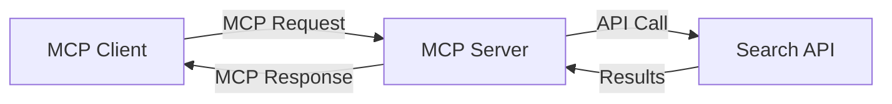
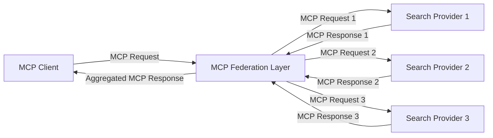
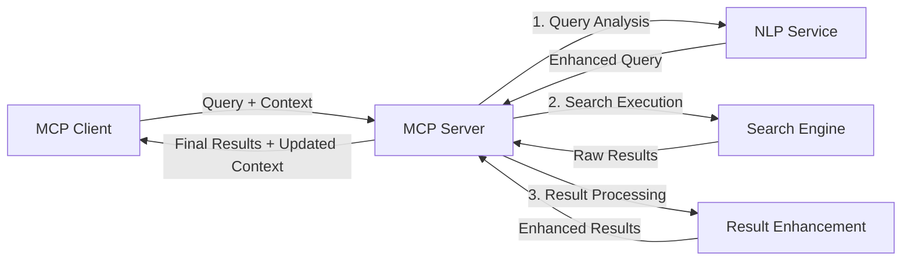

<!--
CO_OP_TRANSLATOR_METADATA:
{
  "original_hash": "eb12652eb7bd17f2193b835a344425c6",
  "translation_date": "2025-06-26T14:17:52+00:00",
  "source_file": "05-AdvancedTopics/mcp-realtimesearch/README.md",
  "language_code": "hu"
}
-->
## Kódpéldák felelősségvállalása

> **Fontos megjegyzés**: Az alábbi kódpéldák a Model Context Protocol (MCP) és a webes keresési funkciók integrációját mutatják be. Bár követik az hivatalos MCP SDK-k mintáit és szerkezetét, oktatási célokra egyszerűsítettek.
> 
> Ezek a példák bemutatják:
> 
> 1. **Python megvalósítás**: Egy FastMCP szerver implementáció, amely webes keresőeszközt biztosít és külső kereső API-hoz csatlakozik. Ez a példa bemutatja az élettartam-kezelést, a kontextuskezelést és az eszközmegvalósítást az [hivatalos MCP Python SDK](https://github.com/modelcontextprotocol/python-sdk) mintáinak megfelelően. A szerver a javasolt Streamable HTTP szállítást használja, amely felváltotta a korábbi SSE szállítást a termelési környezetekben.
> 
> 2. **JavaScript megvalósítás**: Egy TypeScript/JavaScript implementáció a FastMCP mintával az [hivatalos MCP TypeScript SDK-ból](https://github.com/modelcontextprotocol/typescript-sdk), amely keresőszervert hoz létre megfelelő eszközdefiníciókkal és klienskapcsolatokkal. Követi a legfrissebb ajánlásokat a munkamenet-kezelés és kontextusmegőrzés terén.
> 
> Ezek a példák termelési környezetben további hibakezelést, hitelesítést és konkrét API-integrációs kódot igényelnek. A bemutatott kereső API végpontok (`https://api.search-service.example/search`) helyőrzők, amelyeket valós keresőszolgáltatás végpontjaival kell helyettesíteni.
> 
> A teljes megvalósítási részletekért és a legfrissebb megközelítésekért kérjük, tekintse meg a [hivatalos MCP specifikációt](https://spec.modelcontextprotocol.io/) és az SDK dokumentációját.

## Alapfogalmak

### A Model Context Protocol (MCP) keretrendszer

Alapvetően a Model Context Protocol egy szabványosított módot biztosít AI modellek, alkalmazások és szolgáltatások közötti kontextuscsere számára. A valós idejű webes keresésben ez a keretrendszer elengedhetetlen a koherens, többkörös keresési élmények létrehozásához. Fő komponensei:

1. **Kliens-szerver architektúra**: Az MCP világosan elválasztja a kereső klienseket (kérést kezdeményezők) és a kereső szervereket (szolgáltatók), lehetővé téve rugalmas telepítési modelleket.

2. **JSON-RPC kommunikáció**: A protokoll JSON-RPC-t használ az üzenetváltáshoz, így kompatibilis a webes technológiákkal és könnyen implementálható különböző platformokon.

3. **Kontextuskezelés**: Az MCP strukturált módszereket határoz meg a keresési kontextus fenntartására, frissítésére és kihasználására több interakción keresztül.

4. **Eszközdefiníciók**: A keresési képességek szabványosított eszközökként vannak kitéve, jól definiált paraméterekkel és visszatérési értékekkel.

5. **Streaming támogatás**: A protokoll támogatja az eredmények streamelését, ami alapvető a valós idejű keresésnél, ahol az eredmények fokozatosan érkezhetnek.

### Webes keresés integrációs minták

Az MCP webes kereséssel való integrálásakor több mintázat is megfigyelhető:

#### 1. Közvetlen keresőszolgáltató integráció

Ebben a mintában az MCP szerver közvetlenül egy vagy több kereső API-val kommunikál, az MCP kéréseket API-specifikus hívásokká alakítja és az eredményeket MCP válaszként formázza.

#### 2. Federált keresés kontextusmegőrzéssel

Ez a minta a keresési lekérdezéseket több MCP-kompatibilis keresőszolgáltató között osztja meg, amelyek eltérő tartalomtípusokra vagy keresési képességekre specializálódhatnak, miközben egységes kontextust tartanak fenn.

#### 3. Kontextussal bővített keresési lánc

Ebben a mintában a keresési folyamat több szakaszra van bontva, ahol a kontextus minden lépésben gazdagodik, így egyre relevánsabb eredmények születnek.

### Keresési kontextus elemei

MCP-alapú webes keresés esetén a kontextus általában tartalmazza:

- **Lekérdezési előzmények**: Az adott munkamenet korábbi keresései
- **Felhasználói beállítások**: Nyelv, régió, biztonságos keresési beállítások
- **Interakciós előzmények**: Mely eredményeket kattintották meg, mennyi időt töltöttek az eredményeknél
- **Keresési paraméterek**: Szűrők, rendezési sorrendek és egyéb módosítók
- **Domain-specifikus tudás**: A keresés szempontjából releváns témakör-specifikus kontextus
- **Időbeli kontextus**: Időalapú relevancia tényezők
- **Forráspreferenciák**: Megbízható vagy előnyben részesített információforrások

## Felhasználási esetek és alkalmazások

### Kutatás és információgyűjtés

Az MCP javítja a kutatási munkafolyamatokat azzal, hogy:

- Megőrzi a kutatási kontextust a keresési munkamenetek között
- Lehetővé teszi a kifinomultabb és kontextusban relevánsabb lekérdezéseket
- Támogatja a többforrásos keresés federációját
- Segíti a tudáskinyerést a keresési eredményekből

### Valós idejű hírek és trendfigyelés

Az MCP-alapú keresés előnyei a hírfelügyeletben:

- Közel valós idejű új hírek felfedezése
- Kontextuális szűrés a releváns információkra
- Téma- és entitáskövetés több forrás között
- Személyre szabott hírértesítések a felhasználói kontextus alapján

### AI-vel támogatott böngészés és kutatás

Az MCP új lehetőségeket teremt az AI-vel támogatott böngészéshez:

- Kontextuális keresési javaslatok az aktuális böngészési tevékenység alapján
- Zökkenőmentes integráció webes kereséssel és LLM-alapú asszisztensekkel
- Többkörös keresési finomítás megőrzött kontextussal
- Fejlett tényellenőrzés és információhitelesítés

## Jövőbeli trendek és innovációk

### Az MCP fejlődése a webes keresésben

Előre tekintve az MCP várhatóan a következőket célozza meg:

- **Multimodális keresés**: Szöveg, kép, hang és videó keresés integrálása megőrzött kontextussal
- **Decentralizált keresés**: Elosztott és federált keresési ökoszisztémák támogatása
- **Keresési adatvédelem**: Kontextusérzékeny, adatvédelmet szolgáló keresési mechanizmusok
- **Lekérdezés-értelmezés**: Mély szemantikai elemzés a természetes nyelvű keresési lekérdezésekhez

### Technológiai előrelépések

Az MCP keresés jövőjét alakító feltörekvő technológiák:

1. **Neurális keresési architektúrák**: Beágyazás-alapú keresőrendszerek, melyeket MCP-re optimalizáltak
2. **Személyre szabott keresési kontextus**: Egyéni felhasználói keresési minták tanulása idővel
3. **Tudásgráf integráció**: Kontextuális keresés domain-specifikus tudásgráfokkal kiegészítve
4. **Keresztmodális kontextus**: Kontextus megőrzése különböző keresési módok között

## Gyakorlati feladatok

### 1. gyakorlat: Alap MCP keresési csővezeték beállítása

Ebben a gyakorlatban megtanulod, hogyan:

- Konfigurálj egy alap MCP keresési környezetet
- Valósíts meg kontextuskezelőket webes kereséshez
- Teszteld és ellenőrizd a kontextus megőrzését a keresési iterációk között

### 2. gyakorlat: Kutatási asszisztens építése MCP kereséssel

Készíts egy teljes alkalmazást, amely:

- Feldolgozza a természetes nyelvű kutatási kérdéseket
- Kontextusérzékeny webes kereséseket hajt végre
- Több forrásból szintetizál információkat
- Szervezett kutatási eredményeket mutat be

### 3. gyakorlat: Többforrásos keresés federációjának megvalósítása MCP-vel

Haladó gyakorlat, amely lefedi:

- Kontextusérzékeny lekérdezésküldést több keresőmotorhoz
- Eredményrangsort és aggregációt
- Kontextuális duplikációeltávolítást a keresési eredmények között
- Forrás-specifikus metaadatok kezelését

## További források

- [Model Context Protocol specifikáció](https://spec.modelcontextprotocol.io/) – Hivatalos MCP specifikáció és részletes protokoll dokumentáció
- [Model Context Protocol dokumentáció](https://modelcontextprotocol.io/) – Részletes oktatóanyagok és megvalósítási útmutatók
- [MCP Python SDK](https://github.com/modelcontextprotocol/python-sdk) – Hivatalos Python implementációja az MCP protokollnak
- [MCP TypeScript SDK](https://github.com/modelcontextprotocol/typescript-sdk) – Hivatalos TypeScript implementációja az MCP protokollnak
- [MCP referencia szerverek](https://github.com/modelcontextprotocol/servers) – Referencia implementációk MCP szerverekhez
- [Bing Web Search API dokumentáció](https://learn.microsoft.com/en-us/bing/search-apis/bing-web-search/overview) – A Microsoft webes kereső API-ja
- [Google Custom Search JSON API](https://developers.google.com/custom-search/v1/overview) – Google programozható keresőmotorja
- [SerpAPI dokumentáció](https://serpapi.com/search-api) – Keresőmotor eredményoldal API
- [Meilisearch dokumentáció](https://www.meilisearch.com/docs) – Nyílt forráskódú keresőmotor
- [Elasticsearch dokumentáció](https://www.elastic.co/guide/index.html) – Elosztott kereső- és analitikai motor
- [LangChain dokumentáció](https://python.langchain.com/docs/get_started/introduction) – Alkalmazások építése LLM-ekkel

## Tanulási eredmények

A modul elvégzése után képes leszel:

- Megérteni a valós idejű webes keresés alapjait és kihívásait
- Elmagyarázni, hogyan javítja a Model Context Protocol (MCP) a valós idejű webes keresést
- MCP-alapú keresési megoldásokat implementálni népszerű keretrendszerek és API-k segítségével
- Skálázható, nagy teljesítményű keresési architektúrákat tervezni és telepíteni MCP-vel
- MCP koncepciókat alkalmazni különféle felhasználási esetekben, beleértve a szemantikus keresést, kutatási asszisztenseket és AI-vel támogatott böngészést
- Értékelni az MCP-alapú keresési technológiák feltörekvő trendjeit és jövőbeni innovációit

### Bizalom és biztonság szempontjai

MCP-alapú webes keresési megoldások implementálásakor tartsd szem előtt az MCP specifikációból származó fontos elveket:

1. **Felhasználói beleegyezés és irányítás**: A felhasználóknak kifejezetten bele kell egyezniük és érteniük kell minden adat-hozzáférést és műveletet. Ez különösen fontos a webes keresési megvalósításoknál, amelyek külső adatforrásokhoz férhetnek hozzá.

2. **Adatvédelem**: Gondoskodj a keresési lekérdezések és eredmények megfelelő kezeléséről, különösen, ha érzékeny információkat tartalmazhatnak. Alkalmazz megfelelő hozzáférés-ellenőrzéseket a felhasználói adatok védelme érdekében.

3. **Eszközbiztonság**: Biztosíts megfelelő jogosultságkezelést és érvényesítést a keresőeszközök számára, mivel ezek potenciális biztonsági kockázatot jelentenek tetszőleges kódvégrehajtás miatt. Az eszközök viselkedésének leírását nem szabad megbízhatónak tekinteni, kivéve, ha megbízható szervertől származik.

4. **Világos dokumentáció**: Nyújts világos dokumentációt az MCP-alapú keresési megvalósítás képességeiről, korlátairól és biztonsági szempontjairól, követve az MCP specifikáció implementációs irányelveit.

5. **Robosztus beleegyezési folyamatok**: Építs ki robosztus beleegyezési és jogosultságkezelési folyamatokat, amelyek egyértelműen ismertetik, mit csinál az adott eszköz, mielőtt engedélyeznéd annak használatát, különösen az olyan eszközök esetén, amelyek külső webes erőforrásokkal kommunikálnak.

A MCP biztonsági és bizalommal kapcsolatos részleteiért tekintsd meg a [hivatalos dokumentációt](https://modelcontextprotocol.io/specification/2025-03-26#security-and-trust-%26-safety).

## Mi következik ezután

- [5.11 Entra ID hitelesítés Model Context Protocol szerverekhez](../mcp-security-entra/README.md)

**Jogi nyilatkozat**:  
Ezt a dokumentumot az AI fordító szolgáltatás, a [Co-op Translator](https://github.com/Azure/co-op-translator) segítségével fordítottuk le. Bár a pontosságra törekszünk, kérjük, vegye figyelembe, hogy az automatikus fordítások hibákat vagy pontatlanságokat tartalmazhatnak. Az eredeti dokumentum az anyanyelvén tekintendő hiteles forrásnak. Kritikus információk esetén szakmai, emberi fordítást javaslunk. Nem vállalunk felelősséget az ebből a fordításból eredő félreértésekért vagy téves értelmezésekért.