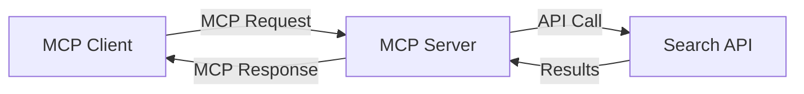
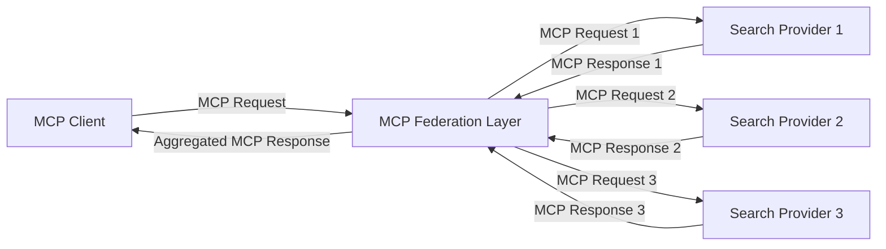
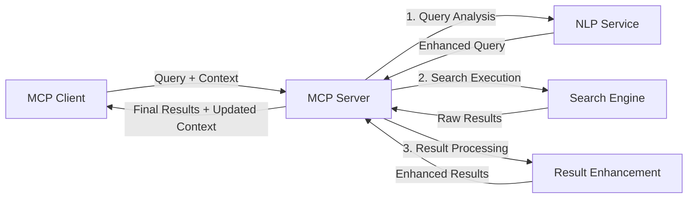

<!--
CO_OP_TRANSLATOR_METADATA:
{
  "original_hash": "333a03e51f90bdf3e6f1ba1694c73f36",
  "translation_date": "2025-07-17T10:27:50+00:00",
  "source_file": "05-AdvancedTopics/mcp-realtimesearch/README.md",
  "language_code": "hu"
}
-->
## Kódpéldák felelősségvállalása

> **Fontos megjegyzés**: Az alábbi kódpéldák a Model Context Protocol (MCP) webes keresési funkcióval való integrációját mutatják be. Bár követik az hivatalos MCP SDK-k mintáit és szerkezetét, oktatási célokra egyszerűsítettek.
> 
> Ezek a példák bemutatják:
> 
> 1. **Python megvalósítás**: Egy FastMCP szerver implementáció, amely webes keresőeszközt biztosít és külső kereső API-hoz csatlakozik. Ez a példa bemutatja a helyes élettartam-kezelést, a kontextuskezelést és az eszköz implementációt az [hivatalos MCP Python SDK](https://github.com/modelcontextprotocol/python-sdk) mintái szerint. A szerver a javasolt Streamable HTTP transportot használja, amely felváltotta a régebbi SSE transportot a gyártási környezetekben.
> 
> 2. **JavaScript megvalósítás**: Egy TypeScript/JavaScript implementáció a FastMCP mintát követve az [hivatalos MCP TypeScript SDK](https://github.com/modelcontextprotocol/typescript-sdk) alapján, amely keresőszervert hoz létre megfelelő eszközdefiníciókkal és klienskapcsolatokkal. Követi a legfrissebb ajánlott mintákat a munkamenet-kezelés és a kontextusmegőrzés terén.
> 
> Ezek a példák további hibakezelést, hitelesítést és specifikus API integrációs kódot igényelnének éles használathoz. A bemutatott kereső API végpontok (`https://api.search-service.example/search`) helykitöltők, amelyeket valós keresőszolgáltatások végpontjaival kell helyettesíteni.
> 
> A teljes megvalósítási részletekért és a legfrissebb megközelítésekért kérjük, tekintse meg a [hivatalos MCP specifikációt](https://spec.modelcontextprotocol.io/) és az SDK dokumentációt.

## Alapfogalmak

### A Model Context Protocol (MCP) keretrendszer

Alapvetően a Model Context Protocol egységesített módot biztosít AI modellek, alkalmazások és szolgáltatások közötti kontextuscserére. A valós idejű webes keresésben ez a keretrendszer elengedhetetlen a koherens, többszörös lekérdezéses keresési élmények létrehozásához. A kulcsfontosságú elemek:

1. **Kliens-szerver architektúra**: Az MCP világosan elválasztja a kereső klienseket (kérvényezőket) és a kereső szervereket (szolgáltatókat), lehetővé téve a rugalmas telepítési modelleket.

2. **JSON-RPC kommunikáció**: A protokoll JSON-RPC-t használ az üzenetváltáshoz, így kompatibilis a webes technológiákkal és könnyen megvalósítható különböző platformokon.

3. **Kontextuskezelés**: Az MCP strukturált módszereket határoz meg a keresési kontextus fenntartására, frissítésére és kihasználására több interakción keresztül.

4. **Eszközdefiníciók**: A keresési képességek szabványosított eszközökként vannak kitéve, jól definiált paraméterekkel és visszatérési értékekkel.

5. **Streaming támogatás**: A protokoll támogatja az eredmények folyamatos továbbítását, ami elengedhetetlen a valós idejű keresésnél, ahol az eredmények fokozatosan érkezhetnek.

### Webes keresés integrációs minták

Az MCP webes kereséssel való integrálásakor több minta is megjelenik:

#### 1. Közvetlen keresőszolgáltató integráció

Ebben a mintában az MCP szerver közvetlenül interfészel egy vagy több kereső API-val, MCP kéréseket API-specifikus hívásokká alakítva, az eredményeket pedig MCP válaszként formázva.

#### 2. Federált keresés kontextusmegőrzéssel

Ez a minta a keresési lekérdezéseket több MCP-kompatibilis keresőszolgáltató között osztja szét, amelyek különböző tartalomtípusokra vagy keresési képességekre specializálódhatnak, miközben egységes kontextust tart fenn.

#### 3. Kontextussal bővített keresési lánc

Ebben a mintában a keresési folyamat több szakaszra oszlik, ahol a kontextus minden lépésben gazdagodik, így egyre relevánsabb eredmények születnek.

### Keresési kontextus összetevők

MCP-alapú webes keresésben a kontextus általában tartalmazza:

- **Lekérdezési előzmények**: A munkamenet korábbi keresési lekérdezései
- **Felhasználói beállítások**: Nyelv, régió, biztonságos keresés beállítások
- **Interakciós előzmények**: Mely eredményeket kattintották meg, mennyi időt töltöttek az eredményeknél
- **Keresési paraméterek**: Szűrők, rendezési sorrendek és egyéb keresési módosítók
- **Témakör-specifikus tudás**: A keresés szempontjából releváns szakterületi kontextus
- **Időbeli kontextus**: Időalapú relevancia tényezők
- **Forráspreferenciák**: Megbízható vagy preferált információforrások

## Használati esetek és alkalmazások

### Kutatás és információgyűjtés

Az MCP javítja a kutatási munkafolyamatokat azáltal, hogy:

- Megőrzi a kutatási kontextust a keresési munkamenetek között
- Lehetővé teszi a kifinomultabb és kontextusban relevánsabb lekérdezéseket
- Támogatja a többforrásos keresési federációt
- Elősegíti a tudáskinyerést a keresési eredményekből

### Valós idejű hírek és trendfigyelés

Az MCP-vel támogatott keresés előnyöket kínál a hírek figyelésében:

- Közel valós idejű felfedezése a felbukkanó híreknek
- Kontextuális szűrése a releváns információknak
- Téma- és entitáskövetés több forrás között
- Személyre szabott hírértesítések a felhasználói kontextus alapján

### AI-vel kiegészített böngészés és kutatás

Az MCP új lehetőségeket teremt az AI-vel támogatott böngészéshez:

- Kontextuális keresési javaslatok az aktuális böngészési tevékenység alapján
- Zökkenőmentes integráció a webes keresés és a LLM-alapú asszisztensek között
- Többszörös lekérdezéses keresési finomítás megőrzött kontextussal
- Fejlettebb tényellenőrzés és információhitelesítés

## Jövőbeli trendek és innovációk

### Az MCP fejlődése a webes keresésben

Előre tekintve az MCP várhatóan fejlődni fog az alábbi területeken:

- **Multimodális keresés**: Szöveg, kép, hang és videó keresés integrálása megőrzött kontextussal
- **Decentralizált keresés**: Támogatás elosztott és federált keresési ökoszisztémákhoz
- **Keresési adatvédelem**: Kontextusérzékeny, adatvédelmet biztosító keresési mechanizmusok  
- **Lekérdezés értelmezése**: Természetes nyelvű keresési lekérdezések mély szemantikai elemzése  

### A technológia lehetséges fejlődései

Az új technológiák, amelyek alakítani fogják az MCP keresés jövőjét:

1. **Neurális keresési architektúrák**: Beágyazás-alapú keresőrendszerek, amelyek az MCP-hez vannak optimalizálva  
2. **Személyre szabott keresési kontextus**: Egyéni felhasználói keresési minták időbeli tanulása  
3. **Tudásgráf integráció**: Kontextus-alapú keresés, amelyet szakterületi tudásgráfok gazdagítanak  
4. **Keresztmodalitású kontextus**: A kontextus megőrzése különböző keresési módok között  

## Gyakorlati feladatok

### 1. feladat: Alap MCP keresési folyamat beállítása

Ebben a feladatban megtanulod, hogyan kell:  
- Beállítani egy alap MCP keresési környezetet  
- Megvalósítani kontextuskezelőket webes kereséshez  
- Tesztelni és ellenőrizni a kontextus megőrzését a keresési iterációk során  

### 2. feladat: Kutatási asszisztens építése MCP kereséssel

Készíts egy teljes alkalmazást, amely:  
- Feldolgozza a természetes nyelvű kutatási kérdéseket  
- Kontextusérzékeny webes kereséseket végez  
- Több forrásból származó információkat szintetizál  
- Rendszerezett kutatási eredményeket jelenít meg  

### 3. feladat: Többforrású keresési federáció megvalósítása MCP-vel

Haladó feladat, amely lefedi:  
- Kontextusérzékeny lekérdezésküldést több keresőmotor felé  
- Eredmények rangsorolását és összesítését  
- Kontextus-alapú duplikációmentesítést a keresési találatok között  
- Forrásspecifikus metaadatok kezelését  

## További források

- [Model Context Protocol Specification](https://spec.modelcontextprotocol.io/) - Az MCP hivatalos specifikációja és részletes protokoll dokumentáció  
- [Model Context Protocol Documentation](https://modelcontextprotocol.io/) - Részletes oktatóanyagok és megvalósítási útmutatók  
- [MCP Python SDK](https://github.com/modelcontextprotocol/python-sdk) - Az MCP protokoll hivatalos Python implementációja  
- [MCP TypeScript SDK](https://github.com/modelcontextprotocol/typescript-sdk) - Az MCP protokoll hivatalos TypeScript implementációja  
- [MCP Reference Servers](https://github.com/modelcontextprotocol/servers) - MCP szerverek referencia implementációi  
- [Bing Web Search API Documentation](https://learn.microsoft.com/en-us/bing/search-apis/bing-web-search/overview) - A Microsoft webes kereső API-ja  
- [Google Custom Search JSON API](https://developers.google.com/custom-search/v1/overview) - A Google programozható keresőmotorja  
- [SerpAPI Documentation](https://serpapi.com/search-api) - Keresőmotor találati oldal API  
- [Meilisearch Documentation](https://www.meilisearch.com/docs) - Nyílt forráskódú keresőmotor  
- [Elasticsearch Documentation](https://www.elastic.co/guide/index.html) - Elosztott kereső- és elemzőmotor  
- [LangChain Documentation](https://python.langchain.com/docs/get_started/introduction) - Alkalmazások építése LLM-ekkel  

## Tanulási eredmények

A modul elvégzése után képes leszel:  

- Megérteni a valós idejű webes keresés alapjait és kihívásait  
- Elmagyarázni, hogyan fejleszti az MCP a valós idejű webes keresés képességeit  
- Megvalósítani MCP-alapú keresési megoldásokat népszerű keretrendszerek és API-k segítségével  
- Tervezni és üzembe helyezni skálázható, nagy teljesítményű keresési architektúrákat MCP-vel  
- Alkalmazni az MCP koncepcióit különféle felhasználási esetekben, beleértve a szemantikus keresést, kutatási asszisztenciát és AI-vel támogatott böngészést  
- Értékelni az MCP-alapú keresési technológiák feltörekvő trendjeit és jövőbeli innovációit  

### Bizalom és biztonság szempontjai

MCP-alapú webes keresési megoldások megvalósításakor tartsd szem előtt az MCP specifikáció fontos elveit:  

1. **Felhasználói beleegyezés és kontroll**: A felhasználóknak kifejezetten bele kell egyezniük, és érteniük kell minden adat-hozzáférést és műveletet. Ez különösen fontos a webes keresési megvalósításoknál, amelyek külső adatforrásokhoz férhetnek hozzá.  

2. **Adatvédelem**: Biztosítsd a keresési lekérdezések és eredmények megfelelő kezelését, különösen, ha érzékeny információkat tartalmazhatnak. Alkalmazz megfelelő hozzáférés-ellenőrzést a felhasználói adatok védelmére.  

3. **Eszközbiztonság**: Gondoskodj a keresőeszközök megfelelő engedélyezéséről és érvényesítéséről, mivel ezek potenciális biztonsági kockázatot jelentenek tetszőleges kód végrehajtásán keresztül. Az eszközök viselkedésének leírását nem szabad megbízhatónak tekinteni, kivéve, ha megbízható szervertől származik.  

4. **Átlátható dokumentáció**: Nyújts világos dokumentációt az MCP-alapú keresési megvalósítás képességeiről, korlátairól és biztonsági szempontjairól, az MCP specifikáció megvalósítási irányelveinek megfelelően.  

5. **Megbízható beleegyezési folyamatok**: Építs ki megbízható beleegyezési és engedélyezési folyamatokat, amelyek világosan elmagyarázzák, mit csinál az adott eszköz, mielőtt engedélyeznéd a használatát, különösen azoknál az eszközöknél, amelyek külső webes erőforrásokkal lépnek kapcsolatba.  

Az MCP biztonsági és bizalommal kapcsolatos részleteiért lásd a [hivatalos dokumentációt](https://modelcontextprotocol.io/specification/2025-03-26#security-and-trust-%26-safety).  

## Mi következik ezután

- [5.12 Entra ID Authentication for Model Context Protocol Servers](../mcp-security-entra/README.md)

**Jogi nyilatkozat**:  
Ez a dokumentum az AI fordító szolgáltatás, a [Co-op Translator](https://github.com/Azure/co-op-translator) segítségével készült. Bár a pontosságra törekszünk, kérjük, vegye figyelembe, hogy az automatikus fordítások hibákat vagy pontatlanságokat tartalmazhatnak. Az eredeti dokumentum az anyanyelvén tekintendő hiteles forrásnak. Kritikus információk esetén professzionális emberi fordítást javaslunk. Nem vállalunk felelősséget a fordítás használatából eredő félreértésekért vagy téves értelmezésekért.