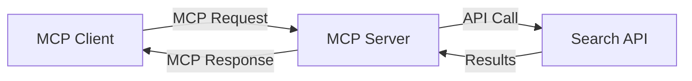
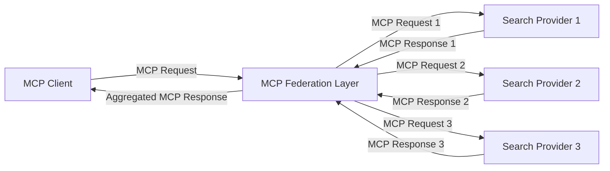
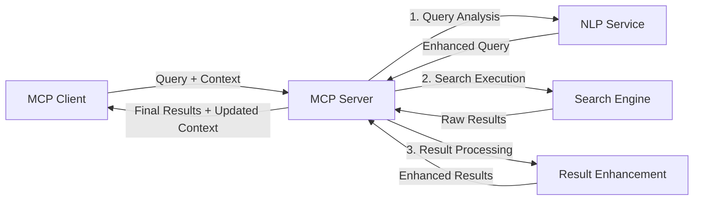

<!--
CO_OP_TRANSLATOR_METADATA:
{
  "original_hash": "16bef2c93c6a86d4ca6a8ce9e120e384",
  "translation_date": "2025-06-13T02:59:01+00:00",
  "source_file": "05-AdvancedTopics/mcp-realtimesearch/README.md",
  "language_code": "hu"
}
-->
## Kódpéldák Felelősségvállalása

> **Fontos Megjegyzés**: Az alábbi kódpéldák a Model Context Protocol (MCP) integrációját mutatják be webes keresési funkciókkal. Bár követik az hivatalos MCP SDK-k mintáit és szerkezetét, oktatási céllal egyszerűsítettek.
> 
> Ezek a példák bemutatják:
> 
> 1. **Python megvalósítás**: Egy FastMCP szerver, amely webes kereső eszközt biztosít és külső kereső API-hoz csatlakozik. Ez a példa helyes élettartam-kezelést, kontextuskezelést és eszközmegvalósítást mutat be az [hivatalos MCP Python SDK](https://github.com/modelcontextprotocol/python-sdk) mintái szerint. A szerver az ajánlott Streamable HTTP transportot használja, amely felváltotta a régebbi SSE transportot a gyártási környezetekben.
> 
> 2. **JavaScript megvalósítás**: Egy TypeScript/JavaScript megoldás a FastMCP mintára az [hivatalos MCP TypeScript SDK](https://github.com/modelcontextprotocol/typescript-sdk) alapján, amely keresőszervert hoz létre megfelelő eszközdefiníciókkal és klienskapcsolatokkal. Ez követi a legújabb ajánlott mintákat a munkamenet-kezelés és kontextusmegőrzés terén.
> 
> Ezek a példák gyártási használathoz további hibakezelést, hitelesítést és specifikus API-integrációs kódot igényelnek. A megadott kereső API végpontok (`https://api.search-service.example/search`) helyőrzők, amelyeket valós keresőszolgáltatók végpontjaival kell helyettesíteni.
> 
> A teljes megvalósítási részletekért és a legfrissebb megközelítésekért kérjük, tekintse meg a [hivatalos MCP specifikációt](https://spec.modelcontextprotocol.io/) és az SDK dokumentációt.

## Alapfogalmak

### A Model Context Protocol (MCP) Keretrendszer

Alapvetően a Model Context Protocol egységes módot biztosít AI modellek, alkalmazások és szolgáltatások közötti kontextus cserére. A valós idejű webes keresésben ez a keretrendszer elengedhetetlen a koherens, többlépcsős keresési élmények létrehozásához. Főbb elemei:

1. **Kliens-szerver architektúra**: Az MCP világos elkülönítést biztosít a kereső kliensek (kérést küldők) és kereső szerverek (szolgáltatók) között, lehetővé téve rugalmas telepítési modelleket.

2. **JSON-RPC kommunikáció**: A protokoll JSON-RPC-t használ az üzenetváltáshoz, így kompatibilis a webes technológiákkal és könnyen megvalósítható különböző platformokon.

3. **Kontextuskezelés**: Az MCP strukturált módszereket definiál a keresési kontextus fenntartására, frissítésére és kihasználására több interakción keresztül.

4. **Eszközdefiníciók**: A keresési képességek egységesített eszközökként jelennek meg, jól definiált paraméterekkel és visszatérési értékekkel.

5. **Streaming támogatás**: A protokoll támogatja az eredmények folyamatos közvetítését, ami elengedhetetlen a valós idejű keresésnél, ahol az eredmények fokozatosan érkeznek.

### Webes Keresés Integrációs Minták

Az MCP webes kereséssel való integrációja során több mintázat figyelhető meg:

#### 1. Közvetlen Keresőszolgáltató Integráció

Ebben a mintában az MCP szerver közvetlenül interfészel egy vagy több kereső API-val, MCP kéréseket API-specifikus hívásokká alakítva, az eredményeket pedig MCP válaszként formázva.

#### 2. Federált Keresés Kontextusmegőrzéssel

Ez a minta a keresési lekérdezéseket több MCP-kompatibilis keresőszolgáltató között osztja szét, amelyek eltérő tartalomtípusokra vagy keresési képességekre szakosodhatnak, miközben egységes kontextust tartanak fenn.

#### 3. Kontextussal Kiegészített Keresési Lánc

Ebben a mintában a keresési folyamat több szakaszra oszlik, ahol a kontextus minden lépésben gazdagodik, így egyre relevánsabb eredmények születnek.

### Keresési Kontextus Összetevők

Az MCP-alapú webes keresés kontextusa általában tartalmazza:

- **Lekérdezés előzmények**: A munkamenet előző keresési lekérdezései
- **Felhasználói preferenciák**: Nyelv, régió, biztonságos keresés beállításai
- **Interakciós előzmények**: Mely találatokat kattintották meg, mennyi időt töltöttek az eredményeknél
- **Keresési paraméterek**: Szűrők, rendezési sorrendek és egyéb módosítók
- **Domain-specifikus tudás**: A kereséshez kapcsolódó témakör-specifikus kontextus
- **Időbeli kontextus**: Időalapú relevancia tényezők
- **Forrás preferenciák**: Megbízható vagy előnyben részesített információforrások

## Használati Esetek és Alkalmazások

### Kutatás és Információgyűjtés

Az MCP javítja a kutatási munkafolyamatokat azáltal, hogy:

- Megőrzi a kutatási kontextust keresési munkamenetek között
- Lehetővé teszi kifinomultabb és kontextusban relevánsabb lekérdezéseket
- Támogatja a többforrásos keresési federációt
- Elősegíti a tudáskinyerést a keresési eredményekből

### Valós Idejű Hírek és Trendfigyelés

Az MCP-alapú keresés előnyei a hírek követésében:

- Közel valós idejű új hírek felfedezése
- Kontextus alapú releváns információszűrés
- Témák és entitások követése több forrás között
- Személyre szabott híradások a felhasználói kontextus alapján

### AI-vel Kiegészített Böngészés és Kutatás

Az MCP új lehetőségeket teremt az AI-vel kiegészített böngészésben:

- Kontextus alapú keresési javaslatok a böngésző aktuális tevékenysége alapján
- Zökkenőmentes integráció webes keresés és LLM-alapú asszisztensek között
- Többlépcsős keresési finomítás kontextusmegőrzéssel
- Fejlettebb tényellenőrzés és információ-hitelesítés

## Jövőbeli Irányok és Innovációk

### Az MCP fejlődése a webes keresésben

A jövőben várható, hogy az MCP a következő területeken fejlődik:

- **Multimodális keresés**: Szöveg, kép, hang és videó keresés integrálása kontextusmegőrzéssel
- **Decentralizált keresés**: Elosztott és federált keresési ökoszisztémák támogatása
- **Keresési adatvédelem**: Kontextusérzékeny, adatvédelmi szempontból biztonságos keresési mechanizmusok
- **Lekérdezés megértés**: Mély szemantikai elemzés a természetes nyelvű keresési lekérdezésekhez

### Technológiai Fejlesztések

Az MCP keresést alakító új technológiák:

1. **Neurális keresési architektúrák**: Beágyazás-alapú keresőrendszerek MCP optimalizálással
2. **Személyre szabott keresési kontextus**: Egyéni felhasználói keresési minták tanulása idővel
3. **Tudásgráf integráció**: Kontextus alapú keresés domain-specifikus tudásgráfokkal
4. **Keresztmodális kontextus**: Kontextus megőrzése különböző keresési modalitások között

## Gyakorlati Feladatok

### 1. Gyakorlat: Alap MCP keresési csővezeték beállítása

Ebben a gyakorlatban megtanulod, hogyan:
- Konfigurálj egy alap MCP keresési környezetet
- Valósíts meg kontextuskezelőket webes kereséshez
- Teszteld és validáld a kontextusmegőrzést keresési iterációk során

### 2. Gyakorlat: Kutatási asszisztens építése MCP kereséssel

Készíts egy teljes alkalmazást, amely:
- Feldolgozza a természetes nyelvű kutatási kérdéseket
- Kontextusérzékeny webes kereséseket végez
- Több forrásból szintetizál információkat
- Rendszerezett kutatási eredményeket jelenít meg

### 3. Gyakorlat: Többforrásos keresési federáció megvalósítása MCP-vel

Haladó gyakorlat, amely lefedi:
- Kontextusérzékeny lekérdezés továbbítást több keresőmotor felé
- Eredmény rangsorolást és aggregálást
- Kontextus alapú eredményduplikáció eltávolítást
- Forrás-specifikus metaadatok kezelését

## További Források

- [Model Context Protocol Specifikáció](https://spec.modelcontextprotocol.io/) – Hivatalos MCP specifikáció és részletes protokoll dokumentáció
- [Model Context Protocol Dokumentáció](https://modelcontextprotocol.io/) – Részletes oktatóanyagok és megvalósítási útmutatók
- [MCP Python SDK](https://github.com/modelcontextprotocol/python-sdk) – Hivatalos Python implementáció az MCP protokollhoz
- [MCP TypeScript SDK](https://github.com/modelcontextprotocol/typescript-sdk) – Hivatalos TypeScript implementáció az MCP protokollhoz
- [MCP Referencia Szerverek](https://github.com/modelcontextprotocol/servers) – MCP szerverek referencia implementációi
- [Bing Web Search API Dokumentáció](https://learn.microsoft.com/en-us/bing/search-apis/bing-web-search/overview) – Microsoft webes kereső API
- [Google Custom Search JSON API](https://developers.google.com/custom-search/v1/overview) – Google programozható keresőmotor
- [SerpAPI Dokumentáció](https://serpapi.com/search-api) – Keresőmotor eredményoldal API
- [Meilisearch Dokumentáció](https://www.meilisearch.com/docs) – Nyílt forráskódú keresőmotor
- [Elasticsearch Dokumentáció](https://www.elastic.co/guide/index.html) – Elosztott kereső- és elemzőmotor
- [LangChain Dokumentáció](https://python.langchain.com/docs/get_started/introduction) – Alkalmazások építése LLM-ekkel

## Tanulási Eredmények

A modul elvégzése után képes leszel:

- Megérteni a valós idejű webes keresés alapjait és kihívásait
- Elmagyarázni, hogyan javítja a Model Context Protocol (MCP) a valós idejű webes keresést
- Megvalósítani MCP-alapú keresési megoldásokat népszerű keretrendszerekkel és API-kkal
- Tervezni és telepíteni skálázható, nagy teljesítményű keresési architektúrákat MCP-vel
- Alkalmazni az MCP koncepciókat különböző használati esetekben, beleértve a szemantikus keresést, kutatási asszisztenciát és AI-vel kiegészített böngészést
- Értékelni az MCP-alapú keresési technológiák fejlődő trendjeit és jövőbeli innovációit

### Biztonsági és Megbízhatósági Szempontok

MCP-alapú webes keresési megoldások megvalósításakor tartsd szem előtt az MCP specifikációból származó fontos elveket:

1. **Felhasználói beleegyezés és kontroll**: A felhasználóknak kifejezetten bele kell egyezniük, és érteniük kell minden adat-hozzáférést és műveletet. Ez különösen fontos olyan webes keresési megvalósításoknál, amelyek külső adatforrásokat érnek el.

2. **Adatvédelem**: Biztosíts megfelelő kezelést a keresési lekérdezések és eredmények esetén, különösen, ha érzékeny információkat tartalmazhatnak. Alkalmazz megfelelő hozzáférés-vezérlést a felhasználói adatok védelmére.

3. **Eszközbiztonság**: Valósíts meg megfelelő engedélyezést és érvényesítést a keresőeszközök számára, mivel ezek potenciális biztonsági kockázatot jelenthetnek tetszőleges kód végrehajtásán keresztül. Az eszköz viselkedésének leírását megbízhatatlannak kell tekinteni, kivéve, ha megbízható szervertől származik.

4. **Világos dokumentáció**: Nyújts világos dokumentációt az MCP-alapú keresési megvalósítás képességeiről, korlátairól és biztonsági megfontolásairól, az MCP specifikáció implementációs útmutatóinak megfelelően.

5. **Robusztus beleegyezési folyamatok**: Építs ki megbízható beleegyezési és engedélyezési folyamatokat, amelyek világosan elmagyarázzák, mit csinál az egyes eszköz, mielőtt engedélyezed használatát, különösen azoknál az eszközöknél, amelyek külső webes erőforrásokkal kommunikálnak.

Az MCP biztonsági és megbízhatósági részleteiről a [hivatalos dokumentációban](https://modelcontextprotocol.io/specification/2025-03-26#security-and-trust-%26-safety) találsz bővebb információt.

## Mi következik

- [6. Közösségi hozzájárulások](../../06-CommunityContributions/README.md)

**Nyilatkozat**:  
Ez a dokumentum az AI fordító szolgáltatás, a [Co-op Translator](https://github.com/Azure/co-op-translator) segítségével készült. Bár a pontosságra törekszünk, kérjük, vegye figyelembe, hogy az automatikus fordítások tartalmazhatnak hibákat vagy pontatlanságokat. Az eredeti dokumentum az anyanyelvén tekintendő hiteles forrásnak. Kritikus információk esetén professzionális emberi fordítást javaslunk. Nem vállalunk felelősséget a fordítás használatából eredő félreértésekért vagy félreértelmezésekért.