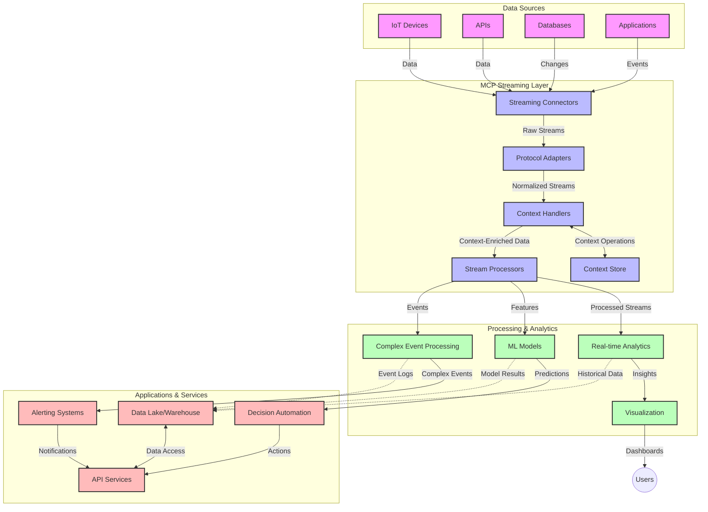

<!--
CO_OP_TRANSLATOR_METADATA:
{
  "original_hash": "68c518dbff8a3b127ed2aa934054c56c",
  "translation_date": "2025-06-11T17:28:01+00:00",
  "source_file": "05-AdvancedTopics/mcp-realtimestreaming/README.md",
  "language_code": "hu"
}
-->
# Model Context Protocol valós idejű adatfolyamokhoz

## Áttekintés

A valós idejű adatfolyamok mára elengedhetetlenné váltak az adatalapú világban, ahol a vállalatoknak és alkalmazásoknak azonnali hozzáférésre van szükségük az információkhoz a gyors döntéshozatal érdekében. A Model Context Protocol (MCP) jelentős előrelépést képvisel ezen valós idejű adatfolyamok optimalizálásában, javítva az adatfeldolgozás hatékonyságát, megőrizve a kontextuális integritást és növelve az egész rendszer teljesítményét.

Ez a modul bemutatja, hogyan alakítja át az MCP a valós idejű adatfolyamokat egy egységes megközelítés biztosításával a kontextus kezelésében az AI modellek, adatfolyam-platformok és alkalmazások között.

## Bevezetés a valós idejű adatfolyamokba

A valós idejű adatfolyam egy olyan technológiai megközelítés, amely lehetővé teszi az adatok folyamatos átvitelét, feldolgozását és elemzését az adatok keletkezésével egyidejűleg, így a rendszerek azonnal reagálhatnak az új információkra. Ellentétben a hagyományos kötegelt feldolgozással, amely statikus adatállományokon működik, az adatfolyam feldolgozás a mozgásban lévő adatokat kezeli, minimális késleltetéssel nyújtva betekintést és intézkedéseket.

### A valós idejű adatfolyamok alapfogalmai:

- **Folyamatos adatáramlás**: Az adatok események vagy rekordok megszakítás nélküli, végtelen sorozataként kerülnek feldolgozásra.
- **Alacsony késleltetésű feldolgozás**: A rendszerek úgy vannak kialakítva, hogy minimalizálják az adat keletkezése és feldolgozása közötti időt.
- **Skálázhatóság**: Az adatfolyam-architektúráknak változó adatvolumeneket és sebességeket kell kezelniük.
- **Hibatűrés**: A rendszereknek ellenállónak kell lenniük a hibákkal szemben, hogy megszakítás nélküli adatáramlást biztosítsanak.
- **Állapotmegőrző feldolgozás**: A kontextus fenntartása az események között elengedhetetlen a releváns elemzéshez.

### A Model Context Protocol és a valós idejű adatfolyamok

A Model Context Protocol (MCP) több kulcsfontosságú kihívást old meg a valós idejű adatfolyam-környezetekben:

1. **Kontextuális folytonosság**: Az MCP szabványosítja, hogyan őrződik meg a kontextus az elosztott adatfolyam-összetevők között, biztosítva, hogy az AI modellek és feldolgozó csomópontok hozzáférjenek a releváns történelmi és környezeti információkhoz.

2. **Hatékony állapotkezelés**: Strukturált mechanizmusokat kínálva a kontextus továbbítására, az MCP csökkenti az állapotkezelés terheit az adatfolyam-pipeline-okban.

3. **Interoperabilitás**: Az MCP közös nyelvet teremt a kontextus megosztására különböző adatfolyam-technológiák és AI modellek között, lehetővé téve rugalmasabb és bővíthetőbb architektúrák kialakítását.

4. **Adatfolyamra optimalizált kontextus**: Az MCP implementációk képesek priorizálni, hogy mely kontextuselemek a legfontosabbak a valós idejű döntéshozatalhoz, optimalizálva mind a teljesítményt, mind a pontosságot.

5. **Adaptív feldolgozás**: Az MCP megfelelő kontextuskezelésével az adatfolyam-rendszerek dinamikusan igazíthatják feldolgozásukat a változó feltételekhez és mintázatokhoz az adatokban.

A modern alkalmazásokban, az IoT szenzorhálózatoktól a pénzügyi kereskedési platformokig, az MCP integrációja az adatfolyam-technológiákkal intelligensebb, kontextusérzékeny feldolgozást tesz lehetővé, amely valós időben képes megfelelően reagálni a komplex, változó helyzetekre.

## Tanulási célok

A lecke végére képes leszel:

- Megérteni a valós idejű adatfolyamok alapjait és kihívásait
- Elmagyarázni, hogyan javítja a Model Context Protocol (MCP) a valós idejű adatfolyamokat
- MCP-alapú adatfolyam-megoldásokat megvalósítani népszerű keretrendszerek, például Kafka és Pulsar használatával
- Hibatűrő, nagy teljesítményű adatfolyam-architektúrákat tervezni és üzembe helyezni MCP-vel
- MCP fogalmakat alkalmazni IoT, pénzügyi kereskedés és AI-alapú elemzési esetekben
- Értékelni az MCP-alapú adatfolyam-technológiák fejlődési irányait és jövőbeli innovációit

### Meghatározás és jelentőség

A valós idejű adatfolyam folyamatos adatgenerálást, feldolgozást és továbbítást jelent minimális késleltetéssel. Ellentétben a kötegelt feldolgozással, ahol az adatokat csoportosan gyűjtik és dolgozzák fel, az adatfolyam adatokat érkezésük szerint, folyamatosan dolgozza fel, lehetővé téve az azonnali betekintést és intézkedéseket.

A valós idejű adatfolyamok fő jellemzői:

- **Alacsony késleltetés**: Az adatok feldolgozása és elemzése milliszekundumoktól másodpercekig terjedő időn belül
- **Folyamatos áramlás**: Megszakítás nélküli adatfolyamok különböző forrásokból
- **Azonnali feldolgozás**: Az adatok érkezéskor történő elemzése, nem kötegekben
- **Eseményvezérelt architektúra**: Az események bekövetkezése szerinti reakció

### Hagyományos adatfolyamok kihívásai

A hagyományos adatfolyam-megoldások számos korlátba ütköznek:

1. **Kontextusvesztés**: Nehézségek a kontextus fenntartásában elosztott rendszerek között
2. **Skálázási problémák**: Magas adatvolumen és sebesség kezelésének nehézségei
3. **Integrációs bonyolultság**: Különböző rendszerek közötti interoperabilitási problémák
4. **Késleltetés kezelése**: A feldolgozási idő és átbocsátás egyensúlyának megteremtése
5. **Adatkonzisztencia**: Az adatok pontosságának és teljességének biztosítása az egész adatfolyamon keresztül

## A Model Context Protocol (MCP) megértése

### Mi az MCP?

A Model Context Protocol (MCP) egy szabványosított kommunikációs protokoll, amely hatékony együttműködést tesz lehetővé AI modellek és alkalmazások között. A valós idejű adatfolyamok kontextusában az MCP keretet biztosít a következőkhöz:

- A kontextus megőrzése az adatfeldolgozási láncban
- Adatcsere-formátumok szabványosítása
- Nagy adatkészletek továbbításának optimalizálása
- Modell-modell és modell-alkalmazás közötti kommunikáció fejlesztése

### Főbb összetevők és architektúra

Az MCP architektúrája valós idejű adatfolyamokhoz több kulcsfontosságú elemből áll:

1. **Context Handlers**: Kezelik és fenntartják a kontextuális információkat az adatfolyam-pipeline során
2. **Stream Processors**: Kontextusérzékeny technikákkal dolgozzák fel a beérkező adatfolyamokat
3. **Protocol Adapters**: Átalakítják az adatfolyam-protokollokat, miközben megőrzik a kontextust
4. **Context Store**: Hatékonyan tárolja és lekéri a kontextuális információkat
5. **Streaming Connectors**: Csatlakoznak különböző adatfolyam-platformokhoz (Kafka, Pulsar, Kinesis stb.)



### Hogyan javítja az MCP a valós idejű adatkezelést

Az MCP a hagyományos adatfolyam-kihívásokat az alábbi módokon kezeli:

- **Kontextuális integritás**: Megőrzi az adatok közötti kapcsolatokat az egész feldolgozási láncban
- **Optimalizált továbbítás**: Csökkenti az adatok ismétlődését intelligens kontextuskezeléssel
- **Szabványosított interfészek**: Egységes API-kat biztosít az adatfolyam-összetevők számára
- **Csökkentett késleltetés**: Minimalizálja a feldolgozási terheket hatékony kontextuskezeléssel
- **Fokozott skálázhatóság**: Támogatja a horizontális bővítést a kontextus megőrzése mellett

## Integráció és megvalósítás

A valós idejű adatfolyam-rendszerek gondos architekturális tervezést és megvalósítást igényelnek, hogy mind a teljesítményt, mind a kontextuális integritást megőrizzék. A Model Context Protocol egységes megközelítést kínál az AI modellek és adatfolyam-technológiák integrációjához, lehetővé téve kifinomultabb, kontextusérzékeny feldolgozó pipeline-ok kialakítását.

### Az MCP integráció áttekintése adatfolyam-architektúrákban

Az MCP megvalósítása valós idejű adatfolyam-környezetekben több fontos szempontot foglal magában:

1. **Kontextus szerializáció és továbbítás**: Az MCP hatékony mechanizmusokat kínál a kontextuális információk kódolására az adatfolyam-csomagokban, biztosítva, hogy az alapvető kontextus végigkövesse az adatokat a feldolgozási láncon. Ez magában foglalja a streaminghez optimalizált szabványos szerializációs formátumokat.

2. **Állapotmegőrző adatfolyam-feldolgozás**: Az MCP lehetővé teszi az intelligensebb állapotmegőrző feldolgozást azáltal, hogy következetes kontextusábrázolást tart fenn a feldolgozó csomópontok között. Ez különösen értékes az elosztott adatfolyam-architektúrákban, ahol az állapotkezelés hagyományosan kihívást jelent.

3. **Esemény-idő vs. feldolgozási idő**: Az MCP implementációknak kezelniük kell az esemény bekövetkezésének és feldolgozásának időpontja közötti különbséget. A protokoll képes időbeli kontextust is tartalmazni, amely megőrzi az esemény-idő szemantikáját.

4. **Visszanyomás kezelése (Backpressure)**: A kontextuskezelés szabványosításával az MCP segíti az adatfolyam-rendszerek visszanyomásának kezelését, lehetővé téve az összetevők számára, hogy kommunikálják feldolgozási kapacitásukat és ennek megfelelően szabályozzák az adatáramlást.

5. **Kontextus-ablakozás és aggregáció**: Az MCP támogatja a kifinomultabb ablakműveleteket strukturált időbeli és relációs kontextusábrázolással, lehetővé téve értelmesebb aggregációkat az eseményfolyamok között.

6. **Pontos egyszeri feldolgozás (Exactly-Once)**: Az olyan adatfolyam-rendszerekben, ahol pontos egyszeri feldolgozás szükséges, az MCP tartalmazhat feldolgozási metaadatokat a feldolgozási állapot nyomon követéséhez és ellenőrzéséhez az elosztott összetevők között.

Az MCP megvalósítása különféle adatfolyam-technológiákban egységes kontextuskezelési megközelítést hoz létre, csökkentve az egyedi integrációs kód szükségességét, miközben javítja a rendszer képességét a releváns kontextus fenntartására az adatok áramlása során.

### MCP különböző adatfolyam-keretrendszerekben

Az MCP integrálható népszerű adatfolyam-keretrendszerekkel, többek között:

#### Apache Kafka integráció

```python
from mcp_streaming import MCPKafkaConnector

# Initialize MCP Kafka connector
connector = MCPKafkaConnector(
    bootstrap_servers='localhost:9092',
    context_preservation=True
)

# Create a context-aware consumer
consumer = connector.create_consumer('input-topic')

# Process streaming data with context
for message in consumer:
    context = message.get_context()
    data = message.get_value()
    
    # Process with context awareness
    result = process_with_context(data, context)
    
    # Produce output with preserved context
    connector.produce('output-topic', result, context=context)
```

#### Apache Pulsar megvalósítás

```python
from mcp_streaming import MCPPulsarClient

# Initialize MCP Pulsar client
client = MCPPulsarClient('pulsar://localhost:6650')

# Subscribe with context awareness
consumer = client.subscribe('input-topic', 'subscription-name', 
                           context_enabled=True)

# Process messages with context preservation
while True:
    message = consumer.receive()
    context = message.get_context()
    
    # Process with context
    result = process_with_context(message.data(), context)
    
    # Acknowledge the message
    consumer.acknowledge(message)
    
    # Send result with preserved context
    producer = client.create_producer('output-topic')
    producer.send(result, context=context)
```

### Legjobb gyakorlatok telepítéshez

Az MCP valós idejű adatfolyamokban történő alkalmazásakor:

1. **Tervezés hibatűrésre**:
   - Megfelelő hibakezelés megvalósítása
   - Dead-letter queue használata sikertelen üzenetekhez
   - Idempotens feldolgozók tervezése

2. **Teljesítmény optimalizálása**:
   - Megfelelő pufferméretek beállítása
   - Tömbösítés alkalmazása, ahol indokolt
   - Visszanyomás mechanizmusok bevezetése

3. **Megfigyelés és monitorozás**:
   - Adatfolyam-feldolgozási metrikák követése
   - Kontextus terjedésének monitorozása
   - Riasztások beállítása rendellenességek esetére

4. **Adatfolyamok biztonságossá tétele**:
   - Érzékeny adatok titkosítása
   - Hitelesítés és jogosultságkezelés alkalmazása
   - Megfelelő hozzáférés-szabályozás

### MCP az IoT és Edge Computing területén

Az MCP javítja az IoT adatfolyamokat az alábbi módokon:

- Az eszközkontextus megőrzése a feldolgozási lánc során
- Hatékony edge-to-cloud adatfolyam biztosítása
- Valós idejű elemzések támogatása IoT adatfolyamokon
- Eszközök közötti kommunikáció kontextussal

Példa: Okos városi szenzorhálózatok  
```
Sensors → Edge Gateways → MCP Stream Processors → Real-time Analytics → Automated Responses
```

### Szerepe pénzügyi tranzakciókban és magas frekvenciájú kereskedésben

Az MCP jelentős előnyöket nyújt a pénzügyi adatfolyamoknál:

- Ultra-alacsony késleltetésű feldolgozás kereskedési döntésekhez
- A tranzakciós kontextus megőrzése a feldolgozás során
- Komplex eseményfeldolgozás támogatása kontextusérzékenységgel
- Adatkonzisztencia biztosítása elosztott kereskedési rendszerekben

### AI-alapú adat-analitika fejlesztése

Az MCP új lehetőségeket teremt az adatfolyam-analitikában:

- Valós idejű modelltréning és következtetés
- Folyamatos tanulás adatfolyamokból
- Kontextusérzékeny jellemzőkinyerés
- Többmodell következtetési pipeline-ok kontextusmegőrzéssel

## Jövőbeli trendek és innovációk

### Az MCP fejlődése valós idejű környezetekben

Előre tekintve az MCP várhatóan a következőket fogja kezelni:

- **Kvantumszámítás integrációja**: Felkészülés kvantumalapú adatfolyam-rendszerekre
- **Edge-natív feldolgozás**: Több kontextusérzékeny feldolgozás az élő eszközökön
- **Önoptimalizáló adatfolyam-kezelés**: Automatikusan optimalizáló pipeline-ok
- **Federált adatfolyamok**: Elosztott feldolgozás a magánszféra megőrzésével

### Potenciális technológiai fejlődések

Az MCP adatfolyamok jövőjét formáló új technológiák:

1. **AI-optimalizált adatfolyam-protokollok**: Kifejezetten AI munkaterhelésekhez tervezett protokollok
2. **Neuromorfikus számítástechnika integrációja**: Az agy inspirálta számítás adatfolyam-feldolgozáshoz
3.

**Nyilatkozat**:  
Ezt a dokumentumot az AI fordító szolgáltatás [Co-op Translator](https://github.com/Azure/co-op-translator) segítségével fordítottuk le. Bár az pontosságra törekszünk, kérjük, vegye figyelembe, hogy az automatikus fordítások hibákat vagy pontatlanságokat tartalmazhatnak. Az eredeti dokumentum az anyanyelvén tekintendő hiteles forrásnak. Kritikus információk esetén professzionális, emberi fordítást javaslunk. Nem vállalunk felelősséget az ebből eredő félreértésekért vagy félreértelmezésekért.