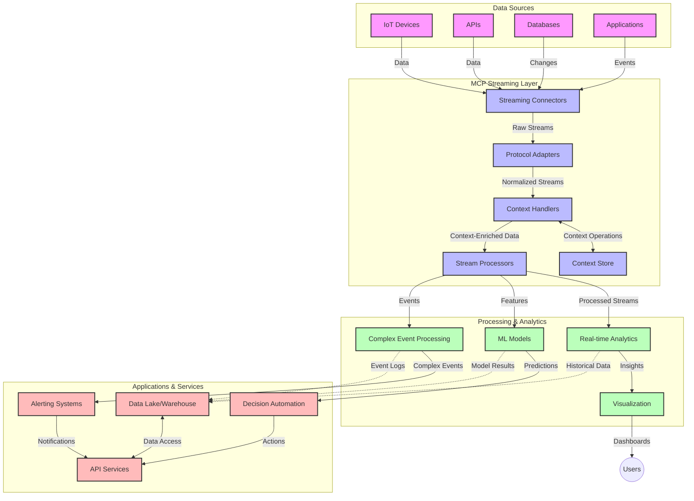

<!--
CO_OP_TRANSLATOR_METADATA:
{
  "original_hash": "b41174ac781ebf228b2043cbdfc09105",
  "translation_date": "2025-06-12T00:44:24+00:00",
  "source_file": "05-AdvancedTopics/mcp-realtimestreaming/README.md",
  "language_code": "hu"
}
-->
# Model Context Protocol valós idejű adatfolyamokhoz

## Áttekintés

A valós idejű adatfolyamok napjaink adatközpontú világában elengedhetetlenné váltak, ahol a vállalatok és alkalmazások azonnali hozzáférést igényelnek az információkhoz a gyors döntéshozatal érdekében. A Model Context Protocol (MCP) jelentős előrelépést képvisel ezen valós idejű streaming folyamatok optimalizálásában, javítva az adatfeldolgozás hatékonyságát, megőrizve a kontextuális integritást, és növelve az egész rendszer teljesítményét.

Ez a modul bemutatja, hogyan alakítja át az MCP a valós idejű adatfolyamokat azáltal, hogy egységes megközelítést kínál a kontextuskezelésre AI modellek, streaming platformok és alkalmazások között.

## Bevezetés a valós idejű adatfolyamokba

A valós idejű adatfolyam egy technológiai paradigma, amely lehetővé teszi az adatok folyamatos átvitelét, feldolgozását és elemzését az adatok keletkezésekor, így a rendszerek azonnal reagálhatnak az új információkra. Ellentétben a hagyományos, statikus adathalmazokon alapuló kötegelt feldolgozással, a streaming folyamatosan mozgásban lévő adatokat dolgoz fel, minimális késleltetéssel nyújtva betekintést és műveleteket.

### A valós idejű adatfolyamok alapvető fogalmai:

- **Folyamatos adatáramlás**: Az adatok események vagy rekordok végtelen folyamaként kerülnek feldolgozásra.
- **Alacsony késleltetésű feldolgozás**: A rendszerek úgy vannak tervezve, hogy minimalizálják az adat keletkezése és feldolgozása közötti időt.
- **Skálázhatóság**: A streaming architektúráknak változó adatvolumeneket és sebességeket kell kezelniük.
- **Hibatűrés**: A rendszereknek ellenállónak kell lenniük a hibákkal szemben az adatfolyam megszakításának elkerülése érdekében.
- **Állapotmegőrző feldolgozás**: A kontextus fenntartása az események között elengedhetetlen a releváns elemzéshez.

### A Model Context Protocol és a valós idejű streaming

A Model Context Protocol (MCP) több kulcsfontosságú kihívást kezel a valós idejű streaming környezetekben:

1. **Kontextuális folytonosság**: Az MCP egységesíti, hogyan őrződik meg a kontextus a különböző, elosztott streaming komponensek között, biztosítva, hogy az AI modellek és feldolgozó csomópontok hozzáférjenek a releváns történelmi és környezeti információkhoz.

2. **Hatékony állapotkezelés**: Strukturált mechanizmusokat nyújtva a kontextus továbbítására, az MCP csökkenti az állapotkezelés terheit a streaming csővezetékekben.

3. **Interoperabilitás**: Közös nyelvet teremt a különböző streaming technológiák és AI modellek közötti kontextusmegosztáshoz, rugalmasabb és bővíthetőbb architektúrákat lehetővé téve.

4. **Streamingre optimalizált kontextus**: Az MCP megvalósítások képesek priorizálni, hogy mely kontextuselemek a legfontosabbak a valós idejű döntéshozatalhoz, optimalizálva a teljesítményt és a pontosságot.

5. **Adaptív feldolgozás**: Megfelelő kontextuskezeléssel az MCP-n keresztül a streaming rendszerek dinamikusan igazíthatják a feldolgozást az adatok változó körülményeihez és mintáihoz.

A modern alkalmazásokban, az IoT szenzorhálózatoktól a pénzügyi kereskedési platformokig, az MCP integrációja a streaming technológiákkal intelligensebb, kontextusérzékeny feldolgozást tesz lehetővé, amely valós időben képes megfelelően reagálni a bonyolult, változó helyzetekre.

## Tanulási célok

A lecke végére képes leszel:

- Megérteni a valós idejű adatfolyamok alapjait és kihívásait
- Elmagyarázni, hogyan javítja a Model Context Protocol (MCP) a valós idejű adatfolyamokat
- Megvalósítani MCP-alapú streaming megoldásokat népszerű keretrendszerek, mint a Kafka és Pulsar segítségével
- Tervezni és üzembe helyezni hibatűrő, nagy teljesítményű streaming architektúrákat MCP-vel
- Alkalmazni az MCP koncepciókat IoT, pénzügyi kereskedés és AI-alapú elemzések területén
- Értékelni az MCP-alapú streaming technológiák fejlődő trendjeit és jövőbeli innovációit

### Meghatározás és jelentőség

A valós idejű adatfolyam folyamatos adatgenerálást, feldolgozást és továbbítást jelent minimális késleltetéssel. Ellentétben a kötegelt feldolgozással, ahol az adatokat csoportokban gyűjtik és dolgozzák fel, a streaming adatokat érkezésük szerint fokozatosan dolgozzák fel, lehetővé téve az azonnali betekintést és beavatkozást.

A valós idejű adatfolyam fő jellemzői:

- **Alacsony késleltetés**: Az adatok feldolgozása és elemzése milliszekundumok vagy másodpercek alatt
- **Folyamatos áramlás**: Megszakítás nélküli adatfolyamok különböző forrásokból
- **Azonnali feldolgozás**: Az adatok érkezésük szerint történő elemzése, nem kötegelt módon
- **Eseményvezérelt architektúra**: Az események bekövetkezése szerinti reagálás

### Hagyományos adatfolyamok kihívásai

A hagyományos adatfolyam-kezelés több korlátozással küzd:

1. **Kontextusvesztés**: Nehézségek a kontextus fenntartásában elosztott rendszerek között
2. **Skálázási problémák**: Nehézségek a nagy mennyiségű, gyors adat kezelésében
3. **Integrációs komplexitás**: Különböző rendszerek közötti interoperabilitási problémák
4. **Késleltetés kezelése**: Az átbocsátóképesség és a feldolgozási idő egyensúlyának megtalálása
5. **Adatkonzisztencia**: Az adatok pontosságának és teljességének biztosítása az egész adatfolyamban

## A Model Context Protocol (MCP) megértése

### Mi az MCP?

A Model Context Protocol (MCP) egy szabványosított kommunikációs protokoll, amely hatékony együttműködést tesz lehetővé AI modellek és alkalmazások között. A valós idejű adatfolyamok kontextusában az MCP keretet biztosít:

- A kontextus megőrzésére az adatcsővezeték teljes hosszában
- Az adatcsere formátumok egységesítésére
- Nagy adathalmazok továbbításának optimalizálására
- Modell-model és modell-alkalmazás közötti kommunikáció javítására

### Alapvető komponensek és architektúra

Az MCP architektúra valós idejű streaminghez több kulcselemből áll:

1. **Context Handlers**: A kontextuális információk kezelése és fenntartása a streaming csővezetékben
2. **Stream Processors**: Kontextusérzékeny technikákkal dolgozzák fel az érkező adatfolyamokat
3. **Protocol Adapters**: Különböző streaming protokollok közötti átalakítás kontextusmegőrzéssel
4. **Context Store**: Hatékony kontextusadat-tárolás és lekérés
5. **Streaming Connectors**: Kapcsolódás különböző streaming platformokhoz (Kafka, Pulsar, Kinesis stb.)



### Hogyan javítja az MCP a valós idejű adatkezelést

Az MCP a hagyományos streaming kihívásokat a következő módokon kezeli:

- **Kontextuális integritás**: Fenntartja az adatpontok közötti kapcsolatokat az egész adatcsővezetékben
- **Optimalizált továbbítás**: Csökkenti az adatcsere redundanciáját intelligens kontextuskezeléssel
- **Szabványosított interfészek**: Egységes API-kat biztosít a streaming komponensek számára
- **Csökkentett késleltetés**: Minimalizálja a feldolgozási többletterhet hatékony kontextuskezeléssel
- **Növelt skálázhatóság**: Támogatja a horizontális skálázást a kontextus megőrzése mellett

## Integráció és megvalósítás

A valós idejű adatfolyam rendszerek gondos architektúra-tervezést és megvalósítást igényelnek a teljesítmény és a kontextuális integritás megőrzése érdekében. A Model Context Protocol egységes megközelítést kínál AI modellek és streaming technológiák integrációjára, lehetővé téve kifinomultabb, kontextusérzékeny feldolgozó csővezetékek létrehozását.

### MCP integráció áttekintése streaming architektúrákban

Az MCP megvalósítása valós idejű streaming környezetekben több fontos szempontot foglal magában:

1. **Kontextus szerializálása és továbbítása**: Az MCP hatékony mechanizmusokat biztosít a kontextuális információk kódolására az adatcsomagokban, így a lényeges kontextus végigkíséri az adatot a feldolgozás során. Ez magában foglalja a streaminghez optimalizált, szabványosított szerializációs formátumokat.

2. **Állapotmegőrző stream feldolgozás**: Az MCP támogatja az intelligensebb állapotmegőrző feldolgozást azáltal, hogy egységes kontextusábrázolást tart fenn a feldolgozó csomópontok között. Ez különösen értékes az elosztott streaming architektúrákban, ahol az állapotkezelés hagyományosan nehézséget jelent.

3. **Eseményidő és feldolgozási idő megkülönböztetése**: Az MCP megvalósításoknak kezelniük kell azt a kihívást, hogy megkülönböztessék, mikor történt egy esemény, és mikor dolgozzák fel azt. A protokoll képes beépíteni az eseményidő kontextust, amely megőrzi az események időbeli jelentését.

4. **Backpressure kezelés**: Az egységes kontextuskezeléssel az MCP segíti a backpressure menedzsmentet a streaming rendszerekben, lehetővé téve a komponensek számára, hogy kommunikálják feldolgozási kapacitásukat és ennek megfelelően állítsák a forgalmat.

5. **Kontextus ablakolás és aggregáció**: Az MCP lehetővé teszi a kifinomultabb ablakolási műveleteket az időbeli és relációs kontextus strukturált ábrázolásával, így értelmesebb aggregációk végezhetők az eseményfolyamokon.

6. **Pontosan egyszeri feldolgozás**: Az olyan streaming rendszerekben, amelyek pontosan egyszeri feldolgozási szemantikát igényelnek, az MCP képes feldolgozási metaadatokat beépíteni a feldolgozási állapot nyomon követésére és ellenőrzésére az elosztott komponensek között.

Az MCP különböző streaming technológiákban történő alkalmazása egységes kontextuskezelést hoz létre, csökkentve az egyedi integrációs kódok szükségességét, miközben javítja a rendszer képességét a releváns kontextus megőrzésére az adatfolyam során.

### MCP különböző adatfolyam-keretrendszerekben

Az alábbi példák az aktuális MCP specifikáción alapulnak, amely egy JSON-RPC alapú protokollt használ eltérő továbbítási mechanizmusokkal. A kód bemutatja, hogyan valósíthatók meg egyedi átviteli megoldások, amelyek integrálják a Kafka és Pulsar streaming platformokat, miközben teljes kompatibilitást biztosítanak az MCP protokollal.

A példák célja, hogy megmutassák, miként lehet a streaming platformokat MCP-vel összekapcsolni valós idejű adatfeldolgozás érdekében, miközben megőrzik az MCP központi kontextusérzékenységét. Ez az eljárás biztosítja, hogy a kódminták pontosan tükrözzék az MCP specifikáció aktuális állapotát 2025 júniusában.

Az MCP integrálható népszerű streaming keretrendszerekbe, többek között:

#### Apache Kafka integráció

```python
import asyncio
import json
from typing import Dict, Any, Optional
from confluent_kafka import Consumer, Producer, KafkaError
from mcp.client import Client, ClientCapabilities
from mcp.core.message import JsonRpcMessage
from mcp.core.transports import Transport

# Custom transport class to bridge MCP with Kafka
class KafkaMCPTransport(Transport):
    def __init__(self, bootstrap_servers: str, input_topic: str, output_topic: str):
        self.bootstrap_servers = bootstrap_servers
        self.input_topic = input_topic
        self.output_topic = output_topic
        self.producer = Producer({'bootstrap.servers': bootstrap_servers})
        self.consumer = Consumer({
            'bootstrap.servers': bootstrap_servers,
            'group.id': 'mcp-client-group',
            'auto.offset.reset': 'earliest'
        })
        self.message_queue = asyncio.Queue()
        self.running = False
        self.consumer_task = None
        
    async def connect(self):
        """Connect to Kafka and start consuming messages"""
        self.consumer.subscribe([self.input_topic])
        self.running = True
        self.consumer_task = asyncio.create_task(self._consume_messages())
        return self
        
    async def _consume_messages(self):
        """Background task to consume messages from Kafka and queue them for processing"""
        while self.running:
            try:
                msg = self.consumer.poll(1.0)
                if msg is None:
                    await asyncio.sleep(0.1)
                    continue
                
                if msg.error():
                    if msg.error().code() == KafkaError._PARTITION_EOF:
                        continue
                    print(f"Consumer error: {msg.error()}")
                    continue
                
                # Parse the message value as JSON-RPC
                try:
                    message_str = msg.value().decode('utf-8')
                    message_data = json.loads(message_str)
                    mcp_message = JsonRpcMessage.from_dict(message_data)
                    await self.message_queue.put(mcp_message)
                except Exception as e:
                    print(f"Error parsing message: {e}")
            except Exception as e:
                print(f"Error in consumer loop: {e}")
                await asyncio.sleep(1)
    
    async def read(self) -> Optional[JsonRpcMessage]:
        """Read the next message from the queue"""
        try:
            message = await self.message_queue.get()
            return message
        except Exception as e:
            print(f"Error reading message: {e}")
            return None
    
    async def write(self, message: JsonRpcMessage) -> None:
        """Write a message to the Kafka output topic"""
        try:
            message_json = json.dumps(message.to_dict())
            self.producer.produce(
                self.output_topic,
                message_json.encode('utf-8'),
                callback=self._delivery_report
            )
            self.producer.poll(0)  # Trigger callbacks
        except Exception as e:
            print(f"Error writing message: {e}")
    
    def _delivery_report(self, err, msg):
        """Kafka producer delivery callback"""
        if err is not None:
            print(f'Message delivery failed: {err}')
        else:
            print(f'Message delivered to {msg.topic()} [{msg.partition()}]')
    
    async def close(self) -> None:
        """Close the transport"""
        self.running = False
        if self.consumer_task:
            self.consumer_task.cancel()
            try:
                await self.consumer_task
            except asyncio.CancelledError:
                pass
        self.consumer.close()
        self.producer.flush()

# Example usage of the Kafka MCP transport
async def kafka_mcp_example():
    # Create MCP client with Kafka transport
    client = Client(
        {"name": "kafka-mcp-client", "version": "1.0.0"},
        ClientCapabilities({})
    )
    
    # Create and connect the Kafka transport
    transport = KafkaMCPTransport(
        bootstrap_servers="localhost:9092",
        input_topic="mcp-responses",
        output_topic="mcp-requests"
    )
    
    await client.connect(transport)
    
    try:
        # Initialize the MCP session
        await client.initialize()
        
        # Example of executing a tool via MCP
        response = await client.execute_tool(
            "process_data",
            {
                "data": "sample data",
                "metadata": {
                    "source": "sensor-1",
                    "timestamp": "2025-06-12T10:30:00Z"
                }
            }
        )
        
        print(f"Tool execution response: {response}")
        
        # Clean shutdown
        await client.shutdown()
    finally:
        await transport.close()

# Run the example
if __name__ == "__main__":
    asyncio.run(kafka_mcp_example())
```

#### Apache Pulsar megvalósítás

```python
import asyncio
import json
import pulsar
from typing import Dict, Any, Optional
from mcp.core.message import JsonRpcMessage
from mcp.core.transports import Transport
from mcp.server import Server, ServerOptions
from mcp.server.tools import Tool, ToolExecutionContext, ToolMetadata

# Create a custom MCP transport that uses Pulsar
class PulsarMCPTransport(Transport):
    def __init__(self, service_url: str, request_topic: str, response_topic: str):
        self.service_url = service_url
        self.request_topic = request_topic
        self.response_topic = response_topic
        self.client = pulsar.Client(service_url)
        self.producer = self.client.create_producer(response_topic)
        self.consumer = self.client.subscribe(
            request_topic,
            "mcp-server-subscription",
            consumer_type=pulsar.ConsumerType.Shared
        )
        self.message_queue = asyncio.Queue()
        self.running = False
        self.consumer_task = None
    
    async def connect(self):
        """Connect to Pulsar and start consuming messages"""
        self.running = True
        self.consumer_task = asyncio.create_task(self._consume_messages())
        return self
    
    async def _consume_messages(self):
        """Background task to consume messages from Pulsar and queue them for processing"""
        while self.running:
            try:
                # Non-blocking receive with timeout
                msg = self.consumer.receive(timeout_millis=500)
                
                # Process the message
                try:
                    message_str = msg.data().decode('utf-8')
                    message_data = json.loads(message_str)
                    mcp_message = JsonRpcMessage.from_dict(message_data)
                    await self.message_queue.put(mcp_message)
                    
                    # Acknowledge the message
                    self.consumer.acknowledge(msg)
                except Exception as e:
                    print(f"Error processing message: {e}")
                    # Negative acknowledge if there was an error
                    self.consumer.negative_acknowledge(msg)
            except Exception as e:
                # Handle timeout or other exceptions
                await asyncio.sleep(0.1)
    
    async def read(self) -> Optional[JsonRpcMessage]:
        """Read the next message from the queue"""
        try:
            message = await self.message_queue.get()
            return message
        except Exception as e:
            print(f"Error reading message: {e}")
            return None
    
    async def write(self, message: JsonRpcMessage) -> None:
        """Write a message to the Pulsar output topic"""
        try:
            message_json = json.dumps(message.to_dict())
            self.producer.send(message_json.encode('utf-8'))
        except Exception as e:
            print(f"Error writing message: {e}")
    
    async def close(self) -> None:
        """Close the transport"""
        self.running = False
        if self.consumer_task:
            self.consumer_task.cancel()
            try:
                await self.consumer_task
            except asyncio.CancelledError:
                pass
        self.consumer.close()
        self.producer.close()
        self.client.close()

# Define a sample MCP tool that processes streaming data
@Tool(
    name="process_streaming_data",
    description="Process streaming data with context preservation",
    metadata=ToolMetadata(
        required_capabilities=["streaming"]
    )
)
async def process_streaming_data(
    ctx: ToolExecutionContext,
    data: str,
    source: str,
    priority: str = "medium"
) -> Dict[str, Any]:
    """
    Process streaming data while preserving context
    
    Args:
        ctx: Tool execution context
        data: The data to process
        source: The source of the data
        priority: Priority level (low, medium, high)
        
    Returns:
        Dict containing processed results and context information
    """
    # Example processing that leverages MCP context
    print(f"Processing data from {source} with priority {priority}")
    
    # Access conversation context from MCP
    conversation_id = ctx.conversation_id if hasattr(ctx, 'conversation_id') else "unknown"
    
    # Return results with enhanced context
    return {
        "processed_data": f"Processed: {data}",
        "context": {
            "conversation_id": conversation_id,
            "source": source,
            "priority": priority,
            "processing_timestamp": ctx.get_current_time_iso()
        }
    }

# Example MCP server implementation using Pulsar transport
async def run_mcp_server_with_pulsar():
    # Create MCP server
    server = Server(
        {"name": "pulsar-mcp-server", "version": "1.0.0"},
        ServerOptions(
            capabilities={"streaming": True}
        )
    )
    
    # Register our tool
    server.register_tool(process_streaming_data)
    
    # Create and connect Pulsar transport
    transport = PulsarMCPTransport(
        service_url="pulsar://localhost:6650",
        request_topic="mcp-requests",
        response_topic="mcp-responses"
    )
    
    try:
        # Start the server with the Pulsar transport
        await server.run(transport)
    finally:
        await transport.close()

# Run the server
if __name__ == "__main__":
    asyncio.run(run_mcp_server_with_pulsar())
```

### Telepítési legjobb gyakorlatok

MCP valós idejű streaminghez történő megvalósításakor:

1. **Hibatűrés tervezése**:
   - Megfelelő hibakezelés alkalmazása
   - Dead-letter queue használata sikertelen üzenetekhez
   - Idempotens feldolgozók tervezése

2. **Teljesítmény optimalizálása**:
   - Megfelelő puffer méretek beállítása
   - Kötetek alkalmazása, ahol indokolt
   - Backpressure mechanizmusok bevezetése

3. **Monitorozás és megfigyelés**:
   - Streaming feldolgozási metrikák nyomon követése
   - Kontextus terjedésének figyelése
   - Anomáliákra figyelmeztető riasztások beállítása

4. **Áramlások biztonságossá tétele**:
   - Titkosítás alkalmazása érzékeny adatokra
   - Hitelesítés és jogosultságkezelés használata
   - Megfelelő hozzáférés-szabályozás érvényesítése

### MCP az IoT és edge computing területén

Az MCP javítja az IoT streaminget az alábbi módokon:

- Eszközkontextus megőrzése a feldolgozó csővezetékben
- Hatékony edge-to-cloud adatfolyam támogatása
- Valós idejű elemzések lehetővé tétele IoT adatfolyamokon
- Eszközök közötti kommunikáció kontextussal

Példa: Okos városi szenzorhálózatok  
```
Sensors → Edge Gateways → MCP Stream Processors → Real-time Analytics → Automated Responses
```

### Szerepe pénzügyi tranzakciókban és nagyfrekvenciás kereskedésben

Az MCP jelentős előnyöket kínál pénzügyi adatfolyamokhoz:

- Ultra-alacsony késleltetésű feldolgozás kereskedési döntésekhez
- Tranzakciós kontextus fenntartása a feldolgozás során
- Komplex eseményfeldolgozás támogatása kontextusérzékenységgel
- Adatkonzisztencia biztosítása elosztott kereskedési rendszerek között

### AI-alapú adat-elemzések fejlesztése

Az MCP új lehetőségeket teremt a streaming elemzések terén:

- Valós idejű modelltréning és következtetés
- Folyamatos tanulás streaming adatból
- Kontextusérzékeny jellemzőkinyerés
- Többmodellből álló következtetési csővezetékek kontextusmegőrzéssel

## Jövőbeli trendek és innovációk

### MCP fejlődése valós idejű környezetekben

A jövőben az MCP várhatóan foglalkozik:

- **Kvantumszámítástechnika integrációja**: Felkészülés kvantumalapú streaming rendszerekre
- **Edge-native feldolgozás**: Több kontextusérzékeny feldolgozás az élő eszközökön
- **Autonóm stream menedzsment**: Önszabályozó streaming csővezetékek
- **Federált streaming**: Elosztott feldolgozás adatvédelmet megőrizve

### Technológiai fejlődés lehetősége

**Nyilatkozat:**  
Ez a dokumentum az AI fordító szolgáltatás, a [Co-op Translator](https://github.com/Azure/co-op-translator) segítségével készült. Bár a pontosságra törekszünk, kérjük, vegye figyelembe, hogy az automatikus fordítások tartalmazhatnak hibákat vagy pontatlanságokat. Az eredeti dokumentum az anyanyelvén tekintendő hiteles forrásnak. Kritikus információk esetén szakmai, emberi fordítást javaslunk. Nem vállalunk felelősséget a fordítás használatából eredő félreértésekért vagy félreértelmezésekért.