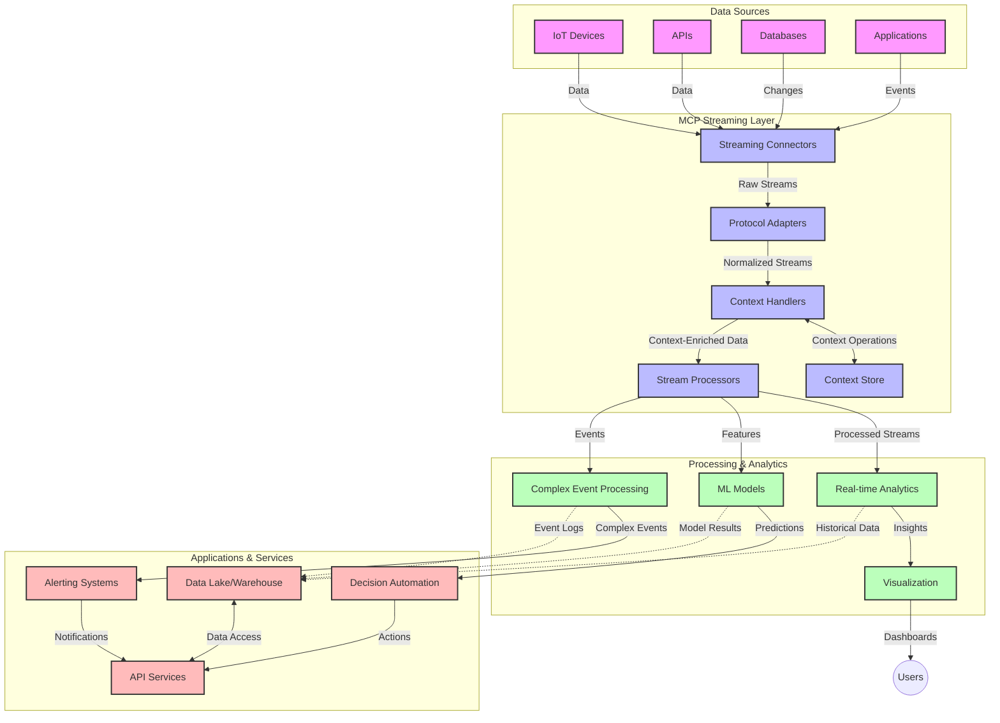

<!--
CO_OP_TRANSLATOR_METADATA:
{
  "original_hash": "195f7287638b77a549acadd96c8f981c",
  "translation_date": "2025-07-14T01:48:52+00:00",
  "source_file": "05-AdvancedTopics/mcp-realtimestreaming/README.md",
  "language_code": "hu"
}
-->
# Model Context Protocol valós idejű adatfolyamokhoz

## Áttekintés

A valós idejű adatfolyamok mára elengedhetetlenné váltak a mai adatvezérelt világban, ahol a vállalatoknak és alkalmazásoknak azonnali hozzáférésre van szükségük az információkhoz a gyors döntéshozatal érdekében. A Model Context Protocol (MCP) jelentős előrelépést jelent ezen valós idejű adatfolyamok optimalizálásában, javítva az adatfeldolgozás hatékonyságát, megőrizve a kontextuális integritást, és növelve az egész rendszer teljesítményét.

Ez a modul bemutatja, hogyan alakítja át az MCP a valós idejű adatfolyamokat azáltal, hogy egységes megközelítést kínál a kontextuskezeléshez AI modellek, adatfolyam-platformok és alkalmazások között.

## Bevezetés a valós idejű adatfolyamokba

A valós idejű adatfolyam egy olyan technológiai paradigma, amely lehetővé teszi az adatok folyamatos átvitelét, feldolgozását és elemzését az adatok keletkezésének pillanatában, így a rendszerek azonnal reagálhatnak az új információkra. Ellentétben a hagyományos, statikus adathalmazokon alapuló kötegelt feldolgozással, az adatfolyam a mozgásban lévő adatokat dolgozza fel, minimális késleltetéssel biztosítva betekintést és cselekvést.

### A valós idejű adatfolyamok alapfogalmai:

- **Folyamatos adatáramlás**: Az adatok események vagy rekordok megszakítás nélküli, folyamatos sorozataként kerülnek feldolgozásra.
- **Alacsony késleltetésű feldolgozás**: A rendszerek úgy vannak tervezve, hogy minimalizálják az adat keletkezése és feldolgozása közötti időt.
- **Skálázhatóság**: Az adatfolyam-architektúráknak képesnek kell lenniük változó adatvolumen és sebesség kezelésére.
- **Hibatűrés**: A rendszereknek ellenállónak kell lenniük a hibákkal szemben, hogy az adatáramlás megszakítás nélkül folytatódjon.
- **Állapotmegőrző feldolgozás**: A kontextus fenntartása az események között elengedhetetlen a releváns elemzéshez.

### A Model Context Protocol és a valós idejű adatfolyamok

A Model Context Protocol (MCP) több kritikus kihívást kezel a valós idejű adatfolyamok környezetében:

1. **Kontextuális folytonosság**: Az MCP szabványosítja, hogyan őrizzük meg a kontextust az elosztott adatfolyam-összetevők között, biztosítva, hogy az AI modellek és feldolgozó csomópontok hozzáférjenek a releváns történeti és környezeti információkhoz.

2. **Hatékony állapotkezelés**: Strukturált mechanizmusokat kínál a kontextus továbbítására, csökkentve az állapotkezelés terheit az adatfolyam-pipeline-okban.

3. **Interoperabilitás**: Közös nyelvet teremt a kontextus megosztására különböző adatfolyam-technológiák és AI modellek között, lehetővé téve rugalmasabb és bővíthetőbb architektúrák kialakítását.

4. **Adatfolyamra optimalizált kontextus**: Az MCP implementációk képesek priorizálni, mely kontextuselemek a legfontosabbak a valós idejű döntéshozatalhoz, optimalizálva a teljesítményt és pontosságot.

5. **Adaptív feldolgozás**: Megfelelő kontextuskezeléssel az MCP-n keresztül az adatfolyam-rendszerek dinamikusan igazíthatják feldolgozásukat az adatokban megjelenő változó körülményekhez és mintázatokhoz.

A modern alkalmazásokban, az IoT érzékelőhálózatoktól a pénzügyi kereskedési platformokig, az MCP integrációja az adatfolyam-technológiákkal intelligensebb, kontextusérzékeny feldolgozást tesz lehetővé, amely valós időben képes megfelelően reagálni a komplex, változó helyzetekre.

## Tanulási célok

A tananyag végére képes leszel:

- Megérteni a valós idejű adatfolyamok alapjait és kihívásait
- Elmagyarázni, hogyan javítja a Model Context Protocol (MCP) a valós idejű adatfolyamokat
- Megvalósítani MCP-alapú adatfolyam-megoldásokat népszerű keretrendszerek, például Kafka és Pulsar használatával
- Tervezni és üzembe helyezni hibatűrő, nagy teljesítményű adatfolyam-architektúrákat MCP-vel
- Alkalmazni az MCP koncepciókat IoT, pénzügyi kereskedés és AI-alapú elemzések területén
- Értékelni az MCP-alapú adatfolyam-technológiák fejlődési irányait és jövőbeli innovációit

### Meghatározás és jelentőség

A valós idejű adatfolyam folyamatos adatgenerálást, feldolgozást és továbbítást jelent minimális késleltetéssel. Ellentétben a kötegelt feldolgozással, ahol az adatokat csoportosan gyűjtik és dolgozzák fel, az adatfolyam inkrementálisan, érkezéskor kerül feldolgozásra, lehetővé téve az azonnali betekintést és cselekvést.

A valós idejű adatfolyamok fő jellemzői:

- **Alacsony késleltetés**: Az adatok feldolgozása és elemzése milliszekundumoktól másodpercekig terjedő időn belül
- **Folyamatos áramlás**: Megszakítás nélküli adatfolyam különböző forrásokból
- **Azonnali feldolgozás**: Az adatok érkezéskor történő elemzése, nem kötegekben
- **Eseményvezérelt architektúra**: Az események bekövetkeztekor történő reagálás

### Hagyományos adatfolyam-kezelés kihívásai

A hagyományos adatfolyam-kezelési megközelítések több korláttal küzdenek:

1. **Kontextusvesztés**: Nehézségek a kontextus fenntartásában elosztott rendszerek között
2. **Skálázási problémák**: Kihívások a nagy volumenű, nagy sebességű adatok kezelésében
3. **Integrációs bonyolultság**: Különböző rendszerek közötti interoperabilitási problémák
4. **Késleltetés kezelése**: Az átbocsátóképesség és a feldolgozási idő egyensúlyozása
5. **Adatkonzisztencia**: Az adatok pontosságának és teljességének biztosítása az egész adatfolyamon át

## A Model Context Protocol (MCP) megértése

### Mi az MCP?

A Model Context Protocol (MCP) egy szabványosított kommunikációs protokoll, amely hatékony együttműködést tesz lehetővé AI modellek és alkalmazások között. A valós idejű adatfolyamok kontextusában az MCP keretet biztosít:

- A kontextus megőrzésére az adatfeldolgozási lánc során
- Az adatcsere formátumainak szabványosítására
- Nagy adathalmazok továbbításának optimalizálására
- A modell-modell és modell-alkalmazás közötti kommunikáció javítására

### Fő komponensek és architektúra

Az MCP architektúrája valós idejű adatfolyamokhoz több kulcsfontosságú elemből áll:

1. **Context Handlers**: Kezelik és fenntartják a kontextuális információkat az adatfolyam-pipeline során
2. **Stream Processors**: Kontextusérzékeny technikákkal dolgozzák fel a bejövő adatfolyamokat
3. **Protocol Adapters**: Átalakítják az adatfolyam-protokollokat, miközben megőrzik a kontextust
4. **Context Store**: Hatékonyan tárolja és lekéri a kontextuális információkat
5. **Streaming Connectors**: Kapcsolódnak különböző adatfolyam-platformokhoz (Kafka, Pulsar, Kinesis stb.)



### Hogyan javítja az MCP a valós idejű adatkezelést

Az MCP a hagyományos adatfolyam-kihívásokat az alábbi módokon kezeli:

- **Kontextuális integritás**: Fenntartja az adatok közötti kapcsolatokat az egész feldolgozási láncban
- **Optimalizált továbbítás**: Csökkenti az adatcsere redundanciáját intelligens kontextuskezeléssel
- **Szabványosított interfészek**: Egységes API-kat biztosít az adatfolyam-összetevők számára
- **Csökkentett késleltetés**: Minimalizálja a feldolgozási terheket hatékony kontextuskezeléssel
- **Fokozott skálázhatóság**: Támogatja a horizontális skálázást a kontextus megőrzése mellett

## Integráció és megvalósítás

A valós idejű adatfolyam-rendszerek gondos architekturális tervezést és megvalósítást igényelnek a teljesítmény és a kontextuális integritás fenntartásához. A Model Context Protocol egységes megközelítést kínál az AI modellek és adatfolyam-technológiák integrálására, lehetővé téve kifinomultabb, kontextusérzékeny feldolgozó pipeline-ok kialakítását.

### Az MCP integráció áttekintése adatfolyam-architektúrákban

Az MCP megvalósítása valós idejű adatfolyam-környezetben több kulcsfontosságú szempontot foglal magában:

1. **Kontextus szerializálása és továbbítása**: Az MCP hatékony mechanizmusokat kínál a kontextuális információk kódolására az adatfolyam-csomagokban, biztosítva, hogy a lényeges kontextus végigkövesse az adatot a feldolgozási láncon. Ez magában foglalja a streaminghez optimalizált szabványos szerializációs formátumokat.

2. **Állapotmegőrző adatfolyam-feldolgozás**: Az MCP lehetővé teszi az intelligensebb állapotmegőrző feldolgozást azáltal, hogy konzisztens kontextusábrázolást tart fenn a feldolgozó csomópontok között. Ez különösen értékes az elosztott adatfolyam-architektúrákban, ahol az állapotkezelés hagyományosan kihívást jelent.

3. **Eseményidő vs. feldolgozási idő**: Az MCP implementációknak kezelniük kell az esemény bekövetkezési ideje és a feldolgozás ideje közötti különbséget. A protokoll képes időbeli kontextust is tartalmazni, amely megőrzi az eseményidő szemantikáját.

4. **Visszanyomás kezelése**: A kontextuskezelés szabványosításával az MCP segít a visszanyomás kezelésében az adatfolyam-rendszerekben, lehetővé téve az összetevők számára, hogy kommunikálják feldolgozási kapacitásukat és ennek megfelelően szabályozzák az adatáramlást.

5. **Kontextus ablakolás és aggregáció**: Az MCP támogatja a kifinomultabb ablakolási műveleteket az időbeli és relációs kontextus strukturált ábrázolásával, lehetővé téve értelmesebb aggregációkat az eseményfolyamokon keresztül.

6. **Pontosan egyszeri feldolgozás**: Azokban az adatfolyam-rendszerekben, ahol pontosan egyszeri szemantikára van szükség, az MCP képes feldolgozási metaadatokat beépíteni, amelyek segítik a feldolgozási állapot nyomon követését és ellenőrzését az elosztott komponensek között.

Az MCP különböző adatfolyam-technológiákban történő megvalósítása egységes megközelítést teremt a kontextuskezeléshez, csökkentve az egyedi integrációs kód szükségességét, miközben növeli a rendszer képességét a releváns kontextus fenntartására az adatfolyam során.

### MCP különböző adatfolyam-keretrendszerekben

Az alábbi példák az aktuális MCP specifikáción alapulnak, amely JSON-RPC alapú protokollt használ különböző szállítási mechanizmusokkal. A kód bemutatja, hogyan lehet egyedi szállításokat megvalósítani, amelyek integrálják a Kafka és Pulsar adatfolyam-platformokat, miközben teljes kompatibilitást biztosítanak az MCP protokollal.

A példák célja, hogy bemutassák, miként lehet az adatfolyam-platformokat MCP-vel összekapcsolni valós idejű adatfeldolgozás érdekében, megőrizve az MCP központi kontextusérzékenységét. Ez a megközelítés biztosítja, hogy a kódminták pontosan tükrözzék az MCP specifikáció aktuális állapotát 2025 júniusában.

Az MCP integrálható népszerű adatfolyam-keretrendszerekbe, többek között:

#### Apache Kafka integráció

```python
import asyncio
import json
from typing import Dict, Any, Optional
from confluent_kafka import Consumer, Producer, KafkaError
from mcp.client import Client, ClientCapabilities
from mcp.core.message import JsonRpcMessage
from mcp.core.transports import Transport

# Custom transport class to bridge MCP with Kafka
class KafkaMCPTransport(Transport):
    def __init__(self, bootstrap_servers: str, input_topic: str, output_topic: str):
        self.bootstrap_servers = bootstrap_servers
        self.input_topic = input_topic
        self.output_topic = output_topic
        self.producer = Producer({'bootstrap.servers': bootstrap_servers})
        self.consumer = Consumer({
            'bootstrap.servers': bootstrap_servers,
            'group.id': 'mcp-client-group',
            'auto.offset.reset': 'earliest'
        })
        self.message_queue = asyncio.Queue()
        self.running = False
        self.consumer_task = None
        
    async def connect(self):
        """Connect to Kafka and start consuming messages"""
        self.consumer.subscribe([self.input_topic])
        self.running = True
        self.consumer_task = asyncio.create_task(self._consume_messages())
        return self
        
    async def _consume_messages(self):
        """Background task to consume messages from Kafka and queue them for processing"""
        while self.running:
            try:
                msg = self.consumer.poll(1.0)
                if msg is None:
                    await asyncio.sleep(0.1)
                    continue
                
                if msg.error():
                    if msg.error().code() == KafkaError._PARTITION_EOF:
                        continue
                    print(f"Consumer error: {msg.error()}")
                    continue
                
                # Parse the message value as JSON-RPC
                try:
                    message_str = msg.value().decode('utf-8')
                    message_data = json.loads(message_str)
                    mcp_message = JsonRpcMessage.from_dict(message_data)
                    await self.message_queue.put(mcp_message)
                except Exception as e:
                    print(f"Error parsing message: {e}")
            except Exception as e:
                print(f"Error in consumer loop: {e}")
                await asyncio.sleep(1)
    
    async def read(self) -> Optional[JsonRpcMessage]:
        """Read the next message from the queue"""
        try:
            message = await self.message_queue.get()
            return message
        except Exception as e:
            print(f"Error reading message: {e}")
            return None
    
    async def write(self, message: JsonRpcMessage) -> None:
        """Write a message to the Kafka output topic"""
        try:
            message_json = json.dumps(message.to_dict())
            self.producer.produce(
                self.output_topic,
                message_json.encode('utf-8'),
                callback=self._delivery_report
            )
            self.producer.poll(0)  # Trigger callbacks
        except Exception as e:
            print(f"Error writing message: {e}")
    
    def _delivery_report(self, err, msg):
        """Kafka producer delivery callback"""
        if err is not None:
            print(f'Message delivery failed: {err}')
        else:
            print(f'Message delivered to {msg.topic()} [{msg.partition()}]')
    
    async def close(self) -> None:
        """Close the transport"""
        self.running = False
        if self.consumer_task:
            self.consumer_task.cancel()
            try:
                await self.consumer_task
            except asyncio.CancelledError:
                pass
        self.consumer.close()
        self.producer.flush()

# Example usage of the Kafka MCP transport
async def kafka_mcp_example():
    # Create MCP client with Kafka transport
    client = Client(
        {"name": "kafka-mcp-client", "version": "1.0.0"},
        ClientCapabilities({})
    )
    
    # Create and connect the Kafka transport
    transport = KafkaMCPTransport(
        bootstrap_servers="localhost:9092",
        input_topic="mcp-responses",
        output_topic="mcp-requests"
    )
    
    await client.connect(transport)
    
    try:
        # Initialize the MCP session
        await client.initialize()
        
        # Example of executing a tool via MCP
        response = await client.execute_tool(
            "process_data",
            {
                "data": "sample data",
                "metadata": {
                    "source": "sensor-1",
                    "timestamp": "2025-06-12T10:30:00Z"
                }
            }
        )
        
        print(f"Tool execution response: {response}")
        
        # Clean shutdown
        await client.shutdown()
    finally:
        await transport.close()

# Run the example
if __name__ == "__main__":
    asyncio.run(kafka_mcp_example())
```

#### Apache Pulsar megvalósítás

```python
import asyncio
import json
import pulsar
from typing import Dict, Any, Optional
from mcp.core.message import JsonRpcMessage
from mcp.core.transports import Transport
from mcp.server import Server, ServerOptions
from mcp.server.tools import Tool, ToolExecutionContext, ToolMetadata

# Create a custom MCP transport that uses Pulsar
class PulsarMCPTransport(Transport):
    def __init__(self, service_url: str, request_topic: str, response_topic: str):
        self.service_url = service_url
        self.request_topic = request_topic
        self.response_topic = response_topic
        self.client = pulsar.Client(service_url)
        self.producer = self.client.create_producer(response_topic)
        self.consumer = self.client.subscribe(
            request_topic,
            "mcp-server-subscription",
            consumer_type=pulsar.ConsumerType.Shared
        )
        self.message_queue = asyncio.Queue()
        self.running = False
        self.consumer_task = None
    
    async def connect(self):
        """Connect to Pulsar and start consuming messages"""
        self.running = True
        self.consumer_task = asyncio.create_task(self._consume_messages())
        return self
    
    async def _consume_messages(self):
        """Background task to consume messages from Pulsar and queue them for processing"""
        while self.running:
            try:
                # Non-blocking receive with timeout
                msg = self.consumer.receive(timeout_millis=500)
                
                # Process the message
                try:
                    message_str = msg.data().decode('utf-8')
                    message_data = json.loads(message_str)
                    mcp_message = JsonRpcMessage.from_dict(message_data)
                    await self.message_queue.put(mcp_message)
                    
                    # Acknowledge the message
                    self.consumer.acknowledge(msg)
                except Exception as e:
                    print(f"Error processing message: {e}")
                    # Negative acknowledge if there was an error
                    self.consumer.negative_acknowledge(msg)
            except Exception as e:
                # Handle timeout or other exceptions
                await asyncio.sleep(0.1)
    
    async def read(self) -> Optional[JsonRpcMessage]:
        """Read the next message from the queue"""
        try:
            message = await self.message_queue.get()
            return message
        except Exception as e:
            print(f"Error reading message: {e}")
            return None
    
    async def write(self, message: JsonRpcMessage) -> None:
        """Write a message to the Pulsar output topic"""
        try:
            message_json = json.dumps(message.to_dict())
            self.producer.send(message_json.encode('utf-8'))
        except Exception as e:
            print(f"Error writing message: {e}")
    
    async def close(self) -> None:
        """Close the transport"""
        self.running = False
        if self.consumer_task:
            self.consumer_task.cancel()
            try:
                await self.consumer_task
            except asyncio.CancelledError:
                pass
        self.consumer.close()
        self.producer.close()
        self.client.close()

# Define a sample MCP tool that processes streaming data
@Tool(
    name="process_streaming_data",
    description="Process streaming data with context preservation",
    metadata=ToolMetadata(
        required_capabilities=["streaming"]
    )
)
async def process_streaming_data(
    ctx: ToolExecutionContext,
    data: str,
    source: str,
    priority: str = "medium"
) -> Dict[str, Any]:
    """
    Process streaming data while preserving context
    
    Args:
        ctx: Tool execution context
        data: The data to process
        source: The source of the data
        priority: Priority level (low, medium, high)
        
    Returns:
        Dict containing processed results and context information
    """
    # Example processing that leverages MCP context
    print(f"Processing data from {source} with priority {priority}")
    
    # Access conversation context from MCP
    conversation_id = ctx.conversation_id if hasattr(ctx, 'conversation_id') else "unknown"
    
    # Return results with enhanced context
    return {
        "processed_data": f"Processed: {data}",
        "context": {
            "conversation_id": conversation_id,
            "source": source,
            "priority": priority,
            "processing_timestamp": ctx.get_current_time_iso()
        }
    }

# Example MCP server implementation using Pulsar transport
async def run_mcp_server_with_pulsar():
    # Create MCP server
    server = Server(
        {"name": "pulsar-mcp-server", "version": "1.0.0"},
        ServerOptions(
            capabilities={"streaming": True}
        )
    )
    
    # Register our tool
    server.register_tool(process_streaming_data)
    
    # Create and connect Pulsar transport
    transport = PulsarMCPTransport(
        service_url="pulsar://localhost:6650",
        request_topic="mcp-requests",
        response_topic="mcp-responses"
    )
    
    try:
        # Start the server with the Pulsar transport
        await server.run(transport)
    finally:
        await transport.close()

# Run the server
if __name__ == "__main__":
    asyncio.run(run_mcp_server_with_pulsar())
```

### Legjobb gyakorlatok az üzembe helyezéshez

MCP valós idejű adatfolyamokhoz történő megvalósításakor:

1. **Tervezés hibatűrésre**:
   - Megfelelő hibakezelés bevezetése
   - Dead-letter queue-k használata sikertelen üzenetekhez
   - Idempotens feldolgozók tervezése

2. **Teljesítmény optimalizálása**:
   - Megfelelő puffer méretek konfigurálása
   - Csomagolás alkalmazása, ahol indokolt
   - Visszanyomás mechanizmusok bevezetése

3. **Monitorozás és megfigyelés**:
   - Az adatfolyam-feldolgozási metrikák nyomon követése
   - A kontextus terjedésének figyelése
   - Riasztások beállítása rendellenességek esetén

4. **Adatfolyamok biztonságossá tétele**:
   - Érzékeny adatok titkosítása
   - Hitelesítés és jogosultságkezelés alkalmazása
   - Megfelelő hozzáférés-szabályozás bevezetése

### MCP az IoT és Edge Computing területén

Az MCP javítja az IoT adatfolyamokat az alábbi módokon:

- Az eszközkontextus megőrzése a feldolgozási láncon keresztül
- Hatékony edge-to-cloud adatfolyamok támogatása
- Valós idejű elemzések lehetővé tétele IoT adatfolyamokon
- Eszközök közötti kommunikáció kontextusmegőrzéssel

Példa: Okos városi érzékelőhálózatok  
```
Sensors → Edge Gateways → MCP Stream Processors → Real-time Analytics → Automated Responses
```

### Szerepe pénzügyi tranzakciókban és nagyfrekvenciás kereskedésben

Az MCP jelentős előnyöket kínál a pénzügyi adatfolyamok számára:

- Ultra-alacsony késleltetésű feldolgozás a kereskedési döntésekhez
- A tranzakciós kontextus megőrzése a teljes feldolgozás során
- Komplex eseményfeldolgozás támogatása kontextusérzékenységgel
- Adatkonzisztencia biztosítása elosztott kereskedési rendszerekben

### AI-alapú adat-elemzések fejlesztése

Az MCP új lehetőségeket teremt az adatfolyam-elemzésekben:

- Valós idejű modelltréning és következtetés
- Folyamatos tanulás adatfolyamokból
- Kontextusérzékeny jellemzők kinyerése
- Többmodellű következtetési pipeline-ok kontextusmegőrzéssel

## Jövőbeli trendek és innovációk

### Az MCP fejlődése valós idejű környezetekben

Előre tekintve az MCP várhatóan

**Jogi nyilatkozat**:  
Ez a dokumentum az AI fordító szolgáltatás, a [Co-op Translator](https://github.com/Azure/co-op-translator) segítségével készült. Bár a pontosságra törekszünk, kérjük, vegye figyelembe, hogy az automatikus fordítások hibákat vagy pontatlanságokat tartalmazhatnak. Az eredeti dokumentum az anyanyelvén tekintendő hiteles forrásnak. Fontos információk esetén szakmai, emberi fordítást javaslunk. Nem vállalunk felelősséget az ebből a fordításból eredő félreértésekért vagy téves értelmezésekért.