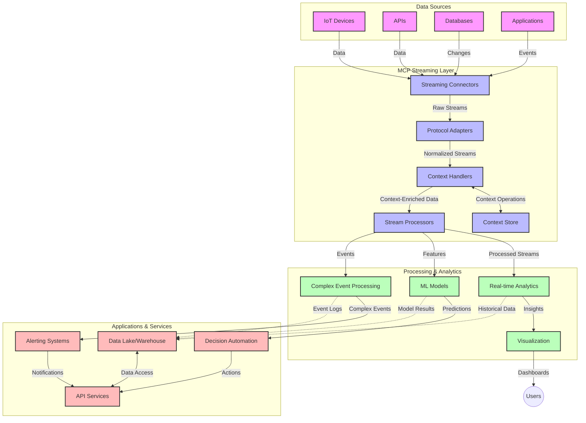

<!--
CO_OP_TRANSLATOR_METADATA:
{
  "original_hash": "195f7287638b77a549acadd96c8f981c",
  "translation_date": "2025-06-13T00:52:37+00:00",
  "source_file": "05-AdvancedTopics/mcp-realtimestreaming/README.md",
  "language_code": "hu"
}
-->
# Model Context Protocol valós idejű adatfolyamokhoz

## Áttekintés

A valós idejű adatfolyamok mára elengedhetetlenek a mai, adatközpontú világban, ahol a vállalatoknak és alkalmazásoknak azonnali hozzáférésre van szükségük az információkhoz a gyors döntéshozatal érdekében. A Model Context Protocol (MCP) jelentős előrelépést jelent ezeknek a valós idejű adatfolyamoknak az optimalizálásában, javítva az adatfeldolgozás hatékonyságát, megőrizve a kontextuális integritást és növelve az egész rendszer teljesítményét.

Ez a modul bemutatja, hogyan alakítja át az MCP a valós idejű adatfolyamokat azáltal, hogy szabványosított megközelítést kínál a kontextuskezeléshez AI modellek, adatfolyam-platformok és alkalmazások között.

## Bevezetés a valós idejű adatfolyamokba

A valós idejű adatfolyam-technológia lehetővé teszi az adatok folyamatos továbbítását, feldolgozását és elemzését az adatok keletkezésének pillanatában, így a rendszerek azonnal reagálhatnak az új információkra. Ellentétben a hagyományos, statikus adatállományokon végzett kötegelt feldolgozással, az adatfolyam feldolgozás mozgó adatokat kezel, minimális késleltetéssel szolgáltatva betekintéseket és műveleteket.

### A valós idejű adatfolyam alapfogalmai:

- **Folyamatos adatáramlás**: Az adatok események vagy rekordok végtelen folyamaként kerülnek feldolgozásra.
- **Alacsony késleltetésű feldolgozás**: A rendszerek úgy vannak tervezve, hogy minimalizálják az adat keletkezése és feldolgozása közti időt.
- **Skálázhatóság**: Az adatfolyam-architektúráknak képesnek kell lenniük változó adatvolumen és sebesség kezelésére.
- **Hibatűrés**: A rendszereknek ellenállónak kell lenniük a hibákkal szemben az adatfolyam megszakítás nélküli fenntartásához.
- **Állapotmegőrző feldolgozás**: A kontextus fenntartása az események között elengedhetetlen a releváns elemzéshez.

### A Model Context Protocol és a valós idejű adatfolyamok

A Model Context Protocol (MCP) több kulcsfontosságú kihívást old meg a valós idejű adatfolyam-környezetekben:

1. **Kontextuális folytonosság**: Az MCP szabványosítja, hogyan őrizzük meg a kontextust az elosztott adatfolyam-összetevők között, biztosítva, hogy az AI modellek és feldolgozó csomópontok hozzáférjenek a releváns történeti és környezeti információkhoz.

2. **Hatékony állapotkezelés**: Strukturált mechanizmusokat kínálva a kontextus továbbítására, az MCP csökkenti az állapotkezelés overhead-jét az adatfolyam-pipeline-okban.

3. **Interoperabilitás**: Közös nyelvet teremt a különböző adatfolyam-technológiák és AI modellek közti kontextusmegosztáshoz, lehetővé téve rugalmasabb és bővíthetőbb architektúrák kialakítását.

4. **Adatfolyamra optimalizált kontextus**: Az MCP implementációk képesek priorizálni, mely kontextuselemek a legfontosabbak a valós idejű döntéshozatalhoz, optimalizálva a teljesítményt és pontosságot.

5. **Adaptív feldolgozás**: Megfelelő kontextuskezeléssel az MCP-n keresztül az adatfolyam-rendszerek dinamikusan tudják módosítani a feldolgozást az adatokban bekövetkező változások és mintázatok alapján.

A modern alkalmazásokban, az IoT szenzorhálózatoktól a pénzügyi kereskedési platformokig, az MCP integrációja az adatfolyam-technológiákkal intelligensebb, kontextusérzékeny feldolgozást tesz lehetővé, amely valós időben reagálhat összetett, folyamatosan változó helyzetekre.

## Tanulási célok

A lecke végére képes leszel:

- Megérteni a valós idejű adatfolyamok alapjait és kihívásait
- Elmagyarázni, hogyan javítja a Model Context Protocol (MCP) a valós idejű adatfolyamokat
- MCP-alapú adatfolyam-megoldásokat megvalósítani népszerű keretrendszerekben, mint a Kafka és Pulsar
- Tervezni és üzembe helyezni hibatűrő, nagy teljesítményű adatfolyam-architektúrákat MCP-vel
- Alkalmazni az MCP koncepciókat IoT, pénzügyi kereskedés és AI-alapú analitika területein
- Értékelni az MCP-alapú adatfolyam-technológiák jövőbeli trendjeit és innovációit

### Meghatározás és jelentőség

A valós idejű adatfolyam azt jelenti, hogy az adatok folyamatosan keletkeznek, feldolgozásra és továbbításra kerülnek minimális késleltetéssel. Ellentétben a kötegelt feldolgozással, ahol az adatokat csoportosan gyűjtik és dolgozzák fel, az adatfolyamok esetében az adatokat azonnal, apránként dolgozzák fel, így azonnali betekintések és műveletek válhatnak lehetővé.

A valós idejű adatfolyam fő jellemzői:

- **Alacsony késleltetés**: Az adatok feldolgozása és elemzése milliszekundumoktól másodpercekig
- **Folyamatos áramlás**: Megszakítás nélküli adatfolyamok különböző forrásokból
- **Azonnali feldolgozás**: Az adatok érkezésük pillanatában történő elemzése, nem kötegekben
- **Eseményvezérelt architektúra**: Az eseményekre azonnal reagáló rendszer

### Hagyományos adatfolyam-kihívások

A hagyományos adatfolyam-megoldások több korláttal küzdenek:

1. **Kontextusvesztés**: Nehézségek a kontextus megőrzésében elosztott rendszerek között
2. **Skálázási problémák**: Nehézségek a nagy volumenű és nagy sebességű adatok kezelésében
3. **Integrációs bonyodalmak**: Különböző rendszerek közötti interoperabilitás nehézségei
4. **Késleltetés kezelése**: A feldolgozási idő és átbocsátóképesség egyensúlyának megteremtése
5. **Adatkonzisztencia**: Az adatpontosság és teljesség biztosítása az egész adatfolyamon át

## A Model Context Protocol (MCP) megértése

### Mi az MCP?

A Model Context Protocol (MCP) egy szabványosított kommunikációs protokoll, amely hatékony interakciót tesz lehetővé AI modellek és alkalmazások között. A valós idejű adatfolyamok területén az MCP keretrendszert biztosít a következőkhöz:

- A kontextus megőrzése az egész adatfeldolgozási folyamat során
- Az adatcsereformátumok szabványosítása
- Nagy adathalmazok továbbításának optimalizálása
- Modell-modell és modell-alkalmazás közti kommunikáció javítása

### Főbb komponensek és architektúra

Az MCP valós idejű adatfolyamokra tervezett architektúrája több kulcsfontosságú elemből áll:

1. **Context Handlers**: Kezelik és fenntartják a kontextuális információkat az adatfolyam-pipeline során
2. **Stream Processors**: Kontextusérzékeny módszerekkel dolgozzák fel a beérkező adatfolyamokat
3. **Protocol Adapters**: Átalakítják a különböző adatfolyam-protokollokat miközben megőrzik a kontextust
4. **Context Store**: Hatékonyan tárolja és hívja elő a kontextuális adatokat
5. **Streaming Connectors**: Kapcsolódnak különböző adatfolyam-platformokhoz (Kafka, Pulsar, Kinesis stb.)



### Hogyan javítja az MCP a valós idejű adatkezelést

Az MCP a hagyományos adatfolyam-kihívásokat az alábbi módokon kezeli:

- **Kontextuális integritás**: Megőrzi az adatok közti kapcsolatokat az egész feldolgozási láncon át
- **Optimalizált továbbítás**: Csökkenti az adatismétlést intelligens kontextuskezeléssel
- **Szabványos interfészek**: Egységes API-kat biztosít az adatfolyam-összetevők számára
- **Csökkentett késleltetés**: Minimalizálja a feldolgozási overhead-et hatékony kontextuskezeléssel
- **Fokozott skálázhatóság**: Támogatja a vízszintes skálázást a kontextus megőrzése mellett

## Integráció és megvalósítás

A valós idejű adatfolyam-rendszerek gondos architekturális tervezést és kivitelezést igényelnek a teljesítmény és a kontextuális integritás fenntartásához. A Model Context Protocol szabványosított megközelítést kínál AI modellek és adatfolyam-technológiák integrálására, lehetővé téve kifinomultabb, kontextusérzékeny feldolgozó pipeline-ok kialakítását.

### MCP integráció áttekintése adatfolyam-architektúrákban

Az MCP valós idejű adatfolyamokban történő alkalmazásakor több fontos szempontot kell figyelembe venni:

1. **Kontextus szerializáció és szállítás**: Az MCP hatékony mechanizmusokat kínál a kontextuális információk kódolására az adatfolyam csomagokban, biztosítva, hogy a lényeges kontextus végigkövesse az adatot a feldolgozás során. Ez magában foglalja a streaming szállításra optimalizált szabványos szerializációs formátumokat.

2. **Állapotmegőrző adatfolyam-feldolgozás**: Az MCP lehetővé teszi az intelligensebb, állapotmegőrző feldolgozást azáltal, hogy egységes kontextusábrázolást tart fenn a feldolgozó csomópontok között. Ez különösen fontos elosztott adatfolyam-architektúrákban, ahol az állapotkezelés hagyományosan kihívást jelent.

3. **Eseményidő vs. feldolgozási idő**: Az MCP implementációknak kezelniük kell az esemény bekövetkezésének és feldolgozásának időpontja közti különbséget. A protokoll képes időbeli kontextust is tartalmazni, megőrizve az eseményidő szemantikáját.

4. **Backpressure kezelés**: A kontextuskezelés szabványosításával az MCP segít kezelni a backpressure-t az adatfolyam-rendszerekben, lehetővé téve az összetevők számára, hogy kommunikálják feldolgozási kapacitásukat és ennek megfelelően szabályozzák az adatáramlást.

5. **Kontextusablakok és aggregáció**: Az MCP támogatja az összetettebb ablakműveleteket, strukturált időbeli és relációs kontextusábrázolásokat biztosítva, amelyek lehetővé teszik az eseményfolyamok értelmesebb aggregálását.

6. **Pontosan egyszeri feldolgozás**: Olyan adatfolyam-rendszerekben, amelyek pontosan egyszeri feldolgozást igényelnek, az MCP képes feldolgozási metaadatokat is tartalmazni, amelyek segítik a feldolgozási állapot nyomon követését és ellenőrzését az elosztott komponensek között.

Az MCP különböző adatfolyam-technológiákra való kiterjesztése egységes kontextuskezelési megközelítést hoz létre, csökkentve az egyedi integrációs kódok szükségességét, miközben növeli a rendszer képességét a releváns kontextus megőrzésére az adatfolyam feldolgozása során.

### MCP különböző adatfolyam-keretrendszerekben

Az alábbi példák az aktuális MCP specifikációt követik, amely egy JSON-RPC alapú protokollra épül, különböző szállítási mechanizmusokkal. A kód bemutatja, hogyan lehet egyedi szállítókat megvalósítani, amelyek integrálják a Kafka és Pulsar adatfolyam-platformokat, miközben teljes kompatibilitást tartanak fenn az MCP protokollal.

A példák célja megmutatni, hogyan lehet az adatfolyam-platformokat MCP-vel összekapcsolni valós idejű adatfeldolgozás érdekében, miközben megőrzik a MCP központi kontextusérzékenységét. Ez biztosítja, hogy a kódminták pontosan tükrözzék az MCP specifikáció 2025 júniusi állapotát.

Az MCP integrálható népszerű adatfolyam-keretrendszerekbe, többek között:

#### Apache Kafka integráció

```python
import asyncio
import json
from typing import Dict, Any, Optional
from confluent_kafka import Consumer, Producer, KafkaError
from mcp.client import Client, ClientCapabilities
from mcp.core.message import JsonRpcMessage
from mcp.core.transports import Transport

# Custom transport class to bridge MCP with Kafka
class KafkaMCPTransport(Transport):
    def __init__(self, bootstrap_servers: str, input_topic: str, output_topic: str):
        self.bootstrap_servers = bootstrap_servers
        self.input_topic = input_topic
        self.output_topic = output_topic
        self.producer = Producer({'bootstrap.servers': bootstrap_servers})
        self.consumer = Consumer({
            'bootstrap.servers': bootstrap_servers,
            'group.id': 'mcp-client-group',
            'auto.offset.reset': 'earliest'
        })
        self.message_queue = asyncio.Queue()
        self.running = False
        self.consumer_task = None
        
    async def connect(self):
        """Connect to Kafka and start consuming messages"""
        self.consumer.subscribe([self.input_topic])
        self.running = True
        self.consumer_task = asyncio.create_task(self._consume_messages())
        return self
        
    async def _consume_messages(self):
        """Background task to consume messages from Kafka and queue them for processing"""
        while self.running:
            try:
                msg = self.consumer.poll(1.0)
                if msg is None:
                    await asyncio.sleep(0.1)
                    continue
                
                if msg.error():
                    if msg.error().code() == KafkaError._PARTITION_EOF:
                        continue
                    print(f"Consumer error: {msg.error()}")
                    continue
                
                # Parse the message value as JSON-RPC
                try:
                    message_str = msg.value().decode('utf-8')
                    message_data = json.loads(message_str)
                    mcp_message = JsonRpcMessage.from_dict(message_data)
                    await self.message_queue.put(mcp_message)
                except Exception as e:
                    print(f"Error parsing message: {e}")
            except Exception as e:
                print(f"Error in consumer loop: {e}")
                await asyncio.sleep(1)
    
    async def read(self) -> Optional[JsonRpcMessage]:
        """Read the next message from the queue"""
        try:
            message = await self.message_queue.get()
            return message
        except Exception as e:
            print(f"Error reading message: {e}")
            return None
    
    async def write(self, message: JsonRpcMessage) -> None:
        """Write a message to the Kafka output topic"""
        try:
            message_json = json.dumps(message.to_dict())
            self.producer.produce(
                self.output_topic,
                message_json.encode('utf-8'),
                callback=self._delivery_report
            )
            self.producer.poll(0)  # Trigger callbacks
        except Exception as e:
            print(f"Error writing message: {e}")
    
    def _delivery_report(self, err, msg):
        """Kafka producer delivery callback"""
        if err is not None:
            print(f'Message delivery failed: {err}')
        else:
            print(f'Message delivered to {msg.topic()} [{msg.partition()}]')
    
    async def close(self) -> None:
        """Close the transport"""
        self.running = False
        if self.consumer_task:
            self.consumer_task.cancel()
            try:
                await self.consumer_task
            except asyncio.CancelledError:
                pass
        self.consumer.close()
        self.producer.flush()

# Example usage of the Kafka MCP transport
async def kafka_mcp_example():
    # Create MCP client with Kafka transport
    client = Client(
        {"name": "kafka-mcp-client", "version": "1.0.0"},
        ClientCapabilities({})
    )
    
    # Create and connect the Kafka transport
    transport = KafkaMCPTransport(
        bootstrap_servers="localhost:9092",
        input_topic="mcp-responses",
        output_topic="mcp-requests"
    )
    
    await client.connect(transport)
    
    try:
        # Initialize the MCP session
        await client.initialize()
        
        # Example of executing a tool via MCP
        response = await client.execute_tool(
            "process_data",
            {
                "data": "sample data",
                "metadata": {
                    "source": "sensor-1",
                    "timestamp": "2025-06-12T10:30:00Z"
                }
            }
        )
        
        print(f"Tool execution response: {response}")
        
        # Clean shutdown
        await client.shutdown()
    finally:
        await transport.close()

# Run the example
if __name__ == "__main__":
    asyncio.run(kafka_mcp_example())
```

#### Apache Pulsar megvalósítás

```python
import asyncio
import json
import pulsar
from typing import Dict, Any, Optional
from mcp.core.message import JsonRpcMessage
from mcp.core.transports import Transport
from mcp.server import Server, ServerOptions
from mcp.server.tools import Tool, ToolExecutionContext, ToolMetadata

# Create a custom MCP transport that uses Pulsar
class PulsarMCPTransport(Transport):
    def __init__(self, service_url: str, request_topic: str, response_topic: str):
        self.service_url = service_url
        self.request_topic = request_topic
        self.response_topic = response_topic
        self.client = pulsar.Client(service_url)
        self.producer = self.client.create_producer(response_topic)
        self.consumer = self.client.subscribe(
            request_topic,
            "mcp-server-subscription",
            consumer_type=pulsar.ConsumerType.Shared
        )
        self.message_queue = asyncio.Queue()
        self.running = False
        self.consumer_task = None
    
    async def connect(self):
        """Connect to Pulsar and start consuming messages"""
        self.running = True
        self.consumer_task = asyncio.create_task(self._consume_messages())
        return self
    
    async def _consume_messages(self):
        """Background task to consume messages from Pulsar and queue them for processing"""
        while self.running:
            try:
                # Non-blocking receive with timeout
                msg = self.consumer.receive(timeout_millis=500)
                
                # Process the message
                try:
                    message_str = msg.data().decode('utf-8')
                    message_data = json.loads(message_str)
                    mcp_message = JsonRpcMessage.from_dict(message_data)
                    await self.message_queue.put(mcp_message)
                    
                    # Acknowledge the message
                    self.consumer.acknowledge(msg)
                except Exception as e:
                    print(f"Error processing message: {e}")
                    # Negative acknowledge if there was an error
                    self.consumer.negative_acknowledge(msg)
            except Exception as e:
                # Handle timeout or other exceptions
                await asyncio.sleep(0.1)
    
    async def read(self) -> Optional[JsonRpcMessage]:
        """Read the next message from the queue"""
        try:
            message = await self.message_queue.get()
            return message
        except Exception as e:
            print(f"Error reading message: {e}")
            return None
    
    async def write(self, message: JsonRpcMessage) -> None:
        """Write a message to the Pulsar output topic"""
        try:
            message_json = json.dumps(message.to_dict())
            self.producer.send(message_json.encode('utf-8'))
        except Exception as e:
            print(f"Error writing message: {e}")
    
    async def close(self) -> None:
        """Close the transport"""
        self.running = False
        if self.consumer_task:
            self.consumer_task.cancel()
            try:
                await self.consumer_task
            except asyncio.CancelledError:
                pass
        self.consumer.close()
        self.producer.close()
        self.client.close()

# Define a sample MCP tool that processes streaming data
@Tool(
    name="process_streaming_data",
    description="Process streaming data with context preservation",
    metadata=ToolMetadata(
        required_capabilities=["streaming"]
    )
)
async def process_streaming_data(
    ctx: ToolExecutionContext,
    data: str,
    source: str,
    priority: str = "medium"
) -> Dict[str, Any]:
    """
    Process streaming data while preserving context
    
    Args:
        ctx: Tool execution context
        data: The data to process
        source: The source of the data
        priority: Priority level (low, medium, high)
        
    Returns:
        Dict containing processed results and context information
    """
    # Example processing that leverages MCP context
    print(f"Processing data from {source} with priority {priority}")
    
    # Access conversation context from MCP
    conversation_id = ctx.conversation_id if hasattr(ctx, 'conversation_id') else "unknown"
    
    # Return results with enhanced context
    return {
        "processed_data": f"Processed: {data}",
        "context": {
            "conversation_id": conversation_id,
            "source": source,
            "priority": priority,
            "processing_timestamp": ctx.get_current_time_iso()
        }
    }

# Example MCP server implementation using Pulsar transport
async def run_mcp_server_with_pulsar():
    # Create MCP server
    server = Server(
        {"name": "pulsar-mcp-server", "version": "1.0.0"},
        ServerOptions(
            capabilities={"streaming": True}
        )
    )
    
    # Register our tool
    server.register_tool(process_streaming_data)
    
    # Create and connect Pulsar transport
    transport = PulsarMCPTransport(
        service_url="pulsar://localhost:6650",
        request_topic="mcp-requests",
        response_topic="mcp-responses"
    )
    
    try:
        # Start the server with the Pulsar transport
        await server.run(transport)
    finally:
        await transport.close()

# Run the server
if __name__ == "__main__":
    asyncio.run(run_mcp_server_with_pulsar())
```

### Telepítési bevált gyakorlatok

MCP valós idejű adatfolyamokhoz történő bevezetésekor:

1. **Tervezés hibatűrésre**:
   - Megfelelő hibakezelés megvalósítása
   - Hibás üzenetekhez dead-letter queue használata
   - Idempotens feldolgozók tervezése

2. **Teljesítmény optimalizálása**:
   - Megfelelő puffer méretek beállítása
   - Kötegelt feldolgozás alkalmazása, ahol indokolt
   - Backpressure mechanizmusok implementálása

3. **Megfigyelés és monitorozás**:
   - Adatfolyam-feldolgozási metrikák követése
   - Kontextus terjedésének monitorozása
   - Anomáliákra figyelmeztető riasztások beállítása

4. **Adatfolyamok biztonságosítása**:
   - Érzékeny adatok titkosítása
   - Hitelesítés és jogosultságkezelés alkalmazása
   - Megfelelő hozzáférés-szabályozás

### MCP az IoT és Edge Computing területén

Az MCP javítja az IoT adatfolyamokat az alábbi módokon:

- Az eszközök kontextusának megőrzése a feldolgozási pipeline során
- Hatékony adatfolyam biztosítása az edge és a felhő között
- Valós idejű analitika támogatása IoT adatfolyamokon
- Eszközök közti kommunikáció kontextusmegőrzéssel

Példa: Okos városi szenzorhálózatok  
```
Sensors → Edge Gateways → MCP Stream Processors → Real-time Analytics → Automated Responses
```

### Szerepe a pénzügyi tranzakciókban és nagyfrekvenciás kereskedésben

Az MCP jelentős előnyöket nyújt a pénzügyi adatfolyamokban:

- Ultra-alacsony késleltetésű feldolgozás a kereskedési döntésekhez
- A tranzakciós kontextus megőrzése a feldolgozás során
- Összetett eseményfeldolgozás támogatása kontextusérzékenyen
- Adatkonzisztencia biztosítása elosztott kereskedési rendszerek között

### AI-alapú adatanalitika fejlesztése

Az MCP új lehetőségeket teremt az adatfolyam-analitikában:

- Valós idejű modelltréning és következtetés
- Folyamatos tanulás adatfolyamokból
- Kontextusérzékeny jellemzők kinyerése
- Többmodellű következtetési pipeline-ok megőrzött kontextussal

## Jövőbeli trendek és innovációk

### MCP fejlődése valós idejű környezetekben

Előre tekintve várható, hogy az MCP az alábbi területeken fejlődik tovább:

- **Kvantumszámítás integrációja**: Felkészülés kvantum-alapú adatfolyam-rendszerek

**Nyilatkozat**:  
Ez a dokumentum az AI fordító szolgáltatás, a [Co-op Translator](https://github.com/Azure/co-op-translator) segítségével készült. Bár törekszünk a pontosságra, kérjük, vegye figyelembe, hogy az automatikus fordítások hibákat vagy pontatlanságokat tartalmazhatnak. Az eredeti dokumentum az anyanyelvén tekintendő hiteles forrásnak. Fontos információk esetén javasolt professzionális emberi fordítást igénybe venni. Nem vállalunk felelősséget a fordítás használatából eredő félreértésekért vagy téves értelmezésekért.