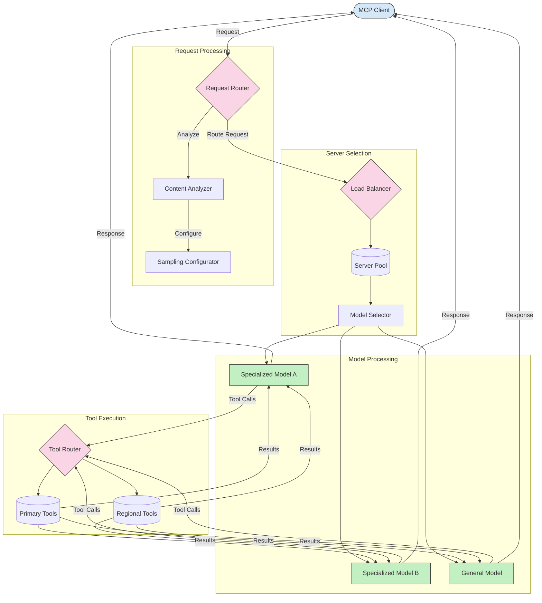

<!--
CO_OP_TRANSLATOR_METADATA:
{
  "original_hash": "a621fc52c7daec552eb8b3b48c0361dd",
  "translation_date": "2025-06-02T19:48:42+00:00",
  "source_file": "05-AdvancedTopics/mcp-routing/README.md",
  "language_code": "hu"
}
-->
## Mintavételezés és irányítási architektúra az MCP-ben

A mintavételezés a Model Context Protocol (MCP) kulcsfontosságú eleme, amely lehetővé teszi a hatékony kérésfeldolgozást és irányítást. Ez magában foglalja a beérkező kérések elemzését annak érdekében, hogy meghatározza, melyik modell vagy szolgáltatás a legmegfelelőbb a kezelésükre, különböző szempontok alapján, mint például a tartalom típusa, a felhasználói kontextus és a rendszer terheltsége.

A mintavételezés és az irányítás kombinálható egy robusztus architektúra létrehozására, amely optimalizálja az erőforrások kihasználtságát és biztosítja a magas rendelkezésre állást. A mintavételi folyamat segítségével a kérések osztályozhatók, míg az irányítás a megfelelő modellekhez vagy szolgáltatásokhoz irányítja őket.

Az alábbi ábra bemutatja, hogyan működnek együtt a mintavételezés és az irányítás egy átfogó MCP architektúrában:

## Mi következik

- [Sampling](../mcp-sampling/README.md)

**Jogi nyilatkozat**:  
Ez a dokumentum az AI fordító szolgáltatás, a [Co-op Translator](https://github.com/Azure/co-op-translator) segítségével készült. Bár a pontosságra törekszünk, kérjük, vegye figyelembe, hogy az automatikus fordítások hibákat vagy pontatlanságokat tartalmazhatnak. Az eredeti dokumentum az anyanyelvén tekintendő hiteles forrásnak. Kritikus információk esetén professzionális emberi fordítást javaslunk. Nem vállalunk felelősséget a fordítás használatából eredő félreértésekért vagy félreértelmezésekért.