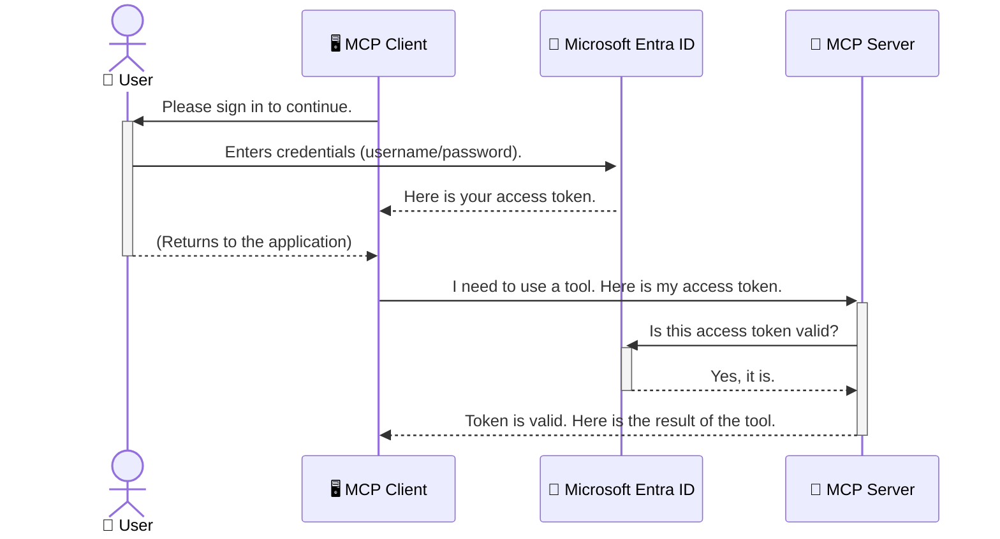

<!--
CO_OP_TRANSLATOR_METADATA:
{
  "original_hash": "0abf26a6c4dbe905d5d49ccdc0ccfe92",
  "translation_date": "2025-06-26T16:38:35+00:00",
  "source_file": "05-AdvancedTopics/mcp-security-entra/README.md",
  "language_code": "hu"
}
-->
# AI Munkafolyamatok Biztonsága: Entra ID Hitelesítés a Model Context Protocol Szerverekhez

## Bevezetés  
A Model Context Protocol (MCP) szerver védelme legalább olyan fontos, mint az otthonod bejárati ajtajának bezárása. Ha nyitva hagyod az MCP szervert, eszközeid és adataid illetéktelen hozzáférésnek vannak kitéve, ami biztonsági problémákhoz vezethet. A Microsoft Entra ID egy megbízható, felhőalapú azonosítás- és hozzáférés-kezelő megoldás, amely biztosítja, hogy csak jogosult felhasználók és alkalmazások férhessenek hozzá az MCP szerveredhez. Ebben a részben megtanulhatod, hogyan védheted meg AI munkafolyamataidat Entra ID hitelesítés segítségével.

## Tanulási célok  
A rész végére képes leszel:

- Megérteni az MCP szerverek biztonságának fontosságát.  
- Elmagyarázni a Microsoft Entra ID és az OAuth 2.0 hitelesítés alapjait.  
- Megkülönböztetni a nyilvános és a bizalmas kliens típusokat.  
- Megvalósítani az Entra ID hitelesítést helyi (nyilvános kliens) és távoli (bizalmas kliens) MCP szerver környezetekben.  
- Alkalmazni a biztonsági legjobb gyakorlatokat AI munkafolyamatok fejlesztésekor.  

## Biztonság és MCP  

Ahogy nem hagynád nyitva az otthonod bejárati ajtaját, úgy az MCP szerveredet sem szabad bárki számára elérhetővé tenni. AI munkafolyamataid védelme elengedhetetlen a megbízható, biztonságos alkalmazások létrehozásához. Ebben a fejezetben megismerkedhetsz a Microsoft Entra ID használatával, amely biztosítja, hogy csak jogosult felhasználók és alkalmazások férhessenek hozzá eszközeidhez és adataidhoz.

## Miért fontos a biztonság az MCP szerverek esetében  

Képzeld el, hogy az MCP szervered rendelkezik egy eszközzel, amely e-maileket küld vagy hozzáfér egy ügyféladatbázishoz. Egy nem védett szerver esetén bárki használhatja ezt az eszközt, ami illetéktelen adat-hozzáféréshez, spamhez vagy más káros tevékenységekhez vezethet.

A hitelesítés bevezetésével biztosíthatod, hogy minden kérés ellenőrzött legyen, és megerősítsd a kérés indítójának személyazonosságát, legyen az felhasználó vagy alkalmazás. Ez az első és legfontosabb lépés az AI munkafolyamataid biztonságossá tételéhez.

## Bevezetés a Microsoft Entra ID-be  

[**Microsoft Entra ID**](https://adoption.microsoft.com/microsoft-security/entra/) egy felhőalapú azonosítás- és hozzáférés-kezelő szolgáltatás. Olyan, mint egy univerzális biztonsági őr az alkalmazásaid számára. Kezeli a felhasználói azonosítás (hitelesítés) bonyolult folyamatát, és meghatározza, hogy mit tehetnek (engedélyezés).

Az Entra ID használatával:

- Biztonságos bejelentkezést teszel lehetővé a felhasználók számára.  
- Véded az API-kat és szolgáltatásokat.  
- Központilag kezelheted a hozzáférési szabályokat.  

Az MCP szerverek számára az Entra ID egy megbízható és széles körben elfogadott megoldás, amely szabályozza, ki férhet hozzá a szerver funkcióihoz.

---

## A varázslat megértése: Hogyan működik az Entra ID hitelesítés  

Az Entra ID nyílt szabványokat, például az **OAuth 2.0**-t használ a hitelesítéshez. Bár a részletek összetettek lehetnek, az alapötlet egyszerű és egy hasonlattal könnyen megérthető.

### Egy könnyed bevezetés az OAuth 2.0-ba: A kulcs a parkolófiútól  

Képzeld el az OAuth 2.0-t úgy, mint egy parkolófiú szolgáltatást az autód számára. Amikor megérkezel egy étterembe, nem adod oda a főkulcsodat a parkolófiúnak. Ehelyett egy **parkolófiú kulcsot** adsz neki, amely korlátozott jogosultságokkal rendelkezik – be tudja indítani az autót és bezárni az ajtókat, de nem tudja kinyitni a csomagtartót vagy a kesztyűtartót.

Ebben a hasonlatban:

- **Te** vagy a **Felhasználó**.  
- **Az autód** az **MCP szerver** értékes eszközeivel és adataival.  
- A **Parkolófiú** a **Microsoft Entra ID**.  
- A **Parkolófiú** a **MCP kliens** (az alkalmazás, amely hozzá akar férni a szerverhez).  
- A **Parkolófiú kulcs** az **Access Token**.  

Az access token egy biztonságos szöveges karakterlánc, amelyet az MCP kliens kap az Entra ID-től a bejelentkezés után. A kliens ezt a tokent minden kérésnél bemutatja az MCP szervernek. A szerver ellenőrizheti a tokent, hogy megbizonyosodjon a kérés jogosultságáról és a kliens jogosultságairól, anélkül, hogy valaha is kezelnie kellene a tényleges hitelesítő adatokat (például jelszót).

### A hitelesítési folyamat  

A folyamat a gyakorlatban így néz ki:



### A Microsoft Authentication Library (MSAL) bemutatása  

Mielőtt belevágnánk a kódba, fontos megismerkedni egy kulcsfontosságú komponenssel, amelyet a példákban láthatsz: a **Microsoft Authentication Library (MSAL)**-lal.

Az MSAL egy Microsoft által fejlesztett könyvtár, amely megkönnyíti a fejlesztők számára a hitelesítés kezelését. Nem neked kell megírnod az összetett kódot a biztonsági tokenek kezeléséhez, a bejelentkezésekhez és a munkamenetek frissítéséhez, az MSAL elvégzi ezt a nehéz munkát.

Az MSAL használata erősen ajánlott, mert:

- **Biztonságos:** Iparági szabványokat és legjobb gyakorlatokat valósít meg, csökkentve a kód sebezhetőségét.  
- **Egyszerűsíti a fejlesztést:** Elrejti az OAuth 2.0 és az OpenID Connect protokollok bonyolultságát, így néhány sor kóddal robusztus hitelesítést adhatsz az alkalmazásodhoz.  
- **Karbantartott:** A Microsoft aktívan fejleszti és frissíti, hogy kezelje az új biztonsági fenyegetéseket és platformváltozásokat.  

Az MSAL számos nyelvet és alkalmazáskeretrendszert támogat, beleértve a .NET-et, JavaScript/TypeScript-et, Pythont, Javat, Go-t, valamint iOS és Android mobil platformokat. Ez azt jelenti, hogy ugyanazokat a következetes hitelesítési mintákat használhatod a teljes technológiai stack-edben.

További információért tekintsd meg az hivatalos [MSAL áttekintő dokumentációt](https://learn.microsoft.com/entra/identity-platform/msal-overview).

---

## MCP szerver védelme Entra ID-vel: Lépésről lépésre  

Most nézzük meg, hogyan védheted meg egy helyi MCP szervert (amely `stdio`) using Entra ID. This example uses a **public client**, which is suitable for applications running on a user's machine, like a desktop app or a local development server.

### Scenario 1: Securing a Local MCP Server (with a Public Client)

In this scenario, we'll look at an MCP server that runs locally, communicates over `stdio`, and uses Entra ID to authenticate the user before allowing access to its tools. The server will have a single tool that fetches the user's profile information from the Microsoft Graph API.

#### 1. Setting Up the Application in Entra ID

Before writing any code, you need to register your application in Microsoft Entra ID. This tells Entra ID about your application and grants it permission to use the authentication service.

1. Navigate to the **[Microsoft Entra portal](https://entra.microsoft.com/)**.
2. Go to **App registrations** and click **New registration**.
3. Give your application a name (e.g., "My Local MCP Server").
4. For **Supported account types**, select **Accounts in this organizational directory only**.
5. You can leave the **Redirect URI** blank for this example.
6. Click **Register**.

Once registered, take note of the **Application (client) ID** and **Directory (tenant) ID**. You'll need these in your code.

#### 2. The Code: A Breakdown

Let's look at the key parts of the code that handle authentication. The full code for this example is available in the [Entra ID - Local - WAM](https://github.com/Azure-Samples/mcp-auth-servers/tree/main/src/entra-id-local-wam) folder of the [mcp-auth-servers GitHub repository](https://github.com/Azure-Samples/mcp-auth-servers).

**`AuthenticationService.cs`**

This class is responsible for handling the interaction with Entra ID.

- **`CreateAsync`**: This method initializes the `PublicClientApplication` from the MSAL (Microsoft Authentication Library). It's configured with your application's `clientId` and `tenantId`.
- **`WithBroker`**: This enables the use of a broker (like the Windows Web Account Manager), which provides a more secure and seamless single sign-on experience.
- **`AcquireTokenAsync`** segítségével működik): Ez a fő metódus, amely először megpróbál csendben (azaz a felhasználó újabb bejelentkezése nélkül) tokent szerezni. Ha ez nem sikerül, interaktív bejelentkezést kér.

```csharp
// Simplified for clarity
public static async Task<AuthenticationService> CreateAsync(ILogger<AuthenticationService> logger)
{
    var msalClient = PublicClientApplicationBuilder
        .Create(_clientId) // Your Application (client) ID
        .WithAuthority(AadAuthorityAudience.AzureAdMyOrg)
        .WithTenantId(_tenantId) // Your Directory (tenant) ID
        .WithBroker(new BrokerOptions(BrokerOptions.OperatingSystems.Windows))
        .Build();

    // ... cache registration ...

    return new AuthenticationService(logger, msalClient);
}

public async Task<string> AcquireTokenAsync()
{
    try
    {
        // Try silent authentication first
        var accounts = await _msalClient.GetAccountsAsync();
        var account = accounts.FirstOrDefault();

        AuthenticationResult? result = null;

        if (account != null)
        {
            result = await _msalClient.AcquireTokenSilent(_scopes, account).ExecuteAsync();
        }
        else
        {
            // If no account, or silent fails, go interactive
            result = await _msalClient.AcquireTokenInteractive(_scopes).ExecuteAsync();
        }

        return result.AccessToken;
    }
    catch (Exception ex)
    {
        _logger.LogError(ex, "An error occurred while acquiring the token.");
        throw; // Optionally rethrow the exception for higher-level handling
    }
}
```

**`Program.cs`**

This is where the MCP server is set up and the authentication service is integrated.

- **`AddSingleton<AuthenticationService>`**: This registers the `AuthenticationService` with the dependency injection container, so it can be used by other parts of the application (like our tool).
- **`GetUserDetailsFromGraph` tool**: This tool requires an instance of `AuthenticationService`. Before it does anything, it calls `authService.AcquireTokenAsync()` metódus segítségével érvényes hozzáférési tokent kér. Ha a hitelesítés sikeres, a tokennel hívja meg a Microsoft Graph API-t, hogy lekérje a felhasználó adatait.

```csharp
// Simplified for clarity
[McpServerTool(Name = "GetUserDetailsFromGraph")]
public static async Task<string> GetUserDetailsFromGraph(
    AuthenticationService authService)
{
    try
    {
        // This will trigger the authentication flow
        var accessToken = await authService.AcquireTokenAsync();

        // Use the token to create a GraphServiceClient
        var graphClient = new GraphServiceClient(
            new BaseBearerTokenAuthenticationProvider(new TokenProvider(authService)));

        var user = await graphClient.Me.GetAsync();

        return System.Text.Json.JsonSerializer.Serialize(user);
    }
    catch (Exception ex)
    {
        return $"Error: {ex.Message}";
    }
}
```

#### 3. Hogyan működik ez együtt  

1. Amikor az MCP kliens megpróbálja használni a `GetUserDetailsFromGraph` tool, the tool first calls `AcquireTokenAsync`.
2. `AcquireTokenAsync` triggers the MSAL library to check for a valid token.
3. If no token is found, MSAL, through the broker, will prompt the user to sign in with their Entra ID account.
4. Once the user signs in, Entra ID issues an access token.
5. The tool receives the token and uses it to make a secure call to the Microsoft Graph API.
6. The user's details are returned to the MCP client.

This process ensures that only authenticated users can use the tool, effectively securing your local MCP server.

### Scenario 2: Securing a Remote MCP Server (with a Confidential Client)

When your MCP server is running on a remote machine (like a cloud server) and communicates over a protocol like HTTP Streaming, the security requirements are different. In this case, you should use a **confidential client** and the **Authorization Code Flow**. This is a more secure method because the application's secrets are never exposed to the browser.

This example uses a TypeScript-based MCP server that uses Express.js to handle HTTP requests.

#### 1. Setting Up the Application in Entra ID

The setup in Entra ID is similar to the public client, but with one key difference: you need to create a **client secret**.

1. Navigate to the **[Microsoft Entra portal](https://entra.microsoft.com/)**.
2. In your app registration, go to the **Certificates & secrets** tab.
3. Click **New client secret**, give it a description, and click **Add**.
4. **Important:** Copy the secret value immediately. You will not be able to see it again.
5. You also need to configure a **Redirect URI**. Go to the **Authentication** tab, click **Add a platform**, select **Web**, and enter the redirect URI for your application (e.g., `http://localhost:3001/auth/callback`).

> **⚠️ Important Security Note:** For production applications, Microsoft strongly recommends using **secretless authentication** methods such as **Managed Identity** or **Workload Identity Federation** instead of client secrets. Client secrets pose security risks as they can be exposed or compromised. Managed identities provide a more secure approach by eliminating the need to store credentials in your code or configuration.
>
> For more information about managed identities and how to implement them, see the [Managed identities for Azure resources overview](https://learn.microsoft.com/entra/identity/managed-identities-azure-resources/overview).

#### 2. The Code: A Breakdown

This example uses a session-based approach. When the user authenticates, the server stores the access token and refresh token in a session and gives the user a session token. This session token is then used for subsequent requests. The full code for this example is available in the [Entra ID - Confidential client](https://github.com/Azure-Samples/mcp-auth-servers/tree/main/src/entra-id-cca-session) folder of the [mcp-auth-servers GitHub repository](https://github.com/Azure-Samples/mcp-auth-servers).

**`Server.ts`**

This file sets up the Express server and the MCP transport layer.

- **`requireBearerAuth`**: This is middleware that protects the `/sse` and `/message` endpoints. It checks for a valid bearer token in the `Authorization` header of the request.
- **`EntraIdServerAuthProvider`**: This is a custom class that implements the `McpServerAuthorizationProvider` interface. It's responsible for handling the OAuth 2.0 flow.
- **`/auth/callback` végpontot: Ez a végpont kezeli az Entra ID-től érkező átirányítást a felhasználó hitelesítése után. Kicseréli az engedélyezési kódot hozzáférési és frissítő tokenre.

```typescript
// Simplified for clarity
const app = express();
const { server } = createServer();
const provider = new EntraIdServerAuthProvider();

// Protect the SSE endpoint
app.get("/sse", requireBearerAuth({
  provider,
  requiredScopes: ["User.Read"]
}), async (req, res) => {
  // ... connect to the transport ...
});

// Protect the message endpoint
app.post("/message", requireBearerAuth({
  provider,
  requiredScopes: ["User.Read"]
}), async (req, res) => {
  // ... handle the message ...
});

// Handle the OAuth 2.0 callback
app.get("/auth/callback", (req, res) => {
  provider.handleCallback(req.query.code, req.query.state)
    .then(result => {
      // ... handle success or failure ...
    });
});
```

**`Tools.ts`**

This file defines the tools that the MCP server provides. The `getUserDetails` eszköz hasonló az előző példához, de az access tokent a munkamenetből veszi.

```typescript
// Simplified for clarity
server.setRequestHandler(CallToolRequestSchema, async (request) => {
  const { name } = request.params;
  const context = request.params?.context as { token?: string } | undefined;
  const sessionToken = context?.token;

  if (name === ToolName.GET_USER_DETAILS) {
    if (!sessionToken) {
      throw new AuthenticationError("Authentication token is missing or invalid. Ensure the token is provided in the request context.");
    }

    // Get the Entra ID token from the session store
    const tokenData = tokenStore.getToken(sessionToken);
    const entraIdToken = tokenData.accessToken;

    const graphClient = Client.init({
      authProvider: (done) => {
        done(null, entraIdToken);
      }
    });

    const user = await graphClient.api('/me').get();

    // ... return user details ...
  }
});
```

**`auth/EntraIdServerAuthProvider.ts`**

This class handles the logic for:

- Redirecting the user to the Entra ID sign-in page.
- Exchanging the authorization code for an access token.
- Storing the tokens in the `tokenStore`.
- Refreshing the access token when it expires.

#### 3. How It All Works Together

1. When a user first tries to connect to the MCP server, the `requireBearerAuth` middleware will see that they don't have a valid session and will redirect them to the Entra ID sign-in page.
2. The user signs in with their Entra ID account.
3. Entra ID redirects the user back to the `/auth/callback` endpoint with an authorization code.
4. The server exchanges the code for an access token and a refresh token, stores them, and creates a session token which is sent to the client.
5. The client can now use this session token in the `Authorization` header for all future requests to the MCP server.
6. When the `getUserDetails` eszköz hívásakor a munkamenet token alapján lekéri az Entra ID access tokent, majd ezt használja a Microsoft Graph API hívásához.

Ez a folyamat bonyolultabb, mint a nyilvános kliens esetében, de szükséges a nyilvános interneten elérhető végpontoknál. Mivel a távoli MCP szerverek nyilvános interneten keresztül elérhetők, erősebb biztonsági intézkedések szükségesek az illetéktelen hozzáférés és támadások ellen.

## Biztonsági legjobb gyakorlatok  

- **Mindig használj HTTPS-t:** Titkosítsd a kliens és szerver közötti kommunikációt, hogy megvédd a tokeneket az elfogástól.  
- **Alkalmazz szerepalapú hozzáférés-vezérlést (RBAC):** Ne csak azt ellenőrizd, hogy a felhasználó hitelesített-e, hanem azt is, hogy mit tehet. Az Entra ID-ben definiálhatsz szerepeket, és ezeket ellenőrizheted az MCP szerverben.  
- **Figyeld és auditáld:** Naplózz minden hitelesítési eseményt, hogy gyanús tevékenységeket észlelj és kezelj.  
- **Kezeld a sebességkorlátozást és a visszaesést:** A Microsoft Graph és más API-k sebességkorlátozást alkalmaznak a visszaélések elkerülésére. Implementálj exponenciális visszaesést és újrapróbálkozást az MCP szerveredben a HTTP 429 (Túl sok kérés) válaszok kezelésére. Fontold meg gyakran használt adatok gyorsítótárazását az API hívások csökkentése érdekében.  
- **Biztonságos token tárolás:** Tárold biztonságosan a hozzáférési és frissítő tokeneket. Helyi alkalmazások esetén használd a rendszer biztonságos tárolási mechanizmusait. Szerveralkalmazásoknál fontold meg titkosított tárolás vagy biztonságos kulcskezelő szolgáltatások, például az Azure Key Vault használatát.  
- **Token lejárat kezelése:** A hozzáférési tokenek élettartama korlátozott. Valósítsd meg az automatikus token frissítést frissítő tokenek segítségével, hogy a felhasználói élmény megszakítás nélküli maradjon, újra hitelesítés nélkül.  
- **Fontold meg az Azure API Management használatát:** Bár a biztonság közvetlen megvalósítása az MCP szerverben finomhangolt vezérlést ad, az API Gateway-ek, mint az Azure API Management, automatikusan kezelhetik a hitelesítést, engedélyezést, sebességkorlátozást és monitorozást. Egy központosított biztonsági réteget biztosítanak a kliensek és az MCP szerverek között. Az MCP-vel való API Gateway használatról bővebben lásd a [Azure API Management Your Auth Gateway For MCP Servers](https://techcommunity.microsoft.com/blog/integrationsonazureblog/azure-api-management-your-auth-gateway-for-mcp-servers/4402690) cikket.

## Főbb tanulságok  

- Az MCP szerver védelme elengedhetetlen az adatok és eszközök védelméhez.  
- A Microsoft Entra ID egy robusztus és skálázható megoldás hitelesítésre és engedélyezésre.  
- Használj **nyilvános klienst** helyi alkalmazásokhoz, és **bizalmas klienst** távoli szerverekhez.  
- A **Authorization Code Flow** a legbiztonságosabb választás webalkalmazások számára.  

## Gyakorlat  

1. Gondold át, milyen MCP szervert építenél. Helyi vagy távoli szerver lenne?  
2. Válaszod alapján nyilvános vagy bizalmas klienst használnál?  
3. Milyen engedélyeket kérne az MCP szervered a Microsoft Graph műveletekhez?  

## Gyakorlati feladatok  

### 1. feladat: Alkalmazás regisztrálása az Entra ID-ben  
Lépj be a Microsoft Entra portálra.  
Regisztrálj egy új alkalmazást az MCP szervered számára.  
Jegyezd fel az Alkalmazás (kliens) azonosítót és a Könyvtár (bérlő) azonosítót.  

### 2. feladat: Helyi MCP szerver védelme (nyilvános kliens)  
- Kövesd a kódpéldát az MSAL (Microsoft Authentication Library) integrálásához a felhasználói hitelesítéshez.  
- Teszteld a hitelesítési folyamatot az MCP eszköz hívásával, amely lekéri a felhasználói adatokat a Microsoft Graphból.  

### 3. feladat: Távoli MCP szerver védelme (bizalmas kliens)  
- Regisztrálj egy bizalmas klienst az Entra ID-ben, és hozz létre kliens titkot.  
- Állítsd be az Express.js MCP szerveredet az Authorization Code Flow használatára.  
- Teszteld a védett végpontokat, és ellenőrizd a token alapú hozzáférést.  

### 4. feladat: Biztonsági legjobb gyakorlatok alkalmazása  
- Engedélyezd a HTTPS-t helyi vagy távoli szervereden.  
- Valósítsd meg a szerepalapú hozzáférés-vezérlést (RBAC) a szerver logikában.  
- Add hozzá a token lejárat kezelését és a biztonságos token tárolást.  

## Források  

1. **MSAL áttekintő dokumentáció**  
   Ismerd meg, hogyan teszi lehetővé a Microsoft Authentication Library (MSAL) a biztonságos token beszerzést több platformon:  
   [MSAL áttekintő a Microsoft Learn-en](https://learn.microsoft.com/en-gb/entra/msal/overview)  

2. **Azure-Samples/mcp-auth-servers GitHub tárhely**  
   Példák MCP szerverek hitelesítési folyamataira:  
   [Azure-Samples/mcp-auth-servers GitHub-on](https://github.com/Azure-Samples/mcp-auth-servers)  

3. **Managed Identities for Azure Resources áttekintés**  
   Ismerd meg, hogyan szüntetheted meg a titkok használatát rendszer- vagy felhasználó által hozzárendelt felügyelt identitásokkal:  
   [Managed Identities áttekintő a Microsoft Learn-en](https://learn.microsoft.com/en-us/entra/identity/managed-identities-azure-resources/)  

4. **Azure API Management: Az MCP szerverek hitelesítési kapuja**  
   Mélyebb betekintés az APIM biztonságos OAuth2

**Jogi nyilatkozat**:  
Ez a dokumentum az AI fordító szolgáltatás, a [Co-op Translator](https://github.com/Azure/co-op-translator) használatával készült. Bár a pontosságra törekszünk, kérjük, vegye figyelembe, hogy az automatikus fordítások hibákat vagy pontatlanságokat tartalmazhatnak. Az eredeti dokumentum az anyanyelvén tekintendő hiteles forrásnak. Kritikus információk esetén professzionális emberi fordítást javasolunk. Nem vállalunk felelősséget a fordítás használatából eredő félreértésekért vagy téves értelmezésekért.