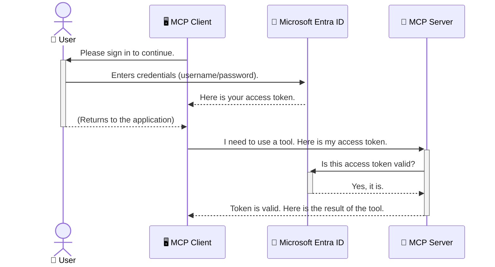

<!--
CO_OP_TRANSLATOR_METADATA:
{
  "original_hash": "6e562d7e5a77c8982da4aa8f762ad1d8",
  "translation_date": "2025-07-02T09:49:36+00:00",
  "source_file": "05-AdvancedTopics/mcp-security-entra/README.md",
  "language_code": "hu"
}
-->
# AI Munkafolyamatok Biztonsága: Entra ID Hitelesítés Model Context Protocol Szerverekhez

## Bevezetés  
Model Context Protocol (MCP) szervered védelme ugyanolyan fontos, mint az otthonod bejárati ajtajának bezárása. Ha nyitva hagyod az MCP szerveredet, eszközeid és adataid illetéktelen hozzáférésnek vannak kitéve, ami biztonsági incidensekhez vezethet. A Microsoft Entra ID egy megbízható, felhőalapú identitás- és hozzáférés-kezelési megoldás, amely biztosítja, hogy csak jogosult felhasználók és alkalmazások férhessenek hozzá az MCP szerveredhez. Ebben a részben megtanulod, hogyan védheted meg AI munkafolyamataidat Entra ID hitelesítéssel.

## Tanulási célok  
A szakasz végére képes leszel:

- Megérteni az MCP szerverek védelmének fontosságát.
- Elmagyarázni a Microsoft Entra ID és az OAuth 2.0 hitelesítés alapjait.
- Megkülönböztetni a nyilvános és a titkos ügyfeleket.
- Entra ID hitelesítést megvalósítani helyi (nyilvános kliens) és távoli (titkos kliens) MCP szerverek esetén.
- Alkalmazni a biztonsági legjobb gyakorlatokat AI munkafolyamatok fejlesztésekor.

## Biztonság és MCP

Ahogy nem hagynád nyitva az otthonod bejárati ajtaját, úgy az MCP szerveredet sem szabad bárki számára hozzáférhetővé tenni. Az AI munkafolyamatok biztonsága elengedhetetlen ahhoz, hogy megbízható és biztonságos alkalmazásokat építs. Ebben a fejezetben megismered, hogyan használhatod a Microsoft Entra ID-t MCP szervereid védelmére, hogy csak jogosult felhasználók és alkalmazások férhessenek hozzá eszközeidhez és adataidhoz.

## Miért fontos a biztonság az MCP szerverek esetén

Képzeld el, hogy az MCP szervered egy olyan eszközt tartalmaz, amely képes e-maileket küldeni vagy hozzáférni egy ügyféladatbázishoz. Egy védtelen szerver esetén bárki használhatná ezt az eszközt, ami illetéktelen adathozzáférést, spamet vagy egyéb rosszindulatú tevékenységeket eredményezhet.

A hitelesítés bevezetésével minden szerverhez intézett kérés ellenőrzötté válik, biztosítva, hogy a kérés feladója – legyen az felhasználó vagy alkalmazás – valóban jogosult legyen a hozzáférésre. Ez az első és legfontosabb lépés AI munkafolyamataid biztonságának megteremtésében.

## Bevezetés a Microsoft Entra ID-be

[**Microsoft Entra ID**](https://adoption.microsoft.com/microsoft-security/entra/) egy felhőalapú identitás- és hozzáférés-kezelő szolgáltatás. Olyan, mint egy univerzális biztonsági őr az alkalmazásaid számára. Kezeli a felhasználók azonosításának (hitelesítés) és jogosultságaik meghatározásának (engedélyezés) bonyolult folyamatát.

Az Entra ID használatával:

- Biztonságos bejelentkezést biztosíthatsz a felhasználóknak.
- Megvédheted az API-kat és szolgáltatásokat.
- Központilag kezelheted a hozzáférési szabályzatokat.

MCP szerverek esetén az Entra ID egy megbízható, széles körben elfogadott megoldást nyújt arra, hogy szabályozd, ki férhet hozzá a szervered képességeihez.

---

## A varázslat megértése: Hogyan működik az Entra ID hitelesítés

Az Entra ID nyílt szabványokat, például az **OAuth 2.0** protokollt használja a hitelesítés kezelésére. Bár a részletek bonyolultak lehetnek, az alapötlet egyszerűen érthető egy analógián keresztül.

### Egy egyszerű bevezetés az OAuth 2.0-ba: A kulcs a parkolóőrnek

Gondolj az OAuth 2.0-ra úgy, mint egy parkolóőr szolgáltatásra az autód számára. Amikor megérkezel egy étterembe, nem adod át a parkolóőrnek a főkulcsodat. Ehelyett egy **parkolóőr kulcsot** adsz neki, amely korlátozott jogosultságokkal rendelkezik – el tudja indítani az autót és bezárni az ajtókat, de nem nyithatja ki a csomagtartót vagy a kesztyűtartót.

Ebben az analógiában:

- **Te** vagy a **Felhasználó**.
- **Az autód** az **MCP szerver** az értékes eszközeivel és adataival.
- A **Parkolóőr** a **Microsoft Entra ID**.
- A **Parkolóőr alkalmazott** az **MCP kliens** (az alkalmazás, amely hozzá szeretne férni a szerverhez).
- A **Parkolóőr kulcs** az **Access Token**.

Az access token egy biztonságos szöveges adat, amelyet az MCP kliens kap az Entra ID-től a bejelentkezésed után. A kliens ezt a tokent minden kérésnél bemutatja az MCP szervernek. A szerver ellenőrizni tudja a tokent, hogy megbizonyosodjon a kérés jogosultságáról és arról, hogy a kliens rendelkezik a szükséges engedélyekkel, anélkül, hogy az eredeti hitelesítő adataidat (például jelszavadat) kezelnie kellene.

### A hitelesítési folyamat

Így működik a folyamat a gyakorlatban:



### Bemutatkozik a Microsoft Authentication Library (MSAL)

Mielőtt belevágnánk a kódba, fontos megismerni egy kulcsfontosságú komponenst, amely a példákban is szerepel: a **Microsoft Authentication Library (MSAL)**-t.

Az MSAL egy Microsoft által fejlesztett könyvtár, amely megkönnyíti a fejlesztők számára a hitelesítés kezelését. Ahelyett, hogy neked kellene megírni az összetett kódot a biztonsági tokenek kezelésére, bejelentkezésekre és munkamenetek frissítésére, az MSAL elvégzi ezt a nehéz munkát.

Az MSAL használata erősen ajánlott, mert:

- **Biztonságos:** Iparági szabványokat és biztonsági legjobb gyakorlatokat alkalmaz, csökkentve a sérülékenységek kockázatát.
- **Egyszerűsíti a fejlesztést:** Elrejti az OAuth 2.0 és OpenID Connect protokollok összetettségét, így néhány sor kóddal erős hitelesítést adhatsz alkalmazásodhoz.
- **Karbantartott:** A Microsoft aktívan fejleszti és frissíti az MSAL-t, hogy reagáljon az új biztonsági fenyegetésekre és platformváltozásokra.

Az MSAL számos nyelvet és alkalmazáskeretrendszert támogat, például .NET, JavaScript/TypeScript, Python, Java, Go, valamint mobil platformokat, mint az iOS és Android. Ez azt jelenti, hogy azonos hitelesítési mintákat alkalmazhatsz az egész technológiai stack-edben.

További információért tekintsd meg a hivatalos [MSAL áttekintő dokumentációt](https://learn.microsoft.com/entra/identity-platform/msal-overview).

---

## MCP szervered védelme Entra ID-vel: lépésről lépésre

Most nézzük meg, hogyan biztosíthatsz egy helyi MCP szervert (amely `stdio`) using Entra ID. This example uses a **public client**, which is suitable for applications running on a user's machine, like a desktop app or a local development server.

### Scenario 1: Securing a Local MCP Server (with a Public Client)

In this scenario, we'll look at an MCP server that runs locally, communicates over `stdio`, and uses Entra ID to authenticate the user before allowing access to its tools. The server will have a single tool that fetches the user's profile information from the Microsoft Graph API.

#### 1. Setting Up the Application in Entra ID

Before writing any code, you need to register your application in Microsoft Entra ID. This tells Entra ID about your application and grants it permission to use the authentication service.

1. Navigate to the **[Microsoft Entra portal](https://entra.microsoft.com/)**.
2. Go to **App registrations** and click **New registration**.
3. Give your application a name (e.g., "My Local MCP Server").
4. For **Supported account types**, select **Accounts in this organizational directory only**.
5. You can leave the **Redirect URI** blank for this example.
6. Click **Register**.

Once registered, take note of the **Application (client) ID** and **Directory (tenant) ID**. You'll need these in your code.

#### 2. The Code: A Breakdown

Let's look at the key parts of the code that handle authentication. The full code for this example is available in the [Entra ID - Local - WAM](https://github.com/Azure-Samples/mcp-auth-servers/tree/main/src/entra-id-local-wam) folder of the [mcp-auth-servers GitHub repository](https://github.com/Azure-Samples/mcp-auth-servers).

**`AuthenticationService.cs`**

This class is responsible for handling the interaction with Entra ID.

- **`CreateAsync`**: This method initializes the `PublicClientApplication` from the MSAL (Microsoft Authentication Library). It's configured with your application's `clientId` and `tenantId`.
- **`WithBroker`**: This enables the use of a broker (like the Windows Web Account Manager), which provides a more secure and seamless single sign-on experience.
- **`AcquireTokenAsync`**-t használja: Ez a kulcsfontosságú metódus. Először megpróbál csendesen tokent szerezni (így a felhasználónak nem kell újra bejelentkeznie, ha már érvényes munkamenete van). Ha a csendes token megszerzése nem sikerül, interaktív bejelentkezést kér a felhasználótól.

```csharp
// Simplified for clarity
public static async Task<AuthenticationService> CreateAsync(ILogger<AuthenticationService> logger)
{
    var msalClient = PublicClientApplicationBuilder
        .Create(_clientId) // Your Application (client) ID
        .WithAuthority(AadAuthorityAudience.AzureAdMyOrg)
        .WithTenantId(_tenantId) // Your Directory (tenant) ID
        .WithBroker(new BrokerOptions(BrokerOptions.OperatingSystems.Windows))
        .Build();

    // ... cache registration ...

    return new AuthenticationService(logger, msalClient);
}

public async Task<string> AcquireTokenAsync()
{
    try
    {
        // Try silent authentication first
        var accounts = await _msalClient.GetAccountsAsync();
        var account = accounts.FirstOrDefault();

        AuthenticationResult? result = null;

        if (account != null)
        {
            result = await _msalClient.AcquireTokenSilent(_scopes, account).ExecuteAsync();
        }
        else
        {
            // If no account, or silent fails, go interactive
            result = await _msalClient.AcquireTokenInteractive(_scopes).ExecuteAsync();
        }

        return result.AccessToken;
    }
    catch (Exception ex)
    {
        _logger.LogError(ex, "An error occurred while acquiring the token.");
        throw; // Optionally rethrow the exception for higher-level handling
    }
}
```

**`Program.cs`**

This is where the MCP server is set up and the authentication service is integrated.

- **`AddSingleton<AuthenticationService>`**: This registers the `AuthenticationService` with the dependency injection container, so it can be used by other parts of the application (like our tool).
- **`GetUserDetailsFromGraph` tool**: This tool requires an instance of `AuthenticationService`. Before it does anything, it calls `authService.AcquireTokenAsync()` metódust hívja meg érvényes hozzáférési token megszerzéséhez. Ha a hitelesítés sikeres, a tokent használva hívja meg a Microsoft Graph API-t, hogy lekérje a felhasználó adatait.

```csharp
// Simplified for clarity
[McpServerTool(Name = "GetUserDetailsFromGraph")]
public static async Task<string> GetUserDetailsFromGraph(
    AuthenticationService authService)
{
    try
    {
        // This will trigger the authentication flow
        var accessToken = await authService.AcquireTokenAsync();

        // Use the token to create a GraphServiceClient
        var graphClient = new GraphServiceClient(
            new BaseBearerTokenAuthenticationProvider(new TokenProvider(authService)));

        var user = await graphClient.Me.GetAsync();

        return System.Text.Json.JsonSerializer.Serialize(user);
    }
    catch (Exception ex)
    {
        return $"Error: {ex.Message}";
    }
}
```

#### 3. Hogyan működik együtt az egész

1. Amikor az MCP kliens megpróbálja használni a `GetUserDetailsFromGraph` tool, the tool first calls `AcquireTokenAsync`.
2. `AcquireTokenAsync` triggers the MSAL library to check for a valid token.
3. If no token is found, MSAL, through the broker, will prompt the user to sign in with their Entra ID account.
4. Once the user signs in, Entra ID issues an access token.
5. The tool receives the token and uses it to make a secure call to the Microsoft Graph API.
6. The user's details are returned to the MCP client.

This process ensures that only authenticated users can use the tool, effectively securing your local MCP server.

### Scenario 2: Securing a Remote MCP Server (with a Confidential Client)

When your MCP server is running on a remote machine (like a cloud server) and communicates over a protocol like HTTP Streaming, the security requirements are different. In this case, you should use a **confidential client** and the **Authorization Code Flow**. This is a more secure method because the application's secrets are never exposed to the browser.

This example uses a TypeScript-based MCP server that uses Express.js to handle HTTP requests.

#### 1. Setting Up the Application in Entra ID

The setup in Entra ID is similar to the public client, but with one key difference: you need to create a **client secret**.

1. Navigate to the **[Microsoft Entra portal](https://entra.microsoft.com/)**.
2. In your app registration, go to the **Certificates & secrets** tab.
3. Click **New client secret**, give it a description, and click **Add**.
4. **Important:** Copy the secret value immediately. You will not be able to see it again.
5. You also need to configure a **Redirect URI**. Go to the **Authentication** tab, click **Add a platform**, select **Web**, and enter the redirect URI for your application (e.g., `http://localhost:3001/auth/callback`).

> **⚠️ Important Security Note:** For production applications, Microsoft strongly recommends using **secretless authentication** methods such as **Managed Identity** or **Workload Identity Federation** instead of client secrets. Client secrets pose security risks as they can be exposed or compromised. Managed identities provide a more secure approach by eliminating the need to store credentials in your code or configuration.
>
> For more information about managed identities and how to implement them, see the [Managed identities for Azure resources overview](https://learn.microsoft.com/entra/identity/managed-identities-azure-resources/overview).

#### 2. The Code: A Breakdown

This example uses a session-based approach. When the user authenticates, the server stores the access token and refresh token in a session and gives the user a session token. This session token is then used for subsequent requests. The full code for this example is available in the [Entra ID - Confidential client](https://github.com/Azure-Samples/mcp-auth-servers/tree/main/src/entra-id-cca-session) folder of the [mcp-auth-servers GitHub repository](https://github.com/Azure-Samples/mcp-auth-servers).

**`Server.ts`**

This file sets up the Express server and the MCP transport layer.

- **`requireBearerAuth`**: This is middleware that protects the `/sse` and `/message` endpoints. It checks for a valid bearer token in the `Authorization` header of the request.
- **`EntraIdServerAuthProvider`**: This is a custom class that implements the `McpServerAuthorizationProvider` interface. It's responsible for handling the OAuth 2.0 flow.
- **`/auth/callback` végpontot: Ez a végpont kezeli az Entra ID-től érkező átirányítást a felhasználó hitelesítése után. Kicseréli az engedélyezési kódot hozzáférési tokenre és frissítő tokenre.

```typescript
// Simplified for clarity
const app = express();
const { server } = createServer();
const provider = new EntraIdServerAuthProvider();

// Protect the SSE endpoint
app.get("/sse", requireBearerAuth({
  provider,
  requiredScopes: ["User.Read"]
}), async (req, res) => {
  // ... connect to the transport ...
});

// Protect the message endpoint
app.post("/message", requireBearerAuth({
  provider,
  requiredScopes: ["User.Read"]
}), async (req, res) => {
  // ... handle the message ...
});

// Handle the OAuth 2.0 callback
app.get("/auth/callback", (req, res) => {
  provider.handleCallback(req.query.code, req.query.state)
    .then(result => {
      // ... handle success or failure ...
    });
});
```

**`Tools.ts`**

This file defines the tools that the MCP server provides. The `getUserDetails` eszköz hasonló az előző példához, de a hozzáférési tokent a munkamenetből szerzi be.

```typescript
// Simplified for clarity
server.setRequestHandler(CallToolRequestSchema, async (request) => {
  const { name } = request.params;
  const context = request.params?.context as { token?: string } | undefined;
  const sessionToken = context?.token;

  if (name === ToolName.GET_USER_DETAILS) {
    if (!sessionToken) {
      throw new AuthenticationError("Authentication token is missing or invalid. Ensure the token is provided in the request context.");
    }

    // Get the Entra ID token from the session store
    const tokenData = tokenStore.getToken(sessionToken);
    const entraIdToken = tokenData.accessToken;

    const graphClient = Client.init({
      authProvider: (done) => {
        done(null, entraIdToken);
      }
    });

    const user = await graphClient.api('/me').get();

    // ... return user details ...
  }
});
```

**`auth/EntraIdServerAuthProvider.ts`**

This class handles the logic for:

- Redirecting the user to the Entra ID sign-in page.
- Exchanging the authorization code for an access token.
- Storing the tokens in the `tokenStore`.
- Refreshing the access token when it expires.

#### 3. How It All Works Together

1. When a user first tries to connect to the MCP server, the `requireBearerAuth` middleware will see that they don't have a valid session and will redirect them to the Entra ID sign-in page.
2. The user signs in with their Entra ID account.
3. Entra ID redirects the user back to the `/auth/callback` endpoint with an authorization code.
4. The server exchanges the code for an access token and a refresh token, stores them, and creates a session token which is sent to the client.
5. The client can now use this session token in the `Authorization` header for all future requests to the MCP server.
6. When the `getUserDetails` eszköz meghívásakor a munkamenet token segítségével lekéri az Entra ID hozzáférési tokent, majd azt használja a Microsoft Graph API hívásához.

Ez a folyamat bonyolultabb, mint a nyilvános kliens esetén, de szükséges az internet felé nyitott végpontoknál. Mivel a távoli MCP szerverek nyilvános interneten keresztül elérhetők, erősebb biztonsági intézkedések szükségesek az illetéktelen hozzáférés és támadások elleni védelemhez.

## Biztonsági legjobb gyakorlatok

- **Mindig használj HTTPS-t:** Titkosítsd a kliens és szerver közötti kommunikációt, hogy megvédd a tokeneket az elfogástól.
- **Alkalmazz szerepalapú hozzáférés-vezérlést (RBAC):** Ne csak azt ellenőrizd, hogy a felhasználó hitelesített-e, hanem azt is, hogy mit jogosult tenni. Entra ID-ben definiálhatsz szerepeket, amelyeket az MCP szerverben ellenőrizhetsz.
- **Figyelj és auditálj:** Naplózz minden hitelesítési eseményt, hogy gyanús tevékenységeket felismerhess és kezelhess.
- **Kezeld a lekérések korlátozását és lassítását:** A Microsoft Graph és más API-k lekéréskorlátozást alkalmaznak a visszaélések megelőzésére. Implementálj exponenciális visszavonást és újrapróbálkozási logikát MCP szerveredben, hogy szépen kezeld a HTTP 429 (Túl sok kérés) válaszokat. Érdemes gyakran használt adatokat cache-elni az API hívások csökkentése érdekében.
- **Biztonságos token tárolás:** Tárold biztonságosan a hozzáférési és frissítő tokeneket. Helyi alkalmazások esetén használd a rendszer biztonságos tárolási mechanizmusait. Szerver alkalmazásoknál fontold meg titkosított tárolás vagy biztonságos kulcskezelő szolgáltatások, például az Azure Key Vault használatát.
- **Token lejárat kezelése:** A hozzáférési tokeneknek van élettartama. Valósíts meg automatikus tokenfrissítést frissítő tokenek segítségével, hogy a felhasználói élmény megszakítás nélkül működjön, újrahitelesítés nélkül.
- **Fontold meg az Azure API Management használatát:** Bár az MCP szerverben történő közvetlen biztonság megvalósítása finomhangolt kontrollt biztosít, az API Gateway-k, mint az Azure API Management, automatikusan kezelik sok biztonsági kérdést, beleértve a hitelesítést, engedélyezést, lekéréskorlátozást és monitorozást. Ezek központosított biztonsági réteget biztosítanak a kliensek és MCP szerverek között. További részletekért az API Gateway-k MCP-vel való használatáról lásd a [Azure API Management Your Auth Gateway For MCP Servers](https://techcommunity.microsoft.com/blog/integrationsonazureblog/azure-api-management-your-auth-gateway-for-mcp-servers/4402690) cikket.

## Főbb tanulságok

- MCP szervered védelme kulcsfontosságú az adataid és eszközeid védelmében.
- A Microsoft Entra ID robusztus és skálázható megoldást nyújt hitelesítésre és engedélyezésre.
- Helyi alkalmazásokhoz használj **nyilvános klienst**, távoli szerverekhez pedig **titkos klienst**.
- A **Authorization Code Flow** a legbiztonságosabb választás webalkalmazásokhoz.

## Gyakorlat

1. Gondolj egy MCP szerverre, amelyet építhetnél. Helyi vagy távoli szerver lenne?
2. Válaszod alapján nyilvános vagy titkos klienst használnál?
3. Milyen engedélyeket kérne az MCP szervered a Microsoft Graph műveletek végrehajtásához?

## Gyakorlati feladatok

### 1. feladat: Alkalmazás regisztrálása az Entra ID-ben  
Navigálj a Microsoft Entra portálra.  
Regisztrálj egy új alkalmazást az MCP szerveredhez.  
Jegyezd fel az Alkalmazás (ügyfél) azonosítóját és a Könyvtár (bérlő) azonosítóját.

### 2. feladat: Helyi MCP szerver védelme (Nyilvános kliens)  
- Kövesd a kódpéldát az MSAL (Microsoft Authentication Library) integrálásához a felhasználói hitelesítéshez.  
- Teszteld a hitelesítési folyamatot az MCP eszköz hívásával, amely lekéri a felhasználó adatait a Microsoft Graphból.

### 3. feladat: Távoli MCP szerver védelme (Titkos kliens)  
- Regisztrálj egy titkos klienst az Entra ID-ben és hozz létre egy kliens titkot.  
- Konfiguráld Express.js alapú MCP szervered az Authorization Code Flow használatára.  
- Teszteld a védett végpontokat és ellenőrizd a token alapú hozzáférést.

### 4. feladat: Biztonsági legjobb gyakorlatok alkalmazása  
- Engedélyezd a HTTPS-t helyi vagy távoli szervereden.  
- Valósíts meg szerepalapú hozzáférés-vezérlést (RBAC) a szerver logikájában.  
- Adj hozzá token lejárat kezelést és biztonságos token tárolást.

## Források

1. **MSAL áttekintő dokumentáció**  
   Ismerd meg, hogyan teszi lehetővé a Microsoft Authentication Library (MSAL) a biztonságos token megszerzést különböző platformokon:  
   [MSAL áttekintő Microsoft Learn-en](https://learn.microsoft.com/en-gb/entra/msal/overview)

2. **Azure-Samples/mcp-auth-servers GitHub tároló**  
   MCP szerverek hitelesítési folyamatainak referencia megvalósításai:  
   [Azure-Samples/mcp-auth-servers GitHub-on](https://github.com/Azure-Samples/mcp-auth-servers)

3. **Managed Identities for Azure Resources áttekintés**  
   Ismerd meg, hogyan szüntetheted meg a titkok használatát rendszer- vagy felhasználóhoz rendelt kezelt identitásokkal:  
   [Managed Identities áttekintő Microsoft Learn-en](

**Nyilatkozat**:  
Ez a dokumentum az AI fordító szolgáltatás, a [Co-op Translator](https://github.com/Azure/co-op-translator) segítségével készült. Bár a pontosságra törekszünk, kérjük, vegye figyelembe, hogy az automatikus fordítások hibákat vagy pontatlanságokat tartalmazhatnak. Az eredeti dokumentum az anyanyelvén tekintendő hiteles forrásnak. Fontos információk esetén professzionális emberi fordítást javaslunk. Nem vállalunk felelősséget az ebből a fordításból eredő félreértésekért vagy téves értelmezésekért.