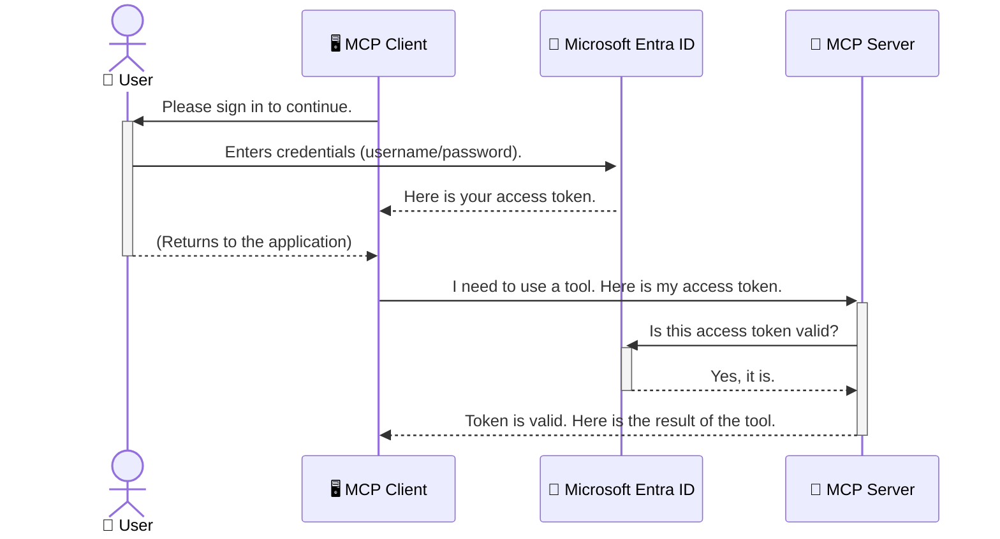

<!--
CO_OP_TRANSLATOR_METADATA:
{
  "original_hash": "6e562d7e5a77c8982da4aa8f762ad1d8",
  "translation_date": "2025-07-14T03:13:47+00:00",
  "source_file": "05-AdvancedTopics/mcp-security-entra/README.md",
  "language_code": "hu"
}
-->
# AI Munkafolyamatok Biztonsága: Entra ID Hitelesítés a Model Context Protocol Szerverekhez

## Bevezetés
A Model Context Protocol (MCP) szerver biztonságossá tétele ugyanolyan fontos, mint az otthonod bejárati ajtajának bezárása. Ha nyitva hagyod az MCP szerveredet, eszközeid és adataid illetéktelen hozzáférésnek vannak kitéve, ami biztonsági incidensekhez vezethet. A Microsoft Entra ID egy megbízható, felhőalapú identitás- és hozzáférés-kezelési megoldás, amely biztosítja, hogy csak jogosult felhasználók és alkalmazások férhessenek hozzá az MCP szerveredhez. Ebben a részben megtanulod, hogyan védd meg AI munkafolyamataidat Entra ID hitelesítéssel.

## Tanulási célok
A rész végére képes leszel:

- Megérteni az MCP szerverek biztonságának fontosságát.
- Elmagyarázni a Microsoft Entra ID és az OAuth 2.0 hitelesítés alapjait.
- Megkülönböztetni a nyilvános és a bizalmas kliens típusokat.
- Megvalósítani az Entra ID hitelesítést helyi (nyilvános kliens) és távoli (bizalmas kliens) MCP szerver esetén.
- Alkalmazni a biztonsági legjobb gyakorlatokat AI munkafolyamatok fejlesztésekor.

## Biztonság és MCP

Ahogy nem hagynád nyitva az otthonod bejárati ajtaját, úgy az MCP szerveredet sem szabad bárki számára elérhetővé tenni. AI munkafolyamataid biztonságossá tétele elengedhetetlen ahhoz, hogy megbízható, stabil és biztonságos alkalmazásokat építs. Ebben a fejezetben megismerkedsz a Microsoft Entra ID használatával az MCP szerverek védelmére, hogy csak jogosult felhasználók és alkalmazások férhessenek hozzá eszközeidhez és adataidhoz.

## Miért fontos a biztonság az MCP szerverek esetében?

Képzeld el, hogy az MCP szervered egy olyan eszközt tartalmaz, amely képes e-maileket küldeni vagy hozzáférni egy ügyféladatbázishoz. Egy nem biztonságos szerver esetén bárki használhatja ezt az eszközt, ami illetéktelen adat-hozzáféréshez, spamhez vagy más rosszindulatú tevékenységekhez vezethet.

A hitelesítés bevezetésével biztosítod, hogy minden kérés a szerveredhez ellenőrzött legyen, megerősítve a kérés kezdeményezőjének személyazonosságát, legyen az felhasználó vagy alkalmazás. Ez az első és legfontosabb lépés AI munkafolyamataid biztonságossá tételében.

## Bevezetés a Microsoft Entra ID-be

[**Microsoft Entra ID**](https://adoption.microsoft.com/microsoft-security/entra/) egy felhőalapú identitás- és hozzáférés-kezelő szolgáltatás. Gondolj rá úgy, mint egy univerzális biztonsági őrre az alkalmazásaid számára. Kezeli a felhasználói azonosítás (hitelesítés) és a jogosultságok meghatározásának (engedélyezés) bonyolult folyamatát.

Az Entra ID használatával:

- Biztonságos bejelentkezést teszel lehetővé a felhasználók számára.
- Véded az API-kat és szolgáltatásokat.
- Központilag kezeled a hozzáférési szabályokat.

Az MCP szerverek esetében az Entra ID egy megbízható és széles körben elfogadott megoldást kínál arra, hogy szabályozd, ki férhet hozzá a szerver képességeihez.

---

## A varázslat megértése: Hogyan működik az Entra ID hitelesítés

Az Entra ID nyílt szabványokat, például az **OAuth 2.0** protokollt használja a hitelesítés kezelésére. Bár a részletek bonyolultak lehetnek, az alapötlet egyszerű és egy hasonlattal könnyen megérthető.

### Egy könnyed bevezetés az OAuth 2.0-ba: A parkolókulcs

Gondolj az OAuth 2.0-ra úgy, mint egy parkolószolgálatra az autód számára. Amikor megérkezel egy étterembe, nem adod oda a parkolósnak a főkulcsodat. Ehelyett egy **parkolókulcsot** adsz neki, amely korlátozott jogosultságokkal rendelkezik – el tudja indítani az autót és bezárni az ajtókat, de nem tudja kinyitni a csomagtartót vagy a kesztyűtartót.

Ebben a hasonlatban:

- **Te** vagy a **Felhasználó**.
- **Az autód** az **MCP szerver** értékes eszközeivel és adataival.
- A **Parkolós** a **Microsoft Entra ID**.
- A **Parkolófiú** az **MCP kliens** (az alkalmazás, amely hozzáférést kér a szerverhez).
- A **Parkolókulcs** az **Access Token**.

Az access token egy biztonságos szöveges kód, amelyet az MCP kliens kap az Entra ID-től a bejelentkezés után. A kliens ezt a tokent minden kéréshez bemutatja az MCP szervernek. A szerver ellenőrizheti a tokent, hogy megbizonyosodjon a kérés jogosultságáról és arról, hogy a kliens rendelkezik a szükséges engedélyekkel, mindezt anélkül, hogy a tényleges hitelesítő adataidat (például jelszavadat) kezelnie kellene.

### A hitelesítési folyamat

A folyamat a gyakorlatban így néz ki:



### Bemutatkozik a Microsoft Authentication Library (MSAL)

Mielőtt belevágnánk a kódba, fontos megismerni egy kulcsfontosságú összetevőt, amelyet a példákban láthatsz: a **Microsoft Authentication Library (MSAL)**-t.

Az MSAL egy Microsoft által fejlesztett könyvtár, amely megkönnyíti a fejlesztők számára a hitelesítés kezelését. Nem neked kell megírnod a bonyolult kódot a biztonsági tokenek kezelésére, a bejelentkezések lebonyolítására és a munkamenetek frissítésére, mert az MSAL ezt elvégzi helyetted.

Az MSAL használata erősen ajánlott, mert:

- **Biztonságos:** Iparági szabványokat és biztonsági legjobb gyakorlatokat valósít meg, csökkentve a sebezhetőségek kockázatát a kódodban.
- **Egyszerűsíti a fejlesztést:** Elrejti az OAuth 2.0 és OpenID Connect protokollok bonyolultságát, így néhány sor kóddal erős hitelesítést adhatsz az alkalmazásodhoz.
- **Karbantartott:** A Microsoft aktívan fejleszti és frissíti az MSAL-t, hogy lépést tartson az új biztonsági fenyegetésekkel és platformváltozásokkal.

Az MSAL számos nyelvet és alkalmazáskeretrendszert támogat, beleértve a .NET-et, JavaScript/TypeScript-et, Pythont, Javat, Go-t, valamint mobil platformokat, mint az iOS és Android. Ez azt jelenti, hogy az egész technológiai stack-edben egységes hitelesítési mintákat használhatsz.

További információért nézd meg a hivatalos [MSAL áttekintő dokumentációt](https://learn.microsoft.com/entra/identity-platform/msal-overview).

---

## MCP szervered védelme Entra ID-vel: Lépésről lépésre

Most nézzük meg, hogyan lehet egy helyi MCP szervert (amely `stdio`-n keresztül kommunikál) Entra ID-vel biztonságossá tenni. Ez a példa egy **nyilvános klienset** használ, amely alkalmas olyan alkalmazásokhoz, amelyek a felhasználó gépén futnak, például asztali alkalmazás vagy helyi fejlesztői szerver.

### 1. Forgatókönyv: Helyi MCP szerver védelme (nyilvános klienssel)

Ebben a forgatókönyvben egy helyileg futó MCP szervert vizsgálunk, amely `stdio`-n keresztül kommunikál, és Entra ID-vel hitelesíti a felhasználót, mielőtt hozzáférést engedélyez az eszközeihez. A szerver egyetlen eszközzel rendelkezik, amely lekéri a felhasználó profiladatait a Microsoft Graph API-ból.

#### 1. Az alkalmazás regisztrálása az Entra ID-ben

Mielőtt kódot írnál, regisztrálnod kell az alkalmazásodat a Microsoft Entra ID-ben. Ez tájékoztatja az Entra ID-t az alkalmazásodról, és engedélyt ad a hitelesítési szolgáltatás használatára.

1. Lépj be a **[Microsoft Entra portálra](https://entra.microsoft.com/)**.
2. Menj az **App registrations** menüpontra, majd kattints az **Új regisztráció** gombra.
3. Adj nevet az alkalmazásodnak (pl. „My Local MCP Server”).
4. A **Támogatott fióktípusok** közül válaszd az **Accounts in this organizational directory only** opciót.
5. A **Redirect URI** mezőt hagyhatod üresen ennél a példánál.
6. Kattints a **Regisztráció** gombra.

A regisztráció után jegyezd fel az **Application (client) ID** és a **Directory (tenant) ID** értékeket, mert szükséged lesz rájuk a kódban.

#### 2. A kód: részletek

Nézzük meg a hitelesítést kezelő kód kulcsfontosságú részeit. A teljes példa elérhető az [Entra ID - Local - WAM](https://github.com/Azure-Samples/mcp-auth-servers/tree/main/src/entra-id-local-wam) mappában a [mcp-auth-servers GitHub tárhelyen](https://github.com/Azure-Samples/mcp-auth-servers).

**`AuthenticationService.cs`**

Ez az osztály felelős az Entra ID-vel való kommunikációért.

- **`CreateAsync`**: Inicializálja az MSAL `PublicClientApplication` példányát, az alkalmazás `clientId` és `tenantId` értékeivel konfigurálva.
- **`WithBroker`**: Engedélyezi egy közvetítő (pl. Windows Web Account Manager) használatát, amely biztonságosabb és zökkenőmentesebb egyetlen bejelentkezési élményt nyújt.
- **`AcquireTokenAsync`**: Ez a fő metódus. Először megpróbál csendesen (interaktivitás nélkül) hozzáférési tokent szerezni, ha van érvényes munkamenet. Ha ez nem sikerül, interaktív bejelentkezést kér a felhasználótól.

```csharp
// Simplified for clarity
public static async Task<AuthenticationService> CreateAsync(ILogger<AuthenticationService> logger)
{
    var msalClient = PublicClientApplicationBuilder
        .Create(_clientId) // Your Application (client) ID
        .WithAuthority(AadAuthorityAudience.AzureAdMyOrg)
        .WithTenantId(_tenantId) // Your Directory (tenant) ID
        .WithBroker(new BrokerOptions(BrokerOptions.OperatingSystems.Windows))
        .Build();

    // ... cache registration ...

    return new AuthenticationService(logger, msalClient);
}

public async Task<string> AcquireTokenAsync()
{
    try
    {
        // Try silent authentication first
        var accounts = await _msalClient.GetAccountsAsync();
        var account = accounts.FirstOrDefault();

        AuthenticationResult? result = null;

        if (account != null)
        {
            result = await _msalClient.AcquireTokenSilent(_scopes, account).ExecuteAsync();
        }
        else
        {
            // If no account, or silent fails, go interactive
            result = await _msalClient.AcquireTokenInteractive(_scopes).ExecuteAsync();
        }

        return result.AccessToken;
    }
    catch (Exception ex)
    {
        _logger.LogError(ex, "An error occurred while acquiring the token.");
        throw; // Optionally rethrow the exception for higher-level handling
    }
}
```

**`Program.cs`**

Itt állítják be az MCP szervert és integrálják a hitelesítési szolgáltatást.

- **`AddSingleton<AuthenticationService>`**: Regisztrálja az `AuthenticationService`-t a függőséginjektáló konténerben, hogy más részek (például az eszköz) használhassák.
- **`GetUserDetailsFromGraph` eszköz**: Ez az eszköz igényli az `AuthenticationService` példányát. Mielőtt bármit tenne, meghívja az `authService.AcquireTokenAsync()`-t, hogy érvényes hozzáférési tokent szerezzen. Ha a hitelesítés sikeres, a tokennel hívja meg a Microsoft Graph API-t, és lekéri a felhasználó adatait.

```csharp
// Simplified for clarity
[McpServerTool(Name = "GetUserDetailsFromGraph")]
public static async Task<string> GetUserDetailsFromGraph(
    AuthenticationService authService)
{
    try
    {
        // This will trigger the authentication flow
        var accessToken = await authService.AcquireTokenAsync();

        // Use the token to create a GraphServiceClient
        var graphClient = new GraphServiceClient(
            new BaseBearerTokenAuthenticationProvider(new TokenProvider(authService)));

        var user = await graphClient.Me.GetAsync();

        return System.Text.Json.JsonSerializer.Serialize(user);
    }
    catch (Exception ex)
    {
        return $"Error: {ex.Message}";
    }
}
```

#### 3. Hogyan működik együtt az egész?

1. Amikor az MCP kliens használni próbálja a `GetUserDetailsFromGraph` eszközt, az először meghívja az `AcquireTokenAsync`-t.
2. Az `AcquireTokenAsync` az MSAL könyvtárat indítja el, hogy ellenőrizze, van-e érvényes token.
3. Ha nincs token, az MSAL a közvetítőn keresztül interaktív bejelentkezést kér a felhasználótól az Entra ID fiókjával.
4. A bejelentkezés után az Entra ID kiad egy hozzáférési tokent.
5. Az eszköz megkapja a tokent, és biztonságos hívást tesz a Microsoft Graph API felé.
6. A felhasználó adatai visszatérnek az MCP klienshez.

Ez a folyamat biztosítja, hogy csak hitelesített felhasználók használhassák az eszközt, így hatékonyan védve a helyi MCP szerveredet.

### 2. Forgatókönyv: Távoli MCP szerver védelme (bizalmas klienssel)

Ha az MCP szervered távoli gépen fut (például felhőben), és olyan protokollon kommunikál, mint az HTTP Streaming, a biztonsági követelmények eltérnek. Ilyenkor **bizalmas klienset** és az **Authorization Code Flow**-t kell használnod. Ez biztonságosabb módszer, mert az alkalmazás titkai soha nem kerülnek ki a böngészőbe.

Ez a példa egy TypeScript alapú MCP szervert használ, amely Express.js-t alkalmaz HTTP kérések kezelésére.

#### 1. Az alkalmazás regisztrálása az Entra ID-ben

Az Entra ID-ben a regisztráció hasonló a nyilvános klienshez, de egy fontos különbséggel: létre kell hoznod egy **client secret**-et.

1. Lépj be a **[Microsoft Entra portálra](https://entra.microsoft.com/)**.
2. Az alkalmazás regisztrációján belül menj a **Certificates & secrets** fülre.
3. Kattints az **Új kliens titok** gombra, adj meg egy leírást, majd kattints a **Hozzáadás** gombra.
4. **Fontos:** Másold ki azonnal a titok értékét, mert később nem fogod látni.
5. Konfigurálnod kell egy **Redirect URI**-t is. Menj az **Authentication** fülre, kattints az **Add a platform** gombra, válaszd a **Web** opciót, és add meg az alkalmazásod átirányítási URI-ját (pl. `http://localhost:3001/auth/callback`).

> **⚠️ Fontos biztonsági megjegyzés:** Éles alkalmazások esetén a Microsoft erősen ajánlja a **titok nélküli hitelesítési** módszerek, például a **Managed Identity** vagy a **Workload Identity Federation** használatát a kliens titkok helyett. A kliens titkok biztonsági kockázatot jelentenek, mert kiszivároghatnak vagy kompromittálódhatnak. A managed identity-k biztonságosabb megoldást kínálnak, mivel nem kell hitelesítő adatokat tárolni a kódban vagy konfigurációban.
>
> További információért lásd a [Managed identities for Azure resources áttekintést](https://learn.microsoft.com/entra/identity/managed-identities-azure-resources/overview).

#### 2. A kód: részletek

Ez a példa munkamenet-alapú megközelítést használ. Amikor a felhasználó hitelesít, a szerver eltárolja a hozzáférési és frissítő tokent a munkamenetben, és egy munkamenet tokent ad vissza a felhasználónak. Ezt a munkamenet tokent használják a további kérésekhez. A teljes példa elérhető az [Entra ID - Confidential client](https://github.com/Azure-Samples/mcp-auth-servers/tree/main/src/entra-id-cca-session) mappában a [mcp-auth-servers GitHub tárhelyen](https://github.com/Azure-Samples/mcp-auth-servers).

**`Server.ts`**

Ez a fájl állítja be az Express szervert és az MCP kommunikációs réteget.

- **`requireBearerAuth`**: Ez egy middleware, amely védi a `/sse` és `/message` végpontokat. Ellenőrzi, hogy a kérés `Authorization` fejlécében érvényes bearer token legyen.
- **`EntraIdServerAuthProvider`**: Egy egyedi osztály, amely megvalósítja a `McpServerAuthorizationProvider` interfészt. Ez kezeli az OAuth 2.0 folyamatot.
- **`/auth/callback`**: Ez a végpont kezeli az Entra ID-ből érkező átirányítást a felhasználó hitelesítése után. Az authorization code-ot hozzá
4. A szerver kicseréli a kódot egy hozzáférési tokenre és egy frissítő tokenre, eltárolja azokat, majd létrehoz egy munkamenet tokent, amelyet elküld az ügyfélnek.  
5. Az ügyfél mostantól ezt a munkamenet tokent használhatja az `Authorization` fejlécben az összes további MCP szerverhez intézett kérésnél.  
6. Amikor a `getUserDetails` eszközt meghívják, az a munkamenet token segítségével lekéri az Entra ID hozzáférési tokent, majd ezt használja a Microsoft Graph API hívásához.  

Ez a folyamat bonyolultabb, mint a nyilvános kliens esetén, de szükséges az internet felé nyitott végpontokhoz. Mivel a távoli MCP szerverek a nyilvános interneten keresztül érhetők el, erősebb biztonsági intézkedésekre van szükség az illetéktelen hozzáférés és a potenciális támadások elleni védelem érdekében.  


## Biztonsági legjobb gyakorlatok

- **Mindig használj HTTPS-t**: Titkosítsd a kommunikációt az ügyfél és a szerver között, hogy megvédd a tokeneket az elfogástól.  
- **Alkalmazz szerepalapú hozzáférés-vezérlést (RBAC)**: Ne csak azt ellenőrizd, hogy a felhasználó hitelesítve van-e, hanem azt is, hogy mit jogosult tenni. Definiálhatsz szerepeket az Entra ID-ben, és ezeket ellenőrizheted az MCP szervereden.  
- **Figyelj és auditálj**: Naplózz minden hitelesítési eseményt, hogy észlelhesd és reagálhass a gyanús tevékenységekre.  
- **Kezeld a lekérési korlátozásokat és a lassítást**: A Microsoft Graph és más API-k lekérési korlátozásokat alkalmaznak a visszaélések megelőzésére. Valósíts meg exponenciális visszalépést és újrapróbálkozási logikát az MCP szerveredben, hogy szépen kezeld a HTTP 429 (Túl sok kérés) válaszokat. Érdemes gyakran használt adatokat gyorsítótárazni az API hívások csökkentése érdekében.  
- **Biztonságos token tárolás**: Tárold biztonságosan a hozzáférési és frissítő tokeneket. Helyi alkalmazások esetén használd a rendszer biztonságos tároló mechanizmusait. Szerveralkalmazásoknál fontold meg titkosított tárolás vagy biztonságos kulcskezelő szolgáltatások, például az Azure Key Vault használatát.  
- **Token lejárat kezelése**: A hozzáférési tokenek élettartama korlátozott. Valósíts meg automatikus tokenfrissítést a frissítő tokenek segítségével, hogy a felhasználói élmény megszakítás nélkül folytatódjon, újra-hitelesítés nélkül.  
- **Fontold meg az Azure API Management használatát**: Bár a biztonság közvetlen megvalósítása az MCP szerveredben finomhangolt kontrollt ad, az API Gateway-ek, mint az Azure API Management, sok biztonsági kérdést automatikusan kezelnek, beleértve a hitelesítést, jogosultságkezelést, lekérési korlátozást és monitorozást. Központosított biztonsági réteget biztosítanak az ügyfeleid és az MCP szervereid között. További részletekért az API Gateway-ek MCP-vel való használatáról lásd a [Azure API Management Your Auth Gateway For MCP Servers](https://techcommunity.microsoft.com/blog/integrationsonazureblog/azure-api-management-your-auth-gateway-for-mcp-servers/4402690) cikket.  


## Főbb tanulságok

- Az MCP szervered biztonságossá tétele kulcsfontosságú az adataid és eszközeid védelméhez.  
- A Microsoft Entra ID robusztus és skálázható megoldást kínál hitelesítésre és jogosultságkezelésre.  
- Helyi alkalmazásokhoz használj **nyilvános klienst**, távoli szerverekhez pedig **titkosított klienst**.  
- A **Authorization Code Flow** a legbiztonságosabb választás webalkalmazások számára.  


## Gyakorlat

1. Gondolj egy MCP szerverre, amit esetleg építenél. Helyi vagy távoli szerver lenne?  
2. A válaszod alapján nyilvános vagy titkosított klienst használnál?  
3. Milyen jogosultságokat kérne az MCP szervered a Microsoft Graph ellen végzett műveletekhez?  


## Gyakorlati feladatok

### 1. gyakorlat: Alkalmazás regisztrálása az Entra ID-ben  
Lépj be a Microsoft Entra portálra.  
Regisztrálj egy új alkalmazást az MCP szerveredhez.  
Jegyezd fel az Application (client) ID-t és a Directory (tenant) ID-t.  

### 2. gyakorlat: Helyi MCP szerver biztonságossá tétele (Nyilvános kliens)  
- Kövesd a kódpéldát az MSAL (Microsoft Authentication Library) integrálásához a felhasználói hitelesítéshez.  
- Teszteld a hitelesítési folyamatot az MCP eszköz meghívásával, amely lekéri a felhasználói adatokat a Microsoft Graphból.  

### 3. gyakorlat: Távoli MCP szerver biztonságossá tétele (Titkosított kliens)  
- Regisztrálj egy titkosított klienst az Entra ID-ben, és hozz létre egy kliens titkot.  
- Állítsd be az Express.js MCP szerveredet az Authorization Code Flow használatára.  
- Teszteld a védett végpontokat, és ellenőrizd a token alapú hozzáférést.  

### 4. gyakorlat: Biztonsági legjobb gyakorlatok alkalmazása  
- Engedélyezd a HTTPS-t helyi vagy távoli szervereden.  
- Valósíts meg szerepalapú hozzáférés-vezérlést (RBAC) a szerver logikájában.  
- Add hozzá a token lejárat kezelését és a biztonságos token tárolást.  


## Források

1. **MSAL Áttekintő dokumentáció**  
   Ismerd meg, hogyan teszi lehetővé a Microsoft Authentication Library (MSAL) a biztonságos token beszerzést különböző platformokon:  
   [MSAL Overview on Microsoft Learn](https://learn.microsoft.com/en-gb/entra/msal/overview)  

2. **Azure-Samples/mcp-auth-servers GitHub tárhely**  
   MCP szerverek hitelesítési folyamatokat bemutató referencia implementációi:  
   [Azure-Samples/mcp-auth-servers on GitHub](https://github.com/Azure-Samples/mcp-auth-servers)  

3. **Managed Identities for Azure Resources áttekintés**  
   Ismerd meg, hogyan szüntetheted meg a titkok használatát rendszer- vagy felhasználó által hozzárendelt kezelt identitásokkal:  
   [Managed Identities Overview on Microsoft Learn](https://learn.microsoft.com/en-us/entra/identity/managed-identities-azure-resources/)  

4. **Azure API Management: Az MCP szerverek hitelesítési kapuja**  
   Mélyebb betekintés az APIM használatába biztonságos OAuth2 kapuként MCP szerverekhez:  
   [Azure API Management Your Auth Gateway For MCP Servers](https://techcommunity.microsoft.com/blog/integrationsonazureblog/azure-api-management-your-auth-gateway-for-mcp-servers/4402690)  

5. **Microsoft Graph jogosultságok referencia**  
   Átfogó lista a delegált és alkalmazás jogosultságokról a Microsoft Graphhoz:  
   [Microsoft Graph Permissions Reference](https://learn.microsoft.com/zh-tw/graph/permissions-reference)  


## Tanulási eredmények  
A szakasz elvégzése után képes leszel:

- Megmagyarázni, miért kritikus a hitelesítés az MCP szerverek és AI munkafolyamatok esetén.  
- Beállítani és konfigurálni az Entra ID hitelesítést helyi és távoli MCP szerver forgatókönyvekhez.  
- Kiválasztani a megfelelő kliens típust (nyilvános vagy titkosított) a szervered telepítése alapján.  
- Biztonságos kódolási gyakorlatokat alkalmazni, beleértve a token tárolást és a szerepalapú jogosultságkezelést.  
- Magabiztosan védeni az MCP szerveredet és eszközeit az illetéktelen hozzáférés ellen.  


## Mi következik

- [5.13 Model Context Protocol (MCP) integráció az Azure AI Foundry-val](../mcp-foundry-agent-integration/README.md)

**Jogi nyilatkozat**:  
Ez a dokumentum az AI fordító szolgáltatás, a [Co-op Translator](https://github.com/Azure/co-op-translator) segítségével készült. Bár a pontosságra törekszünk, kérjük, vegye figyelembe, hogy az automatikus fordítások hibákat vagy pontatlanságokat tartalmazhatnak. Az eredeti dokumentum az anyanyelvén tekintendő hiteles forrásnak. Kritikus információk esetén professzionális emberi fordítást javaslunk. Nem vállalunk felelősséget a fordítás használatából eredő félreértésekért vagy téves értelmezésekért.