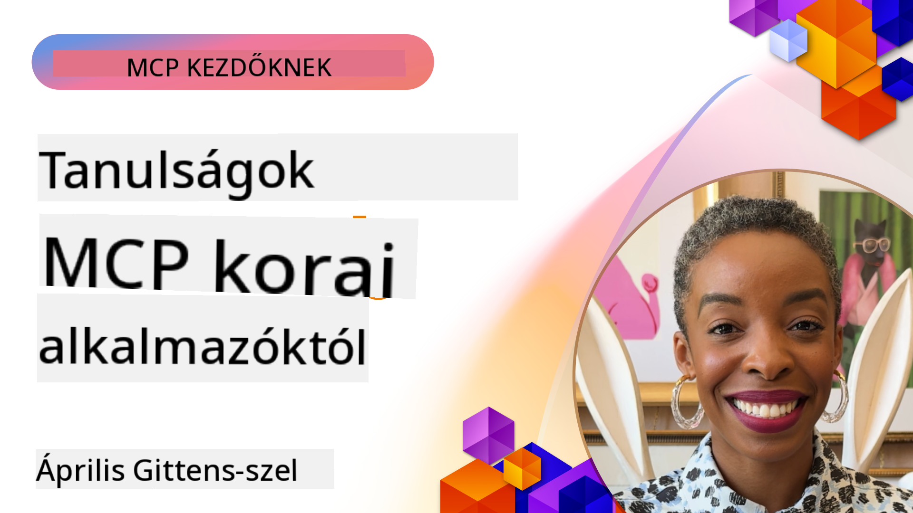

<!--
CO_OP_TRANSLATOR_METADATA:
{
  "original_hash": "41f16dac486d2086a53bc644a01cbe42",
  "translation_date": "2025-08-19T14:55:25+00:00",
  "source_file": "07-LessonsfromEarlyAdoption/README.md",
  "language_code": "hu"
}
-->
# 🌟 Tanulságok korai felhasználóktól

[](https://youtu.be/jds7dSmNptE)

_(Kattints a fenti képre a videó megtekintéséhez)_

## 🎯 Mit tartalmaz ez a modul?

Ez a modul bemutatja, hogyan használják valódi szervezetek és fejlesztők a Model Context Protocol-t (MCP) valós problémák megoldására és innováció előmozdítására. Részletes esettanulmányokon és gyakorlati példákon keresztül megismerheted, hogyan teszi az MCP lehetővé a biztonságos, skálázható AI integrációt, amely összekapcsolja a nyelvi modelleket, eszközöket és vállalati adatokat.

### 📚 Nézd meg az MCP működés közben

Szeretnéd látni, hogyan alkalmazzák ezeket az elveket gyártásra kész eszközökben? Nézd meg a [**10 Microsoft MCP Server, amely átalakítja a fejlesztői produktivitást**](microsoft-mcp-servers.md), amely bemutatja a valódi Microsoft MCP szervereket, amelyeket már ma használhatsz.

## Áttekintés

Ez a lecke bemutatja, hogyan használták a korai felhasználók a Model Context Protocol-t (MCP) valós problémák megoldására és innováció előmozdítására különböző iparágakban. Részletes esettanulmányokon és gyakorlati projekteken keresztül láthatod, hogyan teszi az MCP lehetővé a szabványosított, biztonságos és skálázható AI integrációt—összekapcsolva a nagy nyelvi modelleket, eszközöket és vállalati adatokat egy egységes keretrendszerben. Gyakorlati tapasztalatot szerezhetsz MCP-alapú megoldások tervezésében és építésében, tanulhatsz bevált megvalósítási mintákból, és felfedezheted az MCP gyártási környezetben történő bevezetésének legjobb gyakorlatait. A lecke kiemeli a feltörekvő trendeket, jövőbeli irányokat és nyílt forráskódú erőforrásokat, hogy segítsen naprakészen maradni az MCP technológia és annak fejlődő ökoszisztémája terén.

## Tanulási célok

- Valós MCP megvalósítások elemzése különböző iparágakban
- Teljes MCP-alapú alkalmazások tervezése és építése
- Feltörekvő trendek és jövőbeli irányok felfedezése az MCP technológiában
- Legjobb gyakorlatok alkalmazása valós fejlesztési helyzetekben

## Valós MCP megvalósítások

### Esettanulmány 1: Vállalati ügyfélszolgálati automatizáció

Egy multinacionális vállalat MCP-alapú megoldást vezetett be, hogy szabványosítsa az AI interakciókat ügyfélszolgálati rendszereikben. Ez lehetővé tette számukra:

- Egységes felület létrehozását több LLM szolgáltató számára
- Konzisztens promptkezelés fenntartását az osztályok között
- Robusztus biztonsági és megfelelőségi kontrollok bevezetését
- Könnyű váltást különböző AI modellek között specifikus igények alapján

**Technikai megvalósítás:**

```python
# Python MCP server implementation for customer support
import logging
import asyncio
from modelcontextprotocol import create_server, ServerConfig
from modelcontextprotocol.server import MCPServer
from modelcontextprotocol.transports import create_http_transport
from modelcontextprotocol.resources import ResourceDefinition
from modelcontextprotocol.prompts import PromptDefinition
from modelcontextprotocol.tool import ToolDefinition

# Configure logging
logging.basicConfig(level=logging.INFO)

async def main():
    # Create server configuration
    config = ServerConfig(
        name="Enterprise Customer Support Server",
        version="1.0.0",
        description="MCP server for handling customer support inquiries"
    )
    
    # Initialize MCP server
    server = create_server(config)
    
    # Register knowledge base resources
    server.resources.register(
        ResourceDefinition(
            name="customer_kb",
            description="Customer knowledge base documentation"
        ),
        lambda params: get_customer_documentation(params)
    )
    
    # Register prompt templates
    server.prompts.register(
        PromptDefinition(
            name="support_template",
            description="Templates for customer support responses"
        ),
        lambda params: get_support_templates(params)
    )
    
    # Register support tools
    server.tools.register(
        ToolDefinition(
            name="ticketing",
            description="Create and update support tickets"
        ),
        handle_ticketing_operations
    )
    
    # Start server with HTTP transport
    transport = create_http_transport(port=8080)
    await server.run(transport)

if __name__ == "__main__":
    asyncio.run(main())
```

**Eredmények:** 30%-os költségcsökkentés a modellek esetében, 45%-os javulás a válaszok konzisztenciájában, és fokozott megfelelőség a globális működésben.

### Esettanulmány 2: Egészségügyi diagnosztikai asszisztens

Egy egészségügyi szolgáltató MCP infrastruktúrát fejlesztett ki, hogy integrálja a különböző specializált orvosi AI modelleket, miközben biztosította az érzékeny betegadatok védelmét:

- Zökkenőmentes váltás általános és specialista orvosi modellek között
- Szigorú adatvédelmi kontrollok és audit nyomvonalak
- Integráció meglévő Elektronikus Egészségügyi Nyilvántartási (EHR) rendszerekkel
- Konzisztens promptkezelés az orvosi terminológia számára

**Technikai megvalósítás:**

```csharp
// C# MCP host application implementation in healthcare application
using Microsoft.Extensions.DependencyInjection;
using ModelContextProtocol.SDK.Client;
using ModelContextProtocol.SDK.Security;
using ModelContextProtocol.SDK.Resources;

public class DiagnosticAssistant
{
    private readonly MCPHostClient _mcpClient;
    private readonly PatientContext _patientContext;
    
    public DiagnosticAssistant(PatientContext patientContext)
    {
        _patientContext = patientContext;
        
        // Configure MCP client with healthcare-specific settings
        var clientOptions = new ClientOptions
        {
            Name = "Healthcare Diagnostic Assistant",
            Version = "1.0.0",
            Security = new SecurityOptions
            {
                Encryption = EncryptionLevel.Medical,
                AuditEnabled = true
            }
        };
        
        _mcpClient = new MCPHostClientBuilder()
            .WithOptions(clientOptions)
            .WithTransport(new HttpTransport("https://healthcare-mcp.example.org"))
            .WithAuthentication(new HIPAACompliantAuthProvider())
            .Build();
    }
    
    public async Task<DiagnosticSuggestion> GetDiagnosticAssistance(
        string symptoms, string patientHistory)
    {
        // Create request with appropriate resources and tool access
        var resourceRequest = new ResourceRequest
        {
            Name = "patient_records",
            Parameters = new Dictionary<string, object>
            {
                ["patientId"] = _patientContext.PatientId,
                ["requestingProvider"] = _patientContext.ProviderId
            }
        };
        
        // Request diagnostic assistance using appropriate prompt
        var response = await _mcpClient.SendPromptRequestAsync(
            promptName: "diagnostic_assistance",
            parameters: new Dictionary<string, object>
            {
                ["symptoms"] = symptoms,
                patientHistory = patientHistory,
                relevantGuidelines = _patientContext.GetRelevantGuidelines()
            });
            
        return DiagnosticSuggestion.FromMCPResponse(response);
    }
}
```

**Eredmények:** Javított diagnosztikai javaslatok az orvosok számára, miközben teljes HIPAA megfelelőséget biztosítottak, és jelentősen csökkentették a rendszerek közötti váltás idejét.

### Esettanulmány 3: Pénzügyi szolgáltatások kockázatelemzése

Egy pénzügyi intézmény MCP-t vezetett be, hogy szabványosítsa kockázatelemzési folyamatait különböző osztályok között:

- Egységes felület létrehozása hitelkockázat, csalásészlelés és befektetési kockázati modellek számára
- Szigorú hozzáférés-ellenőrzés és modell verziókezelés bevezetése
- Az AI ajánlások auditálhatóságának biztosítása
- Konzisztens adatformázás fenntartása különböző rendszerek között

**Technikai megvalósítás:**

```java
// Java MCP server for financial risk assessment
import org.mcp.server.*;
import org.mcp.security.*;

public class FinancialRiskMCPServer {
    public static void main(String[] args) {
        // Create MCP server with financial compliance features
        MCPServer server = new MCPServerBuilder()
            .withModelProviders(
                new ModelProvider("risk-assessment-primary", new AzureOpenAIProvider()),
                new ModelProvider("risk-assessment-audit", new LocalLlamaProvider())
            )
            .withPromptTemplateDirectory("./compliance/templates")
            .withAccessControls(new SOCCompliantAccessControl())
            .withDataEncryption(EncryptionStandard.FINANCIAL_GRADE)
            .withVersionControl(true)
            .withAuditLogging(new DatabaseAuditLogger())
            .build();
            
        server.addRequestValidator(new FinancialDataValidator());
        server.addResponseFilter(new PII_RedactionFilter());
        
        server.start(9000);
        
        System.out.println("Financial Risk MCP Server running on port 9000");
    }
}
```

**Eredmények:** Fokozott szabályozási megfelelőség, 40%-kal gyorsabb modellbevezetési ciklusok, és javított kockázatértékelési konzisztencia az osztályok között.

### Esettanulmány 4: Microsoft Playwright MCP Server böngészőautomatizációhoz

A Microsoft kifejlesztette a [Playwright MCP szervert](https://github.com/microsoft/playwright-mcp), hogy lehetővé tegye a biztonságos, szabványosított böngészőautomatizációt a Model Context Protocol segítségével. Ez a gyártásra kész szerver lehetővé teszi AI ügynökök és LLM-ek számára, hogy kontrollált, auditálható és bővíthető módon lépjenek interakcióba webes böngészőkkel—támogatva olyan felhasználási eseteket, mint az automatizált webes tesztelés, adatkinyerés és end-to-end munkafolyamatok.

> **🎯 Gyártásra kész eszköz**
> 
> Ez az esettanulmány egy valódi MCP szervert mutat be, amelyet már ma használhatsz! Tudj meg többet a Playwright MCP Serverről és további 9 gyártásra kész Microsoft MCP szerverről a [**Microsoft MCP Servers Guide**](microsoft-mcp-servers.md#8--playwright-mcp-server) című útmutatónkban.

**Főbb jellemzők:**
- Böngészőautomatizációs képességek (navigáció, űrlapkitöltés, képernyőkép készítés stb.) MCP eszközökként való kitettsége
- Szigorú hozzáférés-ellenőrzés és sandboxing az illetéktelen műveletek megelőzésére
- Részletes auditnaplók biztosítása minden böngészőinterakcióhoz
- Integráció támogatása Azure OpenAI-val és más LLM szolgáltatókkal ügynökvezérelt automatizációhoz
- A GitHub Copilot Coding Agent böngészési képességeinek támogatása

**Technikai megvalósítás:**

```typescript
// TypeScript: Registering Playwright browser automation tools in an MCP server
import { createServer, ToolDefinition } from 'modelcontextprotocol';
import { launch } from 'playwright';

const server = createServer({
  name: 'Playwright MCP Server',
  version: '1.0.0',
  description: 'MCP server for browser automation using Playwright'
});

// Register a tool for navigating to a URL and capturing a screenshot
server.tools.register(
  new ToolDefinition({
    name: 'navigate_and_screenshot',
    description: 'Navigate to a URL and capture a screenshot',
    parameters: {
      url: { type: 'string', description: 'The URL to visit' }
    }
  }),
  async ({ url }) => {
    const browser = await launch();
    const page = await browser.newPage();
    await page.goto(url);
    const screenshot = await page.screenshot();
    await browser.close();
    return { screenshot };
  }
);

// Start the MCP server
server.listen(8080);
```

**Eredmények:**

- Biztonságos, programozható böngészőautomatizáció lehetővé tétele AI ügynökök és LLM-ek számára
- Csökkentett manuális tesztelési erőfeszítés és javított tesztlefedettség webes alkalmazások esetében
- Újrahasználható, bővíthető keretrendszer biztosítása böngészőalapú eszközintegrációhoz vállalati környezetben
- A GitHub Copilot webes böngészési képességeinek támogatása

**Hivatkozások:**

- [Playwright MCP Server GitHub Repository](https://github.com/microsoft/playwright-mcp)
- [Microsoft AI és automatizációs megoldások](https://azure.microsoft.com/en-us/products/ai-services/)

### Esettanulmány 5: Azure MCP – Vállalati szintű Model Context Protocol mint szolgáltatás

Az Azure MCP Server ([https://aka.ms/azmcp](https://aka.ms/azmcp)) a Microsoft által kezelt, vállalati szintű Model Context Protocol megvalósítás, amely skálázható, biztonságos és megfelelőségi MCP szerver képességeket biztosít felhőszolgáltatásként. Az Azure MCP lehetővé teszi a szervezetek számára, hogy gyorsan telepítsenek, kezeljenek és integráljanak MCP szervereket az Azure AI, adat- és biztonsági szolgáltatásokkal, csökkentve az operatív terheket és felgyorsítva az AI elfogadását.

> **🎯 Gyártásra kész eszköz**
> 
> Ez egy valódi MCP szerver, amelyet már ma használhatsz! Tudj meg többet az Azure AI Foundry MCP Serverről a [**Microsoft MCP Servers Guide**](microsoft-mcp-servers.md) című útmutatónkban.

- Teljesen kezelt MCP szerver hosting beépített skálázással, monitorozással és biztonsággal
- Natív integráció Azure OpenAI-val, Azure AI Search-csel és más Azure szolgáltatásokkal
- Vállalati hitelesítés és jogosultságkezelés Microsoft Entra ID-n keresztül
- Egyedi eszközök, prompt sablonok és erőforrás-csatlakozók támogatása
- Megfelelőség vállalati biztonsági és szabályozási követelményekkel

**Technikai megvalósítás:**

```yaml
# Example: Azure MCP server deployment configuration (YAML)
apiVersion: mcp.microsoft.com/v1
kind: McpServer
metadata:
  name: enterprise-mcp-server
spec:
  modelProviders:
    - name: azure-openai
      type: AzureOpenAI
      endpoint: https://<your-openai-resource>.openai.azure.com/
      apiKeySecret: <your-azure-keyvault-secret>
  tools:
    - name: document_search
      type: AzureAISearch
      endpoint: https://<your-search-resource>.search.windows.net/
      apiKeySecret: <your-azure-keyvault-secret>
  authentication:
    type: EntraID
    tenantId: <your-tenant-id>
  monitoring:
    enabled: true
    logAnalyticsWorkspace: <your-log-analytics-id>
```

**Eredmények:**  
- Csökkentett idő az értékteremtésig vállalati AI projektek esetében egy kész, megfelelőségi MCP szerver platform biztosításával
- LLM-ek, eszközök és vállalati adatforrások egyszerűsített integrációja
- Fokozott biztonság, megfigyelhetőség és operatív hatékonyság MCP munkaterhelések esetében
- Javított kódminőség az Azure SDK legjobb gyakorlataival és aktuális hitelesítési mintákkal

**Hivatkozások:**  
- [Azure MCP Dokumentáció](https://aka.ms/azmcp)
- [Azure MCP Server GitHub Repository](https://github.com/Azure/azure-mcp)
- [Azure AI Szolgáltatások](https://azure.microsoft.com/en-us/products/ai-services/)
- [Microsoft MCP Center](https://mcp.azure.com)

### Esettanulmány 6: NLWeb

Az MCP (Model Context Protocol) egy feltörekvő protokoll chatbotok és AI asszisztensek számára, hogy eszközökkel lépjenek interakcióba. Minden NLWeb példány egy MCP szerver is, amely egy alapvető módszert támogat, az "ask"-ot, amelyet arra használnak, hogy természetes nyelven kérdezzenek meg egy weboldalt. A visszakapott válasz a schema.org-ot használja, amely egy széles körben alkalmazott szókészlet a webes adatok leírására. Lényegében az MCP az NLWeb, ahogy a Http az HTML-hez viszonyul. Az NLWeb protokollokat, Schema.org formátumokat és mintakódokat kombinál, hogy segítsen a weboldalaknak gyorsan létrehozni ezeket a végpontokat, előnyben részesítve mind az embereket a beszélgetési felületeken keresztül, mind a gépeket a természetes ügynök-ügynök interakció révén.

Az NLWeb két különálló komponensből áll:
- Egy protokoll, amely nagyon egyszerűen kezdhető el, hogy természetes nyelven lépjen interakcióba egy weboldallal, és egy formátum, amely json-t és schema.org-ot használ a visszakapott válaszhoz. További részletekért lásd a REST API dokumentációját.
- Egy egyszerű megvalósítás (1), amely meglévő jelöléseket használ, olyan weboldalak esetében, amelyek absztrahálhatók elemek listájaként (termékek, receptek, látványosságok, vélemények stb.). Együtt egy sor felhasználói felület widgettel, a weboldalak könnyen biztosíthatnak beszélgetési felületeket tartalmukhoz. További részletekért lásd a "Life of a chat query" dokumentációt.

**Hivatkozások:**  
- [Azure MCP Dokumentáció](https://aka.ms/azmcp)
- [NLWeb](https://github.com/microsoft/NlWeb)

### Esettanulmány 7: Azure AI Foundry MCP Server – Vállalati AI ügynök integráció

Az Azure AI Foundry MCP szerverek bemutatják, hogyan használható az MCP AI ügynökök és munkafolyamatok irányítására és kezelésére vállalati környezetben. Az MCP integrálásával az Azure AI Foundry-val a szervezetek szabványosíthatják az ügynök interakciókat, kihasználhatják a Foundry munkafolyamat-kezelését, és biztosíthatják a biztonságos, skálázható telepítéseket.

> **🎯 Gyártásra kész eszköz**
> 
> Ez egy valódi MCP szerver, amelyet már ma használhatsz! Tudj meg többet az Azure AI Foundry MCP Serverről a [**Microsoft MCP Servers Guide**](microsoft-mcp-servers.md#9--azure-ai-foundry-mcp-server) című útmutatónkban.

**Főbb jellemzők:**
- Átfogó hozzáférés az Azure AI ökoszisztémájához, beleértve a modellkatalógusokat és telepítéskezelést
- Tudásindexelés Azure AI Search segítségével RAG alkalmazásokhoz
- Értékelő eszközök az AI modellek teljesítményének és minőségbiztosításának vizsgálatához
- Integráció az Azure AI Foundry Catalog és Labs szolgáltatásokkal a legújabb kutatási modellekhez
- Ügynökkezelési és értékelési képességek gyártási forgatókönyvekhez

**Eredmények:**
- Gyors prototípus-készítés és robusztus monitorozás AI ügynök munkafolyamatokhoz
- Zökkenőmentes integráció az Azure AI szolgáltatásokkal fejlett forgatókönyvekhez
- Egységes felület ügynökcsatornák építéséhez, telepítéséhez és monitorozásához
- Javított biztonság, megfelelőség és operatív hatékonyság vállalatok számára
- Felgyorsított AI elfogadás, miközben megőrizték a komplex ügynökvezérelt folyamatok feletti kontrollt

**Hivatkozások:**
- [Azure AI Foundry MCP Server GitHub Repository](https://github.com/azure-ai-foundry/mcp-foundry)
- [Integrating Azure AI Agents with MCP (Microsoft Foundry Blog)](https://devblogs.microsoft.com/foundry/integrating-azure-ai-agents-mcp/)

### Esettanulmány 8: Foundry MCP Playground – Kísérletezés és prototípus-készítés

A Foundry MCP Playground egy kész környezetet kínál MCP szerverekkel és Azure AI Foundry integrációkkal való kísérletezéshez. A fejlesztők gyorsan prototípusokat készíthetnek, tesztelhetnek és értékelhetnek AI modelleket és ügynök munkafolyamatokat az Azure AI Foundry Catalog és Labs erőforrásainak felhasználásával. A playground egyszerűsíti a beállítást, mintaprojekteket biztosít, és támogatja az együttműködő fejlesztést, megkönnyítve a legjobb gyakorlatok és új forgatókönyvek felfedezését minimális erőfeszítéssel. Különösen hasznos azoknak a csapatoknak, akik ötleteket szeretnének validálni, kísérleteket megosztani, és felgyorsítani a tanulást komplex infrastruktúra nélkül. Az alacsony belépési küszöb segíti az innovációt és a közösségi hozzájárulásokat az MCP és Azure AI Foundry ökoszisztémában.

**Hivatkozások:**

- [Foundry MCP Playground GitHub Repository](https://github.com/azure-ai-foundry/foundry-mcp-playground)

### Esettanulmány 9: Microsoft Learn Docs MCP Server – AI-alapú dokumentáció hozzáférés

A Microsoft Learn Docs MCP Server egy felhőalapú szolgáltatás, amely valós
> **🎯 Gyártásra Kész Eszköz**  
>  
> Ez egy valódi MCP szerver, amelyet már ma használhatsz! Tudj meg többet a Microsoft Learn Docs MCP szerverről a [**Microsoft MCP Szerverek Útmutatóban**](microsoft-mcp-servers.md#1--microsoft-learn-docs-mcp-server).
**Főbb jellemzők:**
- Valós idejű hozzáférés a hivatalos Microsoft dokumentációhoz, Azure dokumentumokhoz és Microsoft 365 dokumentációhoz
- Fejlett szemantikai keresési képességek, amelyek megértik a kontextust és a szándékot
- Mindig naprakész információk, ahogy a Microsoft Learn tartalmak megjelennek
- Átfogó lefedettség a Microsoft Learn, Azure dokumentáció és Microsoft 365 források között
- Akár 10 kiváló minőségű tartalomrészletet is visszaad cikkcímekkel és URL-ekkel

**Miért kritikus fontosságú:**
- Megoldja a "elavult AI tudás" problémát a Microsoft technológiák esetében
- Biztosítja, hogy az AI asszisztensek hozzáférjenek a legújabb .NET, C#, Azure és Microsoft 365 funkciókhoz
- Hiteles, elsődleges információkat nyújt a pontos kódgeneráláshoz
- Elengedhetetlen a gyorsan fejlődő Microsoft technológiákkal dolgozó fejlesztők számára

**Eredmények:**
- Jelentősen javított pontosság az AI által generált kódok esetében a Microsoft technológiákhoz
- Csökkentett idő a jelenlegi dokumentáció és legjobb gyakorlatok keresésére
- Növelt fejlesztői hatékonyság kontextusérzékeny dokumentáció visszakereséssel
- Zökkenőmentes integráció a fejlesztési munkafolyamatokkal, anélkül hogy el kellene hagyni az IDE-t

**Hivatkozások:**
- [Microsoft Learn Docs MCP Server GitHub Repository](https://github.com/MicrosoftDocs/mcp)
- [Microsoft Learn Documentation](https://learn.microsoft.com/)

## Gyakorlati projektek

### Projekt 1: Több szolgáltatót támogató MCP szerver építése

**Cél:** Hozzon létre egy MCP szervert, amely képes kéréseket irányítani több AI modell szolgáltatóhoz specifikus kritériumok alapján.

**Követelmények:**

- Legalább három különböző modell szolgáltatót támogasson (pl. OpenAI, Anthropic, helyi modellek)
- Valósítson meg egy irányítási mechanizmust a kérés metaadatai alapján
- Hozzon létre egy konfigurációs rendszert a szolgáltatói hitelesítő adatok kezelésére
- Adjon hozzá gyorsítótárazást a teljesítmény és költségek optimalizálásához
- Építsen egy egyszerű irányítópultot a használat nyomon követésére

**Megvalósítási lépések:**

1. Állítsa be az alapvető MCP szerver infrastruktúrát
2. Valósítsa meg a szolgáltatói adaptereket minden AI modell szolgáltatáshoz
3. Hozza létre az irányítási logikát a kérés attribútumai alapján
4. Adjon hozzá gyorsítótárazási mechanizmusokat a gyakori kérésekhez
5. Fejlessze ki az irányítópultot
6. Tesztelje különböző kérésmintákkal

**Technológiák:** Válasszon Python (.NET/Java/Python preferenciája alapján), Redis-t gyorsítótárazáshoz, és egy egyszerű webes keretrendszert az irányítópulthoz.

### Projekt 2: Vállalati promptkezelő rendszer

**Cél:** Fejlesszen ki egy MCP-alapú rendszert a prompt sablonok kezelésére, verziózására és telepítésére egy szervezeten belül.

**Követelmények:**

- Hozzon létre egy központosított tárolót a prompt sablonok számára
- Valósítson meg verziózási és jóváhagyási munkafolyamatokat
- Építsen sablon tesztelési képességeket mintabemenetekkel
- Fejlesszen ki szerepkör-alapú hozzáférés-vezérlést
- Hozzon létre egy API-t a sablonok lekérésére és telepítésére

**Megvalósítási lépések:**

1. Tervezze meg az adatbázis sémát a sablonok tárolásához
2. Hozza létre az alapvető API-t a sablon CRUD műveletekhez
3. Valósítsa meg a verziózási rendszert
4. Építse ki a jóváhagyási munkafolyamatot
5. Fejlessze ki a tesztelési keretrendszert
6. Hozzon létre egy egyszerű webes felületet a kezeléshez
7. Integrálja egy MCP szerverrel

**Technológiák:** Válasszon backend keretrendszert, SQL vagy NoSQL adatbázist, és egy frontend keretrendszert a kezelőfelülethez.

### Projekt 3: MCP-alapú tartalomgeneráló platform

**Cél:** Építsen egy tartalomgeneráló platformot, amely MCP-t használ, hogy következetes eredményeket nyújtson különböző tartalomtípusokhoz.

**Követelmények:**

- Támogasson több tartalomformátumot (blogbejegyzések, közösségi média, marketing szövegek)
- Valósítson meg sablon-alapú generálást testreszabási lehetőségekkel
- Hozzon létre egy tartalomellenőrzési és visszajelzési rendszert
- Kövesse nyomon a tartalom teljesítménymutatóit
- Támogassa a tartalom verziózását és iterációját

**Megvalósítási lépések:**

1. Állítsa be az MCP kliens infrastruktúrát
2. Hozzon létre sablonokat különböző tartalomtípusokhoz
3. Építse ki a tartalomgenerálási folyamatot
4. Valósítsa meg az ellenőrzési rendszert
5. Fejlessze ki a teljesítménymutatók nyomon követési rendszerét
6. Hozzon létre egy felhasználói felületet a sablonkezeléshez és tartalomgeneráláshoz

**Technológiák:** Válassza ki a preferált programozási nyelvet, webes keretrendszert és adatbázis rendszert.

## Az MCP technológia jövőbeli irányai

### Felmerülő trendek

1. **Multimodális MCP**
   - Az MCP kiterjesztése a kép-, hang- és videómodellekkel való interakciók szabványosítására
   - Keresztmodális érvelési képességek fejlesztése
   - Szabványosított prompt formátumok különböző modalitásokhoz

2. **Federált MCP infrastruktúra**
   - Elosztott MCP hálózatok, amelyek megoszthatják erőforrásaikat szervezetek között
   - Szabványosított protokollok a biztonságos modellmegosztáshoz
   - Adatvédelmet biztosító számítási technikák

3. **MCP piacterek**
   - Ökoszisztémák MCP sablonok és bővítmények megosztására és monetizálására
   - Minőségbiztosítási és tanúsítási folyamatok
   - Integráció modell piacterekkel

4. **MCP az élő számítástechnikához**
   - MCP szabványok adaptálása erőforrás-korlátozott élő eszközökhöz
   - Optimalizált protokollok alacsony sávszélességű környezetekhez
   - Speciális MCP megvalósítások IoT ökoszisztémákhoz

5. **Szabályozási keretek**
   - MCP kiterjesztések fejlesztése szabályozási megfelelőséghez
   - Szabványosított audit nyomvonalak és magyarázati interfészek
   - Integráció a feltörekvő AI irányítási keretekkel

### MCP megoldások a Microsofttól

A Microsoft és az Azure számos nyílt forráskódú adattárat fejlesztett ki, hogy segítse a fejlesztőket MCP különböző forgatókönyvekben történő megvalósításában:

#### Microsoft szervezet

1. [playwright-mcp](https://github.com/microsoft/playwright-mcp) - Playwright MCP szerver böngésző automatizáláshoz és teszteléshez
2. [files-mcp-server](https://github.com/microsoft/files-mcp-server) - OneDrive MCP szerver megvalósítás helyi teszteléshez és közösségi hozzájáruláshoz
3. [NLWeb](https://github.com/microsoft/NlWeb) - Nyílt protokollok és kapcsolódó nyílt forráskódú eszközök gyűjteménye, amely az AI Web alaprétegének létrehozására összpontosít

#### Azure-Samples szervezet

1. [mcp](https://github.com/Azure-Samples/mcp) - Minták, eszközök és források MCP szerverek építéséhez és integrálásához az Azure-on több nyelven
2. [mcp-auth-servers](https://github.com/Azure-Samples/mcp-auth-servers) - Referencia MCP szerverek, amelyek bemutatják az aktuális Model Context Protocol specifikációval való hitelesítést
3. [remote-mcp-functions](https://github.com/Azure-Samples/remote-mcp-functions) - Távoli MCP szerver megvalósítások Azure Functions-ben, nyelvspecifikus adattárakhoz kapcsolódó hivatkozásokkal
4. [remote-mcp-functions-python](https://github.com/Azure-Samples/remote-mcp-functions-python) - Gyorsindító sablon egyedi távoli MCP szerverek építéséhez és telepítéséhez Azure Functions használatával Pythonban
5. [remote-mcp-functions-dotnet](https://github.com/Azure-Samples/remote-mcp-functions-dotnet) - Gyorsindító sablon egyedi távoli MCP szerverek építéséhez és telepítéséhez Azure Functions használatával .NET/C#-ban
6. [remote-mcp-functions-typescript](https://github.com/Azure-Samples/remote-mcp-functions-typescript) - Gyorsindító sablon egyedi távoli MCP szerverek építéséhez és telepítéséhez Azure Functions használatával TypeScript-ben
7. [remote-mcp-apim-functions-python](https://github.com/Azure-Samples/remote-mcp-apim-functions-python) - Azure API Management mint AI Gateway távoli MCP szerverekhez Pythonban
8. [AI-Gateway](https://github.com/Azure-Samples/AI-Gateway) - APIM ❤️ AI kísérletek, beleértve az MCP képességeket, integrálva az Azure OpenAI-val és az AI Foundry-val

Ezek az adattárak különböző megvalósításokat, sablonokat és forrásokat kínálnak a Model Context Protocol használatához különböző programozási nyelveken és Azure szolgáltatásokon. Lefedik az alapvető szervermegvalósításoktól kezdve a hitelesítésen, felhőtelepítésen és vállalati integrációs forgatókönyveken át számos felhasználási esetet.

#### MCP Források könyvtára

A hivatalos Microsoft MCP adattár [MCP Resources könyvtára](https://github.com/microsoft/mcp/tree/main/Resources) egy gondosan összeállított mintagyűjteményt kínál, amely prompt sablonokat, eszközdefiníciókat és erőforrásmintákat tartalmaz Model Context Protocol szerverekhez. Ez a könyvtár segíti a fejlesztőket az MCP gyors elindításában, újrahasználható építőelemeket és legjobb gyakorlatokat kínálva:

- **Prompt sablonok:** Kész prompt sablonok gyakori AI feladatokhoz és forgatókönyvekhez, amelyek testreszabhatók saját MCP szervermegvalósításokhoz.
- **Eszközdefiníciók:** Példa eszközsémák és metaadatok az eszközök integrációjának és meghívásának szabványosítására különböző MCP szerverek között.
- **Erőforrásminták:** Példa erőforrás-definíciók adatforrásokhoz, API-khoz és külső szolgáltatásokhoz való csatlakozáshoz az MCP keretrendszerben.
- **Referencia megvalósítások:** Gyakorlati minták, amelyek bemutatják, hogyan lehet strukturálni és szervezni az erőforrásokat, promptokat és eszközöket valós MCP projektekben.

Ezek a források felgyorsítják a fejlesztést, elősegítik a szabványosítást, és segítenek a legjobb gyakorlatok alkalmazásában MCP-alapú megoldások építése és telepítése során.

#### MCP Források könyvtára

- [MCP Resources (Mintapromptok, eszközök és erőforrás-definíciók)](https://github.com/microsoft/mcp/tree/main/Resources)

### Kutatási lehetőségek

- Hatékony prompt optimalizálási technikák MCP keretrendszerekben
- Biztonsági modellek több bérlős MCP telepítésekhez
- Teljesítmény-összehasonlítás különböző MCP megvalósítások között
- Formális ellenőrzési módszerek MCP szerverekhez

## Összegzés

A Model Context Protocol (MCP) gyorsan formálja a szabványosított, biztonságos és interoperábilis AI integráció jövőjét az iparágakban. Az ebben a leckében bemutatott esettanulmányok és gyakorlati projektek révén láthattuk, hogyan használják a korai alkalmazók – köztük a Microsoft és az Azure – az MCP-t valós kihívások megoldására, az AI elfogadásának felgyorsítására, valamint a megfelelőség, biztonság és skálázhatóság biztosítására. Az MCP moduláris megközelítése lehetővé teszi a szervezetek számára, hogy összekapcsolják a nagy nyelvi modelleket, eszközöket és vállalati adatokat egy egységes, auditálható keretrendszerben. Ahogy az MCP tovább fejlődik, a közösséggel való aktív részvétel, a nyílt forráskódú források felfedezése és a legjobb gyakorlatok alkalmazása kulcsfontosságú lesz a robusztus, jövőálló AI megoldások építéséhez.

## További források

- [MCP Foundry GitHub Repository](https://github.com/azure-ai-foundry/mcp-foundry)
- [Foundry MCP Playground](https://github.com/azure-ai-foundry/foundry-mcp-playground)
- [Integrating Azure AI Agents with MCP (Microsoft Foundry Blog)](https://devblogs.microsoft.com/foundry/integrating-azure-ai-agents-mcp/)
- [MCP GitHub Repository (Microsoft)](https://github.com/microsoft/mcp)
- [MCP Resources Directory (Mintapromptok, eszközök és erőforrás-definíciók)](https://github.com/microsoft/mcp/tree/main/Resources)
- [MCP Community & Documentation](https://modelcontextprotocol.io/introduction)
- [Azure MCP Documentation](https://aka.ms/azmcp)
- [Playwright MCP Server GitHub Repository](https://github.com/microsoft/playwright-mcp)
- [Files MCP Server (OneDrive)](https://github.com/microsoft/files-mcp-server)
- [Azure-Samples MCP](https://github.com/Azure-Samples/mcp)
- [MCP Auth Servers (Azure-Samples)](https://github.com/Azure-Samples/mcp-auth-servers)
- [Remote MCP Functions (Azure-Samples)](https://github.com/Azure-Samples/remote-mcp-functions)
- [Remote MCP Functions Python (Azure-Samples)](https://github.com/Azure-Samples/remote-mcp-functions-python)
- [Remote MCP Functions .NET (Azure-Samples)](https://github.com/Azure-Samples/remote-mcp-functions-dotnet)
- [Remote MCP Functions TypeScript (Azure-Samples)](https://github.com/Azure-Samples/remote-mcp-functions-typescript)
- [Remote MCP APIM Functions Python (Azure-Samples)](https://github.com/Azure-Samples/remote-mcp-apim-functions-python)
- [AI-Gateway (Azure-Samples)](https://github.com/Azure-Samples/AI-Gateway)
- [Microsoft AI and Automation Solutions](https://azure.microsoft.com/en-us/products/ai-services/)

## Gyakorlatok

1. Elemezzen egy esettanulmányt, és javasoljon alternatív megvalósítási megközelítést.
2. Válasszon egy projektötletet, és készítsen részletes technikai specifikációt.
3. Kutasson egy iparágat, amelyet nem fedtek le az esettanulmányokban, és vázolja fel, hogyan tudná az MCP megoldani annak specifikus kihívásait.
4. Fedezzen fel egy jövőbeli irányt, és készítsen koncepció

**Felelősségkizárás**:  
Ez a dokumentum az [Co-op Translator](https://github.com/Azure/co-op-translator) AI fordítási szolgáltatás segítségével készült. Bár törekszünk a pontosságra, kérjük, vegye figyelembe, hogy az automatikus fordítások hibákat vagy pontatlanságokat tartalmazhatnak. Az eredeti dokumentum az eredeti nyelvén tekintendő hiteles forrásnak. Kritikus információk esetén javasolt a professzionális, emberi fordítás igénybevétele. Nem vállalunk felelősséget a fordítás használatából eredő félreértésekért vagy téves értelmezésekért.