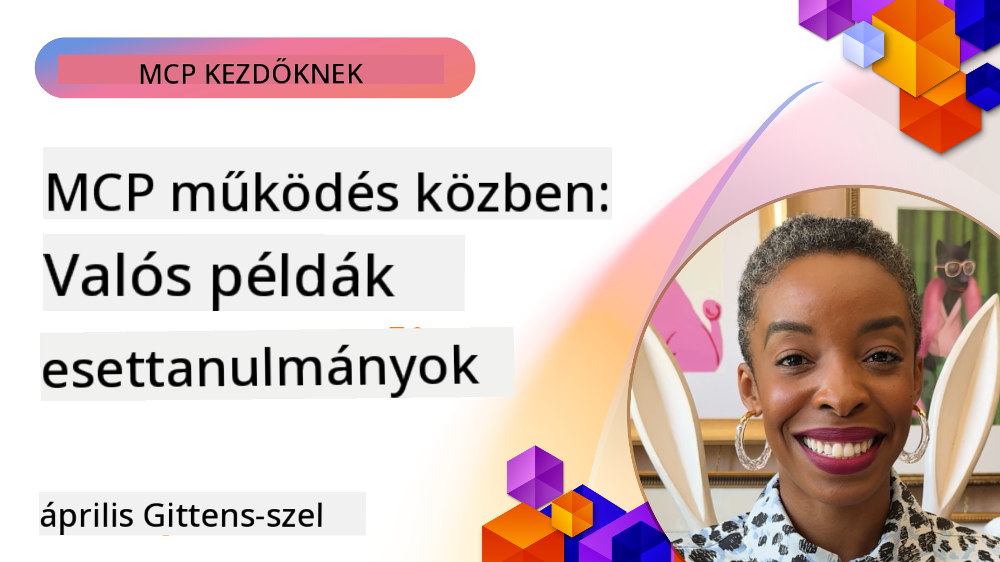

<!--
CO_OP_TRANSLATOR_METADATA:
{
  "original_hash": "1611dc5f6a2a35a789fc4c95fc5bfbe8",
  "translation_date": "2025-09-26T18:58:08+00:00",
  "source_file": "09-CaseStudy/README.md",
  "language_code": "hu"
}
-->
# MCP működés közben: Valós esettanulmányok

_(Kattints a fenti képre a leckéhez tartozó videó megtekintéséhez)_

A Model Context Protocol (MCP) átalakítja, hogyan lépnek kapcsolatba az AI alkalmazások az adatokkal, eszközökkel és szolgáltatásokkal. Ebben a részben valós esettanulmányokat mutatunk be, amelyek az MCP gyakorlati alkalmazását szemléltetik különböző vállalati helyzetekben.

## Áttekintés

Ez a rész konkrét példákat mutat be az MCP megvalósítására, kiemelve, hogyan használják a szervezetek ezt a protokollt összetett üzleti problémák megoldására. Az esettanulmányok elemzésével betekintést nyerhetsz az MCP sokoldalúságába, skálázhatóságába és gyakorlati előnyeibe valós helyzetekben.

## Fő tanulási célok

Az esettanulmányok megismerésével:

- Megérted, hogyan alkalmazható az MCP konkrét üzleti problémák megoldására
- Megtanulod a különböző integrációs mintákat és architekturális megközelítéseket
- Felismered az MCP megvalósításának legjobb gyakorlatait vállalati környezetben
- Betekintést nyersz a valós megvalósítások során felmerülő kihívásokba és megoldásokba
- Azonosítod azokat a lehetőségeket, amelyekkel hasonló mintákat alkalmazhatsz saját projektjeidben

## Kiemelt esettanulmányok

### 1. [Azure AI Utazási Ügynökök – Referencia Megvalósítás](./travelagentsample.md)

Ez az esettanulmány a Microsoft átfogó referencia megoldását vizsgálja, amely bemutatja, hogyan lehet MCP, Azure OpenAI és Azure AI Search segítségével több ügynököt használó, AI-alapú utazástervező alkalmazást építeni. A projekt bemutatja:

- Több ügynök koordinációját MCP segítségével
- Vállalati adatintegrációt az Azure AI Search használatával
- Biztonságos, skálázható architektúrát Azure szolgáltatásokkal
- Bővíthető eszközöket újrahasznosítható MCP komponensekkel
- Beszélgetés-alapú felhasználói élményt az Azure OpenAI által

Az architektúra és megvalósítás részletei értékes betekintést nyújtanak az összetett, több ügynököt használó rendszerek építésébe, ahol az MCP a koordinációs réteg.

### 2. [Azure DevOps elemek frissítése YouTube adatokból](./UpdateADOItemsFromYT.md)

Ez az esettanulmány az MCP gyakorlati alkalmazását mutatja be munkafolyamatok automatizálására. Bemutatja, hogyan használhatók az MCP eszközök:

- Adatok kinyerésére online platformokról (például YouTube)
- Munkafolyamat-elemek frissítésére Azure DevOps rendszerekben
- Ismételhető automatizálási munkafolyamatok létrehozására
- Adatok integrálására különböző rendszerek között

Ez a példa szemlélteti, hogy még viszonylag egyszerű MCP megvalósítások is jelentős hatékonyságnövekedést eredményezhetnek rutin feladatok automatizálásával és az adatok konzisztenciájának javításával.

### 3. [Valós idejű dokumentáció lekérése MCP-vel](./docs-mcp/README.md)

Ez az esettanulmány bemutatja, hogyan lehet egy Python konzol klienssel csatlakozni egy Model Context Protocol (MCP) szerverhez, hogy valós idejű, kontextusfüggő Microsoft dokumentációt kérjünk le és naplózzunk. Megtanulhatod, hogyan:

- Csatlakozz MCP szerverhez Python klienssel és az MCP hivatalos SDK-val
- Használj streaming HTTP klienseket hatékony, valós idejű adatlekéréshez
- Hívj dokumentációs eszközöket a szerveren, és naplózd a válaszokat közvetlenül a konzolba
- Integráld a legfrissebb Microsoft dokumentációt a munkafolyamatodba anélkül, hogy elhagynád a terminált

A fejezet tartalmaz egy gyakorlati feladatot, egy minimális működő kódmintát, és további tanulási forrásokhoz vezető linkeket. A teljes bemutató és kód a kapcsolódó fejezetben található, amely bemutatja, hogyan alakíthatja át az MCP a dokumentáció elérését és a fejlesztői produktivitást konzol-alapú környezetekben.

### 4. [Interaktív tanulási terv generáló webalkalmazás MCP-vel](./docs-mcp/README.md)

Ez az esettanulmány bemutatja, hogyan lehet interaktív webalkalmazást építeni Chainlit és Model Context Protocol (MCP) segítségével, amely személyre szabott tanulási terveket generál bármely témához. A felhasználók megadhatnak egy témát (például "AI-900 tanúsítvány") és egy tanulási időtartamot (például 8 hét), az alkalmazás pedig heti bontásban ajánlott tartalmat biztosít. A Chainlit lehetővé teszi egy beszélgetés-alapú chat interfész létrehozását, amely élvezetes és adaptív élményt nyújt.

- Beszélgetés-alapú webalkalmazás Chainlit segítségével
- Felhasználó által vezérelt kérdések a témáról és időtartamról
- Heti bontású tartalomajánlások MCP segítségével
- Valós idejű, adaptív válaszok chat interfészben

A projekt bemutatja, hogyan kombinálható a beszélgetés-alapú AI és az MCP dinamikus, felhasználó által vezérelt oktatási eszközök létrehozására modern webkörnyezetben.

### 5. [Dokumentáció a szerkesztőben MCP szerverrel VS Code-ban](./docs-mcp/README.md)

Ez az esettanulmány bemutatja, hogyan hozhatod el a Microsoft Learn dokumentációt közvetlenül a VS Code környezetedbe MCP szerver segítségével – többé nem kell váltogatni a böngészőlapok között! Megtudhatod, hogyan:

- Azonnal kereshetsz és olvashatsz dokumentációt a VS Code MCP paneljén vagy parancspalettáján keresztül
- Hivatkozhatsz dokumentációra, és illeszthetsz be linkeket közvetlenül README vagy kurzus markdown fájlokba
- Használhatod a GitHub Copilotot és MCP-t együtt zökkenőmentes, AI-alapú dokumentációs és kódmunkafolyamatokhoz
- Értékelheted és javíthatod dokumentációdat valós idejű visszajelzésekkel és Microsoft által biztosított pontossággal
- Integrálhatod az MCP-t GitHub munkafolyamatokkal folyamatos dokumentáció érvényesítéshez

A megvalósítás tartalmaz:

- Példa `.vscode/mcp.json` konfigurációt az egyszerű beállításhoz
- Képernyőképekkel illusztrált bemutatót a szerkesztőben történő használatról
- Tippeket a Copilot és MCP kombinálásához a maximális produktivitás érdekében

Ez a forgatókönyv ideális kurzus szerzőknek, dokumentáció íróknak és fejlesztőknek, akik szeretnének a szerkesztőjükben maradni, miközben dokumentációval, Copilot-tal és érvényesítő eszközökkel dolgoznak – mindezt MCP segítségével.

### 6. [APIM MCP szerver létrehozása](./apimsample.md)

Ez az esettanulmány lépésről lépésre bemutatja, hogyan hozhatsz létre MCP szervert az Azure API Management (APIM) segítségével. A következőket tartalmazza:

- MCP szerver beállítása az Azure API Management-ben
- API műveletek MCP eszközként való kitettsége
- Politikai konfigurációk beállítása sebességkorlátozásra és biztonságra
- MCP szerver tesztelése Visual Studio Code és GitHub Copilot segítségével

Ez a példa bemutatja, hogyan lehet az Azure képességeit kihasználni egy robusztus MCP szerver létrehozására, amely különböző alkalmazásokban használható, javítva az AI rendszerek integrációját vállalati API-kkal.

### 7. [GitHub MCP Registry — Az ügynöki integráció felgyorsítása](https://github.com/mcp)

Ez az esettanulmány bemutatja, hogyan oldja meg a GitHub MCP Registry, amelyet 2025 szeptemberében indítottak, az AI ökoszisztéma egyik kritikus problémáját: az MCP szerverek széttöredezett felfedezését és telepítését.

#### Áttekintés
Az **MCP Registry** megoldja az MCP szerverek szétszórtságából adódó problémát, amely korábban lassú és hibára hajlamos integrációt eredményezett. Ezek a szerverek lehetővé teszik az AI ügynökök számára, hogy külső rendszerekkel, például API-kkal, adatbázisokkal és dokumentációs forrásokkal lépjenek kapcsolatba.

#### Problémafelvetés
Az ügynöki munkafolyamatokat építő fejlesztők több kihívással szembesültek:
- **Gyenge felfedezhetőség** az MCP szerverek között különböző platformokon
- **Redundáns beállítási kérdések** szétszórva fórumokon és dokumentációkban
- **Biztonsági kockázatok** nem ellenőrzött és megbízhatatlan forrásokból
- **Standardizálás hiánya** a szerverek minőségében és kompatibilitásában

#### Megoldás architektúrája
A GitHub MCP Registry központosítja a megbízható MCP szervereket kulcsfontosságú funkciókkal:
- **Egy kattintásos telepítés** integráció VS Code-ban az egyszerű beállításhoz
- **Jel-zaj arány szerinti rendezés** csillagok, aktivitás és közösségi validáció alapján
- **Közvetlen integráció** GitHub Copilot-tal és más MCP-kompatibilis eszközökkel
- **Nyílt hozzájárulási modell** lehetővé téve közösségi és vállalati partnerek számára a hozzájárulást

#### Üzleti hatás
A regisztráció mérhető javulásokat hozott:
- **Gyorsabb bevezetés** a fejlesztők számára olyan eszközök használatával, mint a Microsoft Learn MCP Server, amely hivatalos dokumentációt streamel közvetlenül az ügynökökbe
- **Növelt produktivitás** speciális szerverekkel, mint például `github-mcp-server`, amely természetes nyelvű GitHub automatizációt tesz lehetővé (PR létrehozás, CI újrafuttatás, kódellenőrzés)
- **Erősebb ökoszisztéma bizalom** kurált listák és átlátható konfigurációs szabványok révén

#### Stratégiai érték
Az ügynök életciklus menedzsmentre és reprodukálható munkafolyamatokra specializálódott szakemberek számára az MCP Registry biztosítja:
- **Moduláris ügynök telepítési** képességeket standardizált komponensekkel
- **Regisztráció által támogatott értékelési folyamatokat** konzisztens teszteléshez és validációhoz
- **Eszközök közötti interoperabilitást** zökkenőmentes integrációt lehetővé téve különböző AI platformok között

Ez az esettanulmány bemutatja, hogy az MCP Registry nem csupán egy könyvtár, hanem egy alapvető platform a skálázható, valós modellek integrációjához és ügynöki rendszerek telepítéséhez.

## Összegzés

Ez a hét átfogó esettanulmány bemutatja a Model Context Protocol figyelemre méltó sokoldalúságát és gyakorlati alkalmazásait különböző valós helyzetekben. Az összetett, több ügynököt használó utazástervező rendszerektől és vállalati API menedzsmenttől kezdve a dokumentációs munkafolyamatok egyszerűsítéséig és a forradalmi GitHub MCP Registry-ig ezek a példák megmutatják, hogyan biztosít az MCP egy szabványosított, skálázható módot az AI rendszerek összekapcsolására az eszközökkel, adatokkal és szolgáltatásokkal, amelyekre szükségük van a kivételes érték nyújtásához.

Az esettanulmányok több dimenzióját ölelik fel az MCP megvalósításának:
- **Vállalati integráció**: Azure API Management és Azure DevOps automatizáció
- **Több ügynök koordinációja**: Utazástervezés koordinált AI ügynökökkel
- **Fejlesztői produktivitás**: VS Code integráció és valós idejű dokumentáció elérés
- **Ökoszisztéma fejlesztés**: GitHub MCP Registry mint alapvető platform
- **Oktatási alkalmazások**: Interaktív tanulási terv generátorok és beszélgetés-alapú interfészek

Ezeknek a megvalósításoknak a tanulmányozásával kritikus betekintést nyerhetsz:
- **Architekturális mintákba** különböző méretekhez és felhasználási esetekhez
- **Megvalósítási stratégiákba**, amelyek egyensúlyban tartják a funkcionalitást és a fenntarthatóságot
- **Biztonsági és skálázhatósági** szempontokba a termelési telepítésekhez
- **Legjobb gyakorlatokba** MCP szerver fejlesztéshez és kliens integrációhoz
- **Ökoszisztéma gondolkodásba** az összekapcsolt AI-alapú megoldások építéséhez

Ezek a példák együttesen bizonyítják, hogy az MCP nem csupán elméleti keretrendszer, hanem egy érett, termelésre kész protokoll, amely gyakorlati megoldásokat kínál összetett üzleti kihívásokra. Akár egyszerű automatizációs eszközöket, akár kifinomult több ügynököt használó rendszereket építesz, az itt bemutatott minták és megközelítések szilárd alapot nyújtanak saját MCP projektjeidhez.

## További források

- [Azure AI Utazási Ügynökök GitHub Repository](https://github.com/Azure-Samples/azure-ai-travel-agents)
- [Azure DevOps MCP Tool](https://github.com/microsoft/azure-devops-mcp)
- [Playwright MCP Tool](https://github.com/microsoft/playwright-mcp)
- [Microsoft Docs MCP Server](https://github.com/MicrosoftDocs/mcp)
- [GitHub MCP Registry — Az ügynöki integráció felgyorsítása](https://github.com/mcp)
- [MCP Közösségi Példák](https://github.com/microsoft/mcp)

Következő: Gyakorlati labor [AI munkafolyamatok egyszerűsítése: MCP szerver építése AI Toolkit segítségével](../10-StreamliningAIWorkflowsBuildingAnMCPServerWithAIToolkit/README.md)

---

