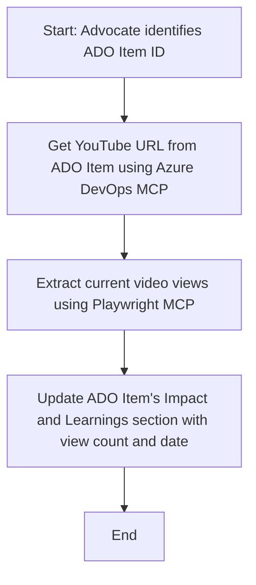

<!--
CO_OP_TRANSLATOR_METADATA:
{
  "original_hash": "14a2dfbea55ef735660a06bd6bdfe5f3",
  "translation_date": "2025-07-14T06:14:50+00:00",
  "source_file": "09-CaseStudy/UpdateADOItemsFromYT.md",
  "language_code": "hu"
}
-->
# Esettanulmány: Azure DevOps elemek frissítése YouTube adatokkal MCP segítségével

> **Disclaimer:** Már léteznek online eszközök és jelentések, amelyek automatizálni tudják az Azure DevOps elemek frissítését olyan platformokról származó adatokkal, mint a YouTube. Az alábbi példa csupán egy illusztráció arra, hogyan alkalmazhatók az MCP eszközök automatizálási és integrációs feladatokra.

## Áttekintés

Ez az esettanulmány bemutatja, hogyan használható a Model Context Protocol (MCP) és eszközei az Azure DevOps (ADO) munkafolyamatok automatizált frissítésére online platformokról, például a YouTube-ról származó információk alapján. A leírt példa csak egy a sokféle lehetőség közül, amelyeket ezek az eszközök kínálnak, és könnyen adaptálhatók hasonló automatizálási igényekhez.

Ebben a példában egy Advocate követi nyomon az online eseményeket ADO elemek segítségével, ahol minden elem tartalmaz egy YouTube videó URL-t. Az MCP eszközök használatával az Advocate automatikusan és ismételhető módon frissítheti az ADO elemeket a legfrissebb videó statisztikákkal, például a megtekintésszámmal. Ez a megközelítés más esetekre is alkalmazható, amikor online forrásból származó adatokat kell integrálni az ADO-ba vagy más rendszerekbe.

## Forgatókönyv

Egy Advocate felelős az online események és közösségi aktivitások hatásának nyomon követéséért. Minden eseményt egy ADO munkafolyamat elemként rögzítenek a 'DevRel' projektben, és az elem tartalmaz egy mezőt a YouTube videó URL-jével. Az esemény elérésének pontos jelentéséhez az Advocate-nek frissítenie kell az ADO elemet a videó aktuális megtekintésszámával és az adatok lekérésének dátumával.

## Használt eszközök

- [Azure DevOps MCP](https://github.com/microsoft/azure-devops-mcp): Lehetővé teszi az ADO munkafolyamat elemek programozott elérését és frissítését MCP-n keresztül.
- [Playwright MCP](https://github.com/microsoft/playwright-mcp): Böngészőműveletek automatizálására szolgál, élő adatok kinyeréséhez weboldalakról, például YouTube videó statisztikák.

## Lépésről lépésre munkafolyamat

1. **ADO elem azonosítása**: Kezdjük az ADO munkafolyamat elem azonosítójával (pl. 1234) a 'DevRel' projektben.
2. **YouTube URL lekérése**: Az Azure DevOps MCP eszközzel lekérjük a YouTube URL-t az adott elemből.
3. **Videó megtekintések kinyerése**: A Playwright MCP eszközzel megnyitjuk a YouTube URL-t, és kinyerjük az aktuális megtekintésszámot.
4. **ADO elem frissítése**: Az Azure DevOps MCP eszközzel beírjuk a legfrissebb megtekintésszámot és a lekérés dátumát az ADO elem 'Impact and Learnings' szekciójába.

## Példa prompt

```bash
- Work with the ADO Item ID: 1234
- The project is '2025-Awesome'
- Get the YouTube URL for the ADO item
- Use Playwright to get the current views from the YouTube video
- Update the ADO item with the current video views and the updated date of the information
```

## Mermaid folyamattérkép



## Technikai megvalósítás

- **MCP koordináció**: A munkafolyamatot egy MCP szerver irányítja, amely összehangolja az Azure DevOps MCP és a Playwright MCP eszközök használatát.
- **Automatizálás**: A folyamat kézzel indítható vagy ütemezhető, hogy rendszeresen frissítse az ADO elemeket.
- **Bővíthetőség**: Ugyanez a minta alkalmazható más online metrikák (pl. lájkok, hozzászólások) vagy más platformok adatai alapján történő ADO elem frissítésre.

## Eredmények és hatás

- **Hatékonyság**: Csökkenti az Advocate-ek manuális munkáját azáltal, hogy automatizálja a videó statisztikák lekérését és frissítését.
- **Pontosság**: Biztosítja, hogy az ADO elemek mindig a legfrissebb online adatokkal legyenek naprakészek.
- **Ismételhetőség**: Újrahasznosítható munkafolyamatot kínál hasonló esetekhez, más adatforrások vagy metrikák esetén is.

## Hivatkozások

- [Azure DevOps MCP](https://github.com/microsoft/azure-devops-mcp)
- [Playwright MCP](https://github.com/microsoft/playwright-mcp)
- [Model Context Protocol (MCP)](https://modelcontextprotocol.io/)

**Jogi nyilatkozat**:  
Ez a dokumentum az AI fordító szolgáltatás, a [Co-op Translator](https://github.com/Azure/co-op-translator) segítségével készült. Bár a pontosságra törekszünk, kérjük, vegye figyelembe, hogy az automatikus fordítások hibákat vagy pontatlanságokat tartalmazhatnak. Az eredeti dokumentum az anyanyelvén tekintendő hiteles forrásnak. Kritikus információk esetén professzionális emberi fordítást javaslunk. Nem vállalunk felelősséget a fordítás használatából eredő félreértésekért vagy téves értelmezésekért.