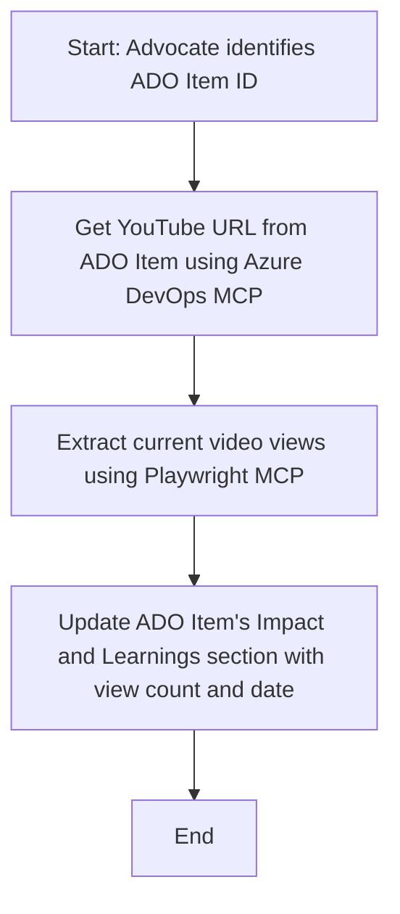

<!--
CO_OP_TRANSLATOR_METADATA:
{
  "original_hash": "14a2dfbea55ef735660a06bd6bdfe5f3",
  "translation_date": "2025-06-13T21:38:02+00:00",
  "source_file": "09-CaseStudy/UpdateADOItemsFromYT.md",
  "language_code": "hu"
}
-->
# Esettanulmány: Azure DevOps elemek frissítése YouTube adatokkal MCP segítségével

> **Disclaimer:** Már léteznek online eszközök és jelentések, amelyek automatizálják az Azure DevOps elemek frissítését olyan platformokról származó adatokkal, mint a YouTube. Az alábbi példa csupán egy bemutató, hogy miként lehet az MCP eszközöket automatizálási és integrációs feladatokra használni.

## Áttekintés

Ez az esettanulmány bemutat egy példát arra, hogyan használható a Model Context Protocol (MCP) és annak eszközei az Azure DevOps (ADO) munkatárgyak automatikus frissítésére online platformokról, például a YouTube-ról származó információk alapján. A leírt forgatókönyv csak egy illusztrációja az eszközök széles körű képességeinek, amelyeket sok hasonló automatizálási igényhez lehet igazítani.

Ebben a példában egy Advocate követi nyomon az online eseményeket ADO elemek segítségével, ahol minden elem tartalmaz egy YouTube videó URL-t. Az MCP eszközök kihasználásával az Advocate ismételhető és automatizált módon tarthatja naprakészen az ADO elemeket a legfrissebb videó statisztikákkal, például megtekintésszámmal. Ez a megközelítés általánosítható más esetekre is, amikor online forrásokból származó információkat kell integrálni ADO-ba vagy más rendszerekbe.

## Forgatókönyv

Egy Advocate felelős az online események és közösségi részvételek hatásának nyomon követéséért. Minden eseményt egy ADO munkatárgyként rögzítenek a 'DevRel' projektben, és a munkatárgy tartalmaz egy mezőt a YouTube videó URL-jével. Az esemény elérésének pontos jelentéséhez az Advocate-nek frissítenie kell az ADO elemet a videó aktuális megtekintésszámával és az adat lekérésének dátumával.

## Használt eszközök

- [Azure DevOps MCP](https://github.com/microsoft/azure-devops-mcp): Lehetővé teszi az ADO munkatárgyak programozott elérését és frissítését MCP-n keresztül.
- [Playwright MCP](https://github.com/microsoft/playwright-mcp): Automatikusan végrehajt böngészőműveleteket, hogy élő adatokat nyerjen weboldalakról, például YouTube videó statisztikákat.

## Lépésről lépésre munkafolyamat

1. **ADO elem azonosítása**: Kezdd az ADO munkatárgy ID-jával (pl. 1234) a 'DevRel' projektben.
2. **YouTube URL lekérése**: Használd az Azure DevOps MCP eszközt, hogy megszerezd a YouTube URL-t az adott munkatárgyból.
3. **Videómegtekintések kinyerése**: A Playwright MCP eszközzel navigálj a YouTube URL-re, és nyerd ki az aktuális megtekintésszámot.
4. **ADO elem frissítése**: Írd be a legfrissebb megtekintésszámot és a lekérés dátumát az ADO munkatárgy 'Impact and Learnings' szekciójába az Azure DevOps MCP eszköz segítségével.

## Példa prompt

```bash
- Work with the ADO Item ID: 1234
- The project is '2025-Awesome'
- Get the YouTube URL for the ADO item
- Use Playwright to get the current views from the YouTube video
- Update the ADO item with the current video views and the updated date of the information
```

## Mermaid folyamattérkép



## Technikai megvalósítás

- **MCP koordináció**: A munkafolyamatot egy MCP szerver irányítja, amely összehangolja az Azure DevOps MCP és a Playwright MCP eszközök használatát.
- **Automatizálás**: A folyamat kézzel indítható vagy időzítve futtatható, hogy az ADO elemek mindig naprakészek legyenek.
- **Bővíthetőség**: Ugyanez a minta kiterjeszthető más online mutatók (pl. like-ok, hozzászólások) vagy más platformok adatai alapján történő ADO frissítésekre is.

## Eredmények és hatás

- **Hatékonyság**: Csökkenti az Advocate-ek manuális munkáját azáltal, hogy automatizálja a videó statisztikák lekérését és frissítését.
- **Pontosság**: Biztosítja, hogy az ADO elemek a legfrissebb online adatokat tükrözzék.
- **Ismételhetőség**: Újrahasznosítható munkafolyamatot nyújt hasonló helyzetekhez, ahol más adatforrásokat vagy mutatókat kell kezelni.

## Hivatkozások

- [Azure DevOps MCP](https://github.com/microsoft/azure-devops-mcp)
- [Playwright MCP](https://github.com/microsoft/playwright-mcp)
- [Model Context Protocol (MCP)](https://modelcontextprotocol.io/)

**Nyilatkozat:**  
Ez a dokumentum az AI fordító szolgáltatás, a [Co-op Translator](https://github.com/Azure/co-op-translator) segítségével készült. Bár az pontosságra törekszünk, kérjük, vegye figyelembe, hogy az automatikus fordítások hibákat vagy pontatlanságokat tartalmazhatnak. Az eredeti dokumentum az anyanyelvén tekintendő hiteles forrásnak. Kritikus információk esetén szakmai, emberi fordítást javaslunk. Nem vállalunk felelősséget a fordítás használatából eredő félreértésekért vagy téves értelmezésekért.