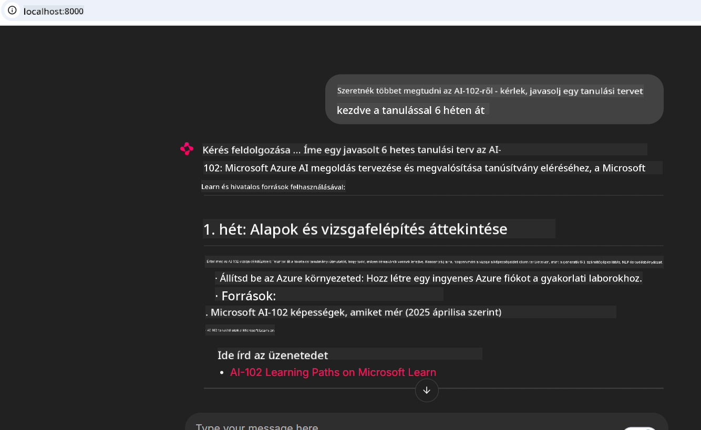
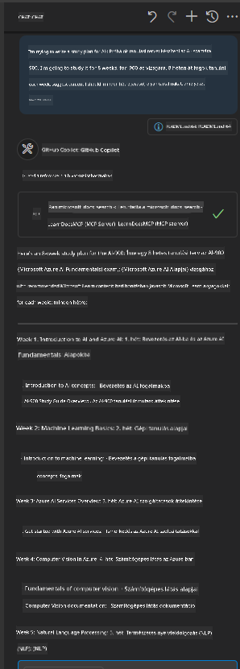

<!--
CO_OP_TRANSLATOR_METADATA:
{
  "original_hash": "4319d291c9d124ecafea52b3d04bfa0e",
  "translation_date": "2025-07-14T06:28:20+00:00",
  "source_file": "09-CaseStudy/docs-mcp/README.md",
  "language_code": "hu"
}
-->
# Esettanulmány: Kapcsolódás a Microsoft Learn Docs MCP szerverhez kliensből

Előfordult már, hogy egyszerre kellett váltogatnod dokumentációs oldalak, a Stack Overflow és végtelen keresőfülek között, miközben egy kódproblémát próbáltál megoldani? Talán van egy második monitorod csak a dokumentációk számára, vagy folyamatosan alt-tabolsz az IDE-d és a böngésző között. Nem lenne jobb, ha a dokumentáció közvetlenül a munkafolyamatod része lenne—integrálva az alkalmazásaidba, az IDE-dbe vagy akár a saját egyedi eszközeidbe? Ebben az esettanulmányban megmutatjuk, hogyan lehet pontosan ezt megvalósítani azzal, hogy közvetlenül a Microsoft Learn Docs MCP szerverhez kapcsolódsz a saját kliensalkalmazásodból.

## Áttekintés

A modern fejlesztés nem csupán kódírásról szól—hanem arról, hogy a megfelelő információt a megfelelő időben megtaláld. A dokumentáció mindenhol ott van, de ritkán ott, ahol a leginkább szükséged van rá: az eszközeidben és a munkafolyamataidban. Ha a dokumentáció lekérését közvetlenül az alkalmazásaidba integrálod, időt takaríthatsz meg, csökkentheted a kontextusváltást, és növelheted a hatékonyságot. Ebben a részben megmutatjuk, hogyan kapcsolódj egy klienssel a Microsoft Learn Docs MCP szerverhez, hogy valós idejű, kontextusérzékeny dokumentációhoz férj hozzá anélkül, hogy elhagynád az alkalmazásodat.

Végigvezetünk a kapcsolat létrehozásának folyamatán, a kérés elküldésén és a streaming válaszok hatékony kezelésén. Ez a megközelítés nemcsak egyszerűsíti a munkafolyamatot, hanem megnyitja az utat okosabb, hasznosabb fejlesztői eszközök építése felé.

## Tanulási célok

Miért csináljuk ezt? Mert a legjobb fejlesztői élmények azok, amelyek eltávolítják az akadályokat. Képzelj el egy világot, ahol a kódszerkesztőd, chatbotod vagy webalkalmazásod azonnal válaszol a dokumentációs kérdéseidre, a Microsoft Learn legfrissebb tartalmait használva. A fejezet végére tudni fogod, hogyan:

- Értsd meg az MCP szerver-kliens kommunikáció alapjait a dokumentációhoz
- Valósíts meg konzol vagy webalkalmazást a Microsoft Learn Docs MCP szerverhez való kapcsolódáshoz
- Használj streaming HTTP klienset valós idejű dokumentáció lekéréshez
- Naplózd és értelmezd a dokumentációs válaszokat az alkalmazásodban

Megmutatjuk, hogyan segíthetnek ezek a képességek olyan eszközök építésében, amelyek nem csak reagálnak, hanem valóban interaktívak és kontextusérzékenyek.

## 1. Forgatókönyv – Valós idejű dokumentáció lekérése MCP-vel

Ebben a forgatókönyvben megmutatjuk, hogyan kapcsolódj egy klienssel a Microsoft Learn Docs MCP szerverhez, hogy valós idejű, kontextusérzékeny dokumentációhoz férj hozzá anélkül, hogy elhagynád az alkalmazásodat.

Gyakorlatba ültetjük ezt. A feladatod egy olyan alkalmazás írása, amely kapcsolódik a Microsoft Learn Docs MCP szerverhez, meghívja a `microsoft_docs_search` eszközt, és a streaming választ naplózza a konzolra.

### Miért ez a megközelítés?
Mert ez az alapja a fejlettebb integrációknak—legyen szó chatbotról, IDE bővítményről vagy webes irányítópultról.

A kódot és az utasításokat ehhez a forgatókönyvhöz a [`solution`](./solution/README.md) mappában találod ebben az esettanulmányban. A lépések végigvezetnek a kapcsolat beállításán:
- Használd az hivatalos MCP SDK-t és a streamelhető HTTP klienst a kapcsolódáshoz
- Hívd meg a `microsoft_docs_search` eszközt egy lekérdezési paraméterrel a dokumentáció lekéréséhez
- Valósíts meg megfelelő naplózást és hibakezelést
- Készíts interaktív konzol felületet, hogy a felhasználók több keresési lekérdezést is beírhassanak

Ez a forgatókönyv bemutatja, hogyan:
- Kapcsolódj a Docs MCP szerverhez
- Küldj lekérdezést
- Elemezd és írd ki az eredményeket

Így nézhet ki a megoldás futtatása:

```
Prompt> What is Azure Key Vault?
Answer> Azure Key Vault is a cloud service for securely storing and accessing secrets. ...
```

Alább egy minimális mintamegoldás látható. A teljes kód és részletek a solution mappában érhetők el.

<details>
<summary>Python</summary>

```python
import asyncio
from mcp.client.streamable_http import streamablehttp_client
from mcp import ClientSession

async def main():
    async with streamablehttp_client("https://learn.microsoft.com/api/mcp") as (read_stream, write_stream, _):
        async with ClientSession(read_stream, write_stream) as session:
            await session.initialize()
            result = await session.call_tool("microsoft_docs_search", {"query": "Azure Functions best practices"})
            print(result.content)

if __name__ == "__main__":
    asyncio.run(main())
```

- A teljes megvalósításhoz és naplózáshoz lásd a [`scenario1.py`](../../../../09-CaseStudy/docs-mcp/solution/python/scenario1.py) fájlt.
- A telepítési és használati útmutató a [`README.md`](./solution/python/README.md) fájlban található ugyanabban a mappában.
</details>

## 2. Forgatókönyv – Interaktív tanulási terv generáló webalkalmazás MCP-vel

Ebben a forgatókönyvben megtanulod, hogyan integráld a Docs MCP-t egy webfejlesztési projektbe. A cél, hogy a felhasználók közvetlenül a webes felületről kereshessenek a Microsoft Learn dokumentációban, így az azonnal elérhetővé válik az alkalmazásodban vagy weboldaladon.

Megmutatjuk, hogyan:
- Állíts be egy webalkalmazást
- Kapcsolódj a Docs MCP szerverhez
- Kezeld a felhasználói bemenetet és jelenítsd meg az eredményeket

Így nézhet ki a megoldás futtatása:

```
User> I want to learn about AI102 - so suggest the roadmap to get it started from learn for 6 weeks

Assistant> Here’s a detailed 6-week roadmap to start your preparation for the AI-102: Designing and Implementing a Microsoft Azure AI Solution certification, using official Microsoft resources and focusing on exam skills areas:

---
## Week 1: Introduction & Fundamentals
- **Understand the Exam**: Review the [AI-102 exam skills outline](https://learn.microsoft.com/en-us/credentials/certifications/exams/ai-102/).
- **Set up Azure**: Sign up for a free Azure account if you don't have one.
- **Learning Path**: [Introduction to Azure AI services](https://learn.microsoft.com/en-us/training/modules/intro-to-azure-ai/)
- **Focus**: Get familiar with Azure portal, AI capabilities, and necessary tools.

....more weeks of the roadmap...

Let me know if you want module-specific recommendations or need more customized weekly tasks!
```

Alább egy minimális mintamegoldás látható. A teljes kód és részletek a solution mappában érhetők el.



<details>
<summary>Python (Chainlit)</summary>

A Chainlit egy keretrendszer beszélgetés-alapú AI webalkalmazások építéséhez. Megkönnyíti interaktív chatbotok és asszisztensek létrehozását, amelyek képesek MCP eszközöket hívni és valós időben megjeleníteni az eredményeket. Ideális gyors prototípus készítéshez és felhasználóbarát felületekhez.

```python
import chainlit as cl
import requests

MCP_URL = "https://learn.microsoft.com/api/mcp"

@cl.on_message
def handle_message(message):
    query = {"question": message}
    response = requests.post(MCP_URL, json=query)
    if response.ok:
        result = response.json()
        cl.Message(content=result.get("answer", "No answer found.")).send()
    else:
        cl.Message(content="Error: " + response.text).send()
```

- A teljes megvalósításhoz lásd a [`scenario2.py`](../../../../09-CaseStudy/docs-mcp/solution/python/scenario2.py) fájlt.
- A beállítási és futtatási útmutató a [`README.md`](./solution/python/README.md) fájlban található.
</details>

## 3. Forgatókönyv: Beépített dokumentáció MCP szerverrel VS Code-ban

Ha szeretnéd a Microsoft Learn Docs-ot közvetlenül a VS Code-ban elérni (a böngészőfülek közti váltás helyett), használhatod az MCP szervert az editorodban. Ez lehetővé teszi, hogy:
- Keresd és olvasd a dokumentációt a VS Code-ban anélkül, hogy elhagynád a fejlesztői környezetet.
- Hivatkozz dokumentációra és illessz be linkeket közvetlenül a README vagy tananyag fájljaidba.
- Használd együtt a GitHub Copilotot és az MCP-t egy zökkenőmentes, AI-alapú dokumentációs munkafolyamathoz.

**Megmutatjuk, hogyan:**
- Adj hozzá egy érvényes `.vscode/mcp.json` fájlt a munkaterületed gyökeréhez (lásd az alábbi példát).
- Nyisd meg az MCP panelt vagy használd a parancspalettát a VS Code-ban a dokumentáció kereséséhez és beszúrásához.
- Hivatkozz dokumentációra közvetlenül a markdown fájljaidban munka közben.
- Kombináld ezt a munkafolyamatot a GitHub Copilottal a még nagyobb hatékonyságért.

Íme egy példa az MCP szerver beállítására VS Code-ban:

```json
{
  "servers": {
    "LearnDocsMCP": {
      "url": "https://learn.microsoft.com/api/mcp"
    }
  }
}
```

</details>

> Részletes lépésről lépésre útmutató képernyőképekkel a [`README.md`](./solution/scenario3/README.md) fájlban található.



Ez a megközelítés ideális mindazoknak, akik technikai tanfolyamokat készítenek, dokumentációt írnak vagy olyan kódot fejlesztenek, amely gyakori hivatkozásokat igényel.

## Főbb tanulságok

A dokumentáció közvetlen integrálása az eszközeidbe nem csupán kényelmi funkció—ez egy igazi áttörés a termelékenységben. Ha a Microsoft Learn Docs MCP szerverhez kapcsolódsz a kliensedből, akkor:

- Megszünteted a kontextusváltást a kód és a dokumentáció között
- Valós időben, naprakész és kontextusérzékeny dokumentációt kérhetsz le
- Okosabb, interaktívabb fejlesztői eszközöket építhetsz

Ezek a képességek segítenek olyan megoldásokat létrehozni, amelyek nemcsak hatékonyak, hanem élvezetesek is a használat során.

## További források

A mélyebb megértés érdekében böngészd át ezeket a hivatalos forrásokat:

- [Microsoft Learn Docs MCP Server (GitHub)](https://github.com/MicrosoftDocs/mcp)
- [Azure MCP Server használatának megkezdése (mcp-python)](https://learn.microsoft.com/en-us/azure/developer/azure-mcp-server/get-started#create-the-python-app)
- [Mi az Azure MCP Server?](https://learn.microsoft.com/en-us/azure/developer/azure-mcp-server/)
- [Model Context Protocol (MCP) bevezető](https://modelcontextprotocol.io/introduction)
- [Pluginok hozzáadása MCP szerverről (Python)](https://learn.microsoft.com/en-us/semantic-kernel/concepts/plugins/adding-mcp-plugins)

**Jogi nyilatkozat**:  
Ez a dokumentum az AI fordító szolgáltatás, a [Co-op Translator](https://github.com/Azure/co-op-translator) segítségével készült. Bár a pontosságra törekszünk, kérjük, vegye figyelembe, hogy az automatikus fordítások hibákat vagy pontatlanságokat tartalmazhatnak. Az eredeti dokumentum az anyanyelvén tekintendő hiteles forrásnak. Kritikus információk esetén professzionális emberi fordítást javaslunk. Nem vállalunk felelősséget a fordítás használatából eredő félreértésekért vagy téves értelmezésekért.