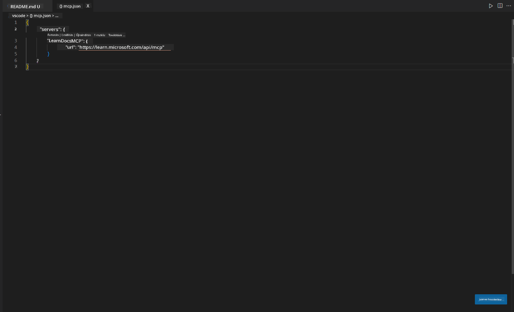
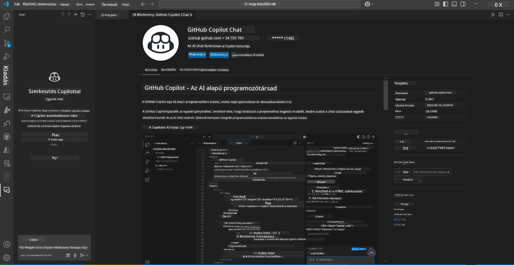
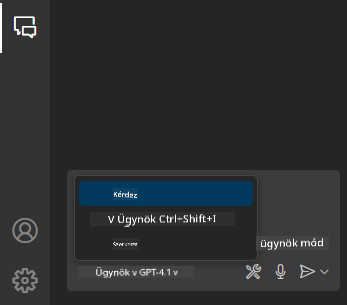
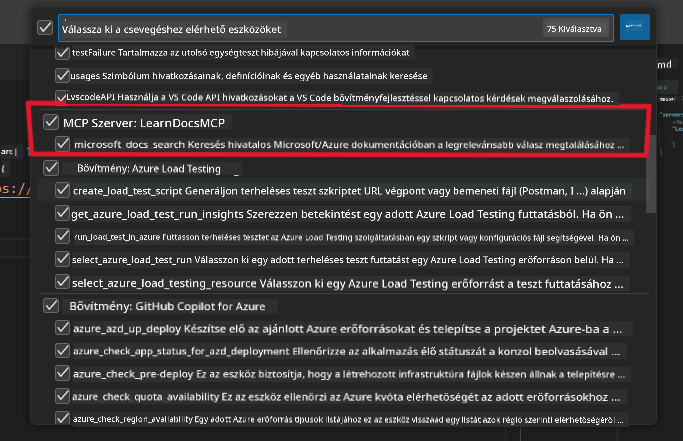
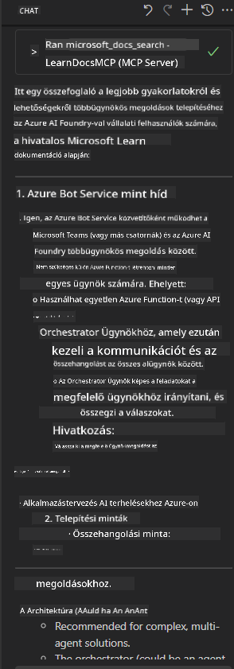

<!--
CO_OP_TRANSLATOR_METADATA:
{
  "original_hash": "db532b1ec386c9ce38c791653dc3c881",
  "translation_date": "2025-06-21T14:43:02+00:00",
  "source_file": "09-CaseStudy/docs-mcp/solution/scenario3/README.md",
  "language_code": "hu"
}
-->
# 3. Forgatókönyv: Szerkesztőn belüli dokumentáció MCP szerverrel VS Code-ban

## Áttekintés

Ebben a forgatókönyvben megtanulod, hogyan hozhatod be a Microsoft Learn dokumentációt közvetlenül a Visual Studio Code környezetedbe az MCP szerver segítségével. Ahelyett, hogy folyamatosan böngészőfüleket váltogatnál a dokumentáció keresése miatt, közvetlenül a szerkesztődben érheted el, keresheted és hivatkozhatsz a hivatalos dokumentumokra. Ez a megközelítés egyszerűsíti a munkafolyamatot, segít fókuszált maradni, és zökkenőmentes integrációt tesz lehetővé olyan eszközökkel, mint a GitHub Copilot.

- Keresd és olvasd a dokumentációt a VS Code-ban anélkül, hogy elhagynád a kódolási környezetet.
- Hivatkozz dokumentációra és illessz be linkeket közvetlenül a README vagy tananyagaid fájljaiba.
- Használd együtt a GitHub Copilotot és az MCP-t egy zökkenőmentes, mesterséges intelligencia által támogatott dokumentációs munkafolyamathoz.

## Tanulási célok

A fejezet végére érteni fogod, hogyan állítsd be és használd az MCP szervert a VS Code-ban a dokumentáció és fejlesztési munkafolyamatod fejlesztésére. Képes leszel:

- Beállítani a munkaterületedet az MCP szerver használatára dokumentáció kereséséhez.
- Közvetlenül a VS Code-ból keresni és beszúrni dokumentációt.
- Egyesíteni a GitHub Copilot és az MCP erejét egy hatékonyabb, mesterséges intelligenciával támogatott munkafolyamatért.

Ezek a képességek segítenek fókuszált maradni, javítani a dokumentáció minőségét, és növelni a termelékenységedet fejlesztőként vagy műszaki íróként.

## Megoldás

A szerkesztőn belüli dokumentáció eléréséhez kövesd azokat a lépéseket, amelyek integrálják az MCP szervert a VS Code-dal és a GitHub Copilottal. Ez a megoldás ideális tananyag szerzőknek, dokumentáció íróknak és fejlesztőknek, akik szeretnék a fókuszukat a szerkesztőben tartani miközben dokumentációval és Copilottal dolgoznak.

- Gyorsan adj hozzá hivatkozásokat egy README fájlhoz tananyag vagy projekt dokumentáció írása közben.
- Használd a Copilotot kód generálására és az MCP-t releváns dokumentumok azonnali megtalálására és idézésére.
- Maradj fókuszált a szerkesztődben és növeld a termelékenységed.

### Lépésről lépésre útmutató

A kezdéshez kövesd az alábbi lépéseket. Minden lépéshez hozzáadhatsz egy képernyőképet az assets mappából a folyamat vizuális bemutatásához.

1. **Add hozzá az MCP konfigurációt:**
   A projekt gyökerében hozz létre egy `.vscode/mcp.json` fájlt, és illeszd be a következő konfigurációt:
   ```json
   {
     "servers": {
       "LearnDocsMCP": {
         "url": "https://learn.microsoft.com/api/mcp"
       }
     }
   }
   ```
   Ez a konfiguráció megmondja a VS Code-nak, hogyan kapcsolódjon a [`Microsoft Learn Docs MCP szerverhez`](https://github.com/MicrosoftDocs/mcp).
   
   
    
2. **Nyisd meg a GitHub Copilot Chat panelt:**
   Ha még nincs telepítve a GitHub Copilot kiterjesztésed, menj a VS Code Extensions nézetébe, és telepítsd. Közvetlenül letöltheted a [Visual Studio Code Marketplace-ről](https://marketplace.visualstudio.com/items?itemName=GitHub.copilot-chat). Ezután nyisd meg a Copilot Chat panelt az oldalsávon.

   

3. **Kapcsold be az agent módot és ellenőrizd az eszközöket:**
   A Copilot Chat panelen kapcsold be az agent módot.

   

   Az agent mód bekapcsolása után ellenőrizd, hogy az MCP szerver szerepel-e az elérhető eszközök között. Ez biztosítja, hogy a Copilot agent hozzáférjen a dokumentációs szerverhez a releváns információk lekéréséhez.
   
   

4. **Indíts új csevegést és kérdezd az agentet:**
   Nyiss egy új csevegést a Copilot Chat panelen. Most már kérdezheted az agentet dokumentációs kérdésekkel. Az agent az MCP szervert használja, hogy közvetlenül a szerkesztődben megjelenítse a releváns Microsoft Learn dokumentációt.

   - *„Tanulmányi tervet szeretnék írni az X témához. 8 hétig fogom tanulni, minden hétre javasolj tartalmat.”*

   

5. **Élő lekérdezés:**

   > Vegyünk egy élő példát az Azure AI Foundry Discord [#get-help](https://discord.gg/D6cRhjHWSC) szekciójából ([eredeti üzenet megtekintése](https://discord.com/channels/1113626258182504448/1385498306720829572)):
   
   *„Válaszokat keresek arra, hogyan lehet többagentős megoldást telepíteni az Azure AI Foundry-n fejlesztett AI ügynökökkel. Látom, hogy nincs közvetlen telepítési módszer, mint például a Copilot Studio csatornák. Milyen különböző módokon lehet ezt megvalósítani vállalati felhasználók számára, hogy interakcióba lépjenek és elvégezzék a munkát? Számos cikk/blog azt állítja, hogy használhatjuk az Azure Bot szolgáltatást, amely hidat képezhet a MS Teams és az Azure AI Foundry ügynökei között. Vajon működni fog, ha beállítok egy Azure botot, amely az Azure functionön keresztül kapcsolódik az Orchestrator Agenthez az Azure AI Foundry-ban az összehangolás érdekében, vagy minden AI ügynökhöz külön Azure function-t kell létrehoznom a Bot Framework-ben történő összehangoláshoz? Egyéb javaslatokat is szívesen fogadok.”*

   

   Az agent releváns dokumentációs linkekkel és összefoglalókkal válaszol, amelyeket közvetlenül beilleszthetsz markdown fájljaidba vagy hivatkozásként használhatsz a kódodban.

### Minta lekérdezések

Íme néhány példa kérdés, amelyeket kipróbálhatsz. Ezek a lekérdezések bemutatják, hogyan működhet együtt az MCP szerver és a Copilot azonnali, kontextusfüggő dokumentáció és hivatkozások biztosítására anélkül, hogy elhagynád a VS Code-ot:

- „Mutasd meg, hogyan használhatók az Azure Functions trigger-ek.”
- „Illessz be egy linket az Azure Key Vault hivatalos dokumentációjához.”
- „Mik az Azure erőforrások biztonságos használatának legjobb gyakorlatai?”
- „Keress egy gyors kezdő útmutatót az Azure AI szolgáltatásokhoz.”

Ezek a lekérdezések jól szemléltetik, hogyan tud együttműködni az MCP szerver és a Copilot, hogy azonnali, kontextusérzékeny dokumentációt és hivatkozásokat biztosítsanak anélkül, hogy el kellene hagynod a VS Code-ot.

---

**Jogi nyilatkozat**:  
Ezt a dokumentumot az AI fordító szolgáltatás, a [Co-op Translator](https://github.com/Azure/co-op-translator) segítségével fordítottuk le. Bár a pontosságra törekszünk, kérjük, vegye figyelembe, hogy az automatikus fordítások hibákat vagy pontatlanságokat tartalmazhatnak. Az eredeti dokumentum az anyanyelvén tekintendő hivatalos forrásnak. Fontos információk esetén professzionális, emberi fordítást javaslunk. Nem vállalunk felelősséget a fordítás használatából eredő félreértésekért vagy téves értelmezésekért.