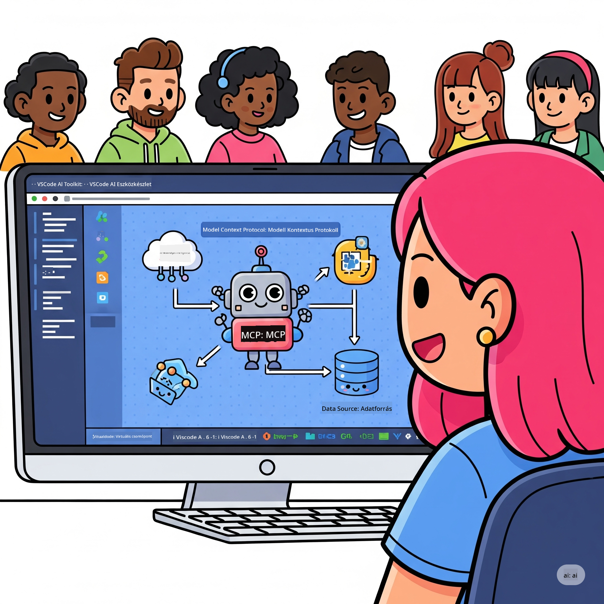
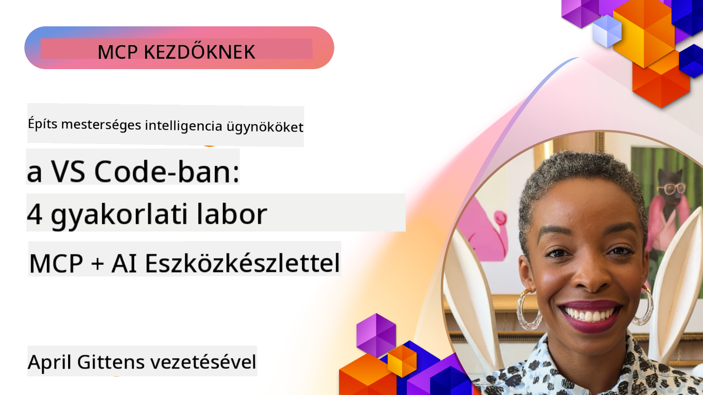

<!--
CO_OP_TRANSLATOR_METADATA:
{
  "original_hash": "1b000fd6e1b04c047578bfc5d07d54eb",
  "translation_date": "2025-08-19T15:20:18+00:00",
  "source_file": "10-StreamliningAIWorkflowsBuildingAnMCPServerWithAIToolkit/README.md",
  "language_code": "hu"
}
-->
# AI Munkafolyamatok Egyszerűsítése: MCP Szerver Építése AI Toolkit segítségével

## 🎯 Áttekintés

_(Kattints a fenti képre a leckéhez tartozó videó megtekintéséhez)_

Üdvözlünk a **Model Context Protocol (MCP) Workshopon**! Ez az átfogó, gyakorlatorientált workshop két élvonalbeli technológiát ötvöz, hogy forradalmasítsa az AI alkalmazásfejlesztést:

- **🔗 Model Context Protocol (MCP)**: Egy nyílt szabvány az AI-eszközök zökkenőmentes integrációjához
- **🛠️ AI Toolkit for Visual Studio Code (AITK)**: A Microsoft erőteljes AI fejlesztési kiterjesztése

### 🎓 Amit Megtanulsz

A workshop végére elsajátítod az intelligens alkalmazások építésének művészetét, amelyek összekötik az AI modelleket a valós eszközökkel és szolgáltatásokkal. Az automatizált teszteléstől az egyedi API integrációkig gyakorlati készségeket szerzel a komplex üzleti kihívások megoldásához.

## 🏗️ Technológiai Halmaz

### 🔌 Model Context Protocol (MCP)

Az MCP az **"AI USB-C-je"** - egy univerzális szabvány, amely összeköti az AI modelleket a külső eszközökkel és adatforrásokkal.

**✨ Főbb Jellemzők:**

- 🔄 **Standardizált Integráció**: Univerzális interfész az AI-eszköz kapcsolatokhoz
- 🏛️ **Rugalmas Architektúra**: Helyi és távoli szerverek stdio/SSE transzporton keresztül
- 🧰 **Gazdag Ökoszisztéma**: Eszközök, promptok és erőforrások egy protokollban
- 🔒 **Vállalati Szintű**: Beépített biztonság és megbízhatóság

**🎯 Miért Fontos az MCP:**
Ahogy az USB-C megszüntette a kábelkáoszt, az MCP megszünteti az AI integrációk bonyolultságát. Egy protokoll, végtelen lehetőség.

### 🤖 AI Toolkit for Visual Studio Code (AITK)

A Microsoft zászlóshajó AI fejlesztési kiterjesztése, amely AI erőművé alakítja a VS Code-ot.

**🚀 Alapvető Képességek:**

- 📦 **Modellek Katalógusa**: Hozzáférés az Azure AI, GitHub, Hugging Face, Ollama modelljeihez
- ⚡ **Helyi Inference**: ONNX-optimalizált CPU/GPU/NPU végrehajtás
- 🏗️ **Ügynök Építő**: Vizualizált AI ügynök fejlesztés MCP integrációval
- 🎭 **Multi-Modális**: Szöveg, vizuális és strukturált kimenet támogatás

**💡 Fejlesztési Előnyök:**

- Konfigurációmentes modelltelepítés
- Vizualizált prompt tervezés
- Valós idejű tesztelési játszótér
- Zökkenőmentes MCP szerver integráció

## 📚 Tanulási Út

### [🚀 1. Modul: AI Toolkit Alapok](./lab1/README.md)

**Időtartam**: 15 perc

- 🛠️ AI Toolkit telepítése és konfigurálása VS Code-hoz
- 🗂️ Modellek Katalógusának felfedezése (100+ modell GitHubról, ONNX-ból, OpenAI-ból, Anthropicból, Google-ből)
- 🎮 Az Interaktív Játszótér használatának elsajátítása valós idejű modellteszteléshez
- 🤖 Első AI ügynököd megépítése az Ügynök Építővel
- 📊 Modellteljesítmény értékelése beépített metrikákkal (F1, relevancia, hasonlóság, koherencia)
- ⚡ Batch feldolgozás és multi-modális támogatás képességeinek megismerése

**🎯 Tanulási Eredmény**: Egy működő AI ügynök létrehozása az AITK képességeinek átfogó megértésével

### [🌐 2. Modul: MCP és AI Toolkit Alapok](./lab2/README.md)

**Időtartam**: 20 perc

- 🧠 MCP architektúra és koncepciók elsajátítása
- 🌐 A Microsoft MCP szerver ökoszisztémájának felfedezése
- 🤖 Böngésző automatizálási ügynök építése Playwright MCP szerverrel
- 🔧 MCP szerverek integrálása az AI Toolkit Ügynök Építővel
- 📊 MCP eszközök konfigurálása és tesztelése az ügynökökben
- 🚀 MCP-alapú ügynökök exportálása és telepítése éles használatra

**🎯 Tanulási Eredmény**: Egy AI ügynök telepítése, amely külső eszközökkel van felturbózva MCP segítségével

### [🔧 3. Modul: Haladó MCP Fejlesztés AI Toolkittel](./lab3/README.md)

**Időtartam**: 20 perc

- 💻 Egyedi MCP szerverek létrehozása AI Toolkit segítségével
- 🐍 A legújabb MCP Python SDK (v1.9.3) konfigurálása és használata
- 🔍 MCP Inspector beállítása és használata hibakereséshez
- 🛠️ Időjárás MCP Szerver építése professzionális hibakeresési munkafolyamatokkal
- 🧪 MCP szerverek hibakeresése az Ügynök Építő és az Inspector környezetekben

**🎯 Tanulási Eredmény**: Egyedi MCP szerverek fejlesztése és hibakeresése modern eszközökkel

### [🐙 4. Modul: Gyakorlati MCP Fejlesztés - Egyedi GitHub Klón Szerver](./lab4/README.md)

**Időtartam**: 30 perc

- 🏗️ Valós GitHub Klón MCP Szerver építése fejlesztési munkafolyamatokhoz
- 🔄 Intelligens repository klónozás megvalósítása validációval és hibakezeléssel
- 📁 Intelligens könyvtárkezelés és VS Code integráció létrehozása
- 🤖 GitHub Copilot Ügynök Mód használata egyedi MCP eszközökkel
- 🛡️ Éles használatra kész megbízhatóság és platformfüggetlenség alkalmazása

**🎯 Tanulási Eredmény**: Egy éles használatra kész MCP szerver telepítése, amely egyszerűsíti a fejlesztési munkafolyamatokat

## 💡 Valós Alkalmazások és Hatás

### 🏢 Vállalati Felhasználási Esetek

#### 🔄 DevOps Automatizálás

Forradalmasítsd a fejlesztési munkafolyamatodat intelligens automatizálással:

- **Intelligens Repository Kezelés**: AI-alapú kódellenőrzés és egyesítési döntések
- **Intelligens CI/CD**: Automatizált pipeline optimalizálás kódváltozások alapján
- **Hibaosztályozás**: Automatikus hibakategorizálás és hozzárendelés

#### 🧪 Minőségbiztosítási Forradalom

Emeld a tesztelést AI-alapú automatizálással:

- **Intelligens Tesztgenerálás**: Átfogó tesztcsomagok automatikus létrehozása
- **Vizuális Regressziós Tesztelés**: AI-alapú UI változásérzékelés
- **Teljesítményfigyelés**: Proaktív problémaazonosítás és megoldás

#### 📊 Adatfolyam Intelligencia

Építs okosabb adatfeldolgozási munkafolyamatokat:

- **Adaptív ETL Folyamatok**: Önműködő adattranszformációk
- **Anomália Észlelés**: Valós idejű adatminőség-figyelés
- **Intelligens Irányítás**: Okos adatáramlás-kezelés

#### 🎧 Ügyfélélmény Javítása

Hozz létre kivételes ügyfélinterakciókat:

- **Környezetfüggő Támogatás**: AI ügynökök ügyféltörténet hozzáféréssel
- **Proaktív Problémamegoldás**: Prediktív ügyfélszolgálat
- **Multi-Csatornás Integráció**: Egységes AI élmény minden platformon

## 🛠️ Előfeltételek és Beállítás

### 💻 Rendszerkövetelmények

| Komponens | Követelmény | Megjegyzés |
|-----------|-------------|------------|
| **Operációs Rendszer** | Windows 10+, macOS 10.15+, Linux | Bármely modern OS |
| **Visual Studio Code** | Legfrissebb stabil verzió | Szükséges az AITK-hoz |
| **Node.js** | v18.0+ és npm | MCP szerver fejlesztéshez |
| **Python** | 3.10+ | Opcionális Python MCP szerverekhez |
| **Memória** | Minimum 8GB RAM | 16GB ajánlott helyi modellekhez |

### 🔧 Fejlesztési Környezet

#### Ajánlott VS Code Kiterjesztések

- **AI Toolkit** (ms-windows-ai-studio.windows-ai-studio)
- **Python** (ms-python.python)
- **Python Debugger** (ms-python.debugpy)
- **GitHub Copilot** (GitHub.copilot) - Opcionális, de hasznos

#### Opcionális Eszközök

- **uv**: Modern Python csomagkezelő
- **MCP Inspector**: Vizualizált hibakereső eszköz MCP szerverekhez
- **Playwright**: Webes automatizálási példákhoz

## 🎖️ Tanulási Eredmények és Minősítési Út

### 🏆 Készségelsajátítási Ellenőrzőlista

A workshop elvégzésével az alábbi készségeket sajátítod el:

#### 🎯 Alapvető Kompetenciák

- [ ] **MCP Protokoll Elsajátítása**: Mély megértés az architektúráról és implementációs mintákról
- [ ] **AITK Jártasság**: Szakértői szintű használat az AI Toolkit gyors fejlesztéséhez
- [ ] **Egyedi Szerverfejlesztés**: MCP szerverek építése, telepítése és karbantartása
- [ ] **Eszközintegráció**: AI zökkenőmentes összekapcsolása meglévő fejlesztési munkafolyamatokkal
- [ ] **Problémamegoldás**: Megtanult készségek alkalmazása valós üzleti kihívásokra

#### 🔧 Technikai Készségek

- [ ] AI Toolkit beállítása és konfigurálása VS Code-ban
- [ ] Egyedi MCP szerverek tervezése és implementálása
- [ ] GitHub Modellek integrálása MCP architektúrával
- [ ] Automatizált tesztelési munkafolyamatok építése Playwright segítségével
- [ ] AI ügynökök telepítése éles használatra
- [ ] MCP szerver teljesítményének hibakeresése és optimalizálása

#### 🚀 Haladó Képességek

- [ ] Vállalati szintű AI integrációk tervezése
- [ ] Biztonsági legjobb gyakorlatok implementálása AI alkalmazásokhoz
- [ ] Skálázható MCP szerver architektúrák tervezése
- [ ] Egyedi eszközláncok létrehozása specifikus területekhez
- [ ] Mások mentorálása AI-alapú fejlesztésben

## 📖 További Források

- [MCP Specifikáció](https://modelcontextprotocol.io/docs)
- [AI Toolkit GitHub Repository](https://github.com/microsoft/vscode-ai-toolkit)
- [MCP Szerverek Gyűjteménye](https://github.com/modelcontextprotocol/servers)
- [Legjobb Gyakorlatok Útmutató](https://modelcontextprotocol.io/docs/best-practices)

---

**🚀 Készen állsz forradalmasítani az AI fejlesztési munkafolyamatodat?**

Építsük együtt az intelligens alkalmazások jövőjét az MCP és az AI Toolkit segítségével!

**Felelősségkizárás**:  
Ez a dokumentum az [Co-op Translator](https://github.com/Azure/co-op-translator) AI fordítási szolgáltatás segítségével készült. Bár törekszünk a pontosságra, kérjük, vegye figyelembe, hogy az automatikus fordítások hibákat vagy pontatlanságokat tartalmazhatnak. Az eredeti dokumentum az eredeti nyelvén tekintendő hiteles forrásnak. Kritikus információk esetén javasolt a professzionális, emberi fordítás igénybevétele. Nem vállalunk felelősséget a fordítás használatából eredő félreértésekért vagy téves értelmezésekért.