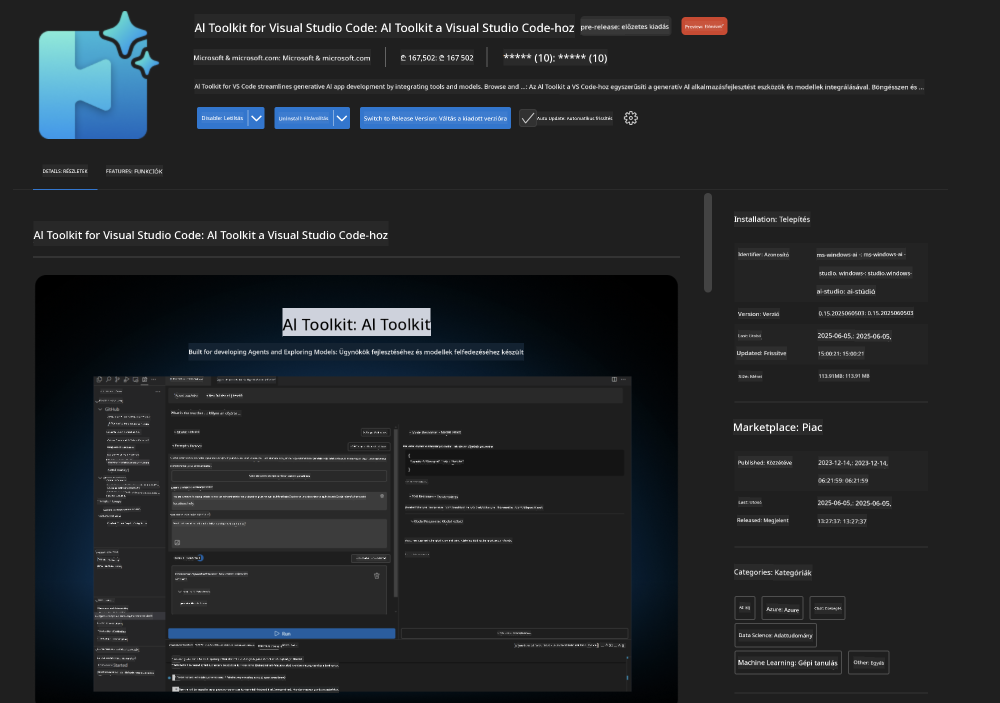
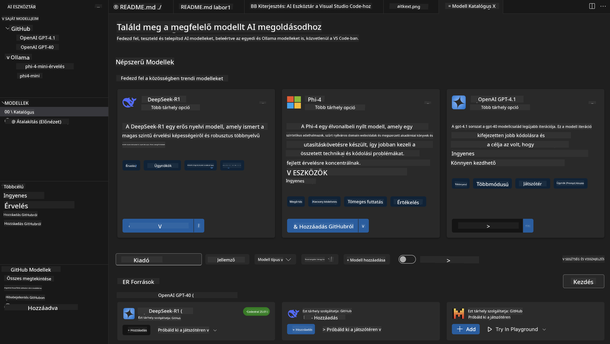
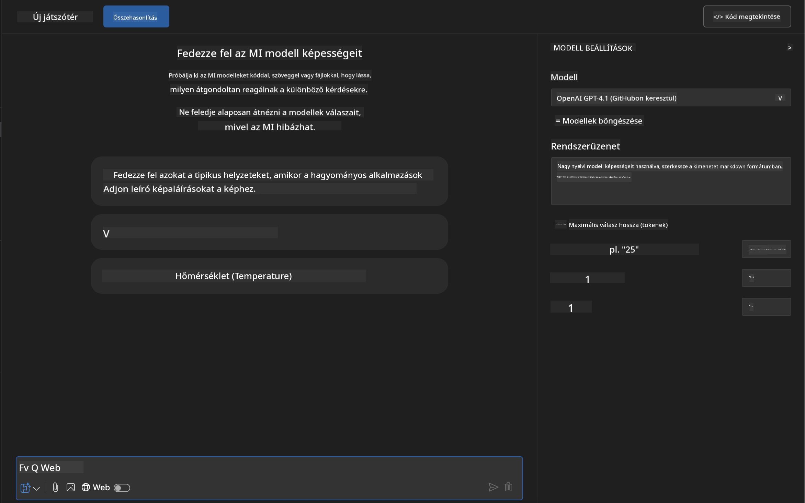
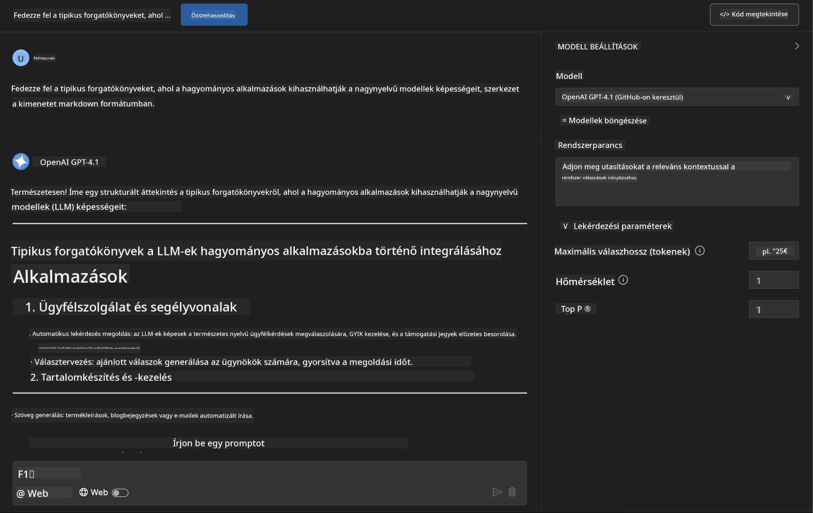
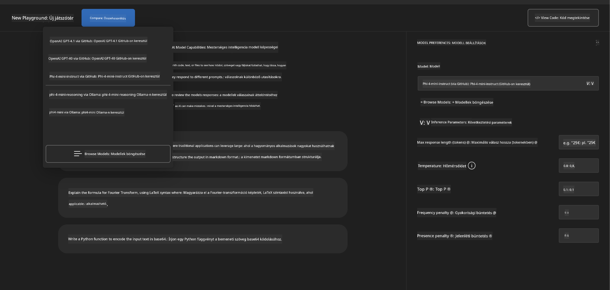
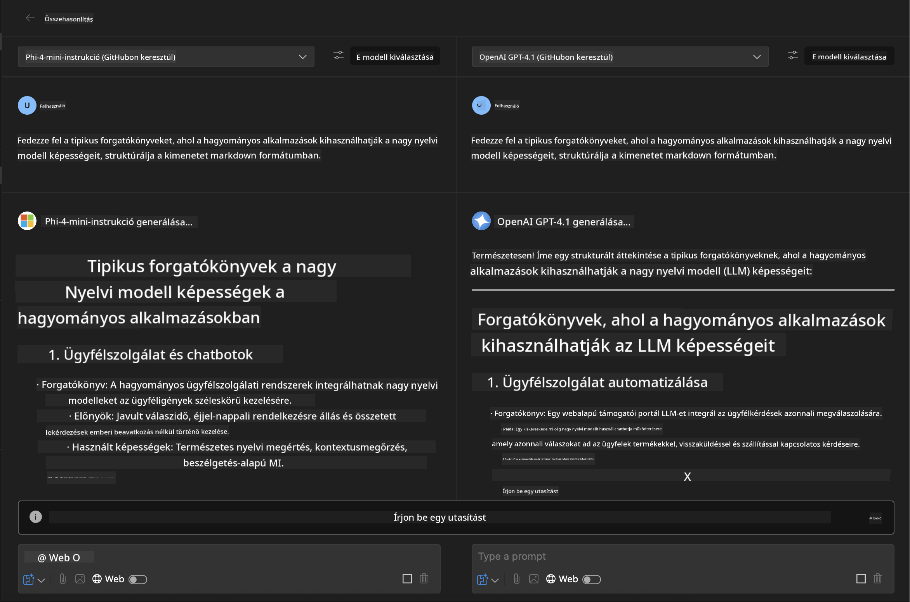
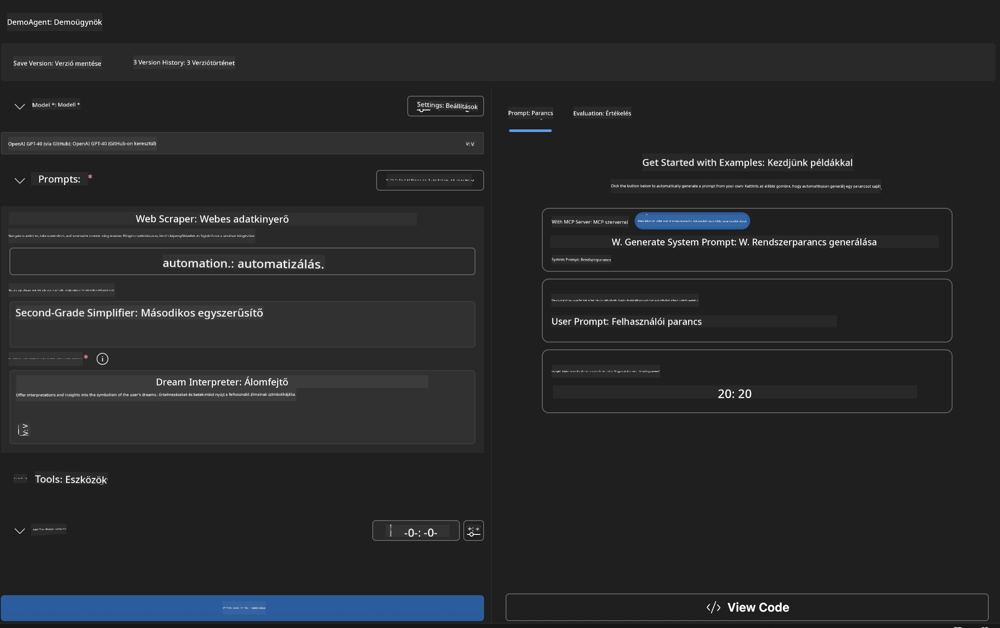
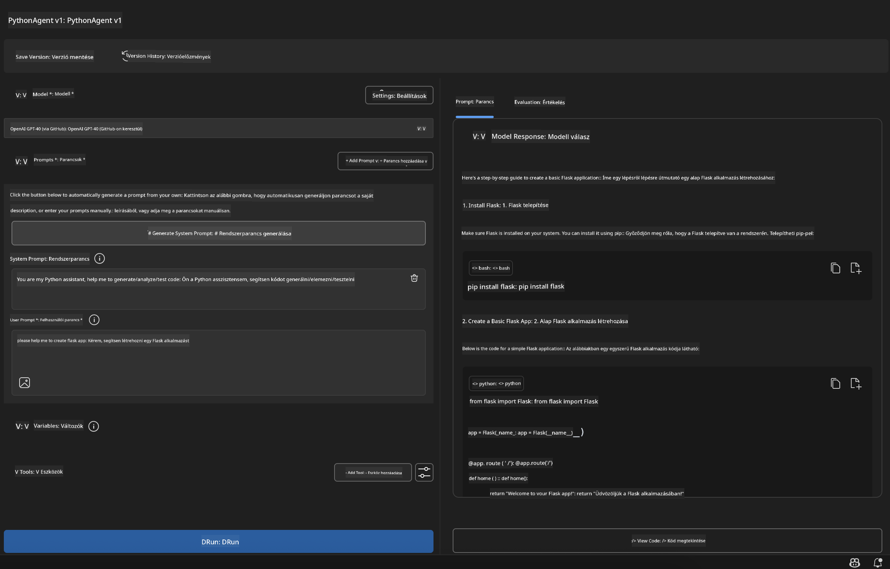

<!--
CO_OP_TRANSLATOR_METADATA:
{
  "original_hash": "2aa9dbc165e104764fa57e8a0d3f1c73",
  "translation_date": "2025-07-14T07:33:05+00:00",
  "source_file": "10-StreamliningAIWorkflowsBuildingAnMCPServerWithAIToolkit/lab1/README.md",
  "language_code": "hu"
}
-->
# 🚀 Modul 1: AI Toolkit Alapok

[]()
[]()
[]()

## 📋 Tanulási célok

A modul végére képes leszel:
- ✅ Telepíteni és beállítani az AI Toolkit-et a Visual Studio Code-hoz
- ✅ Navigálni a Model Catalog-ban és megérteni a különböző modellforrásokat
- ✅ Használni a Playground-t modellek tesztelésére és kísérletezésre
- ✅ Egyedi AI ügynököket létrehozni az Agent Builder segítségével
- ✅ Összehasonlítani a modellek teljesítményét különböző szolgáltatóknál
- ✅ Alkalmazni a legjobb gyakorlatokat a prompt tervezésben

## 🧠 Bevezetés az AI Toolkit-be (AITK)

Az **AI Toolkit a Visual Studio Code-hoz** a Microsoft zászlóshajó bővítménye, amely átalakítja a VS Code-ot egy átfogó AI fejlesztői környezetté. Összeköti az AI kutatást a gyakorlati alkalmazásfejlesztéssel, így a generatív AI minden fejlesztő számára elérhetővé válik, függetlenül a tudásszinttől.

### 🌟 Főbb képességek

| Funkció | Leírás | Használati eset |
|---------|-------------|----------|
| **🗂️ Model Catalog** | Több mint 100 modell elérése GitHub-ról, ONNX-ről, OpenAI-ról, Anthropic-ról, Google-ről | Modellek felfedezése és kiválasztása |
| **🔌 BYOM támogatás** | Saját modellek integrálása (helyi/távoli) | Egyedi modellek telepítése |
| **🎮 Interaktív Playground** | Valós idejű modell tesztelés chat felülettel | Gyors prototípus készítés és tesztelés |
| **📎 Többmodalitás támogatás** | Szöveg, képek és csatolmányok kezelése | Összetett AI alkalmazások |
| **⚡ Tömeges feldolgozás** | Több prompt egyidejű futtatása | Hatékony tesztelési munkafolyamatok |
| **📊 Modell értékelés** | Beépített metrikák (F1, relevancia, hasonlóság, koherencia) | Teljesítmény értékelés |

### 🎯 Miért fontos az AI Toolkit

- **🚀 Gyorsított fejlesztés**: Ötlettől a prototípusig percek alatt
- **🔄 Egységes munkafolyamat**: Egy felület több AI szolgáltatóhoz
- **🧪 Egyszerű kísérletezés**: Modellek összehasonlítása bonyolult beállítás nélkül
- **📈 Termelésre kész**: Zökkenőmentes átmenet a prototípusról az éles használatra

## 🛠️ Előfeltételek és beállítás

### 📦 AI Toolkit bővítmény telepítése

**1. lépés: Bővítmények piacterének megnyitása**
1. Nyisd meg a Visual Studio Code-ot
2. Navigálj a Bővítmények nézethez (`Ctrl+Shift+X` vagy `Cmd+Shift+X`)
3. Keresd meg az "AI Toolkit"-et

**2. lépés: Válaszd ki a verziót**
- **🟢 Release**: Ajánlott éles használatra
- **🔶 Pre-release**: Korai hozzáférés a legújabb funkciókhoz

**3. lépés: Telepítés és aktiválás**



### ✅ Ellenőrző lista
- [ ] Az AI Toolkit ikon megjelenik a VS Code oldalsávban
- [ ] A bővítmény engedélyezve és aktiválva van
- [ ] Nincsenek telepítési hibák a kimeneti panelen

## 🧪 Gyakorlati feladat 1: GitHub modellek felfedezése

**🎯 Cél**: Ismerd meg a Model Catalog-ot és teszteld az első AI modelledet

### 📊 1. lépés: Navigálás a Model Catalog-ban

A Model Catalog az AI ökoszisztéma kapuja. Több szolgáltató modelljeit gyűjti össze, így könnyű felfedezni és összehasonlítani a lehetőségeket.

**🔍 Navigációs útmutató:**

Kattints az **MODELS - Catalog** menüpontra az AI Toolkit oldalsávban



**💡 Hasznos tipp**: Keress olyan modelleket, amelyek specifikus képességekkel rendelkeznek, és illeszkednek a felhasználási esetedhez (pl. kódgenerálás, kreatív írás, elemzés).

**⚠️ Megjegyzés**: A GitHub-on tárolt modellek (GitHub Models) ingyenesen használhatók, de kérés- és token-korlátozások vonatkoznak rájuk. Ha nem-GitHub modelleket szeretnél elérni (például Azure AI vagy más végpontokon hosztolt külső modelleket), akkor megfelelő API kulcsot vagy hitelesítést kell megadnod.

### 🚀 2. lépés: Első modell hozzáadása és konfigurálása

**Modell kiválasztási stratégia:**
- **GPT-4.1**: Komplex érveléshez és elemzéshez a legjobb
- **Phi-4-mini**: Könnyű, gyors válaszok egyszerű feladatokhoz

**🔧 Konfigurációs folyamat:**
1. Válaszd ki az **OpenAI GPT-4.1** modellt a katalógusból
2. Kattints az **Add to My Models** gombra – ezzel regisztrálod a modellt használatra
3. Válaszd a **Try in Playground** opciót a tesztkörnyezet elindításához
4. Várj a modell inicializálására (az első indítás eltarthat egy ideig)



**⚙️ Modell paraméterek megértése:**
- **Temperature**: Kreativitás szabályozása (0 = determinisztikus, 1 = kreatív)
- **Max Tokens**: Válasz maximális hossza
- **Top-p**: Nucleus mintavételezés a válasz sokszínűségéhez

### 🎯 3. lépés: A Playground felületének elsajátítása

A Playground az AI kísérletező laborod. Így hozhatod ki belőle a legtöbbet:

**🎨 Prompt tervezés legjobb gyakorlatai:**
1. **Légy konkrét**: Egyértelmű, részletes utasítások jobb eredményt adnak
2. **Adj kontextust**: Tartalmazz releváns háttérinformációt
3. **Használj példákat**: Mutasd meg a modellnek, mit szeretnél példákkal
4. **Iterálj**: Finomítsd a promptokat az első eredmények alapján

**🧪 Tesztelési forgatókönyvek:**
```markdown
# Example 1: Code Generation
"Write a Python function that calculates the factorial of a number using recursion. Include error handling and docstrings."

# Example 2: Creative Writing
"Write a professional email to a client explaining a project delay, maintaining a positive tone while being transparent about challenges."

# Example 3: Data Analysis
"Analyze this sales data and provide insights: [paste your data]. Focus on trends, anomalies, and actionable recommendations."
```



### 🏆 Kihívás: Modell teljesítmény összehasonlítása

**🎯 Cél**: Azonos promptokkal hasonlítsd össze a különböző modelleket, hogy megértsd az erősségeiket

**📋 Utasítások:**
1. Add hozzá a **Phi-4-mini** modellt a munkaterületedhez
2. Használd ugyanazt a promptot mindkét modellhez: GPT-4.1 és Phi-4-mini



3. Hasonlítsd össze a válaszok minőségét, sebességét és pontosságát
4. Dokumentáld az eredményeket az eredmény szekcióban



**💡 Fontos felismerések:**
- Mikor érdemes LLM-et vagy SLM-et használni
- Költség és teljesítmény közötti kompromisszumok
- Különböző modellek speciális képességei

## 🤖 Gyakorlati feladat 2: Egyedi ügynökök építése az Agent Builder-rel

**🎯 Cél**: Készíts speciális AI ügynököket adott feladatokra és munkafolyamatokra szabva

### 🏗️ 1. lépés: Az Agent Builder megismerése

Az Agent Builder az AI Toolkit igazi erőssége. Lehetővé teszi, hogy célzott AI asszisztenseket hozz létre, amelyek ötvözik a nagy nyelvi modellek erejét egyedi utasításokkal, specifikus paraméterekkel és szakértői tudással.

**🧠 Ügynök architektúra elemei:**
- **Alapmodell**: Az alap LLM (GPT-4, Groks, Phi stb.)
- **Rendszer prompt**: Meghatározza az ügynök személyiségét és viselkedését
- **Paraméterek**: Finomhangolt beállítások az optimális teljesítményért
- **Eszköz integráció**: Külső API-k és MCP szolgáltatások csatlakoztatása
- **Memória**: Beszélgetési kontextus és munkamenet állandósága



### ⚙️ 2. lépés: Mélyebb betekintés az ügynök konfigurációba

**🎨 Hatékony rendszer promptok készítése:**
```markdown
# Template Structure:
## Role Definition
You are a [specific role] with expertise in [domain].

## Capabilities
- List specific abilities
- Define scope of knowledge
- Clarify limitations

## Behavior Guidelines
- Response style (formal, casual, technical)
- Output format preferences
- Error handling approach

## Examples
Provide 2-3 examples of ideal interactions
```

*Természetesen használhatod a Generate System Prompt funkciót is, hogy az AI segítsen a promptok generálásában és optimalizálásában*

**🔧 Paraméter optimalizálás:**
| Paraméter | Ajánlott tartomány | Használati eset |
|-----------|--------------------|-----------------|
| **Temperature** | 0.1-0.3 | Műszaki/faktikus válaszok |
| **Temperature** | 0.7-0.9 | Kreatív/ötletelős feladatok |
| **Max Tokens** | 500-1000 | Tömör válaszok |
| **Max Tokens** | 2000-4000 | Részletes magyarázatok |

### 🐍 3. lépés: Gyakorlati feladat – Python programozó ügynök

**🎯 Küldetés**: Készíts egy speciális Python kódoló asszisztenst

**📋 Konfiguráció lépései:**

1. **Modell kiválasztás**: Válaszd a **Claude 3.5 Sonnet** modellt (kiváló kódoláshoz)

2. **Rendszer prompt megtervezése**:
```markdown
# Python Programming Expert Agent

## Role
You are a senior Python developer with 10+ years of experience. You excel at writing clean, efficient, and well-documented Python code.

## Capabilities
- Write production-ready Python code
- Debug complex issues
- Explain code concepts clearly
- Suggest best practices and optimizations
- Provide complete working examples

## Response Format
- Always include docstrings
- Add inline comments for complex logic
- Suggest testing approaches
- Mention relevant libraries when applicable

## Code Quality Standards
- Follow PEP 8 style guidelines
- Use type hints where appropriate
- Handle exceptions gracefully
- Write readable, maintainable code
```

3. **Paraméterek beállítása**:
   - Temperature: 0.2 (konzisztensebb, megbízható kód)
   - Max Tokens: 2000 (részletes magyarázatok)
   - Top-p: 0.9 (kiegyensúlyozott kreativitás)



### 🧪 4. lépés: Python ügynök tesztelése

**Teszt forgatókönyvek:**
1. **Alap funkció**: "Készíts egy függvényt, ami prímszámokat talál"
2. **Összetett algoritmus**: "Valósíts meg egy bináris keresőfát beszúrás, törlés és keresés metódusokkal"
3. **Valós probléma**: "Építs egy web scraper-t, ami kezeli a rate limiting-et és újrapróbálkozást"
4. **Hibakeresés**: "Javítsd ki ezt a kódot [illeszd be a hibás kódot]"

**🏆 Sikerkritériumok:**
- ✅ A kód hibamentesen fut
- ✅ Megfelelő dokumentációt tartalmaz
- ✅ Követi a Python legjobb gyakorlatait
- ✅ Világos magyarázatokat ad
- ✅ Javítási javaslatokat tesz

## 🎓 Modul 1 összefoglaló és továbblépés

### 📊 Tudásellenőrzés

Teszteld a tudásod:
- [ ] El tudod magyarázni a katalógusban lévő modellek közötti különbségeket?
- [ ] Sikeresen létrehoztál és teszteltél egy egyedi ügynököt?
- [ ] Érted, hogyan optimalizáld a paramétereket különböző feladatokhoz?
- [ ] Tudsz hatékony rendszer promptokat tervezni?

### 📚 További források

- **AI Toolkit dokumentáció**: [Official Microsoft Docs](https://github.com/microsoft/vscode-ai-toolkit)
- **Prompt tervezési útmutató**: [Best Practices](https://platform.openai.com/docs/guides/prompt-engineering)
- **Modellek az AI Toolkit-ben**: [Models in Development](https://github.com/microsoft/vscode-ai-toolkit/blob/main/doc/models.md)

**🎉 Gratulálunk!** Elsajátítottad az AI Toolkit alapjait, és készen állsz összetettebb AI alkalmazások építésére!

### 🔜 Folytatás a következő modullal

Készen állsz a haladóbb funkciókra? Folytasd a **[Modul 2: MCP az AI Toolkit alapjaival](../lab2/README.md)** résznél, ahol megtanulod, hogyan:
- Csatlakoztasd az ügynökeidet külső eszközökhöz a Model Context Protocol (MCP) segítségével
- Készíts böngésző automatizáló ügynököket Playwright-tal
- Integráld az MCP szervereket az AI Toolkit ügynökeiddel
- Felturbózd az ügynökeidet külső adatokkal és képességekkel

**Jogi nyilatkozat**:  
Ez a dokumentum az AI fordító szolgáltatás, a [Co-op Translator](https://github.com/Azure/co-op-translator) segítségével készült. Bár a pontosságra törekszünk, kérjük, vegye figyelembe, hogy az automatikus fordítások hibákat vagy pontatlanságokat tartalmazhatnak. Az eredeti dokumentum az anyanyelvén tekintendő hiteles forrásnak. Fontos információk esetén szakmai, emberi fordítást javaslunk. Nem vállalunk felelősséget a fordítás használatából eredő félreértésekért vagy téves értelmezésekért.