<!--
CO_OP_TRANSLATOR_METADATA:
{
  "original_hash": "a22b7dd11cd7690f99f9195877cafdc3",
  "translation_date": "2025-06-10T05:56:31+00:00",
  "source_file": "10-StreamliningAIWorkflowsBuildingAnMCPServerWithAIToolkit/lab2/README.md",
  "language_code": "hu"
}
-->
# 🌐 2. modul: MCP az AI Toolkit alapjaival

[]()
[]()
[]()

## 📋 Tanulási célok

A modul végére képes leszel:
- ✅ Megérteni a Model Context Protocol (MCP) felépítését és előnyeit
- ✅ Felfedezni a Microsoft MCP szerver ökoszisztémáját
- ✅ Integrálni az MCP szervereket az AI Toolkit Agent Builderrel
- ✅ Használható böngésző-automatizálási ügynököt építeni Playwright MCP-vel
- ✅ Beállítani és tesztelni az MCP eszközöket az ügynökeidben
- ✅ Exportálni és éles környezetbe telepíteni MCP-alapú ügynököket

## 🎯 Az 1. modulra építve

Az 1. modulban elsajátítottuk az AI Toolkit alapjait és elkészítettük első Python ügynökünket. Most **felpörgetjük** az ügynökeidet azzal, hogy a forradalmi **Model Context Protocol (MCP)** segítségével külső eszközökhöz és szolgáltatásokhoz kapcsolódnak.

Gondolj erre úgy, mintha egy egyszerű számológépről egy teljes számítógépre váltanál – az AI ügynökeid képesek lesznek:
- 🌐 Böngészni és interakcióba lépni weboldalakkal
- 📁 Fájlokat elérni és kezelni
- 🔧 Vállalati rendszerekkel integrálódni
- 📊 Valós idejű adatokat feldolgozni API-król

## 🧠 A Model Context Protocol (MCP) megértése

### 🔍 Mi az MCP?

A Model Context Protocol (MCP) az AI alkalmazások **"USB-C csatlakozója"** – egy forradalmi, nyílt szabvány, amely összeköti a nagy nyelvi modelleket (LLM-eket) külső eszközökkel, adatforrásokkal és szolgáltatásokkal. Ahogy az USB-C megszüntette a kábelkavalkádot egy univerzális csatlakozóval, úgy az MCP egyszerűsíti az AI integrációkat egy egységes protokollal.

### 🎯 Az MCP által megoldott probléma

**MCP előtt:**
- 🔧 Egyedi integrációk minden eszközhöz
- 🔄 Szállítófüggőség zárt megoldásokkal  
- 🔒 Biztonsági kockázatok ad hoc kapcsolatokból
- ⏱️ Hónapokig tartó fejlesztés alap integrációkra

**MCP-vel:**
- ⚡ Plug-and-play eszközintegráció
- 🔄 Szállítófüggetlen architektúra
- 🛡️ Beépített biztonsági gyakorlatok
- 🚀 Új funkciók percek alatt hozzáadhatók

### 🏗️ MCP architektúra részletesen

Az MCP **kliens-szerver architektúrát** követ, amely egy biztonságos, skálázható ökoszisztémát hoz létre:

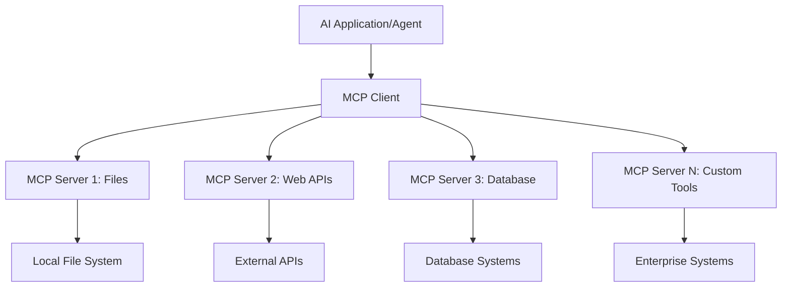

**🔧 Fő komponensek:**

| Komponens | Szerep | Példák |
|-----------|--------|--------|
| **MCP Hosts** | MCP szolgáltatásokat fogyasztó alkalmazások | Claude Desktop, VS Code, AI Toolkit |
| **MCP Clients** | Protokoll kezelők (1:1 a szerverekkel) | Beépítve a host alkalmazásokba |
| **MCP Servers** | Képességeket tesznek elérhetővé szabványos protokollon keresztül | Playwright, Files, Azure, GitHub |
| **Transport Layer** | Kommunikációs módszerek | stdio, HTTP, WebSockets |

## 🏢 Microsoft MCP szerver ökoszisztéma

A Microsoft vezeti az MCP ökoszisztémát egy átfogó vállalati szintű szervercsomaggal, amelyek valós üzleti igényeket fednek le.

### 🌟 Kiemelt Microsoft MCP szerverek

#### 1. ☁️ Azure MCP Server
**🔗 Repository**: [azure/azure-mcp](https://github.com/azure/azure-mcp)  
**🎯 Cél**: Átfogó Azure erőforrás-menedzsment AI integrációval

**✨ Főbb funkciók:**
- Deklaratív infrastruktúra-telepítés
- Valós idejű erőforrás-monitorozás
- Költségoptimalizálási ajánlások
- Biztonsági megfelelőség ellenőrzése

**🚀 Használati esetek:**
- Infrastructure-as-Code AI támogatással
- Automatikus erőforrás skálázás
- Felhő költségoptimalizálás
- DevOps munkafolyamat automatizálás

#### 2. 📊 Microsoft Dataverse MCP
**📚 Dokumentáció**: [Microsoft Dataverse Integration](https://go.microsoft.com/fwlink/?linkid=2320176)  
**🎯 Cél**: Természetes nyelvű interfész üzleti adatokhoz

**✨ Főbb funkciók:**
- Természetes nyelvű adatbázis lekérdezések
- Üzleti kontextus értelmezése
- Egyedi prompt sablonok
- Vállalati adatkezelés

**🚀 Használati esetek:**
- Üzleti intelligencia riportok
- Ügyféladat elemzés
- Értékesítési csővezeték áttekintés
- Megfelelőségi adatlekérdezések

#### 3. 🌐 Playwright MCP Server
**🔗 Repository**: [microsoft/playwright-mcp](https://github.com/microsoft/playwright-mcp)  
**🎯 Cél**: Böngésző-automatizálás és webes interakciók

**✨ Főbb funkciók:**
- Több böngészős automatizálás (Chrome, Firefox, Safari)
- Intelligens elemfelismerés
- Képernyőkép és PDF generálás
- Hálózati forgalom monitorozás

**🚀 Használati esetek:**
- Automatizált tesztelési folyamatok
- Weboldal adatkinyerés
- UI/UX monitorozás
- Versenytárselemzés automatizálása

#### 4. 📁 Files MCP Server
**🔗 Repository**: [microsoft/files-mcp-server](https://github.com/microsoft/files-mcp-server)  
**🎯 Cél**: Intelligens fájlrendszer műveletek

**✨ Főbb funkciók:**
- Deklaratív fájlkezelés
- Tartalomszinkronizáció
- Verziókezelés integráció
- Metaadat kinyerés

**🚀 Használati esetek:**
- Dokumentáció menedzsment
- Kód tárház szervezés
- Tartalom publikálási munkafolyamatok
- Adatfeldolgozó pipeline-ok fájlkezelése

#### 5. 📝 MarkItDown MCP Server
**🔗 Repository**: [microsoft/markitdown](https://github.com/microsoft/markitdown)  
**🎯 Cél**: Fejlett Markdown feldolgozás és manipuláció

**✨ Főbb funkciók:**
- Gazdag Markdown elemzés
- Formátum konverzió (MD ↔ HTML ↔ PDF)
- Tartalomszerkezet elemzés
- Sablon feldolgozás

**🚀 Használati esetek:**
- Műszaki dokumentáció munkafolyamatok
- Tartalomkezelő rendszerek
- Jelentéskészítés
- Tudásbázis automatizálás

#### 6. 📈 Clarity MCP Server
**📦 Package**: [@microsoft/clarity-mcp-server](https://www.npmjs.com/package/@microsoft/clarity-mcp-server)  
**🎯 Cél**: Webanalitika és felhasználói viselkedés elemzés

**✨ Főbb funkciók:**
- Hőtérképes adat elemzés
- Felhasználói munkamenet felvételek
- Teljesítménymutatók
- Konverziós tölcsér elemzés

**🚀 Használati esetek:**
- Weboldal optimalizálás
- Felhasználói élmény kutatás
- A/B teszt elemzés
- Üzleti intelligencia dashboardok

### 🌍 Közösségi ökoszisztéma

A Microsoft szerverein túl az MCP ökoszisztéma magában foglalja:
- **🐙 GitHub MCP**: Repository menedzsment és kód elemzés
- **🗄️ Adatbázis MCP-k**: PostgreSQL, MySQL, MongoDB integrációk
- **☁️ Felhőszolgáltató MCP-k**: AWS, GCP, Digital Ocean eszközök
- **📧 Kommunikációs MCP-k**: Slack, Teams, Email integrációk

## 🛠️ Gyakorlati labor: Böngésző-automatizálási ügynök építése

**🎯 Projekt célja**: Intelligens böngésző-automatizálási ügynök létrehozása Playwright MCP szerverrel, amely képes weboldalak navigálására, információkinyerésre és összetett webes műveletek végrehajtására.

### 🚀 1. fázis: Ügynök alapjainak létrehozása

#### 1. lépés: Ügynök inicializálása
1. **Nyisd meg az AI Toolkit Agent Buildert**
2. **Hozz létre új ügynököt** a következő beállításokkal:
   - **Név**: `BrowserAgent`
   - **Model**: Choose GPT-4o 

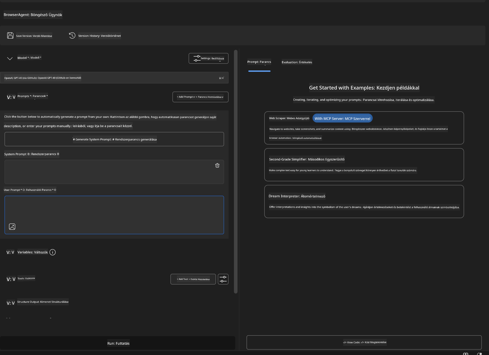


### 🔧 Phase 2: MCP Integration Workflow

#### Step 3: Add MCP Server Integration
1. **Navigate to Tools Section** in Agent Builder
2. **Click "Add Tool"** to open the integration menu
3. **Select "MCP Server"** from available options

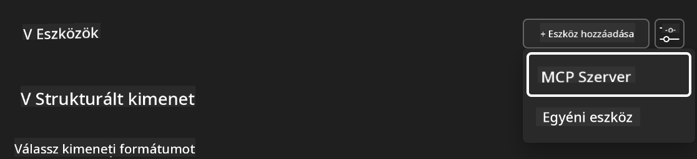

**🔍 Understanding Tool Types:**
- **Built-in Tools**: Pre-configured AI Toolkit functions
- **MCP Servers**: External service integrations
- **Custom APIs**: Your own service endpoints
- **Function Calling**: Direct model function access

#### Step 4: MCP Server Selection
1. **Choose "MCP Server"** option to proceed
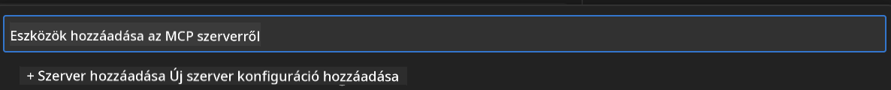

2. **Browse MCP Catalog** to explore available integrations
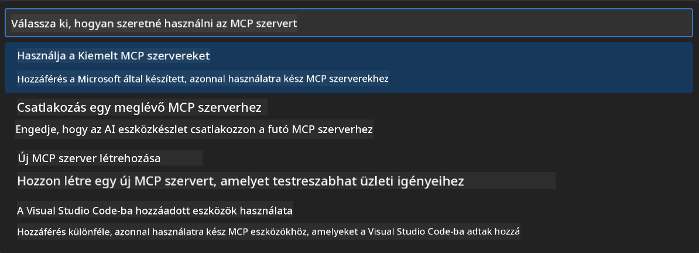


### 🎮 Phase 3: Playwright MCP Configuration

#### Step 5: Select and Configure Playwright
1. **Click "Use Featured MCP Servers"** to access Microsoft's verified servers
2. **Select "Playwright"** from the featured list
3. **Accept Default MCP ID** or customize for your environment

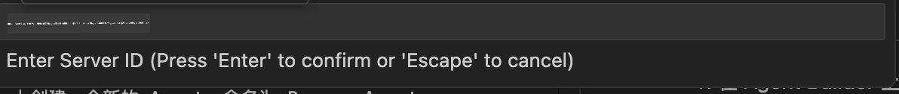

#### Step 6: Enable Playwright Capabilities
**🔑 Critical Step**: Select **ALL** available Playwright methods for maximum functionality

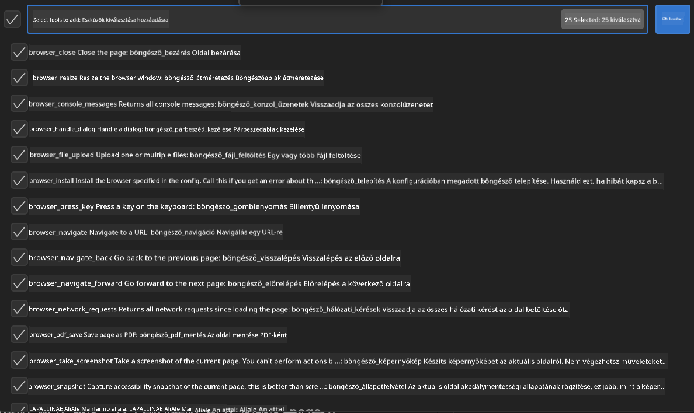

**🛠️ Essential Playwright Tools:**
- **Navigation**: `goto`, `goBack`, `goForward`, `reload`
- **Interaction**: `click`, `fill`, `press`, `hover`, `drag`
- **Extraction**: `textContent`, `innerHTML`, `getAttribute`
- **Validation**: `isVisible`, `isEnabled`, `waitForSelector`
- **Capture**: `screenshot`, `pdf`, `video`
- **Network**: `setExtraHTTPHeaders`, `route`, `waitForResponse`

#### 7. lépés: Integráció sikerességének ellenőrzése
**✅ Sikert jelző jelek:**
- Minden eszköz megjelenik az Agent Builder felületén
- Nincs hibaüzenet az integrációs panelen
- A Playwright szerver státusza "Connected"

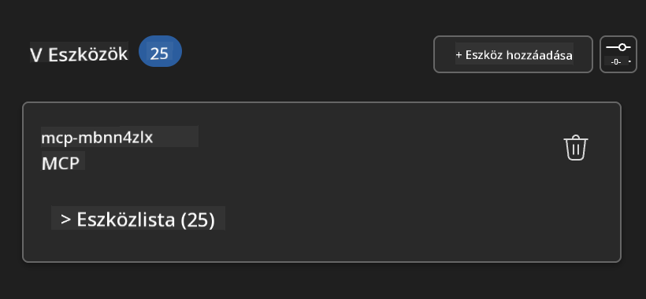

**🔧 Gyakori problémák elhárítása:**
- **Kapcsolódási hiba**: Ellenőrizd az internetkapcsolatot és a tűzfal beállításokat
- **Hiányzó eszközök**: Győződj meg róla, hogy minden képesség ki lett választva a beállítás során
- **Engedélyezési hibák**: Ellenőrizd, hogy a VS Code rendelkezik a szükséges rendszerengedélyekkel

### 🎯 4. fázis: Fejlett prompt tervezés

#### 8. lépés: Intelligens rendszer promptok megtervezése
Készíts kifinomult promptokat, amelyek teljes mértékben kihasználják a Playwright képességeit:

```markdown
# Web Automation Expert System Prompt

## Core Identity
You are an advanced web automation specialist with deep expertise in browser automation, web scraping, and user experience analysis. You have access to Playwright tools for comprehensive browser control.

## Capabilities & Approach
### Navigation Strategy
- Always start with screenshots to understand page layout
- Use semantic selectors (text content, labels) when possible
- Implement wait strategies for dynamic content
- Handle single-page applications (SPAs) effectively

### Error Handling
- Retry failed operations with exponential backoff
- Provide clear error descriptions and solutions
- Suggest alternative approaches when primary methods fail
- Always capture diagnostic screenshots on errors

### Data Extraction
- Extract structured data in JSON format when possible
- Provide confidence scores for extracted information
- Validate data completeness and accuracy
- Handle pagination and infinite scroll scenarios

### Reporting
- Include step-by-step execution logs
- Provide before/after screenshots for verification
- Suggest optimizations and alternative approaches
- Document any limitations or edge cases encountered

## Ethical Guidelines
- Respect robots.txt and rate limiting
- Avoid overloading target servers
- Only extract publicly available information
- Follow website terms of service
```

#### 9. lépés: Dinamikus felhasználói promptok létrehozása
Tervezd meg azokat a promptokat, amelyek különféle képességeket demonstrálnak:

**🌐 Webes elemzés példa:**
```markdown
Navigate to github.com/kinfey and provide a comprehensive analysis including:
1. Repository structure and organization
2. Recent activity and contribution patterns  
3. Documentation quality assessment
4. Technology stack identification
5. Community engagement metrics
6. Notable projects and their purposes

Include screenshots at key steps and provide actionable insights.
```


### 🚀 5. fázis: Végrehajtás és tesztelés

#### 10. lépés: Futtasd az első automatizálást
1. **Kattints a "Run" gombra**, hogy elindítsd az automatizálási folyamatot
2. **Kövesd nyomon valós időben a futást**:
   - A Chrome böngésző automatikusan elindul
   - Az ügynök navigál a cél weboldalra
   - Képernyőképek készülnek minden fontos lépésnél
   - Az elemzési eredmények valós időben érkeznek

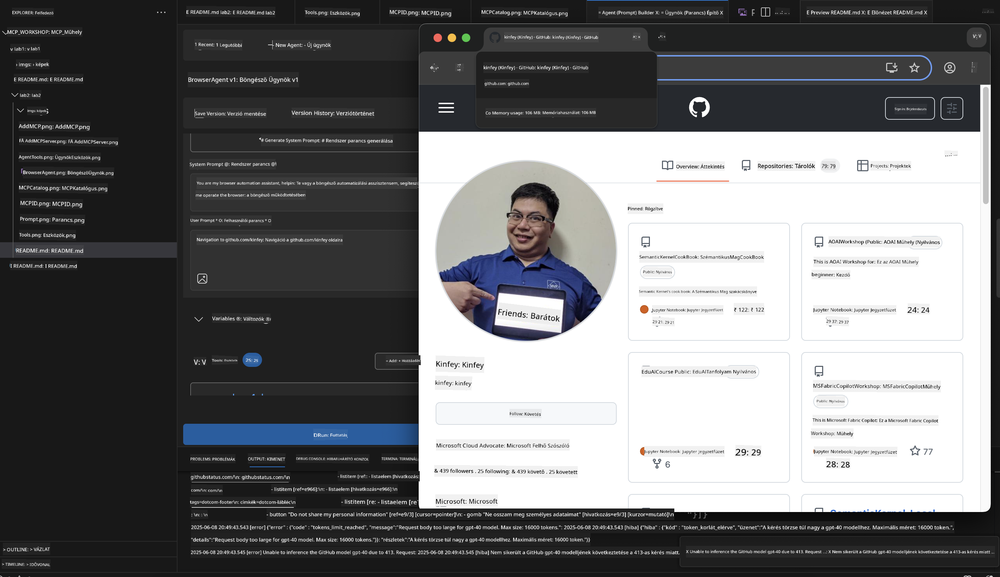

#### 11. lépés: Eredmények és betekintések elemzése
Tekintsd át az átfogó elemzést az Agent Builder felületén:

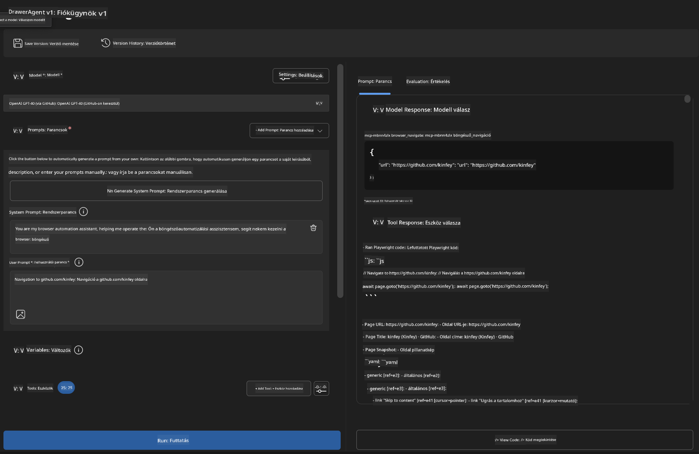

### 🌟 6. fázis: Fejlett képességek és élesítés

#### 12. lépés: Exportálás és éles környezetbe telepítés
Az Agent Builder több telepítési lehetőséget támogat:

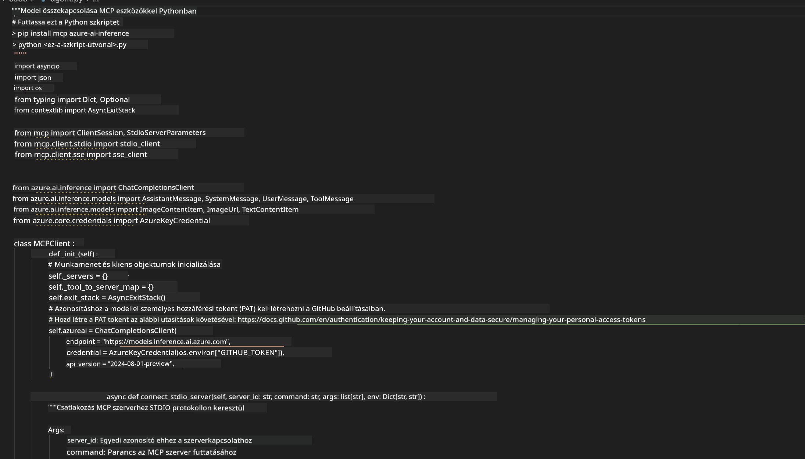

## 🎓 2. modul összefoglaló és továbblépés

### 🏆 Elért eredmény: MCP integráció mesterfokon

**✅ Megszerzett készségek:**
- [ ] MCP architektúra és előnyök megértése
- [ ] A Microsoft MCP szerver ökoszisztéma áttekintése
- [ ] Playwright MCP integrálása az AI Toolkittel
- [ ] Fejlett böngésző-automatizálási ügynökök építése
- [ ] Fejlett prompt tervezés webes automatizáláshoz

### 📚 További források

- **🔗 MCP specifikáció**: [Hivatalos protokoll dokumentáció](https://modelcontextprotocol.io/)
- **🛠️ Playwright API**: [Teljes metódus referenciák](https://playwright.dev/docs/api/class-playwright)
- **🏢 Microsoft MCP szerverek**: [Vállalati integrációs útmutató](https://github.com/microsoft/mcp-servers)
- **🌍 Közösségi példák**: [MCP szerver galéria](https://github.com/modelcontextprotocol/servers)

**🎉 Gratulálunk!** Sikeresen elsajátítottad az MCP integrációt, és most már képes vagy éles környezetbe szánt AI ügynököket építeni külső eszközökkel!

### 🔜 Folytatás a következő modullal

Készen állsz, hogy még magasabb szintre emeld MCP tudásod? Folytasd a **[3. modul: Fejlett MCP fejlesztés AI Toolkittel](../lab3/README.md)** anyaggal, ahol megtanulhatod:
- Saját egyedi MCP szerverek létrehozását
- Az új MCP Python SDK konfigurálását és használatát
- MCP Inspector beállítását hibakereséshez
- Fejlett MCP szerver fejlesztési munkafolyamatok elsajátítását
- Egy időjárás MCP szerver építését az alapoktól

**Felelősségkizárás**:  
Ezt a dokumentumot az AI fordító szolgáltatás, a [Co-op Translator](https://github.com/Azure/co-op-translator) segítségével fordítottuk le. Bár a pontosságra törekszünk, kérjük, vegye figyelembe, hogy az automatikus fordítások hibákat vagy pontatlanságokat tartalmazhatnak. Az eredeti dokumentum az anyanyelvén tekintendő hiteles forrásnak. Fontos információk esetén professzionális emberi fordítást javaslunk. Nem vállalunk felelősséget az ebből eredő félreértésekért vagy téves értelmezésekért.