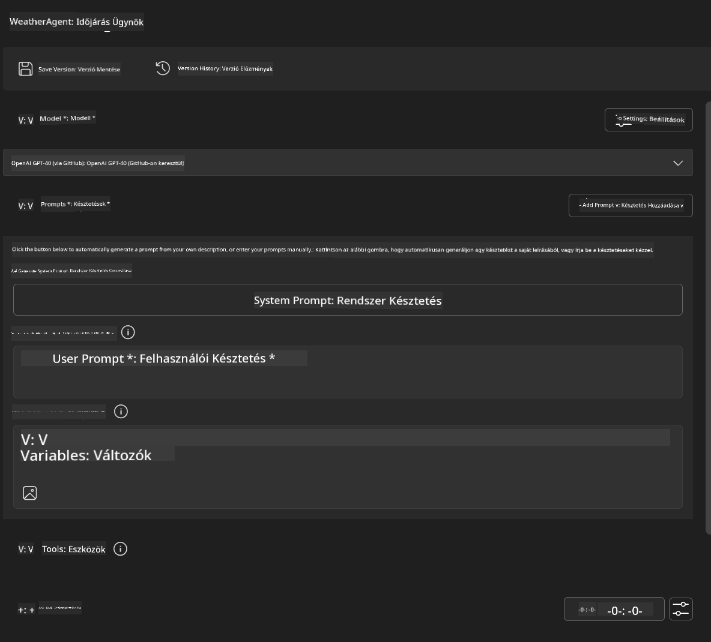
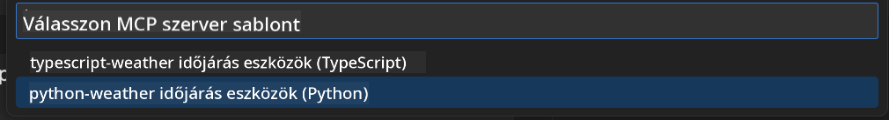
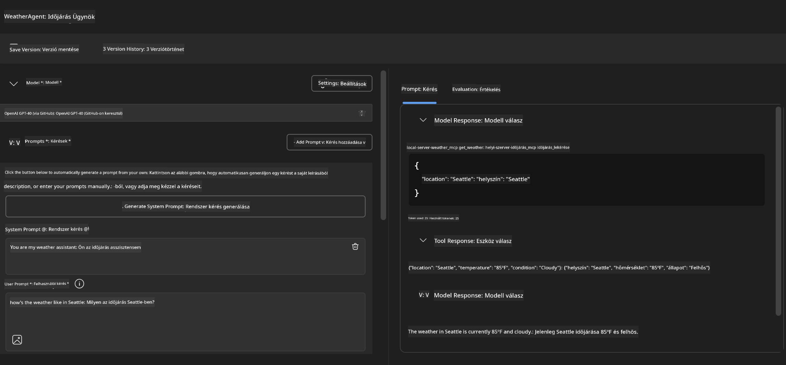
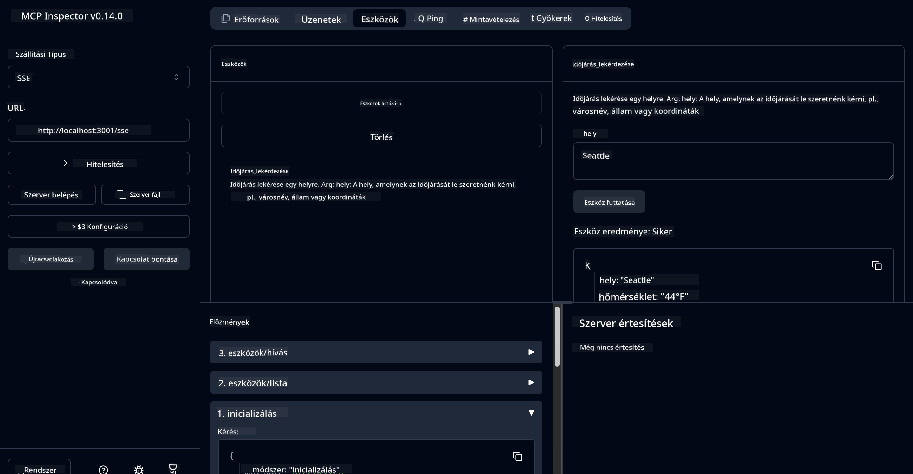

<!--
CO_OP_TRANSLATOR_METADATA:
{
  "original_hash": "dd8da3f75addcef453fe11f02a270217",
  "translation_date": "2025-07-14T08:18:21+00:00",
  "source_file": "10-StreamliningAIWorkflowsBuildingAnMCPServerWithAIToolkit/lab3/README.md",
  "language_code": "hu"
}
-->
# 🔧 Modul 3: Fejlett MCP Fejlesztés az AI Toolkit segítségével


## 🎯 Tanulási célok

A labor végére képes leszel:

- ✅ Egyedi MCP szervereket létrehozni az AI Toolkit segítségével
- ✅ Beállítani és használni a legfrissebb MCP Python SDK-t (v1.9.3)
- ✅ Telepíteni és használni az MCP Inspectort hibakereséshez
- ✅ Hibakeresni MCP szervereket mind az Agent Builder, mind az Inspector környezetben
- ✅ Megérteni a fejlett MCP szerverfejlesztési munkafolyamatokat

## 📋 Előfeltételek

- A 2. labor (MCP Alapok) elvégzése
- VS Code AI Toolkit kiterjesztéssel telepítve
- Python 3.10+ környezet
- Node.js és npm az Inspector telepítéséhez

## 🏗️ Amit építeni fogsz

Ebben a laborban egy **Weather MCP Server**-t hozol létre, amely bemutatja:
- Egyedi MCP szerver megvalósítását
- Integrációt az AI Toolkit Agent Builderrel
- Professzionális hibakeresési munkafolyamatokat
- Modern MCP SDK használati mintákat

---

## 🔧 Fő komponensek áttekintése

### 🐍 MCP Python SDK  
A Model Context Protocol Python SDK adja az alapot az egyedi MCP szerverek építéséhez. A 1.9.3-as verziót használod, amely fejlett hibakeresési funkciókat tartalmaz.

### 🔍 MCP Inspector  
Egy erőteljes hibakereső eszköz, amely lehetővé teszi:
- A szerver valós idejű monitorozását
- Az eszközök futtatásának vizualizálását
- Hálózati kérések és válaszok vizsgálatát
- Interaktív tesztelési környezetet

---

## 📖 Lépésről lépésre megvalósítás

### 1. lépés: Hozz létre egy WeatherAgent-et az Agent Builderben

1. **Indítsd el az Agent Buildert** a VS Code AI Toolkit kiterjesztésén keresztül  
2. **Hozz létre egy új agentet** a következő beállításokkal:  
   - Agent neve: `WeatherAgent`



### 2. lépés: Inicializáld az MCP Server projektet

1. **Navigálj a Tools → Add Tool** menüpontra az Agent Builderben  
2. **Válaszd ki az "MCP Server" opciót**  
3. **Válaszd a "Create A new MCP Server" lehetőséget**  
4. **Válaszd a `python-weather` sablont**  
5. **Nevezd el a szervered:** `weather_mcp`



### 3. lépés: Nyisd meg és vizsgáld meg a projektet

1. **Nyisd meg a generált projektet** a VS Code-ban  
2. **Tekintsd át a projekt struktúráját:**  
   ```
   weather_mcp/
   ├── src/
   │   ├── __init__.py
   │   └── server.py
   ├── inspector/
   │   ├── package.json
   │   └── package-lock.json
   ├── .vscode/
   │   ├── launch.json
   │   └── tasks.json
   ├── pyproject.toml
   └── README.md
   ```

### 4. lépés: Frissítsd a legújabb MCP SDK-ra

> **🔍 Miért frissítsünk?** A legújabb MCP SDK-t (v1.9.3) és Inspector szolgáltatást (0.14.0) szeretnénk használni a fejlettebb funkciók és jobb hibakeresés érdekében.

#### 4a. Python függőségek frissítése

**Szerkeszd a `pyproject.toml` fájlt:** frissítsd a [./code/weather_mcp/pyproject.toml](../../../../10-StreamliningAIWorkflowsBuildingAnMCPServerWithAIToolkit/lab3/code/weather_mcp/pyproject.toml) fájlt

#### 4b. Inspector konfiguráció frissítése

**Szerkeszd az `inspector/package.json` fájlt:** frissítsd a [./code/weather_mcp/inspector/package.json](../../../../10-StreamliningAIWorkflowsBuildingAnMCPServerWithAIToolkit/lab3/code/weather_mcp/inspector/package.json) fájlt

#### 4c. Inspector függőségek frissítése

**Szerkeszd az `inspector/package-lock.json` fájlt:** frissítsd a [./code/weather_mcp/inspector/package-lock.json](../../../../10-StreamliningAIWorkflowsBuildingAnMCPServerWithAIToolkit/lab3/code/weather_mcp/inspector/package-lock.json) fájlt

> **📝 Megjegyzés:** Ez a fájl kiterjedt függőségdefiníciókat tartalmaz. Lentebb a lényeges szerkezet látható – a teljes tartalom biztosítja a helyes függőségkezelést.

> **⚡ Teljes Package Lock:** A teljes package-lock.json körülbelül 3000 sor függőségdefiníciót tartalmaz. A fentiek a kulcsfontosságú szerkezetet mutatják – a teljes függőségkezeléshez használd a mellékelt fájlt.

### 5. lépés: VS Code hibakeresés beállítása

*Megjegyzés: Kérjük, másold át a megadott elérési úton található fájlt a helyi fájl felülírásához*

#### 5a. Indítási konfiguráció frissítése

**Szerkeszd a `.vscode/launch.json` fájlt:**

```json
{
  "version": "0.2.0",
  "configurations": [
    {
      "name": "Attach to Local MCP",
      "type": "debugpy",
      "request": "attach",
      "connect": {
        "host": "localhost",
        "port": 5678
      },
      "presentation": {
        "hidden": true
      },
      "internalConsoleOptions": "neverOpen",
      "postDebugTask": "Terminate All Tasks"
    },
    {
      "name": "Launch Inspector (Edge)",
      "type": "msedge",
      "request": "launch",
      "url": "http://localhost:6274?timeout=60000&serverUrl=http://localhost:3001/sse#tools",
      "cascadeTerminateToConfigurations": [
        "Attach to Local MCP"
      ],
      "presentation": {
        "hidden": true
      },
      "internalConsoleOptions": "neverOpen"
    },
    {
      "name": "Launch Inspector (Chrome)",
      "type": "chrome",
      "request": "launch",
      "url": "http://localhost:6274?timeout=60000&serverUrl=http://localhost:3001/sse#tools",
      "cascadeTerminateToConfigurations": [
        "Attach to Local MCP"
      ],
      "presentation": {
        "hidden": true
      },
      "internalConsoleOptions": "neverOpen"
    }
  ],
  "compounds": [
    {
      "name": "Debug in Agent Builder",
      "configurations": [
        "Attach to Local MCP"
      ],
      "preLaunchTask": "Open Agent Builder",
    },
    {
      "name": "Debug in Inspector (Edge)",
      "configurations": [
        "Launch Inspector (Edge)",
        "Attach to Local MCP"
      ],
      "preLaunchTask": "Start MCP Inspector",
      "stopAll": true
    },
    {
      "name": "Debug in Inspector (Chrome)",
      "configurations": [
        "Launch Inspector (Chrome)",
        "Attach to Local MCP"
      ],
      "preLaunchTask": "Start MCP Inspector",
      "stopAll": true
    }
  ]
}
```

**Szerkeszd a `.vscode/tasks.json` fájlt:**

```
{
  "version": "2.0.0",
  "tasks": [
    {
      "label": "Start MCP Server",
      "type": "shell",
      "command": "python -m debugpy --listen 127.0.0.1:5678 src/__init__.py sse",
      "isBackground": true,
      "options": {
        "cwd": "${workspaceFolder}",
        "env": {
          "PORT": "3001"
        }
      },
      "problemMatcher": {
        "pattern": [
          {
            "regexp": "^.*$",
            "file": 0,
            "location": 1,
            "message": 2
          }
        ],
        "background": {
          "activeOnStart": true,
          "beginsPattern": ".*",
          "endsPattern": "Application startup complete|running"
        }
      }
    },
    {
      "label": "Start MCP Inspector",
      "type": "shell",
      "command": "npm run dev:inspector",
      "isBackground": true,
      "options": {
        "cwd": "${workspaceFolder}/inspector",
        "env": {
          "CLIENT_PORT": "6274",
          "SERVER_PORT": "6277",
        }
      },
      "problemMatcher": {
        "pattern": [
          {
            "regexp": "^.*$",
            "file": 0,
            "location": 1,
            "message": 2
          }
        ],
        "background": {
          "activeOnStart": true,
          "beginsPattern": "Starting MCP inspector",
          "endsPattern": "Proxy server listening on port"
        }
      },
      "dependsOn": [
        "Start MCP Server"
      ]
    },
    {
      "label": "Open Agent Builder",
      "type": "shell",
      "command": "echo ${input:openAgentBuilder}",
      "presentation": {
        "reveal": "never"
      },
      "dependsOn": [
        "Start MCP Server"
      ],
    },
    {
      "label": "Terminate All Tasks",
      "command": "echo ${input:terminate}",
      "type": "shell",
      "problemMatcher": []
    }
  ],
  "inputs": [
    {
      "id": "openAgentBuilder",
      "type": "command",
      "command": "ai-mlstudio.agentBuilder",
      "args": {
        "initialMCPs": [ "local-server-weather_mcp" ],
        "triggeredFrom": "vsc-tasks"
      }
    },
    {
      "id": "terminate",
      "type": "command",
      "command": "workbench.action.tasks.terminate",
      "args": "terminateAll"
    }
  ]
}
```

---

## 🚀 MCP szerver futtatása és tesztelése

### 6. lépés: Függőségek telepítése

A konfigurációs módosítások után futtasd a következő parancsokat:

**Python függőségek telepítése:**  
```bash
uv sync
```

**Inspector függőségek telepítése:**  
```bash
cd inspector
npm install
```

### 7. lépés: Hibakeresés az Agent Builderrel

1. **Nyomd meg az F5-öt** vagy válaszd a **"Debug in Agent Builder"** konfigurációt  
2. **Válaszd ki az összetett konfigurációt** a hibakereső panelen  
3. **Várd meg, amíg elindul a szerver és megnyílik az Agent Builder**  
4. **Teszteld az időjárás MCP szerveredet természetes nyelvű lekérdezésekkel**

Írj be például ilyet:

SYSTEM_PROMPT

```
You are my weather assistant
```

USER_PROMPT

```
How's the weather like in Seattle
```



### 8. lépés: Hibakeresés az MCP Inspectorral

1. **Használd a "Debug in Inspector" konfigurációt** (Edge vagy Chrome böngészőben)  
2. **Nyisd meg az Inspector felületét** a `http://localhost:6274` címen  
3. **Fedezd fel az interaktív tesztelési környezetet:**  
   - Nézd meg az elérhető eszközöket  
   - Teszteld az eszközök futtatását  
   - Figyeld a hálózati kéréseket  
   - Hibakeresd a szerver válaszait



---

## 🎯 Fő tanulságok

A labor elvégzésével:

- [x] **Létrehoztál egy egyedi MCP szervert** az AI Toolkit sablonjai alapján  
- [x] **Frissítettél a legújabb MCP SDK-ra** (v1.9.3) a jobb funkcionalitásért  
- [x] **Beállítottál professzionális hibakeresési munkafolyamatokat** mind az Agent Builder, mind az Inspector számára  
- [x] **Telepítetted az MCP Inspectort** az interaktív szerverteszteléshez  
- [x] **Elsajátítottad a VS Code hibakeresési konfigurációit** MCP fejlesztéshez

## 🔧 Felfedezett fejlett funkciók

| Funkció | Leírás | Használati eset |
|---------|---------|-----------------|
| **MCP Python SDK v1.9.3** | Legújabb protokoll implementáció | Modern szerverfejlesztés |
| **MCP Inspector 0.14.0** | Interaktív hibakereső eszköz | Valós idejű szervertesztelés |
| **VS Code hibakeresés** | Integrált fejlesztői környezet | Professzionális hibakeresési munkafolyamat |
| **Agent Builder integráció** | Közvetlen AI Toolkit kapcsolat | Végponttól végpontig terjedő agent tesztelés |

## 📚 További források

- [MCP Python SDK dokumentáció](https://modelcontextprotocol.io/docs/sdk/python)  
- [AI Toolkit kiterjesztés útmutató](https://code.visualstudio.com/docs/ai/ai-toolkit)  
- [VS Code hibakeresési dokumentáció](https://code.visualstudio.com/docs/editor/debugging)  
- [Model Context Protocol specifikáció](https://modelcontextprotocol.io/docs/concepts/architecture)

---

**🎉 Gratulálunk!** Sikeresen befejezted a 3. labort, és most már képes vagy egyedi MCP szervereket létrehozni, hibakeresni és telepíteni professzionális fejlesztési munkafolyamatokkal.

### 🔜 Folytatás a következő modullal

Készen állsz, hogy az MCP tudásodat valós fejlesztési munkafolyamatban alkalmazd? Folytasd a **[4. modul: Gyakorlati MCP fejlesztés – Egyedi GitHub klón szerver](../lab4/README.md)** modullal, ahol:  
- Egy éles környezetbe szánt MCP szervert építesz, amely automatizálja a GitHub tárhely műveleteket  
- Megvalósítod a GitHub tárhely klónozását MCP-n keresztül  
- Integrálod az egyedi MCP szervereket a VS Code-dal és a GitHub Copilot Agent Mode-dal  
- Teszteled és élesíted az egyedi MCP szervereket  
- Megtanulod a fejlesztők számára hasznos munkafolyamat-automatizálást

**Jogi nyilatkozat**:  
Ez a dokumentum az AI fordító szolgáltatás, a [Co-op Translator](https://github.com/Azure/co-op-translator) segítségével készült. Bár a pontosságra törekszünk, kérjük, vegye figyelembe, hogy az automatikus fordítások hibákat vagy pontatlanságokat tartalmazhatnak. Az eredeti dokumentum az anyanyelvén tekintendő hiteles forrásnak. Fontos információk esetén szakmai, emberi fordítást javaslunk. Nem vállalunk felelősséget a fordítás használatából eredő félreértésekért vagy téves értelmezésekért.