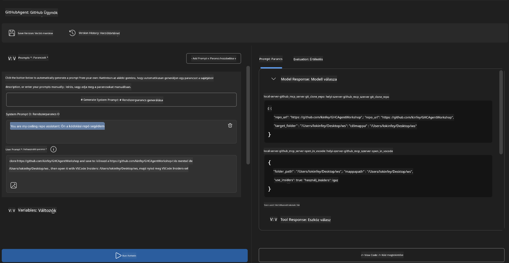
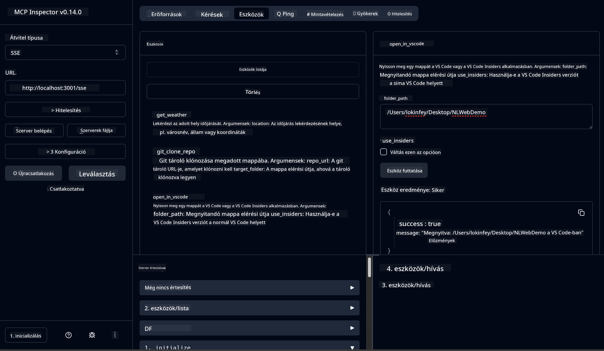

<!--
CO_OP_TRANSLATOR_METADATA:
{
  "original_hash": "f83bc722dc758efffd68667d6a1db470",
  "translation_date": "2025-07-14T08:46:21+00:00",
  "source_file": "10-StreamliningAIWorkflowsBuildingAnMCPServerWithAIToolkit/lab4/README.md",
  "language_code": "hu"
}
-->
# 🐙 4. modul: Gyakorlati MCP fejlesztés – Egyedi GitHub klón szerver


> **⚡ Gyors kezdés:** Építs egy éles környezetbe alkalmas MCP szervert, amely 30 perc alatt automatizálja a GitHub tárolók klónozását és a VS Code integrációt!

## 🎯 Tanulási célok

A labor végére képes leszel:

- ✅ Egyedi MCP szervert létrehozni valós fejlesztési munkafolyamatokhoz
- ✅ Megvalósítani a GitHub tárolók klónozását MCP-n keresztül
- ✅ Integrálni az egyedi MCP szervereket a VS Code-dal és az Agent Builderrel
- ✅ Használni a GitHub Copilot Agent Mode-ot egyedi MCP eszközökkel
- ✅ Tesztelni és éles környezetben telepíteni az egyedi MCP szervereket

## 📋 Előfeltételek

- Az 1-3. laborok elvégzése (MCP alapok és haladó fejlesztés)
- GitHub Copilot előfizetés ([ingyenes regisztráció elérhető](https://github.com/github-copilot/signup))
- VS Code AI Toolkit és GitHub Copilot bővítményekkel
- Telepített és konfigurált Git CLI

## 🏗️ Projekt áttekintés

### **Valós fejlesztési kihívás**  
Fejlesztőként gyakran használjuk a GitHub-ot tárolók klónozására, majd megnyitjuk őket VS Code-ban vagy VS Code Insiders-ben. Ez a manuális folyamat a következő lépésekből áll:  
1. Terminál/parancssor megnyitása  
2. A kívánt könyvtárba navigálás  
3. `git clone` parancs futtatása  
4. VS Code megnyitása a klónozott könyvtárban  

**Az MCP megoldásunk ezt egyetlen intelligens parancsba sűríti!**

### **Mit fogsz építeni**  
Egy **GitHub Clone MCP szervert** (`git_mcp_server`), amely a következőket nyújtja:

| Funkció | Leírás | Előny |
|---------|-------------|---------|
| 🔄 **Okos tároló klónozás** | GitHub tárolók klónozása érvényesítéssel | Automatikus hibakezelés |
| 📁 **Intelligens könyvtárkezelés** | Biztonságos könyvtár ellenőrzés és létrehozás | Felülírás megelőzése |
| 🚀 **Platformfüggetlen VS Code integráció** | Projektek megnyitása VS Code/Insiders-ben | Zökkenőmentes munkafolyamat |
| 🛡️ **Robosztus hibakezelés** | Hálózati, jogosultsági és elérési hibák kezelése | Éles környezetbe alkalmas megbízhatóság |

---

## 📖 Lépésről lépésre megvalósítás

### 1. lépés: GitHub Agent létrehozása az Agent Builderben

1. **Indítsd el az Agent Buildert** az AI Toolkit bővítményből  
2. **Hozz létre egy új agentet** az alábbi konfigurációval:  
   ```
   Agent Name: GitHubAgent
   ```

3. **Inicializáld az egyedi MCP szervert:**  
   - Navigálj a **Tools** → **Add Tool** → **MCP Server** menüpontra  
   - Válaszd a **"Create A new MCP Server"** opciót  
   - Válaszd a **Python sablont** a maximális rugalmasságért  
   - **Szerver neve:** `git_mcp_server`

### 2. lépés: GitHub Copilot Agent Mode konfigurálása

1. **Nyisd meg a GitHub Copilotot** VS Code-ban (Ctrl/Cmd + Shift + P → "GitHub Copilot: Open")  
2. **Válaszd ki az Agent Modelt** a Copilot felületén  
3. **Válaszd a Claude 3.7 modellt** a fejlettebb érvelési képességekért  
4. **Kapcsold be az MCP integrációt** az eszközhozzáféréshez

> **💡 Profi tipp:** A Claude 3.7 jobban érti a fejlesztési munkafolyamatokat és a hibakezelési mintákat.

### 3. lépés: Az MCP szerver alapfunkcióinak megvalósítása

**Használd a következő részletes promptot a GitHub Copilot Agent Mode-ban:**

```
Create two MCP tools with the following comprehensive requirements:

🔧 TOOL A: clone_repository
Requirements:
- Clone any GitHub repository to a specified local folder
- Return the absolute path of the successfully cloned project
- Implement comprehensive validation:
  ✓ Check if target directory already exists (return error if exists)
  ✓ Validate GitHub URL format (https://github.com/user/repo)
  ✓ Verify git command availability (prompt installation if missing)
  ✓ Handle network connectivity issues
  ✓ Provide clear error messages for all failure scenarios

🚀 TOOL B: open_in_vscode
Requirements:
- Open specified folder in VS Code or VS Code Insiders
- Cross-platform compatibility (Windows/Linux/macOS)
- Use direct application launch (not terminal commands)
- Auto-detect available VS Code installations
- Handle cases where VS Code is not installed
- Provide user-friendly error messages

Additional Requirements:
- Follow MCP 1.9.3 best practices
- Include proper type hints and documentation
- Implement logging for debugging purposes
- Add input validation for all parameters
- Include comprehensive error handling
```

### 4. lépés: MCP szerver tesztelése

#### 4a. Tesztelés az Agent Builderben

1. **Indítsd el a debug konfigurációt** az Agent Builderben  
2. **Állítsd be az agentet a következő rendszer prompttal:**  

```
SYSTEM_PROMPT:
You are my intelligent coding repository assistant. You help developers efficiently clone GitHub repositories and set up their development environment. Always provide clear feedback about operations and handle errors gracefully.
```

3. **Teszteld valós felhasználói forgatókönyvekkel:**  

```
USER_PROMPT EXAMPLES:

Scenario : Basic Clone and Open
"Clone {Your GitHub Repo link such as https://github.com/kinfey/GHCAgentWorkshop
 } and save to {The global path you specify}, then open it with VS Code Insiders"
```



**Várt eredmények:**  
- ✅ Sikeres klónozás és elérési út megerősítése  
- ✅ Automatikus VS Code indítás  
- ✅ Egyértelmű hibaüzenetek érvénytelen esetekre  
- ✅ Szélsőséges esetek megfelelő kezelése

#### 4b. Tesztelés az MCP Inspectorban



---

**🎉 Gratulálunk!** Sikeresen létrehoztál egy gyakorlati, éles környezetbe alkalmas MCP szervert, amely megoldja a valós fejlesztési munkafolyamatok kihívásait. Az egyedi GitHub klón szervered bizonyítja az MCP erejét a fejlesztői hatékonyság automatizálásában és növelésében.

### 🏆 Elért eredmények:  
- ✅ **MCP fejlesztő** – Egyedi MCP szerver létrehozása  
- ✅ **Munkafolyamat automatizáló** – Fejlesztési folyamatok egyszerűsítése  
- ✅ **Integrációs szakértő** – Több fejlesztői eszköz összekapcsolása  
- ✅ **Éles környezetre kész** – Telepíthető megoldások építése

---

## 🎓 Workshop befejezése: Az utad a Model Context Protocol-lal

**Kedves Workshop résztvevő!**

Gratulálunk, hogy befejezted a Model Context Protocol workshop mind a négy modulját! Hosszú utat tettél meg az AI Toolkit alapjainak megértésétől az éles környezetbe alkalmas MCP szerverek építéséig, amelyek valós fejlesztési kihívásokat oldanak meg.

### 🚀 Tanulási út összefoglaló:

**[1. modul](../lab1/README.md):** Megismerted az AI Toolkit alapjait, modellek tesztelését és az első AI agent létrehozását.

**[2. modul](../lab2/README.md):** Megtanultad az MCP architektúrát, integráltad a Playwright MCP-t, és elkészítetted az első böngésző automatizáló agentet.

**[3. modul](../lab3/README.md):** Haladó MCP szerver fejlesztést végeztél a Weather MCP szerverrel, és elsajátítottad a hibakereső eszközök használatát.

**[4. modul](../lab4/README.md):** Most mindezt alkalmaztad egy gyakorlati GitHub tároló munkafolyamat automatizáló eszköz létrehozására.

### 🌟 Amit elsajátítottál:

- ✅ **AI Toolkit ökoszisztéma:** Modellek, agentek és integrációs minták  
- ✅ **MCP architektúra:** Kliens-szerver felépítés, protokollok és biztonság  
- ✅ **Fejlesztői eszközök:** Playground, Inspector és éles telepítés  
- ✅ **Egyedi fejlesztés:** Saját MCP szerverek építése, tesztelése és telepítése  
- ✅ **Gyakorlati alkalmazások:** Valós munkafolyamatok megoldása AI segítségével

### 🔮 Következő lépések:

1. **Építsd meg saját MCP szerveredet:** Használd ezeket a képességeket egyedi munkafolyamataid automatizálására  
2. **Csatlakozz az MCP közösséghez:** Oszd meg alkotásaidat és tanulj másoktól  
3. **Fedezd fel a haladó integrációkat:** Kapcsold össze az MCP szervereket vállalati rendszerekkel  
4. **Járulj hozzá nyílt forráskódhoz:** Segíts az MCP eszközök és dokumentáció fejlesztésében

Ne feledd, ez a workshop csak a kezdet. A Model Context Protocol ökoszisztéma gyorsan fejlődik, és most már fel vagy készülve, hogy az AI-alapú fejlesztői eszközök élvonalában legyél.

**Köszönjük a részvételedet és a tanulás iránti elkötelezettségedet!**

Reméljük, hogy ez a workshop inspirációt adott, amely megváltoztatja, hogyan építesz és használsz AI eszközöket a fejlesztői munkád során.

**Jó kódolást!**

---

**Jogi nyilatkozat**:  
Ez a dokumentum az AI fordító szolgáltatás, a [Co-op Translator](https://github.com/Azure/co-op-translator) segítségével készült. Bár a pontosságra törekszünk, kérjük, vegye figyelembe, hogy az automatikus fordítások hibákat vagy pontatlanságokat tartalmazhatnak. Az eredeti dokumentum az anyanyelvén tekintendő hiteles forrásnak. Kritikus információk esetén professzionális emberi fordítást javaslunk. Nem vállalunk felelősséget az ebből a fordításból eredő félreértésekért vagy téves értelmezésekért.