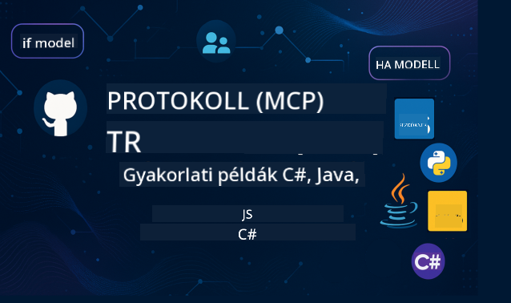

<!--
CO_OP_TRANSLATOR_METADATA:
{
  "original_hash": "2a21391378c12ecfef50f866329dfde0",
  "translation_date": "2025-05-17T05:32:49+00:00",
  "source_file": "README.md",
  "language_code": "hu"
}
-->

Kövesd ezeket a lépéseket, hogy elkezdhesd használni ezeket az erőforrásokat:
1. **Forkold a tárolót**: Kattints 
2. **Klónozd a tárolót**: `git clone https://github.com/microsoft/mcp-for-beginners.git`
3. [**Csatlakozz a Microsoft Azure AI Foundry Discordhoz, és ismerkedj meg szakértőkkel és fejlesztőtársakkal**](https://discord.com/invite/ByRwuEEgH4)

### 🌐 Többnyelvű támogatás

#### Támogatott GitHub Action révén (Automatizált és mindig naprakész)
[Francia](../fr/README.md) | [Spanyol](../es/README.md) | [Német](../de/README.md) | [Orosz](../ru/README.md) | [Arab](../ar/README.md) | [Perzsa (Farsi)](../fa/README.md) | [Urdu](../ur/README.md) | [Kínai (egyszerűsített)](../zh/README.md) | [Kínai (hagyományos, Makaó)](../mo/README.md) | [Kínai (hagyományos, Hongkong)](../hk/README.md) | [Kínai (hagyományos, Tajvan)](../tw/README.md) | [Japán](../ja/README.md) | [Koreai](../ko/README.md) | [Hindi](../hi/README.md) | [Bengáli](../bn/README.md) | [Marathi](../mr/README.md) | [Nepáli](../ne/README.md) | [Pandzsábi (Gurmukhi)](../pa/README.md) | [Portugál (Portugália)](../pt/README.md) | [Portugál (Brazília)](../br/README.md) | [Olasz](../it/README.md) | [Lengyel](../pl/README.md) | [Török](../tr/README.md) | [Görög](../el/README.md) | [Thai](../th/README.md) | [Svéd](../sv/README.md) | [Dán](../da/README.md) | [Norvég](../no/README.md) | [Finn](../fi/README.md) | [Holland](../nl/README.md) | [Héber](../he/README.md) | [Vietnámi](../vi/README.md) | [Indonéz](../id/README.md) | [Maláj](../ms/README.md) | [Tagalog (Filippínó)](../tl/README.md) | [Szuahéli](../sw/README.md) | [Magyar](./README.md) | [Cseh](../cs/README.md) | [Szlovák](../sk/README.md) | [Román](../ro/README.md) | [Bolgár](../bg/README.md) | [Szerb (cirill)](../sr/README.md) | [Horvát](../hr/README.md) | [Szlovén](../sl/README.md)
# 🚀 Kezdőknek szóló Végső Útmutató a Model Context Protocol (MCP) Tananyaghoz

## **Tanulj MCP-t gyakorlati kódpéldákkal C#, Java, JavaScript, Python és TypeScript nyelveken**

## 🧠 A Model Context Protocol Tananyag Áttekintése

A **Model Context Protocol (MCP)** egy korszerű keretrendszer, amely az AI modellek és kliens alkalmazások közötti interakciók szabványosítására készült. Ez a nyílt forráskódú tananyag egy strukturált tanulási utat kínál, gyakorlati kódpéldákkal és valós használati esetekkel, népszerű programozási nyelveken, mint a C#, Java, JavaScript, TypeScript és Python.

Akár AI fejlesztő, rendszerarchitekt vagy szoftvermérnök vagy, ez az útmutató átfogó forrásod az MCP alapjainak és megvalósítási stratégiáinak elsajátításához.

## 🔗 Hivatalos MCP Források

- 📘 [MCP Dokumentáció](https://modelcontextprotocol.io/) – Részletes oktatóanyagok és felhasználói útmutatók  
- 📜 [MCP Specifikáció](https://spec.modelcontextprotocol.io/) – Protokoll architektúra és technikai hivatkozások  
- 🧑‍💻 [MCP GitHub Tároló](https://github.com/modelcontextprotocol) – Nyílt forráskódú SDK-k, eszközök és kódminták  

## 🧭 Teljes MCP Tananyag Felépítése

### 📌 [Bevezetés az MCP-be](./00-Introduction/README.md)

- Mi az a Model Context Protocol?
- Miért fontos a szabványosítás az AI folyamatokban?
- Gyakorlati használati esetek és az MCP előnyei

### 🧩 [Alapfogalmak Magyarázata](./01-CoreConcepts/README.md)

- Kliens-szerver architektúra megértése az MCP-ben
- Kulcsfontosságú protokoll elemek: kérések, válaszok és sémák
- MCP üzenetküldési és adatcsere minták

### 🔐 [Biztonság az MCP-ben](./02-Security/readme.md)

- Biztonsági fenyegetések az MCP-alapú rendszerekben
- Technikák és legjobb gyakorlatok a megvalósítások biztosításához

### 🚀 [Kezdés az MCP-vel](./03-GettingStarted/README.md)

- Környezet beállítása és konfigurálása
- Alapvető MCP szerverek és kliensek létrehozása
- MCP integrálása meglévő alkalmazásokkal

#### 🧮 MCP Kalkulátor Mintaprojektek:

  
<strong>Kódmegvalósítások Felfedezése Nyelvek Szerint</strong>

  - [C# MCP Szerver Példa](./03-GettingStarted/samples/csharp/README.md)
  - [Java MCP Kalkulátor](./03-GettingStarted/samples/java/calculator/README.md)
  - [JavaScript MCP Bemutató](./03-GettingStarted/samples/javascript/README.md)
  - [Python MCP Szerver](../../03-GettingStarted/samples/python/mcp_calculator_server.py)
  - [TypeScript MCP Példa](./03-GettingStarted/samples/typescript/README.md)

### 🛠️ [Gyakorlati Megvalósítás](./04-PracticalImplementation/README.md)

- SDK-k használata különböző nyelveken
- Hibakeresés, tesztelés és érvényesítés
- Újrahasznosítható prompt sablonok és munkafolyamatok készítése

#### 💡 MCP Fejlett Kalkulátor Projektek:

  
<strong>Fejlett Minták Felfedezése</strong>

  - [Fejlett C# Minta](./04-PracticalImplementation/samples/csharp/README.md)
  - [Java Konténer Alkalmazás Példa](./04-PracticalImplementation/samples/java/containerapp/README.md)
  - [JavaScript Fejlett Minta](./04-PracticalImplementation/samples/javascript/README.md)
  - [Python Komplex Megvalósítás](../../04-PracticalImplementation/samples/python/mcp_sample.py)
  - [TypeScript Konténer Minta](./04-PracticalImplementation/samples/typescript/README.md)

### 🎓 [Fejlett Témák az MCP-ben](./05-AdvancedTopics/README.md)

- Multimodális AI munkafolyamatok és kiterjeszthetőség
- Biztonságos skálázási stratégiák
- MCP vállalati ökoszisztémákban

### 🌍 [Közösségi Hozzájárulások](./06-CommunityContributions/README.md)

- Hogyan járulhatsz hozzá kóddal és dokumentációval
- Együttműködés GitHubon keresztül
- Közösség által vezérelt fejlesztések és visszajelzések

### 📈 [Belső Tapasztalatok a Korai Alkalmazásból](./07-CaseStudies/README.md)

- Valós megvalósítások és ami működött
- MCP-alapú megoldások építése és telepítése
- Trendek és jövőbeli útvonalterv

### 📏 [Legjobb Gyakorlatok az MCP-hez](./08-BestPractices/README.md)

- Teljesítményhangolás és optimalizálás
- Hibatűrő MCP rendszerek tervezése
- Tesztelési és ellenállási stratégiák

### 📊 [MCP Esettanulmányok](./09-CaseStudy/Readme.md)

- MCP megoldás architektúrák mélyreható elemzése
- Telepítési tervrajzok és integrációs tippek
- Annotált diagramok és projekt bemutatók

## 🎯 Előfeltételek az MCP Tanulásához

Ahhoz, hogy a legtöbbet hozd ki ebből a tananyagból, rendelkezned kell:

- Alapvető ismeretek C#, Java vagy Python nyelvből
- Kliens-szerver modell és API-k megértése
- (Opcionális) Gépi tanulási fogalmak ismerete

## 🛠️ Hogyan Használhatod Hatékonyan Ezt a Tananyagot

Az útmutató minden leckéje tartalmazza:

1. MCP fogalmak világos magyarázata  
2. Élő kódpéldák több nyelven  
3. Gyakorlatok valódi MCP alkalmazások építéséhez  
4. Extra források haladó tanulóknak  

## 📜 Licenc Információ

Ez a tartalom az **MIT Licenc** alatt van licencelve. A feltételekért és kikötésekért lásd a [LICENSE](../../LICENSE).

## 🤝 Hozzájárulási Irányelvek

Ez a projekt örömmel fogad hozzájárulásokat és javaslatokat. A legtöbb hozzájárulás megköveteli, hogy beleegyezz abba, hogy aláírsz egy
Hozzájárulói Licenc Megállapodást (CLA), amely kijelenti, hogy jogod van, és ténylegesen megadod nekünk
a jogokat a hozzájárulásod felhasználására. Részletekért látogasd meg a <https://cla.opensource.microsoft.com>.

Amikor beküldesz egy pull requestet, egy CLA bot automatikusan meghatározza, hogy szükséges-e
CLA-t biztosítanod, és ennek megfelelően díszíti a PR-t (pl. státusz ellenőrzés, megjegyzés). Csak kövesd a bot által adott utasításokat.
Ezt csak egyszer kell megtenned minden repo esetében, amely a CLA-t használja.

Ez a projekt elfogadta a [Microsoft Open Source Code of Conduct](https://opensource.microsoft.com/codeofconduct/).
További információkért lásd a [Code of Conduct FAQ](https://opensource.microsoft.com/codeofconduct/faq/) vagy
lépj kapcsolatba [opencode@microsoft.com](mailto:opencode@microsoft.com) további kérdésekkel vagy megjegyzésekkel.

## ™️ Védjegy Közlemény

Ez a projekt tartalmazhat védjegyeket vagy logókat projektekhez, termékekhez vagy szolgáltatásokhoz. A Microsoft
védjegyek vagy logók jogosult használata a [Microsoft Trademark & Brand Guidelines](https://www.microsoft.com/legal/intellectualproperty/trademarks/usage/general) követésének tárgyát képezi.
A Microsoft védjegyek vagy logók használata a projekt módosított verzióiban nem okozhat zavart vagy nem sugallhatja a Microsoft támogatását.
Bármilyen harmadik fél védjegyek vagy logók használata az adott harmadik fél politikájának tárgyát képezi.

**Jogi nyilatkozat**:  
Ez a dokumentum az [Co-op Translator](https://github.com/Azure/co-op-translator) AI fordítási szolgáltatás használatával készült. Bár törekszünk a pontosságra, kérjük, vegye figyelembe, hogy az automatikus fordítások hibákat vagy pontatlanságokat tartalmazhatnak. Az eredeti dokumentum az eredeti nyelvén tekintendő hiteles forrásnak. Kritikus információk esetén javasolt a professzionális emberi fordítás igénybevétele. Nem vállalunk felelősséget a fordítás használatából eredő félreértésekért vagy félreértelmezésekért.