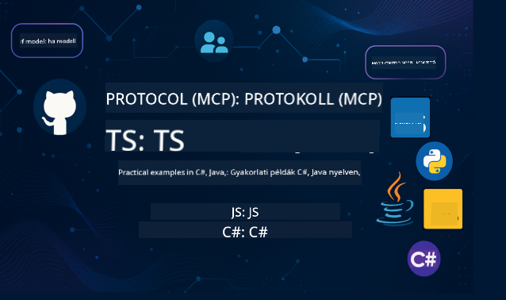

<!--
CO_OP_TRANSLATOR_METADATA:
{
  "original_hash": "db69f754d127d295e6449e29c08ed5c8",
  "translation_date": "2025-09-15T20:57:21+00:00",
  "source_file": "README.md",
  "language_code": "hu"
}
-->
 

Kövesd az alábbi lépéseket, hogy elkezdhesd használni ezeket az erőforrásokat:
1. **Forkold a repót**: Kattints 
2. **Klónozd a repót**:   `git clone https://github.com/microsoft/mcp-for-beginners.git`
3. [**Csatlakozz az Azure AI Foundry Discordhoz, és találkozz szakértőkkel és fejlesztőkkel**](https://discord.com/invite/ByRwuEEgH4)

### 🌐 Többnyelvű támogatás

#### GitHub Action által támogatott (Automatikus és mindig naprakész)

 [Arab](../ar/README.md) | [Bengáli](../bn/README.md) | [Bolgár](../bg/README.md) | [Burmai (Mianmar)](../my/README.md) | [Kínai (Egyszerűsített)](../zh/README.md) | [Kínai (Hagyományos, Hongkong)](../hk/README.md) | [Kínai (Hagyományos, Makaó)](../mo/README.md) | [Kínai (Hagyományos, Tajvan)](../tw/README.md) | [Horvát](../hr/README.md) | [Cseh](../cs/README.md) | [Dán](../da/README.md) | [Holland](../nl/README.md) | [Finn](../fi/README.md) | [Francia](../fr/README.md) | [Német](../de/README.md) | [Görög](../el/README.md) | [Héber](../he/README.md) | [Hindi](../hi/README.md) | [Magyar](./README.md) | [Indonéz](../id/README.md) | [Olasz](../it/README.md) | [Japán](../ja/README.md) | [Koreai](../ko/README.md) | [Maláj](../ms/README.md) | [Maráthi](../mr/README.md) | [Nepáli](../ne/README.md) | [Norvég](../no/README.md) | [Perzsa (Fárszi)](../fa/README.md) | [Lengyel](../pl/README.md) | [Portugál (Brazília)](../br/README.md) | [Portugál (Portugália)](../pt/README.md) | [Pandzsábi (Gurmukhi)](../pa/README.md) | [Román](../ro/README.md) | [Orosz](../ru/README.md) | [Szerb (Cirill)](../sr/README.md) | [Szlovák](../sk/README.md) | [Szlovén](../sl/README.md) | [Spanyol](../es/README.md) | [Szuahéli](../sw/README.md) | [Svéd](../sv/README.md) | [Tagalog (Filippínó)](../tl/README.md) | [Thai](../th/README.md) | [Török](../tr/README.md) | [Ukrán](../uk/README.md) | [Urdu](../ur/README.md) | [Vietnámi](../vi/README.md)

# 🚀 Model Context Protocol (MCP) Tananyag Kezdőknek

## **Tanuld meg az MCP-t gyakorlati kódpéldákkal C#, Java, JavaScript, Rust, Python és TypeScript nyelveken**

## 🧠 Áttekintés az MCP tananyagról

A **Model Context Protocol (MCP)** egy modern keretrendszer, amely szabványosítja az AI modellek és kliensalkalmazások közötti interakciókat. Ez a nyílt forráskódú tananyag strukturált tanulási útvonalat kínál, gyakorlati kódpéldákkal és valós használati esetekkel, népszerű programozási nyelveken, mint például C#, Java, JavaScript, TypeScript és Python.

Akár AI fejlesztő, rendszerarchitekt vagy szoftvermérnök vagy, ez az útmutató átfogó forrás az MCP alapjainak és megvalósítási stratégiáinak elsajátításához.

## 🔗 Hivatalos MCP erőforrások

- 📘 [MCP Dokumentáció](https://modelcontextprotocol.io/) – Részletes útmutatók és felhasználói kézikönyvek  
- 📜 [MCP Specifikáció](https://modelcontextprotocol.io/docs/) – Protokoll architektúra és technikai referenciák  
- 📜 [Eredeti MCP Specifikáció](https://spec.modelcontextprotocol.io/) – Régebbi technikai referenciák (további részleteket tartalmazhatnak)  
- 🧑‍💻 [MCP GitHub Repository](https://github.com/modelcontextprotocol) – Nyílt forráskódú SDK-k, eszközök és kódminták
- 🌐 [MCP Közösség](https://github.com/orgs/modelcontextprotocol/discussions) – Csatlakozz a beszélgetésekhez és járulj hozzá a közösséghez

## 🧭 MCP Tananyag Áttekintés

### 📚 Teljes tananyag struktúra

| Modul | Téma | Leírás | Link |
|--------|-------|-------------|------|
| **1-3. modul: Alapok** | | | |
| 00 | Bevezetés az MCP-be | Áttekintés a Model Context Protocolról és annak jelentőségéről az AI folyamatokban | [Tovább olvasás](./00-Introduction/README.md) |
| 01 | Alapfogalmak magyarázata | Az MCP alapfogalmainak részletes bemutatása | [Tovább olvasás](./01-CoreConcepts/README.md) |
| 02 | Biztonság az MCP-ben | Biztonsági fenyegetések és legjobb gyakorlatok | [Tovább olvasás](./02-Security/README.md) |
| 03 | Első lépések az MCP-vel | Környezet beállítása, alap szerverek/kliens, integráció | [Tovább olvasás](./03-GettingStarted/README.md) |
| **3. modul: Első szerver és kliens létrehozása** | | | |
| 3.1 | Első szerver | Hozd létre az első MCP szerveredet | [Útmutató](./03-GettingStarted/01-first-server/README.md) |
| 3.2 | Első kliens | Fejlessz egy alap MCP klienst | [Útmutató](./03-GettingStarted/02-client/README.md) |
| 3.3 | Kliens LLM-mel | Integrálj nagy nyelvi modelleket | [Útmutató](./03-GettingStarted/03-llm-client/README.md) |
| 3.4 | VS Code integráció | Fogyassz MCP szervereket a VS Code-ban | [Útmutató](./03-GettingStarted/04-vscode/README.md) |
| 3.5 | stdio szerver | Hozz létre szervereket stdio transzporttal | [Útmutató](./03-GettingStarted/05-stdio-server/README.md) |
| 3.6 | HTTP streaming | Valósíts meg HTTP streaminget az MCP-ben | [Útmutató](./03-GettingStarted/06-http-streaming/README.md) |
| 3.7 | AI Toolkit | Használd az AI Toolkitet az MCP-vel | [Útmutató](./03-GettingStarted/07-aitk/README.md) |
| 3.8 | Tesztelés | Teszteld az MCP szerver megvalósításodat | [Útmutató](./03-GettingStarted/08-testing/README.md) |
| 3.9 | Telepítés | Telepítsd az MCP szervereket éles környezetbe | [Útmutató](./03-GettingStarted/09-deployment/README.md) |
| **4-5. modul: Gyakorlati és haladó** | | | |
| 04 | Gyakorlati megvalósítás | SDK-k, hibakeresés, tesztelés, újrahasználható prompt sablonok | [Tovább olvasás](./04-PracticalImplementation/README.md) |
| 05 | Haladó témák az MCP-ben | Multimodális AI, skálázás, vállalati használat | [Tovább olvasás](./05-AdvancedTopics/README.md) |
| 5.1 | Azure integráció | MCP integráció az Azure-val | [Útmutató](./05-AdvancedTopics/mcp-integration/README.md) |
| 5.2 | Multimodalitás | Több modalitás kezelése | [Útmutató](./05-AdvancedTopics/mcp-multi-modality/README.md) |
| 5.3 | OAuth2 demó | Valósíts meg OAuth2 hitelesítést | [Útmutató](./05-AdvancedTopics/mcp-oauth2-demo/README.md) |
| 5.4 | Root kontextusok | Root kontextusok megértése és megvalósítása | [Útmutató](./05-AdvancedTopics/mcp-root-contexts/README.md) |
| 5.5 | Routing | MCP útvonaltervezési stratégiák | [Útmutató](./05-AdvancedTopics/mcp-routing/README.md) |
| 5.6 | Mintavétel | Mintavételi technikák az MCP-ben | [Útmutató](./05-AdvancedTopics/mcp-sampling/README.md) |
| 5.7 | Skálázás | MCP megvalósítások skálázása | [Útmutató](./05-AdvancedTopics/mcp-scaling/README.md) |
| 5.8 | Biztonság | Haladó biztonsági megfontolások | [Útmutató](./05-AdvancedTopics/mcp-security/README.md) |
| 5.9 | Webes keresés | Webes keresési képességek megvalósítása | [Útmutató](./05-AdvancedTopics/web-search-mcp/README.md) |
| 5.10 | Valós idejű streaming | Valós idejű streaming funkciók létrehozása | [Útmutató](./05-AdvancedTopics/mcp-realtimestreaming/README.md) |
| 5.11 | Valós idejű keresés | Valós idejű keresés megvalósítása | [Útmutató](./05-AdvancedTopics/mcp-realtimesearch/README.md) |
| 5.12 | Entra ID Auth | Hitelesítés a Microsoft Entra ID-vel | [Útmutató](./05-AdvancedTopics/mcp-security-entra/README.md) |
| 5.13 | Foundry integráció | Integráció az Azure AI Foundry-val | [Útmutató](./05-AdvancedTopics/mcp-foundry-agent-integration/README.md) |
| 5.14 | Kontextus mérnökség | Hatékony kontextus mérnökségi technikák | [Útmutató](./05-AdvancedTopics/mcp-contextengineering/README.md) |
| 5.15 | MCP egyedi transzport | Egyedi transzport megvalósítások | [Útmutató](./05-AdvancedTopics/mcp-transport/README.md) |

| **6-10. modul: Közösség és legjobb gyakorlatok** | | | |
| 06 | Közösségi hozzájárulások | Hogyan járulhatsz hozzá az MCP ökoszisztémához | [Útmutató](./06-CommunityContributions/README.md) |
| 07 | Korai alkalmazás tanulságai | Valós megvalósítási történetek | [Útmutató](./07-LessonsFromEarlyAdoption/README.md) |
| 08 | Legjobb gyakorlatok az MCP-hez | Teljesítmény, hibatűrés, ellenállóképesség | [Útmutató](./08-BestPractices/README.md) |
| 09 | MCP esettanulmányok | Gyakorlati megvalósítási példák | [Útmutató](./09-CaseStudy/README.md) |
| 10 | Gyakorlati workshop | MCP szerver építése AI Toolkit segítségével | [Labor](./10-StreamliningAIWorkflowsBuildingAnMCPServerWithAIToolkit/README.md) |

### 💻 Példa kódprojektek

#### Alap MCP kalkulátor minták

| Nyelv | Leírás | Link |
|----------|-------------|------|
| C# | MCP szerver példa | [Kód megtekintése](./03-GettingStarted/samples/csharp/README.md) |
| Java | MCP kalkulátor | [Kód megtekintése](./03-GettingStarted/samples/java/calculator/README.md) |
| JavaScript | MCP demó | [Kód megtekintése](./03-GettingStarted/samples/javascript/README.md) |
| Python | MCP szerver | [Kód megtekintése](../../03-GettingStarted/samples/python/mcp_calculator_server.py) |
| TypeScript | MCP példa | [Kód megtekintése](./03-GettingStarted/samples/typescript/README.md) |
| Rust | MCP példa | [Kód megtekintése](./03-GettingStarted/samples/rust/README.md) |
#### Fejlett MCP Megvalósítások

| Nyelv | Leírás | Link |
|-------|--------|------|
| C# | Fejlett példa | [View Code](./04-PracticalImplementation/samples/csharp/README.md) |
| Java Spring keretrendszerrel | Konténeralkalmazás példa | [View Code](./04-PracticalImplementation/samples/java/containerapp/README.md) |
| JavaScript | Fejlett példa | [View Code](./04-PracticalImplementation/samples/javascript/README.md) |
| Python | Komplex megvalósítás | [View Code](../../04-PracticalImplementation/samples/python/READMEmd) |
| TypeScript | Konténer példa | [View Code](./04-PracticalImplementation/samples/typescript/README.md) |

## 🎯 Előfeltételek az MCP tanulásához

Ahhoz, hogy a legtöbbet hozd ki ebből a tananyagból, rendelkezned kell:

- Alapvető programozási ismeretekkel legalább az alábbi nyelvek egyikében: C#, Java, JavaScript, Python vagy TypeScript
- A kliens-szerver modell és az API-k megértésével
- REST és HTTP fogalmak ismeretével
- (Opcionális) AI/ML fogalmak hátterével

- Csatlakozás a közösségi beszélgetéseinkhez támogatásért

## 📚 Tanulási útmutató és források

Ez a repó számos forrást tartalmaz, amelyek segítenek eligazodni és hatékonyan tanulni:

### Tanulási útmutató

Egy átfogó [Tanulási Útmutató](./study_guide.md) áll rendelkezésre, amely segít hatékonyan eligazodni ebben a repóban. Az útmutató tartalmazza:

- Egy vizuális tananyag térképet, amely bemutatja az összes lefedett témát
- Az egyes repó szekciók részletes bontását
- Útmutatást a mintaprojektek használatához
- Ajánlott tanulási útvonalakat különböző készségszintekhez
- További forrásokat, amelyek kiegészítik a tanulási folyamatot

### Változásnapló

Részletes [Változásnaplót](./changelog.md) vezetünk, amely nyomon követi a tananyagok minden jelentős frissítését, beleértve:

- Új tartalom hozzáadását
- Strukturális változásokat
- Funkciófejlesztéseket
- Dokumentációs frissítéseket

## 🛠️ Hogyan használd hatékonyan ezt a tananyagot

Minden lecke ebben az útmutatóban tartalmazza:

1. Az MCP fogalmak világos magyarázatát  
2. Élő kódpéldákat több nyelven  
3. Gyakorlatokat valódi MCP alkalmazások építéséhez  
4. További forrásokat haladó tanulók számára

## Események 

### [MCP Dev Days 2025. július](https://developer.microsoft.com/en-us/reactor/series/S-1563/)
#### [➡️Nézd meg igény szerint - MCP Dev Days](https://developer.microsoft.com/en-us/reactor/series/S-1563/)
Készülj fel két nap mély technikai betekintésre, közösségi kapcsolódásra és gyakorlati tanulásra az MCP Dev Days-en, egy virtuális eseményen, amely az Model Context Protocol (MCP) köré épül — az új szabvány, amely hidat képez az AI modellek és az általuk használt eszközök között.
Az MCP Dev Days megtekintéséhez regisztrálj az esemény oldalán: https://aka.ms/mcpdevdays. 

#### [1. nap: MCP termelékenység, fejlesztői eszközök és közösség:](https://developer.microsoft.com/en-us/reactor/series/S-1563/)

Az első nap célja, hogy a fejlesztőket felhatalmazza az MCP használatára a fejlesztői munkafolyamatukban, és ünnepelje az MCP közösségét. Közösségi tagokkal és partnerekkel, mint Arcade, Block, Okta és Neon, együttműködve bemutatjuk, hogyan dolgoznak együtt a Microsofttal egy nyílt, bővíthető MCP ökoszisztéma kialakításán. Valós példák a VS Code, Visual Studio, GitHub Copilot és népszerű közösségi eszközök használatával
Gyakorlati, kontextusvezérelt fejlesztői munkafolyamatok
Közösség által vezetett szekciók és betekintések
Akár most kezded az MCP tanulását, akár már építesz vele, az első nap inspirációval és gyakorlati tanácsokkal szolgál.

#### [2. nap: MCP szerverek magabiztos építése](https://developer.microsoft.com/en-us/reactor/series/S-1563/)

A második nap az MCP építőknek szól. Mélyen belemegyünk a megvalósítási stratégiákba és a legjobb gyakorlatokba MCP szerverek létrehozásához és az MCP integrálásához az AI munkafolyamatokba.

#### Témák:

- MCP szerverek építése és integrálása ügynökélményekbe
- Prompt-vezérelt fejlesztés
- Biztonsági legjobb gyakorlatok
- Építőelemek, mint a Functions, ACA és API Management használata
- Regisztrációs igazítás és eszközök (1P + 3P)

Ha fejlesztő, eszközépítő vagy AI termékstratéga vagy, ez a nap tele lesz olyan betekintésekkel, amelyekre szükséged van skálázható, biztonságos és jövőálló MCP megoldások építéséhez.

### MCP Boot Camp 2025. augusztus
Intenzív videós szekciókban tanulhatod meg, hogyan hozz létre MCP szervereket, integráld őket a VS Code-ba, és telepítsd professzionálisan az Azure-ra az MCP kezdőknek szóló tananyag alapján. Gyakorlati készségekkel távozhatsz egy olyan technológiában, amelyet már nagy cégek is használnak.

#### [➡️Nézd meg igény szerint MCP Bootcamp | Angol](https://developer.microsoft.com/en-us/reactor/series/s-1568/)
#### [➡️Nézd meg igény szerint MCP Bootcamp | Brazil](https://developer.microsoft.com/en-us/reactor/series/S-1566/)
#### [➡️Nézd meg igény szerint MCP Bootcamp | Spanyol](https://developer.microsoft.com/en-us/reactor/series/S-1567/)

### Tanuljunk MCP-t C#-ban - Oktatási sorozat
Ismerjük meg az Model Context Protocol-t (MCP), egy korszerű keretrendszert, amely szabványosítja az AI modellek és kliensalkalmazások közötti interakciókat. Ebben a kezdőbarát szekcióban bemutatjuk az MCP-t, és végigvezetünk az első MCP szerver létrehozásán.
#### C#: [https://aka.ms/letslearnmcp-csharp](https://aka.ms/letslearnmcp-csharp)
#### Java: [https://aka.ms/letslearnmcp-java](https://aka.ms/letslearnmcp-java)
#### JavaScript: [https://aka.ms/letslearnmcp-javascript](https://aka.ms/letslearnmcp-javascript)
#### Python: [https://aka.ms/letslearnmcp-python](https://aka.ms/letslearnmcp-python)

## 🌟 Közösségi köszönet

Köszönet a Microsoft Valued Professional [Shivam Goyal](https://www.linkedin.com/in/shivam2003/) számára, hogy fontos kódmintákkal járult hozzá. 

## 📜 Licencinformáció

Ez a tartalom az **MIT Licenc** alatt van licencelve. A feltételekért és kikötésekért lásd a [LICENSE](../../LICENSE) fájlt.

## 🤝 Hozzájárulási irányelvek

Ez a projekt szívesen fogad hozzájárulásokat és javaslatokat. A legtöbb hozzájárulás megköveteli, hogy elfogadj egy
Hozzájárulói Licencszerződést (CLA), amely kijelenti, hogy jogod van, és ténylegesen megadod nekünk
a jogokat a hozzájárulásod használatához. Részletekért látogass el a 
<https://cla.opensource.microsoft.com> oldalra.

Amikor benyújtasz egy pull requestet, egy CLA bot automatikusan meghatározza, hogy szükséges-e CLA-t biztosítanod, és megfelelően megjelöli a PR-t (pl. állapotellenőrzés, megjegyzés). Egyszerűen kövesd a bot által adott utasításokat. Ezt csak egyszer kell megtenned az összes CLA-t használó repó esetében.

Ez a projekt elfogadta a [Microsoft Nyílt Forráskódú Magatartási Kódexét](https://opensource.microsoft.com/codeofconduct/).
További információért lásd a [Magatartási Kódex GYIK](https://opensource.microsoft.com/codeofconduct/faq/) vagy
lépj kapcsolatba a [opencode@microsoft.com](mailto:opencode@microsoft.com) címen bármilyen további kérdéssel vagy megjegyzéssel.

## 📂 Repó struktúra

A repó az alábbiak szerint van szervezve:

- **Alaptananyag (00-10)**: A fő tartalom tíz egymást követő modulban szervezve
- **images/**: Diagramok és illusztrációk, amelyek a tananyagban szerepelnek
- **translations/**: Többnyelvű támogatás automatikus fordításokkal
- **translated_images/**: Diagramok és illusztrációk lokalizált verziói
- **study_guide.md**: Átfogó útmutató a repóban való eligazodáshoz
- **changelog.md**: A tananyagok minden jelentős változásának nyilvántartása
- **mcp.json**: Konfigurációs fájl az MCP specifikációhoz
- **CODE_OF_CONDUCT.md, LICENSE, SECURITY.md, SUPPORT.md**: Projektirányítási dokumentumok

## 🎒 Egyéb tanfolyamok
Csapatunk más tanfolyamokat is készít! Nézd meg:

- [AI Agents For Beginners](https://github.com/microsoft/ai-agents-for-beginners?WT.mc_id=academic-105485-koreyst)
- [Generative AI for Beginners using .NET](https://github.com/microsoft/Generative-AI-for-beginners-dotnet?WT.mc_id=academic-105485-koreyst)
- [Generative AI for Beginners using JavaScript](https://github.com/microsoft/generative-ai-with-javascript?WT.mc_id=academic-105485-koreyst)
- [Generative AI for Beginners](https://github.com/microsoft/generative-ai-for-beginners?WT.mc_id=academic-105485-koreyst)
- [Generative AI for Beginners using Java](https://github.com/microsoft/generative-ai-for-beginners-java?WT.mc_id=academic-105485-koreyst)
- [ML for Beginners](https://aka.ms/ml-beginners?WT.mc_id=academic-105485-koreyst)
- [Data Science for Beginners](https://aka.ms/datascience-beginners?WT.mc_id=academic-105485-koreyst)
- [AI for Beginners](https://aka.ms/ai-beginners?WT.mc_id=academic-105485-koreyst)
- [Cybersecurity for Beginners](https://github.com/microsoft/Security-101?WT.mc_id=academic-96948-sayoung)
- [Web Dev for Beginners](https://aka.ms/webdev-beginners?WT.mc_id=academic-105485-koreyst)
- [IoT for Beginners](https://aka.ms/iot-beginners?WT.mc_id=academic-105485-koreyst)
- [XR Development for Beginners](https://github.com/microsoft/xr-development-for-beginners?WT.mc_id=academic-105485-koreyst)
- [Mastering GitHub Copilot for AI Paired Programming](https://aka.ms/GitHubCopilotAI?WT.mc_id=academic-105485-koreyst)
- [Mastering GitHub Copilot for C#/.NET Developers](https://github.com/microsoft/mastering-github-copilot-for-dotnet-csharp-developers?WT.mc_id=academic-105485-koreyst)
- [Choose Your Own Copilot Adventure](https://github.com/microsoft/CopilotAdventures?WT.mc_id=academic-105485-koreyst)

## ™️ Védjegyfigyelmeztetés

Ez a projekt tartalmazhat védjegyeket vagy logókat projektekhez, termékekhez vagy szolgáltatásokhoz. A Microsoft
védjegyek vagy logók engedélyezett használata a [Microsoft Védjegy és Márka Irányelveinek](https://www.microsoft.com/legal/intellectualproperty/trademarks/usage/general) betartásától függ.
A Microsoft védjegyek vagy logók használata a projekt módosított verzióiban nem okozhat zavart vagy nem utalhat a Microsoft támogatására.
Harmadik fél védjegyek vagy logók használata az adott harmadik fél irányelveitől függ.

---

**Felelősség kizárása**:  
Ez a dokumentum az AI fordítási szolgáltatás, a [Co-op Translator](https://github.com/Azure/co-op-translator) segítségével lett lefordítva. Bár törekszünk a pontosságra, kérjük, vegye figyelembe, hogy az automatikus fordítások hibákat vagy pontatlanságokat tartalmazhatnak. Az eredeti dokumentum az eredeti nyelvén tekintendő hiteles forrásnak. Kritikus információk esetén javasolt professzionális emberi fordítást igénybe venni. Nem vállalunk felelősséget semmilyen félreértésért vagy téves értelmezésért, amely a fordítás használatából eredhet.