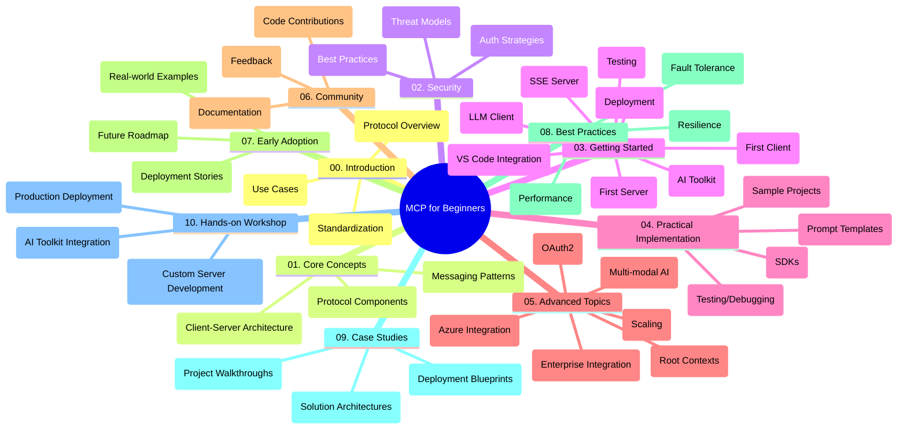

<!--
CO_OP_TRANSLATOR_METADATA:
{
  "original_hash": "a607d4febc94caee9a12b77795f7fc9a",
  "translation_date": "2025-06-11T16:49:32+00:00",
  "source_file": "study_guide.md",
  "language_code": "hu"
}
-->
# Model Context Protocol (MCP) kezdőknek – Tanulmányi útmutató

Ez a tanulmányi útmutató áttekintést nyújt a "Model Context Protocol (MCP) kezdőknek" tananyag tárházának felépítéséről és tartalmáról. Használd ezt az útmutatót a tárház hatékonyabb böngészéséhez és az elérhető erőforrások maximális kihasználásához.

## Tárház áttekintése

A Model Context Protocol (MCP) egy szabványosított keretrendszer az AI modellek és kliens alkalmazások közötti kommunikációhoz. Ez a tárház átfogó tananyagot kínál, gyakorlati kódpéldákkal C#, Java, JavaScript, Python és TypeScript nyelveken, AI fejlesztők, rendszermérnökök és szoftvermérnökök számára.

## Vizuális tananyag térkép

## Tárház felépítése

A tárház tíz fő részre tagolódik, amelyek az MCP különböző aspektusaira fókuszálnak:

1. **Bevezetés (00-Introduction/)**
   - A Model Context Protocol áttekintése
   - Miért fontos a szabványosítás az AI folyamatokban
   - Gyakorlati felhasználási esetek és előnyök

2. **Alapfogalmak (01-CoreConcepts/)**
   - Kliens-szerver architektúra
   - A protokoll kulcselemei
   - Üzenetküldési minták az MCP-ben

3. **Biztonság (02-Security/)**
   - Biztonsági fenyegetések MCP-alapú rendszerekben
   - Legjobb gyakorlatok a biztonságos megvalósításhoz
   - Hitelesítési és jogosultságkezelési stratégiák

4. **Első lépések (03-GettingStarted/)**
   - Környezet beállítása és konfigurálása
   - Egyszerű MCP szerverek és kliensek létrehozása
   - Integráció meglévő alkalmazásokkal
   - Alkategóriák: első szerver, első kliens, LLM kliens, VS Code integráció, SSE szerver, AI Toolkit, tesztelés és telepítés

5. **Gyakorlati megvalósítás (04-PracticalImplementation/)**
   - SDK-k használata különböző programozási nyelveken
   - Hibakeresési, tesztelési és érvényesítési módszerek
   - Újrahasználható prompt sablonok és munkafolyamatok készítése
   - Minta projektek megvalósítási példákkal

6. **Haladó témák (05-AdvancedTopics/)**
   - Többmodalitású AI munkafolyamatok és bővíthetőség
   - Biztonságos skálázási stratégiák
   - MCP vállalati ökoszisztémákban
   - Speciális témák, mint Azure integráció, többmodalitás, OAuth2, root context-ek, routing, mintavételezés, skálázás, biztonság, webes keresés integrációja és streaming

7. **Közösségi hozzájárulások (06-CommunityContributions/)**
   - Kód és dokumentáció hozzájárulás módjai
   - Együttműködés GitHub-on keresztül
   - Közösség által vezérelt fejlesztések és visszajelzések

8. **Tapasztalatok a korai bevezetésből (07-LessonsfromEarlyAdoption/)**
   - Valós megvalósítások és sikertörténetek
   - MCP-alapú megoldások építése és telepítése
   - Trendek és jövőbeli fejlesztési irányok

9. **Legjobb gyakorlatok (08-BestPractices/)**
   - Teljesítményhangolás és optimalizáció
   - Hibabiztos MCP rendszerek tervezése
   - Tesztelési és ellenállóképességi stratégiák

10. **Esettanulmányok (09-CaseStudy/)**
    - Mélyebb betekintés MCP megoldás architektúrákba
    - Telepítési tervek és integrációs tippek
    - Kommentált ábrák és projektbemutatók

11. **Gyakorlati műhely (10-StreamliningAIWorkflowsBuildingAnMCPServerWithAIToolkit/)**
    - Átfogó gyakorlati műhely, amely az MCP-t a Microsoft AI Toolkit VS Code bővítményével ötvözi
    - Intelligens alkalmazások építése, amelyek összekapcsolják az AI modelleket a valós eszközökkel
    - Gyakorlati modulok az alapoktól a saját szerver fejlesztésén át a termelési telepítésig

## Minta projektek

A tárház számos mintaprojektet tartalmaz, amelyek bemutatják az MCP megvalósítását különböző programozási nyelveken:

### Alap MCP kalkulátor minták
- C# MCP szerver példa
- Java MCP kalkulátor
- JavaScript MCP demo
- Python MCP szerver
- TypeScript MCP példa

### Haladó MCP kalkulátor projektek
- Haladó C# példa
- Java konténer alkalmazás példa
- JavaScript haladó minta
- Python összetett megvalósítás
- TypeScript konténer minta

## További erőforrások

A tárház további támogatást nyújtó anyagokat is tartalmaz:

- **Images mappa**: Diagramok és illusztrációk, amelyek a tananyagban szerepelnek
- **Fordítások**: Többnyelvű támogatás automatikus dokumentáció fordításokkal
- **Hivatalos MCP források**:
  - [MCP Documentation](https://modelcontextprotocol.io/)
  - [MCP Specification](https://spec.modelcontextprotocol.io/)
  - [MCP GitHub Repository](https://github.com/modelcontextprotocol)

## Hogyan használd ezt a tárházat

1. **Fokozatos tanulás**: Kövesd a fejezeteket sorrendben (00-tól 10-ig) a strukturált tanulás érdekében.
2. **Nyelvspecifikus fókusz**: Ha egy adott programozási nyelv érdekel, böngészd a minták mappáit a választott nyelv megvalósításaiért.
3. **Gyakorlati megvalósítás**: Kezdd az "Első lépések" résszel a környezet beállításához és az első MCP szerver és kliens létrehozásához.
4. **Haladó ismeretek**: Ha már magabiztos vagy az alapokban, merülj el a haladó témákban a tudásod bővítéséhez.
5. **Közösségi részvétel**: Csatlakozz az [Azure AI Foundry Discord](https://discord.com/invite/ByRwuEEgH4) szerverhez, hogy kapcsolatba léphess szakértőkkel és fejlesztőtársakkal.

## Hozzájárulás

Ez a tárház szívesen fogadja a közösség hozzájárulásait. A Közösségi hozzájárulások részben találsz útmutatást arról, hogyan járulhatsz hozzá.

---

*Ez a tanulmányi útmutató 2025. június 11-én készült, és az akkori tárház állapotát tükrözi. Azóta a tartalom frissülhetett.*

**Nyilatkozat**:  
Ez a dokumentum az AI fordító szolgáltatás, a [Co-op Translator](https://github.com/Azure/co-op-translator) segítségével készült. Bár törekszünk a pontosságra, kérjük, vegye figyelembe, hogy az automatikus fordítások tartalmazhatnak hibákat vagy pontatlanságokat. Az eredeti dokumentum az anyanyelvén tekintendő hiteles forrásnak. Kritikus információk esetén szakmai, emberi fordítást javaslunk. Nem vállalunk felelősséget az ebből eredő félreértésekért vagy helytelen értelmezésekért.