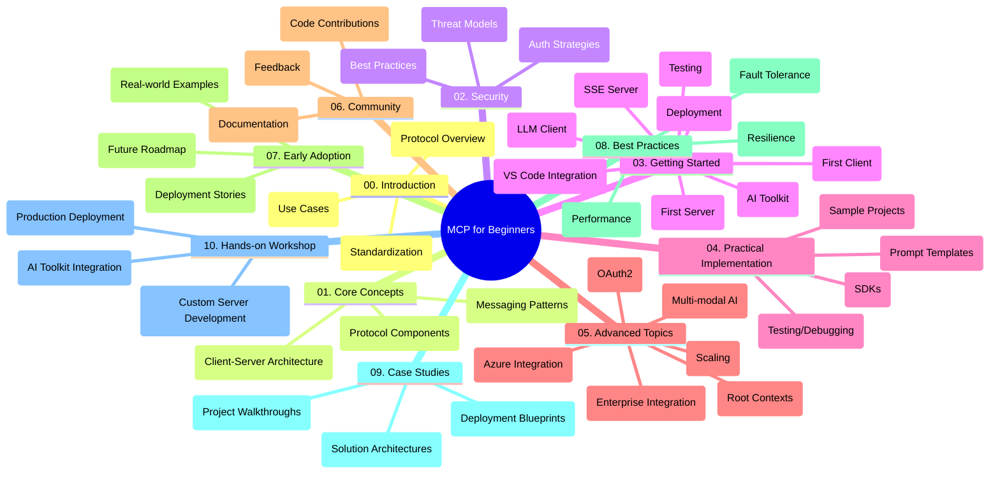

<!--
CO_OP_TRANSLATOR_METADATA:
{
  "original_hash": "a607d4febc94caee9a12b77795f7fc9a",
  "translation_date": "2025-07-13T15:17:33+00:00",
  "source_file": "study_guide.md",
  "language_code": "hu"
}
-->
# Model Context Protocol (MCP) kezdőknek – Tanulmányi útmutató

Ez a tanulmányi útmutató áttekintést nyújt a tárház felépítéséről és tartalmáról a „Model Context Protocol (MCP) kezdőknek” tananyaghoz. Használd ezt az útmutatót a tárház hatékonyabb böngészéséhez és a rendelkezésre álló erőforrások maximális kihasználásához.

## Tárház áttekintése

A Model Context Protocol (MCP) egy szabványosított keretrendszer az AI modellek és kliensalkalmazások közötti kommunikációhoz. Ez a tárház átfogó tananyagot kínál gyakorlati kódpéldákkal C#, Java, JavaScript, Python és TypeScript nyelveken, amelyeket AI fejlesztők, rendszertervezők és szoftvermérnökök számára készítettek.

## Vizualizált tananyag térkép

## Tárház felépítése

A tárház tíz fő részre tagolódik, amelyek mindegyike az MCP különböző aspektusaira fókuszál:

1. **Bevezetés (00-Introduction/)**
   - A Model Context Protocol áttekintése
   - Miért fontos a szabványosítás az AI folyamatokban
   - Gyakorlati felhasználási esetek és előnyök

2. **Alapfogalmak (01-CoreConcepts/)**
   - Kliens-szerver architektúra
   - A protokoll kulcselemei
   - Üzenetküldési minták az MCP-ben

3. **Biztonság (02-Security/)**
   - Biztonsági fenyegetések MCP-alapú rendszerekben
   - Legjobb gyakorlatok a biztonságos megvalósításhoz
   - Hitelesítési és jogosultságkezelési stratégiák

4. **Első lépések (03-GettingStarted/)**
   - Környezet beállítása és konfigurálása
   - Egyszerű MCP szerverek és kliensek létrehozása
   - Integráció meglévő alkalmazásokkal
   - Alkategóriák: első szerver, első kliens, LLM kliens, VS Code integráció, SSE szerver, AI Toolkit, tesztelés és telepítés

5. **Gyakorlati megvalósítás (04-PracticalImplementation/)**
   - SDK-k használata különböző programozási nyelveken
   - Hibakeresés, tesztelés és validálás
   - Újrahasználható prompt sablonok és munkafolyamatok készítése
   - Minta projektek megvalósítási példákkal

6. **Haladó témák (05-AdvancedTopics/)**
   - Többmodalitású AI munkafolyamatok és bővíthetőség
   - Biztonságos skálázási stratégiák
   - MCP vállalati ökoszisztémákban
   - Speciális témák, mint Azure integráció, többmodalitás, OAuth2, root context-ek, routing, mintavételezés, skálázás, biztonság, webes keresés integráció és streaming

7. **Közösségi hozzájárulások (06-CommunityContributions/)**
   - Kód és dokumentáció hozzájárulásának módjai
   - Együttműködés GitHub-on keresztül
   - Közösségi fejlesztések és visszajelzések

8. **Tanulságok a korai alkalmazásból (07-LessonsfromEarlyAdoption/)**
   - Valós megvalósítások és sikertörténetek
   - MCP-alapú megoldások építése és telepítése
   - Trendek és jövőbeli irányok

9. **Legjobb gyakorlatok (08-BestPractices/)**
   - Teljesítményhangolás és optimalizálás
   - Hibabiztos MCP rendszerek tervezése
   - Tesztelési és ellenálló képesség stratégiák

10. **Esettanulmányok (09-CaseStudy/)**
    - Mélyebb elemzések MCP megoldás architektúrákról
    - Telepítési tervek és integrációs tippek
    - Jegyzetelt diagramok és projektbemutatók

11. **Gyakorlati workshop (10-StreamliningAIWorkflowsBuildingAnMCPServerWithAIToolkit/)**
    - Átfogó gyakorlati workshop, amely az MCP-t a Microsoft AI Toolkit-jével kombinálja VS Code-hoz
    - Intelligens alkalmazások építése, amelyek összekapcsolják az AI modelleket a valós eszközökkel
    - Gyakorlati modulok az alapoktól a saját szerver fejlesztésén át a termelési telepítésig

## Minta projektek

A tárház több minta projektet tartalmaz, amelyek bemutatják az MCP megvalósítását különböző programozási nyelveken:

### Alap MCP számológép minták
- C# MCP szerver példa
- Java MCP számológép
- JavaScript MCP demó
- Python MCP szerver
- TypeScript MCP példa

### Haladó MCP számológép projektek
- Haladó C# példa
- Java konténer alkalmazás példa
- JavaScript haladó példa
- Python összetett megvalósítás
- TypeScript konténer példa

## További források

A tárház tartalmaz további támogató anyagokat:

- **Képek mappa**: Diagramok és illusztrációk a tananyagban
- **Fordítások**: Többnyelvű támogatás automatikus dokumentáció fordításokkal
- **Hivatalos MCP források**:
  - [MCP dokumentáció](https://modelcontextprotocol.io/)
  - [MCP specifikáció](https://spec.modelcontextprotocol.io/)
  - [MCP GitHub tárház](https://github.com/modelcontextprotocol)

## Hogyan használd ezt a tárházat

1. **Sorrendben tanulás**: Kövesd a fejezeteket sorrendben (00-tól 10-ig) a strukturált tanulás érdekében.
2. **Nyelvspecifikus fókusz**: Ha egy adott programozási nyelv érdekel, nézd meg a minták könyvtárait a választott nyelv megvalósításaiért.
3. **Gyakorlati megvalósítás**: Kezdd az „Első lépések” résszel, hogy beállítsd a környezeted és elkészítsd az első MCP szerveredet és kliensedet.
4. **Haladó felfedezés**: Ha már magabiztos vagy az alapokban, mélyedj el a haladó témákban a tudásod bővítéséhez.
5. **Közösségi részvétel**: Csatlakozz az [Azure AI Foundry Discord](https://discord.com/invite/ByRwuEEgH4) szerverhez, hogy kapcsolatba léphess szakértőkkel és fejlesztőtársaiddal.

## Hozzájárulás

Ez a tárház szívesen fogadja a közösség hozzájárulásait. A Közösségi hozzájárulások részben találsz útmutatást a beküldésekhez.

---

*Ez a tanulmányi útmutató 2025. június 11-én készült, és a tárház ezen időpontbeli állapotát tükrözi. Azóta a tárház tartalma frissülhetett.*

**Jogi nyilatkozat**:  
Ez a dokumentum az AI fordító szolgáltatás, a [Co-op Translator](https://github.com/Azure/co-op-translator) segítségével készült. Bár a pontosságra törekszünk, kérjük, vegye figyelembe, hogy az automatikus fordítások hibákat vagy pontatlanságokat tartalmazhatnak. Az eredeti dokumentum az anyanyelvén tekintendő hiteles forrásnak. Kritikus információk esetén professzionális emberi fordítást javaslunk. Nem vállalunk felelősséget a fordítás használatából eredő félreértésekért vagy téves értelmezésekért.