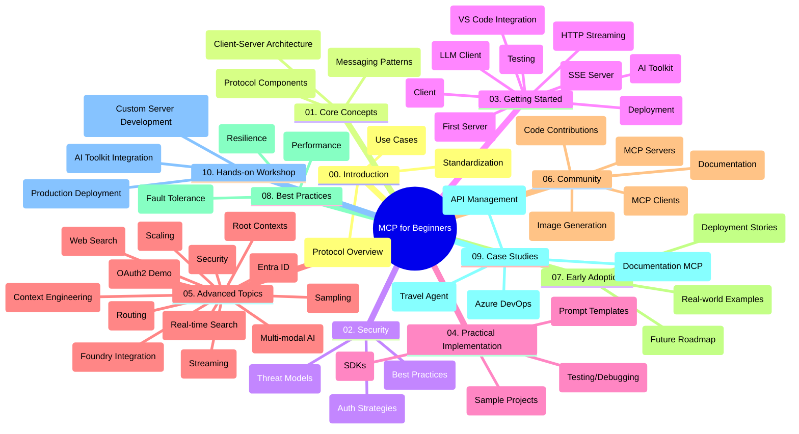

<!--
CO_OP_TRANSLATOR_METADATA:
{
  "original_hash": "5f321ea583cf087a94e47ee74c62b504",
  "translation_date": "2025-07-17T10:17:14+00:00",
  "source_file": "study_guide.md",
  "language_code": "hu"
}
-->
# Model Context Protocol (MCP) kezdőknek – Tanulmányi útmutató

Ez a tanulmányi útmutató áttekintést nyújt a "Model Context Protocol (MCP) kezdőknek" tananyag tárházának felépítéséről és tartalmáról. Használd ezt az útmutatót a tárház hatékonyabb böngészéséhez és a rendelkezésre álló erőforrások maximális kihasználásához.

## Tárház áttekintése

A Model Context Protocol (MCP) egy szabványosított keretrendszer az AI modellek és kliensalkalmazások közötti interakciókhoz. Eredetileg az Anthropic hozta létre, az MCP-t ma már a szélesebb MCP közösség tartja karban az hivatalos GitHub szervezet keretében. Ez a tárház átfogó tananyagot kínál gyakorlati kódpéldákkal C#, Java, JavaScript, Python és TypeScript nyelveken, amelyeket AI fejlesztők, rendszertervezők és szoftvermérnökök számára készítettek.

## Vizualizált tananyag térkép

## Tárház felépítése

A tárház tíz fő részre tagolódik, amelyek mindegyike az MCP különböző aspektusaira fókuszál:

1. **Bevezetés (00-Introduction/)**
   - A Model Context Protocol áttekintése
   - Miért fontos a szabványosítás az AI folyamatokban
   - Gyakorlati felhasználási esetek és előnyök

2. **Alapfogalmak (01-CoreConcepts/)**
   - Kliens-szerver architektúra
   - A protokoll kulcselemei
   - Üzenetküldési minták az MCP-ben

3. **Biztonság (02-Security/)**
   - Biztonsági fenyegetések MCP-alapú rendszerekben
   - Legjobb gyakorlatok a biztonságos megvalósításhoz
   - Hitelesítési és jogosultságkezelési stratégiák

4. **Első lépések (03-GettingStarted/)**
   - Környezet beállítása és konfigurálása
   - Egyszerű MCP szerverek és kliensek létrehozása
   - Integráció meglévő alkalmazásokkal
   - Tartalmazza a következő részeket:
     - Első szerver implementáció
     - Kliens fejlesztés
     - LLM kliens integráció
     - VS Code integráció
     - Server-Sent Events (SSE) szerver
     - HTTP streaming
     - AI Toolkit integráció
     - Tesztelési stratégiák
     - Telepítési irányelvek

5. **Gyakorlati megvalósítás (04-PracticalImplementation/)**
   - SDK-k használata különböző programozási nyelveken
   - Hibakeresés, tesztelés és validálás
   - Újrahasználható prompt sablonok és munkafolyamatok készítése
   - Minta projektek megvalósítási példákkal

6. **Haladó témák (05-AdvancedTopics/)**
   - Kontextus mérnöki technikák
   - Foundry agent integráció
   - Többmodalitású AI munkafolyamatok
   - OAuth2 hitelesítési demók
   - Valós idejű keresési funkciók
   - Valós idejű streaming
   - Root context-ek megvalósítása
   - Routing stratégiák
   - Mintavételezési technikák
   - Skálázási megközelítések
   - Biztonsági szempontok
   - Entra ID biztonsági integráció
   - Webes keresés integrációja

7. **Közösségi hozzájárulások (06-CommunityContributions/)**
   - Hogyan járulhatsz hozzá kóddal és dokumentációval
   - Együttműködés GitHub-on keresztül
   - Közösség által vezérelt fejlesztések és visszajelzések
   - Különböző MCP kliensek használata (Claude Desktop, Cline, VSCode)
   - Népszerű MCP szerverekkel való munka, beleértve a képgenerálást is

8. **Korai alkalmazás tanulságai (07-LessonsfromEarlyAdoption/)**
   - Valós megvalósítások és sikertörténetek
   - MCP-alapú megoldások építése és telepítése
   - Trendek és jövőbeli fejlesztési irányok

9. **Legjobb gyakorlatok (08-BestPractices/)**
   - Teljesítményhangolás és optimalizálás
   - Hibabiztos MCP rendszerek tervezése
   - Tesztelési és ellenálló képesség stratégiák

10. **Esettanulmányok (09-CaseStudy/)**
    - Esettanulmány: Azure API Management integráció
    - Esettanulmány: Utazási ügynök megvalósítás
    - Esettanulmány: Azure DevOps integráció YouTube-bal
    - Megvalósítási példák részletes dokumentációval

11. **Gyakorlati workshop (10-StreamliningAIWorkflowsBuildingAnMCPServerWithAIToolkit/)**
    - Átfogó gyakorlati workshop az MCP és AI Toolkit kombinálásával
    - Intelligens alkalmazások építése, amelyek összekapcsolják az AI modelleket a valós eszközökkel
    - Gyakorlati modulok az alapoktól a saját szerver fejlesztésén át a termelési telepítésig
    - Laboratóriumi tanulási megközelítés lépésről lépésre

## További források

A tárház tartalmaz kiegészítő anyagokat is:

- **Képek mappa**: Diagramok és illusztrációk, amelyeket a tananyag során használnak
- **Fordítások**: Többnyelvű támogatás, automatikus dokumentáció fordításokkal
- **Hivatalos MCP források**:
  - [MCP Dokumentáció](https://modelcontextprotocol.io/)
  - [MCP Specifikáció](https://spec.modelcontextprotocol.io/)
  - [MCP GitHub tárház](https://github.com/modelcontextprotocol)

## Hogyan használd ezt a tárházat

1. **Sorrendben tanulás**: Kövesd a fejezeteket sorrendben (00-tól 10-ig) a strukturált tanulás érdekében.
2. **Nyelvspecifikus fókusz**: Ha egy adott programozási nyelv érdekel, nézd meg a mintakönyvtárakat a választott nyelv megvalósításaiért.
3. **Gyakorlati megvalósítás**: Kezdd az "Első lépések" résszel, hogy beállítsd a környezeted és elkészítsd az első MCP szervered és kliensed.
4. **Haladó témák felfedezése**: Amint magabiztos vagy az alapokban, merülj el a haladó témákban a tudásod bővítéséhez.
5. **Közösségi részvétel**: Csatlakozz az MCP közösséghez GitHub beszélgetéseken és Discord csatornákon, hogy kapcsolatba léphess szakértőkkel és fejlesztőtársakkal.

## MCP kliensek és eszközök

A tananyag különböző MCP klienseket és eszközöket mutat be:

1. **Hivatalos kliensek**:
   - Visual Studio Code
   - MCP a Visual Studio Code-ban
   - Claude Desktop
   - Claude VSCode-ban
   - Claude API

2. **Közösségi kliensek**:
   - Cline (terminál alapú)
   - Cursor (kódszerkesztő)
   - ChatMCP
   - Windsurf

3. **MCP kezelő eszközök**:
   - MCP CLI
   - MCP Manager
   - MCP Linker
   - MCP Router

## Népszerű MCP szerverek

A tárház bemutat különféle MCP szervereket, többek között:

1. **Hivatalos referencia szerverek**:
   - Filesystem
   - Fetch
   - Memory
   - Sequential Thinking

2. **Képgenerálás**:
   - Azure OpenAI DALL-E 3
   - Stable Diffusion WebUI
   - Replicate

3. **Fejlesztői eszközök**:
   - Git MCP
   - Terminal Control
   - Code Assistant

4. **Speciális szerverek**:
   - Salesforce
   - Microsoft Teams
   - Jira & Confluence

## Hozzájárulás

Ez a tárház szívesen fogadja a közösség hozzájárulásait. A Közösségi hozzájárulások részben találsz útmutatást arról, hogyan járulhatsz hozzá hatékonyan az MCP ökoszisztémához.

## Változásnapló

| Dátum | Változások |
|-------|------------|
| 2025. július 16. | - A tárház szerkezetének frissítése a jelenlegi tartalomnak megfelelően - MCP kliensek és eszközök szekció hozzáadva - Népszerű MCP szerverek szekció hozzáadva - Vizualizált tananyag térkép frissítése az összes aktuális témával - Haladó témák szekció bővítése minden speciális területtel - Esettanulmányok frissítése valós példákkal - Az MCP eredetének tisztázása, mint az Anthropic által létrehozott |
| 2025. június 11. | - A tanulmányi útmutató kezdeti létrehozása - Vizualizált tananyag térkép hozzáadása - A tárház szerkezetének vázolása - Minta projektek és további források beillesztése |

---

*Ez a tanulmányi útmutató 2025. július 16-án frissült, és az akkori állapot szerinti áttekintést nyújtja a tárházról. A tárház tartalma a későbbiekben frissülhet.*

**Jogi nyilatkozat**:  
Ez a dokumentum az AI fordító szolgáltatás, a [Co-op Translator](https://github.com/Azure/co-op-translator) segítségével készült. Bár a pontosságra törekszünk, kérjük, vegye figyelembe, hogy az automatikus fordítások hibákat vagy pontatlanságokat tartalmazhatnak. Az eredeti dokumentum az anyanyelvén tekintendő hiteles forrásnak. Kritikus információk esetén professzionális emberi fordítást javaslunk. Nem vállalunk felelősséget a fordítás használatából eredő félreértésekért vagy téves értelmezésekért.