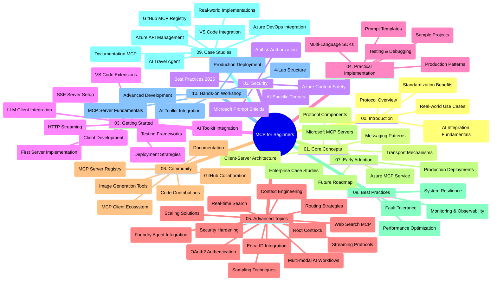

<!--
CO_OP_TRANSLATOR_METADATA:
{
  "original_hash": "719117a0a5f34ade7b5dfb61ee06fb13",
  "translation_date": "2025-09-26T18:57:35+00:00",
  "source_file": "study_guide.md",
  "language_code": "hu"
}
-->
# Model Context Protocol (MCP) kezdőknek - Tanulási útmutató

Ez a tanulási útmutató áttekintést nyújt a "Model Context Protocol (MCP) kezdőknek" tananyaghoz tartozó adattár szerkezetéről és tartalmáról. Használja ezt az útmutatót az adattár hatékony navigálásához és az elérhető erőforrások maximális kihasználásához.

## Adattár áttekintése

A Model Context Protocol (MCP) egy szabványosított keretrendszer az AI modellek és kliensalkalmazások közötti interakciókhoz. Eredetileg az Anthropic hozta létre, de ma már a szélesebb MCP közösség tartja karban az hivatalos GitHub szervezeten keresztül. Ez az adattár átfogó tananyagot kínál gyakorlati kódpéldákkal C#, Java, JavaScript, Python és TypeScript nyelveken, AI fejlesztők, rendszerarchitekták és szoftvermérnökök számára.

## Vizualizált tananyag térkép

## Adattár szerkezete

Az adattár tíz fő szakaszra van osztva, amelyek az MCP különböző aspektusaira összpontosítanak:

1. **Bevezetés (00-Introduction/)**
   - A Model Context Protocol áttekintése
   - Miért fontos a szabványosítás az AI folyamatokban
   - Gyakorlati felhasználási esetek és előnyök

2. **Alapfogalmak (01-CoreConcepts/)**
   - Kliens-szerver architektúra
   - Kulcsfontosságú protokoll komponensek
   - Üzenetküldési minták az MCP-ben

3. **Biztonság (02-Security/)**
   - Biztonsági fenyegetések MCP-alapú rendszerekben
   - Legjobb gyakorlatok a megvalósítások biztonságossá tételéhez
   - Hitelesítési és jogosultsági stratégiák
   - **Átfogó biztonsági dokumentáció**:
     - MCP Biztonsági Legjobb Gyakorlatok 2025
     - Azure Tartalom Biztonsági Megvalósítási Útmutató
     - MCP Biztonsági Ellenőrzések és Technikák
     - MCP Gyors Referencia Legjobb Gyakorlatok
   - **Kulcsfontosságú biztonsági témák**:
     - Prompt injekció és eszközmérgezési támadások
     - Munkamenet eltérítése és zavart helyettes problémák
     - Token átadási sebezhetőségek
     - Túlzott jogosultságok és hozzáférés-ellenőrzés
     - Ellátási lánc biztonsága AI komponensek esetében
     - Microsoft Prompt Shields integráció

4. **Első lépések (03-GettingStarted/)**
   - Környezet beállítása és konfigurálása
   - Alapvető MCP szerverek és kliensek létrehozása
   - Integráció meglévő alkalmazásokkal
   - Tartalmazza:
     - Első szerver megvalósítása
     - Kliens fejlesztés
     - LLM kliens integráció
     - VS Code integráció
     - Server-Sent Events (SSE) szerver
     - HTTP streaming
     - AI Toolkit integráció
     - Tesztelési stratégiák
     - Telepítési irányelvek

5. **Gyakorlati megvalósítás (04-PracticalImplementation/)**
   - SDK-k használata különböző programozási nyelveken
   - Hibakeresési, tesztelési és validálási technikák
   - Újrafelhasználható prompt sablonok és munkafolyamatok készítése
   - Mintaprojektek megvalósítási példákkal

6. **Haladó témák (05-AdvancedTopics/)**
   - Kontextus mérnöki technikák
   - Foundry ügynök integráció
   - Multi-modális AI munkafolyamatok
   - OAuth2 hitelesítési demók
   - Valós idejű keresési képességek
   - Valós idejű streaming
   - Root kontextusok megvalósítása
   - Útvonaltervezési stratégiák
   - Mintavételi technikák
   - Méretezési megközelítések
   - Biztonsági megfontolások
   - Entra ID biztonsági integráció
   - Webes keresési integráció

7. **Közösségi hozzájárulások (06-CommunityContributions/)**
   - Hogyan járulhat hozzá kódhoz és dokumentációhoz
   - Együttműködés GitHubon keresztül
   - Közösség által vezérelt fejlesztések és visszajelzések
   - Különböző MCP kliensek használata (Claude Desktop, Cline, VSCode)
   - Népszerű MCP szerverekkel való munka, beleértve a képgenerálást

8. **Korai alkalmazás tanulságai (07-LessonsfromEarlyAdoption/)**
   - Valós megvalósítások és sikertörténetek
   - MCP-alapú megoldások építése és telepítése
   - Trendek és jövőbeli útiterv
   - **Microsoft MCP Szerverek Útmutató**: Átfogó útmutató 10 gyártásra kész Microsoft MCP szerverhez, beleértve:
     - Microsoft Learn Docs MCP Szerver
     - Azure MCP Szerver (15+ speciális csatlakozó)
     - GitHub MCP Szerver
     - Azure DevOps MCP Szerver
     - MarkItDown MCP Szerver
     - SQL Server MCP Szerver
     - Playwright MCP Szerver
     - Dev Box MCP Szerver
     - Azure AI Foundry MCP Szerver
     - Microsoft 365 Agents Toolkit MCP Szerver

9. **Legjobb gyakorlatok (08-BestPractices/)**
   - Teljesítményhangolás és optimalizálás
   - Hibatűrő MCP rendszerek tervezése
   - Tesztelési és ellenállóképességi stratégiák

10. **Esettanulmányok (09-CaseStudy/)**
    - **Hét átfogó esettanulmány** az MCP sokoldalúságának bemutatására különböző helyzetekben:
    - **Azure AI Utazási Ügynökök**: Több ügynök összehangolása Azure OpenAI és AI Search segítségével
    - **Azure DevOps Integráció**: Munkafolyamatok automatizálása YouTube adatfrissítésekkel
    - **Valós idejű dokumentáció visszakeresés**: Python konzol kliens streaming HTTP-vel
    - **Interaktív tanulási terv generátor**: Chainlit webalkalmazás beszélgetési AI-val
    - **Szerkesztőben belüli dokumentáció**: VS Code integráció GitHub Copilot munkafolyamatokkal
    - **Azure API Management**: Vállalati API integráció MCP szerver létrehozásával
    - **GitHub MCP Registry**: Ökoszisztéma fejlesztés és ügynöki integrációs platform
    - Megvalósítási példák a vállalati integráció, fejlesztői termelékenység és ökoszisztéma fejlesztés területén

11. **Gyakorlati workshop (10-StreamliningAIWorkflowsBuildingAnMCPServerWithAIToolkit/)**
    - Átfogó gyakorlati workshop MCP és AI Toolkit kombinálásával
    - Intelligens alkalmazások építése, amelyek összekapcsolják az AI modelleket a valós eszközökkel
    - Gyakorlati modulok az alapok, egyedi szerverfejlesztés és gyártási telepítési stratégiák lefedésére
    - **Labor szerkezet**:
      - Labor 1: MCP szerver alapjai
      - Labor 2: Haladó MCP szerver fejlesztés
      - Labor 3: AI Toolkit integráció
      - Labor 4: Gyártási telepítés és méretezés
    - Laboralapú tanulási megközelítés lépésről lépésre

## További erőforrások

Az adattár tartalmaz támogató erőforrásokat:

- **Képek mappa**: Diagramokat és illusztrációkat tartalmaz, amelyek a tananyagban szerepelnek
- **Fordítások**: Többnyelvű támogatás automatikus dokumentációfordításokkal
- **Hivatalos MCP erőforrások**:
  - [MCP Dokumentáció](https://modelcontextprotocol.io/)
  - [MCP Specifikáció](https://spec.modelcontextprotocol.io/)
  - [MCP GitHub Adattár](https://github.com/modelcontextprotocol)

## Hogyan használja az adattárat

1. **Szekvenciális tanulás**: Kövesse a fejezeteket sorrendben (00-tól 10-ig) a strukturált tanulási élmény érdekében.
2. **Nyelvspecifikus fókusz**: Ha egy adott programozási nyelv érdekli, böngéssze a minták könyvtárát a kedvenc nyelvén megvalósított példákért.
3. **Gyakorlati megvalósítás**: Kezdje az "Első lépések" szekcióval, hogy beállítsa környezetét és létrehozza első MCP szerverét és kliensét.
4. **Haladó felfedezés**: Miután megismerkedett az alapokkal, merüljön el a haladó témákban, hogy bővítse tudását.
5. **Közösségi részvétel**: Csatlakozzon az MCP közösséghez GitHub vitákon és Discord csatornákon keresztül, hogy kapcsolatba lépjen szakértőkkel és más fejlesztőkkel.

## MCP kliensek és eszközök

A tananyag különböző MCP klienseket és eszközöket tárgyal:

1. **Hivatalos kliensek**:
   - Visual Studio Code 
   - MCP a Visual Studio Code-ban
   - Claude Desktop
   - Claude a VSCode-ban 
   - Claude API

2. **Közösségi kliensek**:
   - Cline (terminál alapú)
   - Cursor (kódszerkesztő)
   - ChatMCP
   - Windsurf

3. **MCP kezelőeszközök**:
   - MCP CLI
   - MCP Manager
   - MCP Linker
   - MCP Router

## Népszerű MCP szerverek

Az adattár bemutatja a különböző MCP szervereket, beleértve:

1. **Hivatalos Microsoft MCP szerverek**:
   - Microsoft Learn Docs MCP Szerver
   - Azure MCP Szerver (15+ speciális csatlakozó)
   - GitHub MCP Szerver
   - Azure DevOps MCP Szerver
   - MarkItDown MCP Szerver
   - SQL Server MCP Szerver
   - Playwright MCP Szerver
   - Dev Box MCP Szerver
   - Azure AI Foundry MCP Szerver
   - Microsoft 365 Agents Toolkit MCP Szerver

2. **Hivatalos referencia szerverek**:
   - Filesystem
   - Fetch
   - Memory
   - Sequential Thinking

3. **Képgenerálás**:
   - Azure OpenAI DALL-E 3
   - Stable Diffusion WebUI
   - Replicate

4. **Fejlesztői eszközök**:
   - Git MCP
   - Terminál vezérlés
   - Kód asszisztens

5. **Speciális szerverek**:
   - Salesforce
   - Microsoft Teams
   - Jira & Confluence

## Hozzájárulás

Ez az adattár szívesen fogadja a közösség hozzájárulásait. Lásd a Közösségi hozzájárulások szekciót az MCP ökoszisztémához való hatékony hozzájárulás útmutatójáért.

## Változásnapló

| Dátum | Változások |
|------|---------|
| 2025. szeptember 26. | - GitHub MCP Registry esettanulmány hozzáadása a 09-CaseStudy szekcióhoz - Esettanulmányok frissítése hét átfogó esettanulmányra - Esettanulmány leírások bővítése konkrét megvalósítási részletekkel - Vizualizált tananyag térkép frissítése a GitHub MCP Registry-vel - Tanulási útmutató szerkezetének átdolgozása az ökoszisztéma fejlesztési fókusz tükrözésére |
| 2025. július 18. | - Adattár szerkezetének frissítése a Microsoft MCP Szerverek Útmutatóval - 10 gyártásra kész Microsoft MCP szerver átfogó listájának hozzáadása - Népszerű MCP szerverek szekció bővítése hivatalos Microsoft MCP szerverekkel - Esettanulmányok szekció frissítése tényleges fájlpéldákkal - Labor szerkezet részleteinek hozzáadása a gyakorlati workshophoz |
| 2025. július 16. | - Adattár szerkezetének frissítése az aktuális tartalom tükrözésére - MCP kliensek és eszközök szekció hozzáadása - Népszerű MCP szerverek szekció hozzáadása - Vizualizált tananyag térkép frissítése az összes aktuális témával - Haladó témák szekció bővítése minden speciális területtel - Esettanulmányok frissítése tényleges példákkal - MCP eredetének tisztázása, mint az Anthropic által létrehozott |
| 2025. június 11. | - Tanulási útmutató kezdeti létrehozása - Vizualizált tananyag térkép hozzáadása - Adattár szerkezetének körvonalazása - Mintaprojektek és további erőforrások hozzáadása |

---

*Ez a tanulási útmutató 2025. szeptember 26-án frissült, és az adattár ezen a dátumon érvényes áttekintését nyújtja. Az adattár tartalma ezen dátum után frissülhet.*

---

