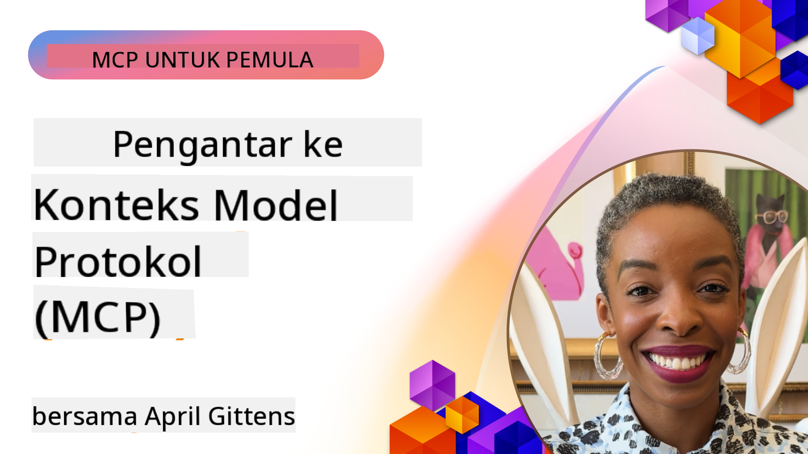
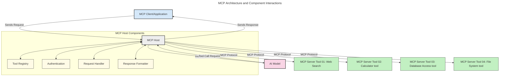
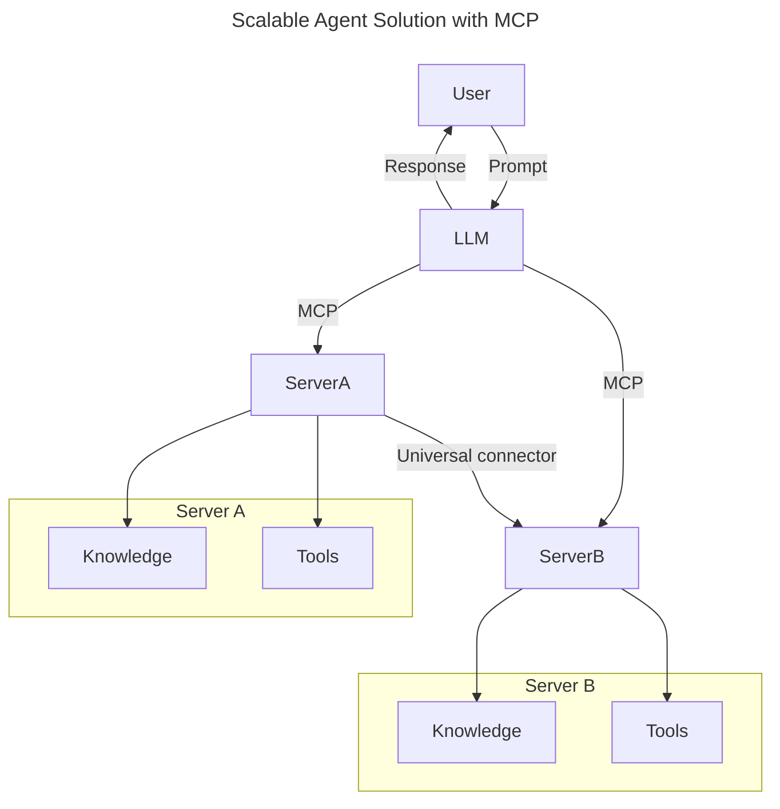
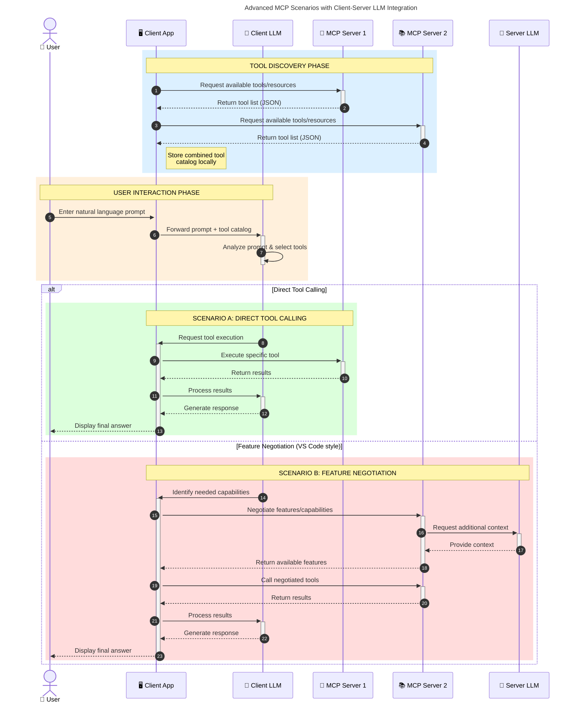

<!--
CO_OP_TRANSLATOR_METADATA:
{
  "original_hash": "0df1ee78a6dd8300f3a040ca5b411c2e",
  "translation_date": "2025-08-18T17:45:54+00:00",
  "source_file": "00-Introduction/README.md",
  "language_code": "id"
}
-->
# Pengantar Model Context Protocol (MCP): Mengapa Penting untuk Aplikasi AI yang Skalabel

_(Klik gambar di atas untuk menonton video pelajaran ini)_

Aplikasi AI generatif adalah langkah maju yang luar biasa karena sering kali memungkinkan pengguna berinteraksi dengan aplikasi menggunakan perintah bahasa alami. Namun, seiring waktu dan sumber daya yang diinvestasikan dalam aplikasi semacam itu, Anda ingin memastikan bahwa Anda dapat dengan mudah mengintegrasikan fungsionalitas dan sumber daya dengan cara yang mudah diperluas, sehingga aplikasi Anda dapat mendukung lebih dari satu model yang digunakan, serta menangani berbagai kompleksitas model. Singkatnya, membangun aplikasi AI generatif mudah untuk dimulai, tetapi seiring pertumbuhannya dan menjadi lebih kompleks, Anda perlu mulai mendefinisikan arsitektur dan kemungkinan memerlukan standar untuk memastikan aplikasi Anda dibangun dengan cara yang konsisten. Di sinilah MCP hadir untuk mengatur segalanya dan menyediakan standar.

---

## **🔍 Apa Itu Model Context Protocol (MCP)?**

**Model Context Protocol (MCP)** adalah **antarmuka terbuka dan terstandarisasi** yang memungkinkan Model Bahasa Besar (LLM) berinteraksi dengan mulus dengan alat eksternal, API, dan sumber data. MCP menyediakan arsitektur yang konsisten untuk meningkatkan fungsionalitas model AI di luar data pelatihannya, memungkinkan sistem AI yang lebih cerdas, skalabel, dan responsif.

---

## **🎯 Mengapa Standarisasi dalam AI Penting**

Seiring aplikasi AI generatif menjadi lebih kompleks, penting untuk mengadopsi standar yang memastikan **skalabilitas, ekstensibilitas, pemeliharaan,** dan **menghindari ketergantungan pada vendor tertentu**. MCP menjawab kebutuhan ini dengan:

- Menyatukan integrasi model-alat
- Mengurangi solusi kustom yang rapuh dan satu kali
- Memungkinkan beberapa model dari berbagai vendor untuk hidup berdampingan dalam satu ekosistem

**Catatan:** Meskipun MCP mengklaim sebagai standar terbuka, tidak ada rencana untuk menstandarisasi MCP melalui badan standar yang ada seperti IEEE, IETF, W3C, ISO, atau badan standar lainnya.

---

## **📚 Tujuan Pembelajaran**

Pada akhir artikel ini, Anda akan dapat:

- Mendefinisikan **Model Context Protocol (MCP)** dan kasus penggunaannya
- Memahami bagaimana MCP menstandarisasi komunikasi model-ke-alat
- Mengidentifikasi komponen inti arsitektur MCP
- Mengeksplorasi aplikasi dunia nyata MCP dalam konteks perusahaan dan pengembangan

---

## **💡 Mengapa Model Context Protocol (MCP) Menjadi Terobosan**

### **🔗 MCP Mengatasi Fragmentasi dalam Interaksi AI**

Sebelum MCP, integrasi model dengan alat membutuhkan:

- Kode kustom untuk setiap pasangan alat-model
- API yang tidak standar untuk setiap vendor
- Gangguan yang sering terjadi akibat pembaruan
- Skalabilitas yang buruk dengan lebih banyak alat

### **✅ Manfaat Standarisasi MCP**

| **Manfaat**              | **Deskripsi**                                                                |
|--------------------------|--------------------------------------------------------------------------------|
| Interoperabilitas        | LLM bekerja dengan mulus dengan alat dari berbagai vendor                     |
| Konsistensi              | Perilaku yang seragam di berbagai platform dan alat                           |
| Dapat Digunakan Kembali  | Alat yang dibangun sekali dapat digunakan di berbagai proyek dan sistem        |
| Pengembangan Lebih Cepat | Mengurangi waktu pengembangan dengan antarmuka standar yang siap pakai         |

---

## **🧱 Gambaran Arsitektur MCP Tingkat Tinggi**

MCP mengikuti model **klien-server**, di mana:

- **MCP Hosts** menjalankan model AI
- **MCP Clients** memulai permintaan
- **MCP Servers** menyediakan konteks, alat, dan kemampuan

### **Komponen Utama:**

- **Resources** – Data statis atau dinamis untuk model  
- **Prompts** – Alur kerja yang telah ditentukan untuk generasi terpandu  
- **Tools** – Fungsi yang dapat dieksekusi seperti pencarian, perhitungan  
- **Sampling** – Perilaku agen melalui interaksi berulang  

---

## Cara Kerja MCP Servers

Server MCP beroperasi dengan cara berikut:

- **Alur Permintaan**:
    1. Permintaan dimulai oleh pengguna akhir atau perangkat lunak yang bertindak atas nama mereka.
    2. **MCP Client** mengirimkan permintaan ke **MCP Host**, yang mengelola runtime model AI.
    3. **Model AI** menerima perintah pengguna dan mungkin meminta akses ke alat atau data eksternal melalui satu atau lebih panggilan alat.
    4. **MCP Host**, bukan model secara langsung, berkomunikasi dengan **MCP Server(s)** yang sesuai menggunakan protokol standar.
- **Fungsi MCP Host**:
    - **Tool Registry**: Memelihara katalog alat yang tersedia dan kemampuannya.
    - **Authentication**: Memverifikasi izin untuk akses alat.
    - **Request Handler**: Memproses permintaan alat yang masuk dari model.
    - **Response Formatter**: Menyusun keluaran alat dalam format yang dapat dipahami oleh model.
- **Eksekusi MCP Server**:
    - **MCP Host** mengarahkan panggilan alat ke satu atau lebih **MCP Servers**, masing-masing menyediakan fungsi khusus (misalnya, pencarian, perhitungan, kueri basis data).
    - **MCP Servers** melakukan operasi masing-masing dan mengembalikan hasil ke **MCP Host** dalam format yang konsisten.
    - **MCP Host** menyusun dan menyampaikan hasil ini ke **Model AI**.
- **Penyelesaian Respons**:
    - **Model AI** menggabungkan keluaran alat ke dalam respons akhir.
    - **MCP Host** mengirimkan respons ini kembali ke **MCP Client**, yang menyampaikannya kepada pengguna akhir atau perangkat lunak pemanggil.

## 👨‍💻 Cara Membangun MCP Server (Dengan Contoh)

Server MCP memungkinkan Anda memperluas kemampuan LLM dengan menyediakan data dan fungsionalitas.

Siap mencobanya? Berikut adalah SDK spesifik bahasa dan/atau stack dengan contoh pembuatan server MCP sederhana dalam berbagai bahasa/stack:

- **Python SDK**: https://github.com/modelcontextprotocol/python-sdk

- **TypeScript SDK**: https://github.com/modelcontextprotocol/typescript-sdk

- **Java SDK**: https://github.com/modelcontextprotocol/java-sdk

- **C#/.NET SDK**: https://github.com/modelcontextprotocol/csharp-sdk

---

## 🌍 Kasus Penggunaan Dunia Nyata untuk MCP

MCP memungkinkan berbagai aplikasi dengan memperluas kemampuan AI:

| **Aplikasi**               | **Deskripsi**                                                                |
|----------------------------|--------------------------------------------------------------------------------|
| Integrasi Data Perusahaan  | Menghubungkan LLM ke basis data, CRM, atau alat internal                      |
| Sistem AI Agen             | Memungkinkan agen otonom dengan akses alat dan alur kerja pengambilan keputusan |
| Aplikasi Multi-modal       | Menggabungkan alat teks, gambar, dan audio dalam satu aplikasi AI yang terpadu |
| Integrasi Data Real-time   | Membawa data langsung ke interaksi AI untuk keluaran yang lebih akurat dan terkini |

---

### 🧠 MCP = Standar Universal untuk Interaksi AI

Model Context Protocol (MCP) bertindak sebagai standar universal untuk interaksi AI, seperti halnya USB-C menstandarisasi koneksi fisik untuk perangkat. Dalam dunia AI, MCP menyediakan antarmuka yang konsisten, memungkinkan model (klien) untuk berintegrasi dengan mulus dengan alat eksternal dan penyedia data (server). Ini menghilangkan kebutuhan akan protokol kustom yang beragam untuk setiap API atau sumber data.

Di bawah MCP, alat yang kompatibel dengan MCP (disebut sebagai server MCP) mengikuti standar yang seragam. Server ini dapat mencantumkan alat atau tindakan yang mereka tawarkan dan menjalankan tindakan tersebut saat diminta oleh agen AI. Platform agen AI yang mendukung MCP mampu menemukan alat yang tersedia dari server dan memanggilnya melalui protokol standar ini.

### 💡 Memfasilitasi akses ke pengetahuan

Selain menawarkan alat, MCP juga memfasilitasi akses ke pengetahuan. Ini memungkinkan aplikasi untuk memberikan konteks kepada model bahasa besar (LLM) dengan menghubungkannya ke berbagai sumber data. Misalnya, server MCP dapat mewakili repositori dokumen perusahaan, memungkinkan agen untuk mengambil informasi yang relevan sesuai permintaan. Server lain dapat menangani tindakan spesifik seperti mengirim email atau memperbarui catatan. Dari perspektif agen, ini hanyalah alat yang dapat digunakan—beberapa alat mengembalikan data (konteks pengetahuan), sementara yang lain melakukan tindakan. MCP secara efisien mengelola keduanya.

Agen yang terhubung ke server MCP secara otomatis mempelajari kemampuan yang tersedia dan data yang dapat diakses server melalui format standar. Standarisasi ini memungkinkan ketersediaan alat yang dinamis. Misalnya, menambahkan server MCP baru ke sistem agen membuat fungsinya langsung dapat digunakan tanpa memerlukan penyesuaian lebih lanjut pada instruksi agen.

Integrasi yang efisien ini selaras dengan alur yang digambarkan dalam diagram berikut, di mana server menyediakan alat dan pengetahuan, memastikan kolaborasi yang mulus di seluruh sistem.

### 👉 Contoh: Solusi Agen yang Skalabel

### 🔄 Skenario MCP Lanjutan dengan Integrasi LLM di Sisi Klien

Selain arsitektur MCP dasar, ada skenario lanjutan di mana baik klien maupun server mengandung LLM, memungkinkan interaksi yang lebih canggih. Dalam diagram berikut, **Client App** bisa berupa IDE dengan sejumlah alat MCP yang tersedia untuk digunakan oleh LLM:

---

## 🔐 Manfaat Praktis MCP

Berikut adalah manfaat praktis menggunakan MCP:

- **Keterkinian**: Model dapat mengakses informasi terkini di luar data pelatihannya
- **Ekstensi Kemampuan**: Model dapat memanfaatkan alat khusus untuk tugas yang tidak dilatihnya
- **Mengurangi Halusinasi**: Sumber data eksternal memberikan landasan faktual
- **Privasi**: Data sensitif dapat tetap berada dalam lingkungan yang aman daripada disematkan dalam perintah

---

## 📌 Poin Penting

Berikut adalah poin penting dalam menggunakan MCP:

- **MCP** menstandarisasi cara model AI berinteraksi dengan alat dan data
- Mendorong **ekstensibilitas, konsistensi, dan interoperabilitas**
- MCP membantu **mengurangi waktu pengembangan, meningkatkan keandalan, dan memperluas kemampuan model**
- Arsitektur klien-server **memungkinkan aplikasi AI yang fleksibel dan dapat diperluas**

---

## 🧠 Latihan

Pikirkan tentang aplikasi AI yang ingin Anda bangun.

- Alat atau data **eksternal** apa yang dapat meningkatkan kemampuannya?
- Bagaimana MCP dapat membuat integrasi **lebih sederhana dan lebih andal?**

---

## Sumber Daya Tambahan

- [Repositori GitHub MCP](https://github.com/modelcontextprotocol)

---

## Apa Selanjutnya

Selanjutnya: [Bab 1: Konsep Inti](../01-CoreConcepts/README.md)

**Penafian**:  
Dokumen ini telah diterjemahkan menggunakan layanan penerjemahan AI [Co-op Translator](https://github.com/Azure/co-op-translator). Meskipun kami berupaya untuk memberikan hasil yang akurat, harap diperhatikan bahwa terjemahan otomatis mungkin mengandung kesalahan atau ketidakakuratan. Dokumen asli dalam bahasa aslinya harus dianggap sebagai sumber yang berwenang. Untuk informasi yang bersifat kritis, disarankan menggunakan jasa penerjemahan manusia profesional. Kami tidak bertanggung jawab atas kesalahpahaman atau penafsiran yang keliru yang timbul dari penggunaan terjemahan ini.