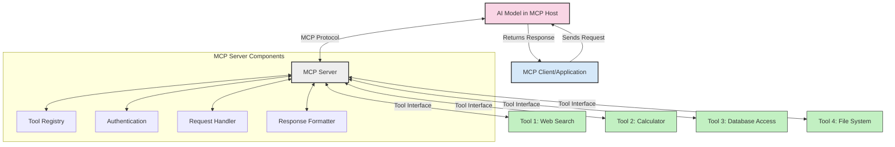
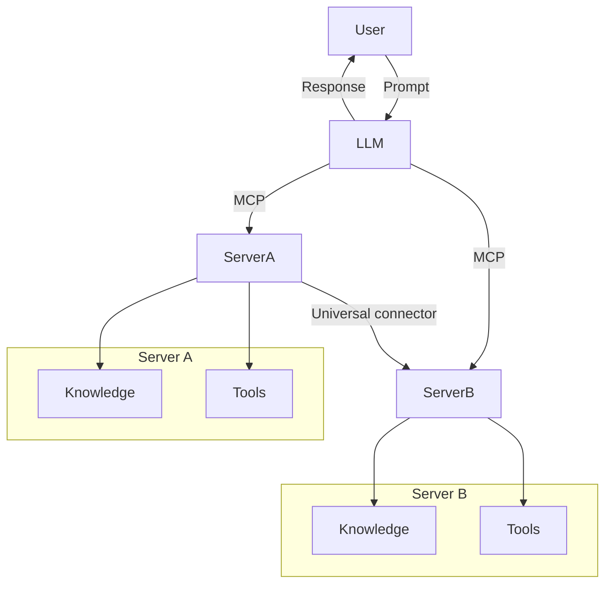

<!--
CO_OP_TRANSLATOR_METADATA:
{
  "original_hash": "cf84f987e1b771d2201408e110dfd2db",
  "translation_date": "2025-05-20T17:43:27+00:00",
  "source_file": "00-Introduction/README.md",
  "language_code": "id"
}
-->
# Pengantar ke Model Context Protocol (MCP): Mengapa Ini Penting untuk Aplikasi AI yang Skalabel

Aplikasi AI generatif adalah langkah maju yang besar karena seringkali memungkinkan pengguna berinteraksi dengan aplikasi menggunakan perintah bahasa alami. Namun, seiring waktu dan sumber daya yang diinvestasikan dalam aplikasi tersebut, Anda ingin memastikan bahwa Anda dapat dengan mudah mengintegrasikan fungsi dan sumber daya sehingga mudah untuk dikembangkan, aplikasi Anda dapat melayani lebih dari satu model yang digunakan, beserta kerumitannya. Singkatnya, membangun aplikasi Gen AI mudah untuk memulai, tapi saat berkembang dan menjadi lebih kompleks, Anda perlu mulai mendefinisikan arsitektur dan kemungkinan besar perlu mengandalkan standar agar aplikasi Anda dibangun dengan cara yang konsisten. Di sinilah MCP berperan untuk mengatur semuanya, menyediakan standar.

---

## **🔍 Apa Itu Model Context Protocol (MCP)?**

**Model Context Protocol (MCP)** adalah **antarmuka terbuka dan standar** yang memungkinkan Large Language Models (LLM) berinteraksi dengan mulus dengan alat eksternal, API, dan sumber data. Ini menyediakan arsitektur konsisten untuk meningkatkan fungsi model AI di luar data pelatihan mereka, memungkinkan sistem AI yang lebih pintar, skalabel, dan responsif.

---

## **🎯 Mengapa Standarisasi dalam AI Penting**

Seiring aplikasi AI generatif menjadi lebih kompleks, penting untuk mengadopsi standar yang memastikan **skalabilitas, ekstensi**, dan **pemeliharaan**. MCP mengatasi kebutuhan ini dengan:

- Menyatukan integrasi model-alat  
- Mengurangi solusi kustom yang rentan dan satu kali pakai  
- Memungkinkan beberapa model hidup berdampingan dalam satu ekosistem  

---

## **📚 Tujuan Pembelajaran**

Di akhir artikel ini, Anda akan dapat:

- Mendefinisikan **Model Context Protocol (MCP)** dan kasus penggunaannya  
- Memahami bagaimana MCP menstandarisasi komunikasi model-ke-alat  
- Mengidentifikasi komponen inti arsitektur MCP  
- Menjelajahi aplikasi nyata MCP dalam konteks perusahaan dan pengembangan  

---

## **💡 Mengapa Model Context Protocol (MCP) Merupakan Pengubah Permainan**

### **🔗 MCP Mengatasi Fragmentasi dalam Interaksi AI**

Sebelum MCP, integrasi model dengan alat memerlukan:

- Kode kustom untuk setiap pasangan alat-model  
- API non-standar untuk setiap vendor  
- Sering terjadi gangguan akibat pembaruan  
- Skalabilitas buruk saat menambah lebih banyak alat  

### **✅ Manfaat Standarisasi MCP**

| **Manfaat**               | **Deskripsi**                                                                 |
|---------------------------|-------------------------------------------------------------------------------|
| Interoperabilitas         | LLM bekerja mulus dengan alat dari berbagai vendor                            |
| Konsistensi               | Perilaku seragam di berbagai platform dan alat                               |
| Reusabilitas              | Alat yang dibuat sekali dapat digunakan di berbagai proyek dan sistem        |
| Percepatan Pengembangan   | Mengurangi waktu pengembangan dengan menggunakan antarmuka standar yang plug-and-play |

---

## **🧱 Gambaran Arsitektur MCP Tingkat Tinggi**

MCP mengikuti **model klien-server**, di mana:

- **MCP Hosts** menjalankan model AI  
- **MCP Clients** menginisiasi permintaan  
- **MCP Servers** menyediakan konteks, alat, dan kapabilitas  

### **Komponen Utama:**

- **Resources** – Data statis atau dinamis untuk model  
- **Prompts** – Alur kerja yang sudah ditentukan untuk panduan generasi  
- **Tools** – Fungsi yang dapat dijalankan seperti pencarian, perhitungan  
- **Sampling** – Perilaku agen melalui interaksi rekursif  

---

## Cara Kerja MCP Servers

Server MCP beroperasi dengan cara berikut:

- **Alur Permintaan**:  
    1. MCP Client mengirimkan permintaan ke Model AI yang berjalan di MCP Host.  
    2. Model AI mengenali saat membutuhkan alat eksternal atau data.  
    3. Model berkomunikasi dengan MCP Server menggunakan protokol standar.  

- **Fungsi MCP Server**:  
    - Tool Registry: Menyimpan katalog alat yang tersedia dan kapabilitasnya.  
    - Otentikasi: Memverifikasi izin akses alat.  
    - Request Handler: Memproses permintaan alat yang masuk dari model.  
    - Response Formatter: Menyusun output alat dalam format yang dapat dipahami model.  

- **Eksekusi Alat**:  
    - Server mengarahkan permintaan ke alat eksternal yang sesuai  
    - Alat menjalankan fungsi khususnya (pencarian, perhitungan, kueri basis data, dll.)  
    - Hasil dikembalikan ke model dalam format yang konsisten.  

- **Penyelesaian Respons**:  
    - Model AI menggabungkan output alat ke dalam responsnya.  
    - Respons akhir dikirim kembali ke aplikasi klien.  

## 👨‍💻 Cara Membangun MCP Server (Dengan Contoh)

Server MCP memungkinkan Anda memperluas kapabilitas LLM dengan menyediakan data dan fungsi.

Siap mencobanya? Berikut contoh membuat server MCP sederhana dalam berbagai bahasa:

- **Contoh Python**: https://github.com/modelcontextprotocol/python-sdk

- **Contoh TypeScript**: https://github.com/modelcontextprotocol/typescript-sdk

- **Contoh Java**: https://github.com/modelcontextprotocol/java-sdk

- **Contoh C#/.NET**: https://github.com/modelcontextprotocol/csharp-sdk

## 🌍 Kasus Penggunaan Nyata untuk MCP

MCP memungkinkan berbagai aplikasi dengan memperluas kapabilitas AI:

| **Aplikasi**               | **Deskripsi**                                                                 |
|----------------------------|-------------------------------------------------------------------------------|
| Integrasi Data Perusahaan  | Menghubungkan LLM ke basis data, CRM, atau alat internal                      |
| Sistem AI Agenik           | Memungkinkan agen otonom dengan akses alat dan alur pengambilan keputusan     |
| Aplikasi Multi-modal       | Menggabungkan alat teks, gambar, dan audio dalam satu aplikasi AI terpadu    |
| Integrasi Data Real-time   | Membawa data langsung ke interaksi AI untuk output yang lebih akurat dan terkini |

### 🧠 MCP = Standar Universal untuk Interaksi AI

Model Context Protocol (MCP) bertindak sebagai standar universal untuk interaksi AI, seperti bagaimana USB-C menstandarisasi koneksi fisik untuk perangkat. Dalam dunia AI, MCP menyediakan antarmuka konsisten, memungkinkan model (klien) untuk terintegrasi mulus dengan alat eksternal dan penyedia data (server). Ini menghilangkan kebutuhan protokol kustom yang beragam untuk setiap API atau sumber data.

Di bawah MCP, alat yang kompatibel dengan MCP (disebut server MCP) mengikuti standar terpadu. Server ini dapat mencantumkan alat atau aksi yang mereka tawarkan dan menjalankan aksi tersebut saat diminta oleh agen AI. Platform agen AI yang mendukung MCP mampu menemukan alat yang tersedia dari server dan memanggilnya melalui protokol standar ini.

### 💡 Mempermudah akses ke pengetahuan

Selain menyediakan alat, MCP juga memudahkan akses ke pengetahuan. Ini memungkinkan aplikasi memberikan konteks ke large language models (LLM) dengan menghubungkannya ke berbagai sumber data. Misalnya, server MCP bisa mewakili repositori dokumen perusahaan, memungkinkan agen mengambil informasi relevan sesuai permintaan. Server lain bisa menangani aksi spesifik seperti mengirim email atau memperbarui catatan. Dari perspektif agen, ini hanyalah alat yang dapat digunakan—beberapa alat mengembalikan data (konteks pengetahuan), sementara yang lain menjalankan aksi. MCP mengelola keduanya dengan efisien.

Agen yang terhubung ke server MCP secara otomatis mempelajari kapabilitas dan data yang dapat diakses server tersebut melalui format standar. Standarisasi ini memungkinkan ketersediaan alat secara dinamis. Misalnya, menambahkan server MCP baru ke sistem agen membuat fungsi server tersebut langsung dapat digunakan tanpa perlu kustomisasi lebih lanjut pada instruksi agen.

Integrasi yang terstruktur ini sesuai dengan alur yang digambarkan dalam diagram mermaid, di mana server menyediakan alat dan pengetahuan, memastikan kolaborasi mulus antar sistem.

### 👉 Contoh: Solusi Agen yang Skalabel

## 🔐 Manfaat Praktis MCP

Berikut manfaat praktis menggunakan MCP:

- **Kebaruan**: Model dapat mengakses informasi terbaru di luar data pelatihan mereka  
- **Perluasan Kapabilitas**: Model dapat memanfaatkan alat khusus untuk tugas yang tidak dilatih sebelumnya  
- **Pengurangan Halusinasi**: Sumber data eksternal memberikan dasar fakta  
- **Privasi**: Data sensitif dapat tetap berada dalam lingkungan yang aman daripada disematkan dalam prompt  

## 📌 Poin Penting

Berikut poin penting dalam menggunakan MCP:

- **MCP** menstandarisasi cara model AI berinteraksi dengan alat dan data  
- Mendorong **ekstensibilitas, konsistensi, dan interoperabilitas**  
- MCP membantu **mengurangi waktu pengembangan, meningkatkan keandalan, dan memperluas kapabilitas model**  
- Arsitektur klien-server **memungkinkan aplikasi AI yang fleksibel dan dapat dikembangkan**  

## 🧠 Latihan

Pikirkan tentang aplikasi AI yang ingin Anda bangun.

- Alat atau data eksternal apa yang bisa meningkatkan kapabilitasnya?  
- Bagaimana MCP dapat membuat integrasi menjadi lebih sederhana dan lebih andal?  

## Sumber Daya Tambahan

- [MCP GitHub Repository](https://github.com/modelcontextprotocol)

## Selanjutnya

Selanjutnya: [Chapter 1: Core Concepts](/01-CoreConcepts/README.md)

**Penafian**:  
Dokumen ini telah diterjemahkan menggunakan layanan terjemahan AI [Co-op Translator](https://github.com/Azure/co-op-translator). Meskipun kami berusaha untuk akurasi, harap diingat bahwa terjemahan otomatis mungkin mengandung kesalahan atau ketidakakuratan. Dokumen asli dalam bahasa aslinya harus dianggap sebagai sumber yang otoritatif. Untuk informasi yang sangat penting, disarankan menggunakan terjemahan profesional oleh manusia. Kami tidak bertanggung jawab atas kesalahpahaman atau penafsiran yang salah yang timbul dari penggunaan terjemahan ini.