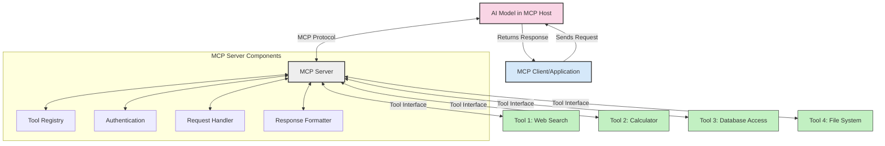
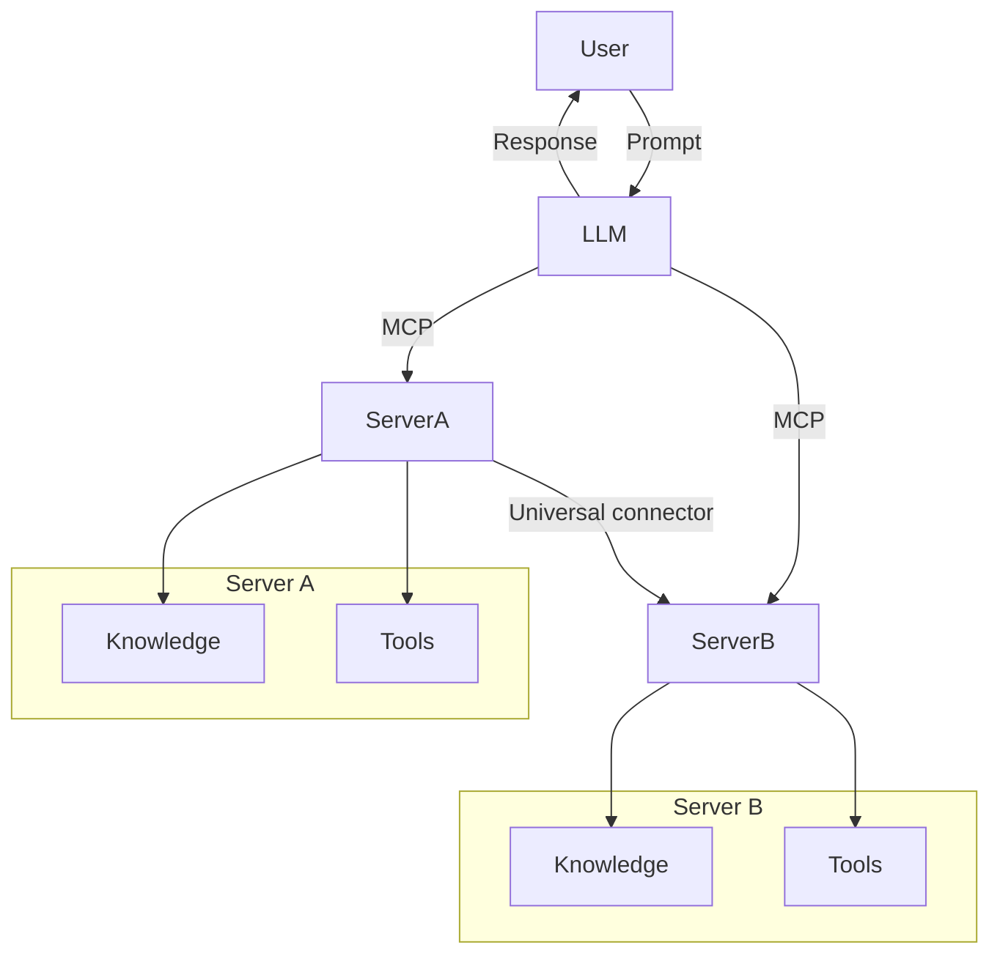

<!--
CO_OP_TRANSLATOR_METADATA:
{
  "original_hash": "02301140adbd807ecf0f17720fa307bc",
  "translation_date": "2025-05-17T06:05:55+00:00",
  "source_file": "00-Introduction/README.md",
  "language_code": "id"
}
-->
# Pengantar Protokol Konteks Model (MCP): Mengapa Ini Penting untuk Aplikasi AI yang Skalabel

Aplikasi AI generatif adalah langkah besar ke depan karena sering kali memungkinkan pengguna berinteraksi dengan aplikasi menggunakan prompt bahasa alami. Namun, seiring semakin banyak waktu dan sumber daya diinvestasikan dalam aplikasi semacam itu, Anda ingin memastikan bahwa Anda dapat dengan mudah mengintegrasikan fungsi dan sumber daya sedemikian rupa sehingga mudah untuk diperluas, bahwa aplikasi Anda dapat melayani lebih dari satu model yang digunakan, dan seluk-beluknya. Singkatnya, membangun aplikasi Gen AI mudah dimulai tetapi seiring pertumbuhannya dan menjadi lebih kompleks, Anda perlu mulai mendefinisikan arsitektur dan kemungkinan besar akan membutuhkan standar untuk memastikan aplikasi Anda dibangun dengan cara yang konsisten. Di sinilah MCP hadir untuk mengatur segalanya, untuk memberikan standar.

---

## **🔍 Apa Itu Protokol Konteks Model (MCP)?**

**Protokol Konteks Model (MCP)** adalah antarmuka **terbuka dan standar** yang memungkinkan Model Bahasa Besar (LLM) berinteraksi secara mulus dengan alat eksternal, API, dan sumber data. Ini memberikan arsitektur yang konsisten untuk meningkatkan fungsi model AI di luar data pelatihannya, memungkinkan sistem AI yang lebih cerdas, skalabel, dan responsif.

---

## **🎯 Mengapa Standarisasi dalam AI Penting**

Seiring aplikasi AI generatif menjadi lebih kompleks, penting untuk mengadopsi standar yang memastikan **skalabilitas, ekstensibilitas**, dan **pemeliharaan**. MCP memenuhi kebutuhan ini dengan:

- Menyatukan integrasi model-alat
- Mengurangi solusi kustom satu kali yang rapuh
- Memungkinkan beberapa model untuk hidup berdampingan dalam satu ekosistem

---

## **📚 Tujuan Pembelajaran**

Pada akhir artikel ini, Anda akan dapat:

- Mendefinisikan **Protokol Konteks Model (MCP)** dan kasus penggunaannya
- Memahami bagaimana MCP menstandarkan komunikasi model-ke-alat
- Mengidentifikasi komponen inti dari arsitektur MCP
- Menjelajahi aplikasi dunia nyata MCP dalam konteks perusahaan dan pengembangan

---

## **💡 Mengapa Protokol Konteks Model (MCP) Menjadi Pengubah Permainan**

### **🔗 MCP Mengatasi Fragmentasi dalam Interaksi AI**

Sebelum MCP, mengintegrasikan model dengan alat memerlukan:

- Kode kustom per pasangan model-alat
- API non-standar untuk setiap vendor
- Gangguan yang sering terjadi akibat pembaruan
- Skalabilitas buruk dengan lebih banyak alat

### **✅ Manfaat Standarisasi MCP**

| **Manfaat**                | **Deskripsi**                                                                   |
|----------------------------|---------------------------------------------------------------------------------|
| Interoperabilitas          | LLM bekerja secara mulus dengan alat dari berbagai vendor                      |
| Konsistensi                | Perilaku seragam di berbagai platform dan alat                                  |
| Reusabilitas               | Alat yang dibangun sekali dapat digunakan di berbagai proyek dan sistem         |
| Percepatan Pengembangan    | Mengurangi waktu pengembangan dengan menggunakan antarmuka standar, plug-and-play |

---

## **🧱 Gambaran Arsitektur MCP Tingkat Tinggi**

MCP mengikuti model **klien-server**, di mana:

- **Host MCP** menjalankan model AI
- **Klien MCP** memulai permintaan
- **Server MCP** melayani konteks, alat, dan kemampuan

### **Komponen Utama:**

- **Sumber Daya** – Data statis atau dinamis untuk model  
- **Prompt** – Alur kerja yang telah ditentukan untuk generasi yang terarah  
- **Alat** – Fungsi yang dapat dieksekusi seperti pencarian, perhitungan  
- **Pengambilan Sampel** – Perilaku agen melalui interaksi berulang

---

## Cara Kerja Server MCP

Server MCP beroperasi dengan cara berikut:

- **Alur Permintaan**: 
    1. Klien MCP mengirimkan permintaan ke Model AI yang berjalan di Host MCP.
    2. Model AI mengidentifikasi kapan ia membutuhkan alat atau data eksternal.
    3. Model berkomunikasi dengan Server MCP menggunakan protokol standar.

- **Fungsi Server MCP**:
    - Registri Alat: Memelihara katalog alat yang tersedia dan kemampuan mereka.
    - Otentikasi: Memverifikasi izin untuk akses alat.
    - Penangan Permintaan: Memproses permintaan alat yang masuk dari model.
    - Pemformat Respons: Menyusun keluaran alat dalam format yang dapat dipahami model.

- **Eksekusi Alat**: 
    - Server mengarahkan permintaan ke alat eksternal yang sesuai
    - Alat menjalankan fungsi khusus mereka (pencarian, perhitungan, kueri database, dll.)
    - Hasil dikembalikan ke model dalam format yang konsisten.

- **Penyelesaian Respons**: 
    - Model AI menggabungkan keluaran alat ke dalam responsnya.
    - Respons akhir dikirim kembali ke aplikasi klien.

## 👨‍💻 Cara Membangun Server MCP (Dengan Contoh)

Server MCP memungkinkan Anda memperluas kemampuan LLM dengan menyediakan data dan fungsi. 

Siap mencobanya? Berikut adalah contoh pembuatan server MCP sederhana dalam berbagai bahasa:

- **Contoh Python**: https://github.com/modelcontextprotocol/python-sdk

- **Contoh TypeScript**: https://github.com/modelcontextprotocol/typescript-sdk

- **Contoh Java**: https://github.com/modelcontextprotocol/java-sdk

- **Contoh C#/.NET**: https://github.com/modelcontextprotocol/csharp-sdk

## 🌍 Kasus Penggunaan Dunia Nyata untuk MCP

MCP memungkinkan berbagai aplikasi dengan memperluas kemampuan AI:

| **Aplikasi**                | **Deskripsi**                                                                   |
|-----------------------------|---------------------------------------------------------------------------------|
| Integrasi Data Perusahaan   | Menghubungkan LLM ke database, CRM, atau alat internal                          |
| Sistem AI Agen              | Memungkinkan agen otonom dengan akses alat dan alur kerja pengambilan keputusan |
| Aplikasi Multi-modal        | Menggabungkan alat teks, gambar, dan audio dalam satu aplikasi AI terpadu       |
| Integrasi Data Real-time    | Membawa data langsung ke interaksi AI untuk keluaran yang lebih akurat dan terkini |

### 🧠 MCP = Standar Universal untuk Interaksi AI

Protokol Konteks Model (MCP) bertindak sebagai standar universal untuk interaksi AI, seperti bagaimana USB-C menstandarkan koneksi fisik untuk perangkat. Di dunia AI, MCP menyediakan antarmuka yang konsisten, memungkinkan model (klien) untuk berintegrasi secara mulus dengan alat eksternal dan penyedia data (server). Ini menghilangkan kebutuhan untuk protokol kustom yang beragam untuk setiap API atau sumber data.

Di bawah MCP, alat yang kompatibel dengan MCP (disebut sebagai server MCP) mengikuti standar yang terpadu. Server ini dapat mencantumkan alat atau tindakan yang mereka tawarkan dan mengeksekusi tindakan tersebut saat diminta oleh agen AI. Platform agen AI yang mendukung MCP mampu menemukan alat yang tersedia dari server dan memanggilnya melalui protokol standar ini.

### 💡 Memfasilitasi akses ke pengetahuan

Selain menawarkan alat, MCP juga memfasilitasi akses ke pengetahuan. Ini memungkinkan aplikasi untuk memberikan konteks kepada model bahasa besar (LLM) dengan menghubungkan mereka ke berbagai sumber data. Misalnya, server MCP mungkin mewakili repositori dokumen perusahaan, memungkinkan agen untuk mengambil informasi yang relevan sesuai permintaan. Server lain dapat menangani tindakan khusus seperti mengirim email atau memperbarui catatan. Dari perspektif agen, ini hanyalah alat yang dapat digunakan—beberapa alat mengembalikan data (konteks pengetahuan), sementara yang lain melakukan tindakan. MCP mengelola keduanya dengan efisien.

Agen yang terhubung ke server MCP secara otomatis mempelajari kemampuan yang tersedia dan data yang dapat diakses dari server melalui format standar. Standarisasi ini memungkinkan ketersediaan alat yang dinamis. Misalnya, menambahkan server MCP baru ke sistem agen membuat fungsinya langsung dapat digunakan tanpa memerlukan kustomisasi lebih lanjut dari instruksi agen.

Integrasi yang efisien ini selaras dengan alur yang digambarkan dalam diagram mermaid, di mana server menyediakan alat dan pengetahuan, memastikan kolaborasi yang mulus di seluruh sistem.

### 👉 Contoh: Solusi Agen yang Skalabel

## 🔐 Manfaat Praktis dari MCP

Berikut beberapa manfaat praktis menggunakan MCP:

- **Kebaruan**: Model dapat mengakses informasi terkini di luar data pelatihannya
- **Ekstensi Kemampuan**: Model dapat memanfaatkan alat khusus untuk tugas yang tidak dilatihnya
- **Pengurangan Halusinasi**: Sumber data eksternal memberikan dasar faktual
- **Privasi**: Data sensitif dapat tetap berada dalam lingkungan yang aman daripada disematkan dalam prompt

## 📌 Poin Penting

Berikut adalah poin penting untuk menggunakan MCP:

- **MCP** menstandarkan bagaimana model AI berinteraksi dengan alat dan data
- Mempromosikan **ekstensibilitas, konsistensi, dan interoperabilitas**
- MCP membantu **mengurangi waktu pengembangan, meningkatkan keandalan, dan memperluas kemampuan model**
- Arsitektur klien-server **memungkinkan aplikasi AI yang fleksibel dan dapat diperluas**

## 🧠 Latihan

Pikirkan tentang aplikasi AI yang ingin Anda bangun.

- Alat atau data **eksternal** apa yang dapat meningkatkan kemampuannya?
- Bagaimana MCP dapat membuat integrasi **lebih sederhana dan lebih dapat diandalkan?**

## Sumber Daya Tambahan

- [Repositori GitHub MCP](https://github.com/modelcontextprotocol)

## Apa yang Selanjutnya

Selanjutnya: [Bab 1: Konsep Inti](/01-CoreConcepts/README.md)

**Penafian**:  
Dokumen ini telah diterjemahkan menggunakan layanan penerjemahan AI [Co-op Translator](https://github.com/Azure/co-op-translator). Meskipun kami berusaha untuk mencapai akurasi, harap diingat bahwa terjemahan otomatis mungkin mengandung kesalahan atau ketidakakuratan. Dokumen asli dalam bahasa aslinya harus dianggap sebagai sumber yang berwenang. Untuk informasi penting, disarankan menggunakan penerjemahan manusia profesional. Kami tidak bertanggung jawab atas kesalahpahaman atau salah tafsir yang timbul dari penggunaan terjemahan ini.