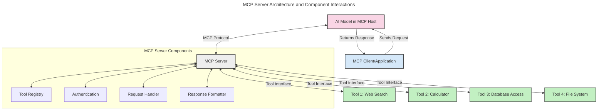
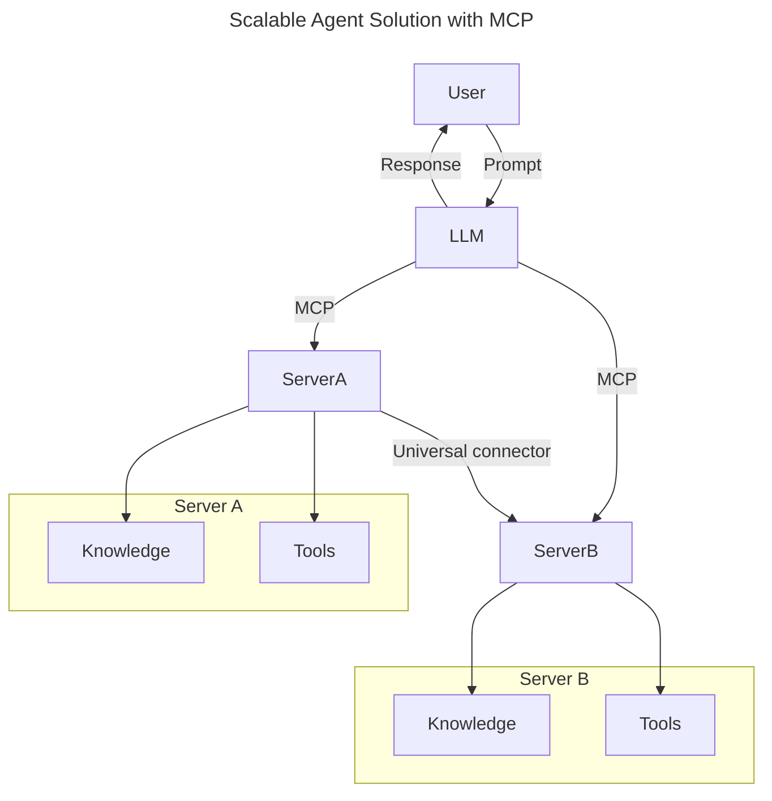
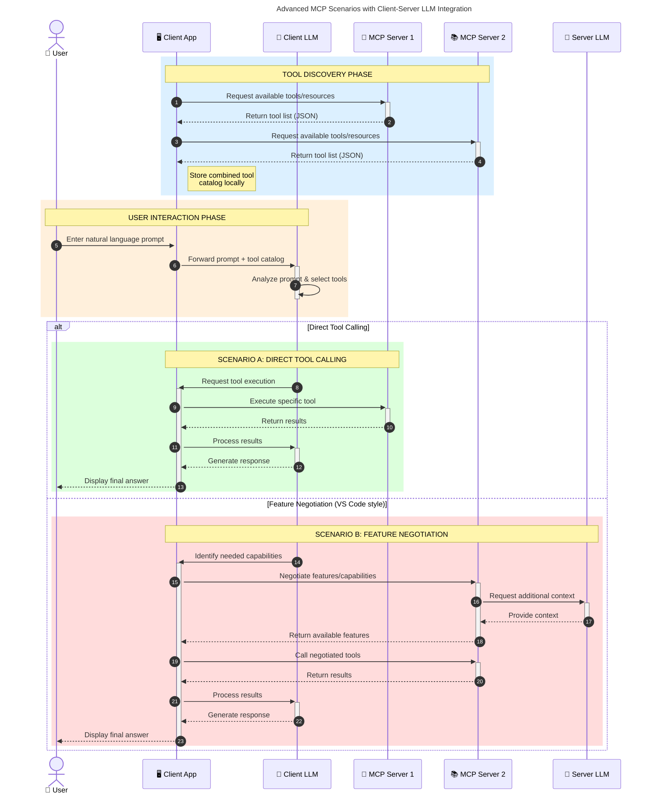

<!--
CO_OP_TRANSLATOR_METADATA:
{
  "original_hash": "105c2ddbb77bc38f7e9df009e1b06e45",
  "translation_date": "2025-07-04T18:08:17+00:00",
  "source_file": "00-Introduction/README.md",
  "language_code": "id"
}
-->
# Pengenalan Model Context Protocol (MCP): Mengapa Ini Penting untuk Aplikasi AI yang Skalabel

Aplikasi Generative AI merupakan langkah maju yang besar karena seringkali memungkinkan pengguna berinteraksi dengan aplikasi menggunakan perintah bahasa alami. Namun, seiring semakin banyak waktu dan sumber daya yang diinvestasikan dalam aplikasi semacam ini, Anda ingin memastikan bahwa Anda dapat dengan mudah mengintegrasikan fungsionalitas dan sumber daya dengan cara yang mudah diperluas, aplikasi Anda dapat melayani lebih dari satu model yang digunakan, dan menangani berbagai kompleksitas model. Singkatnya, membangun aplikasi Gen AI mudah untuk dimulai, tetapi saat mereka tumbuh dan menjadi lebih kompleks, Anda perlu mulai mendefinisikan arsitektur dan kemungkinan besar harus mengandalkan standar untuk memastikan aplikasi Anda dibangun secara konsisten. Di sinilah MCP hadir untuk mengatur semuanya dan menyediakan standar.

---

## **🔍 Apa Itu Model Context Protocol (MCP)?**

**Model Context Protocol (MCP)** adalah **antarmuka terbuka dan standar** yang memungkinkan Large Language Models (LLM) berinteraksi dengan mulus dengan alat eksternal, API, dan sumber data. MCP menyediakan arsitektur yang konsisten untuk meningkatkan fungsi model AI di luar data pelatihan mereka, memungkinkan sistem AI yang lebih cerdas, skalabel, dan responsif.

---

## **🎯 Mengapa Standarisasi dalam AI Penting**

Seiring aplikasi generative AI menjadi lebih kompleks, penting untuk mengadopsi standar yang menjamin **skalabilitas, kemampuan perluasan**, dan **pemeliharaan**. MCP menjawab kebutuhan ini dengan:

- Menyatukan integrasi model dengan alat
- Mengurangi solusi kustom yang rapuh dan sekali pakai
- Memungkinkan beberapa model hidup berdampingan dalam satu ekosistem

---

## **📚 Tujuan Pembelajaran**

Di akhir artikel ini, Anda akan dapat:

- Mendefinisikan **Model Context Protocol (MCP)** dan kasus penggunaannya
- Memahami bagaimana MCP menstandarisasi komunikasi model-ke-alat
- Mengidentifikasi komponen inti arsitektur MCP
- Menjelajahi aplikasi nyata MCP dalam konteks perusahaan dan pengembangan

---

## **💡 Mengapa Model Context Protocol (MCP) Merupakan Terobosan**

### **🔗 MCP Mengatasi Fragmentasi dalam Interaksi AI**

Sebelum MCP, mengintegrasikan model dengan alat memerlukan:

- Kode kustom untuk setiap pasangan alat-model
- API non-standar untuk setiap vendor
- Sering terjadi gangguan akibat pembaruan
- Skalabilitas yang buruk dengan bertambahnya alat

### **✅ Manfaat Standarisasi MCP**

| **Manfaat**              | **Deskripsi**                                                                |
|--------------------------|------------------------------------------------------------------------------|
| Interoperabilitas        | LLM bekerja mulus dengan alat dari berbagai vendor                           |
| Konsistensi              | Perilaku seragam di berbagai platform dan alat                              |
| Dapat Digunakan Kembali  | Alat yang dibuat sekali dapat digunakan di berbagai proyek dan sistem       |
| Percepatan Pengembangan  | Mengurangi waktu pengembangan dengan menggunakan antarmuka standar plug-and-play |

---

## **🧱 Gambaran Arsitektur MCP Tingkat Tinggi**

MCP mengikuti **model klien-server**, di mana:

- **MCP Hosts** menjalankan model AI
- **MCP Clients** menginisiasi permintaan
- **MCP Servers** menyediakan konteks, alat, dan kapabilitas

### **Komponen Utama:**

- **Resources** – Data statis atau dinamis untuk model  
- **Prompts** – Alur kerja yang telah ditentukan untuk generasi terarah  
- **Tools** – Fungsi yang dapat dijalankan seperti pencarian, perhitungan  
- **Sampling** – Perilaku agen melalui interaksi rekursif

---

## Cara Kerja MCP Servers

MCP server beroperasi dengan cara berikut:

- **Alur Permintaan**:  
    1. MCP Client mengirim permintaan ke Model AI yang berjalan di MCP Host.  
    2. Model AI mengenali saat membutuhkan alat atau data eksternal.  
    3. Model berkomunikasi dengan MCP Server menggunakan protokol standar.

- **Fungsi MCP Server**:  
    - Tool Registry: Menjaga katalog alat yang tersedia dan kapabilitasnya.  
    - Otentikasi: Memverifikasi izin akses alat.  
    - Request Handler: Memproses permintaan alat yang masuk dari model.  
    - Response Formatter: Menyusun output alat dalam format yang dapat dipahami model.

- **Eksekusi Alat**:  
    - Server mengarahkan permintaan ke alat eksternal yang sesuai  
    - Alat menjalankan fungsi khususnya (pencarian, perhitungan, kueri database, dll.)  
    - Hasil dikembalikan ke model dalam format yang konsisten.

- **Penyelesaian Respon**:  
    - Model AI menggabungkan output alat ke dalam responsnya.  
    - Respons akhir dikirim kembali ke aplikasi klien.

## 👨‍💻 Cara Membangun MCP Server (Dengan Contoh)

MCP server memungkinkan Anda memperluas kapabilitas LLM dengan menyediakan data dan fungsionalitas.

Siap mencoba? Berikut contoh membuat MCP server sederhana dalam berbagai bahasa:

- **Contoh Python**: https://github.com/modelcontextprotocol/python-sdk

- **Contoh TypeScript**: https://github.com/modelcontextprotocol/typescript-sdk

- **Contoh Java**: https://github.com/modelcontextprotocol/java-sdk

- **Contoh C#/.NET**: https://github.com/modelcontextprotocol/csharp-sdk

## 🌍 Kasus Penggunaan MCP di Dunia Nyata

MCP memungkinkan berbagai aplikasi dengan memperluas kapabilitas AI:

| **Aplikasi**               | **Deskripsi**                                                                |
|----------------------------|------------------------------------------------------------------------------|
| Integrasi Data Perusahaan  | Menghubungkan LLM ke database, CRM, atau alat internal                       |
| Sistem AI Agenik           | Memungkinkan agen otonom dengan akses alat dan alur pengambilan keputusan    |
| Aplikasi Multi-modal       | Menggabungkan alat teks, gambar, dan audio dalam satu aplikasi AI terpadu   |
| Integrasi Data Real-time   | Membawa data langsung ke interaksi AI untuk output yang lebih akurat dan terkini |

### 🧠 MCP = Standar Universal untuk Interaksi AI

Model Context Protocol (MCP) berperan sebagai standar universal untuk interaksi AI, seperti bagaimana USB-C menstandarisasi koneksi fisik perangkat. Dalam dunia AI, MCP menyediakan antarmuka yang konsisten, memungkinkan model (klien) terintegrasi mulus dengan alat eksternal dan penyedia data (server). Ini menghilangkan kebutuhan akan protokol kustom yang beragam untuk setiap API atau sumber data.

Di bawah MCP, alat yang kompatibel dengan MCP (disebut MCP server) mengikuti standar terpadu. Server ini dapat mencantumkan alat atau aksi yang mereka tawarkan dan menjalankan aksi tersebut saat diminta oleh agen AI. Platform agen AI yang mendukung MCP mampu menemukan alat yang tersedia dari server dan memanggilnya melalui protokol standar ini.

### 💡 Memudahkan Akses ke Pengetahuan

Selain menyediakan alat, MCP juga memudahkan akses ke pengetahuan. MCP memungkinkan aplikasi memberikan konteks kepada large language models (LLM) dengan menghubungkannya ke berbagai sumber data. Misalnya, sebuah MCP server bisa mewakili repositori dokumen perusahaan, memungkinkan agen mengambil informasi relevan sesuai permintaan. Server lain bisa menangani aksi spesifik seperti mengirim email atau memperbarui catatan. Dari perspektif agen, ini hanyalah alat yang bisa digunakan—beberapa alat mengembalikan data (konteks pengetahuan), sementara yang lain melakukan aksi. MCP mengelola keduanya dengan efisien.

Agen yang terhubung ke MCP server secara otomatis mempelajari kapabilitas dan data yang dapat diakses server melalui format standar. Standarisasi ini memungkinkan ketersediaan alat secara dinamis. Misalnya, menambahkan MCP server baru ke sistem agen membuat fungsi server tersebut langsung dapat digunakan tanpa perlu penyesuaian lebih lanjut pada instruksi agen.

Integrasi yang efisien ini sesuai dengan alur yang digambarkan dalam diagram mermaid, di mana server menyediakan alat dan pengetahuan, memastikan kolaborasi mulus antar sistem.

### 👉 Contoh: Solusi Agen yang Skalabel

### 🔄 Skenario MCP Lanjutan dengan Integrasi LLM di Sisi Klien

Selain arsitektur MCP dasar, ada skenario lanjutan di mana baik klien maupun server memiliki LLM, memungkinkan interaksi yang lebih canggih:

## 🔐 Manfaat Praktis MCP

Berikut manfaat praktis menggunakan MCP:

- **Kebaruan**: Model dapat mengakses informasi terkini di luar data pelatihan mereka  
- **Perluasan Kapabilitas**: Model dapat memanfaatkan alat khusus untuk tugas yang tidak mereka latih  
- **Pengurangan Halusinasi**: Sumber data eksternal memberikan dasar fakta  
- **Privasi**: Data sensitif dapat tetap berada di lingkungan yang aman tanpa harus disematkan dalam prompt

## 📌 Poin Penting

Berikut poin penting dalam menggunakan MCP:

- **MCP** menstandarisasi cara model AI berinteraksi dengan alat dan data  
- Mendorong **kemampuan perluasan, konsistensi, dan interoperabilitas**  
- MCP membantu **mengurangi waktu pengembangan, meningkatkan keandalan, dan memperluas kapabilitas model**  
- Arsitektur klien-server **memungkinkan aplikasi AI yang fleksibel dan dapat diperluas**

## 🧠 Latihan

Pikirkan tentang aplikasi AI yang ingin Anda bangun.

- Alat atau data eksternal apa yang bisa meningkatkan kapabilitasnya?  
- Bagaimana MCP bisa membuat integrasi menjadi lebih sederhana dan andal?

## Sumber Tambahan

- [MCP GitHub Repository](https://github.com/modelcontextprotocol)

## Selanjutnya

Selanjutnya: [Bab 1: Konsep Inti](../01-CoreConcepts/README.md)

**Penafian**:  
Dokumen ini telah diterjemahkan menggunakan layanan terjemahan AI [Co-op Translator](https://github.com/Azure/co-op-translator). Meskipun kami berupaya untuk mencapai akurasi, harap diperhatikan bahwa terjemahan otomatis mungkin mengandung kesalahan atau ketidakakuratan. Dokumen asli dalam bahasa aslinya harus dianggap sebagai sumber yang sahih. Untuk informasi penting, disarankan menggunakan terjemahan profesional oleh manusia. Kami tidak bertanggung jawab atas kesalahpahaman atau penafsiran yang keliru yang timbul dari penggunaan terjemahan ini.