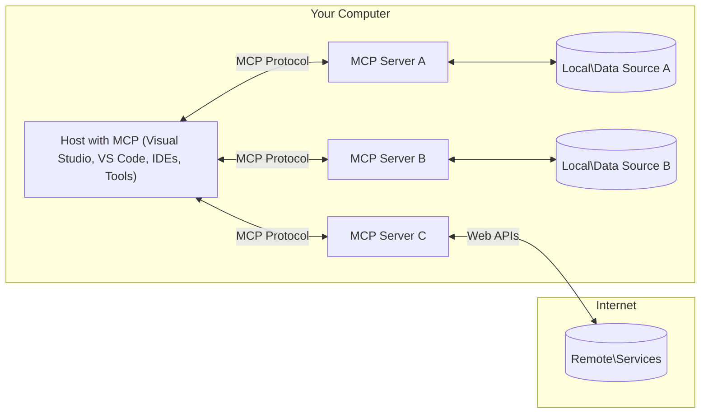

<!--
CO_OP_TRANSLATOR_METADATA:
{
  "original_hash": "904b59de1de9264801242d90a42cdd9d",
  "translation_date": "2025-09-05T11:18:42+00:00",
  "source_file": "01-CoreConcepts/README.md",
  "language_code": "id"
}
-->
# Konsep Inti MCP: Menguasai Model Context Protocol untuk Integrasi AI

[](https://youtu.be/earDzWGtE84)

_(Klik gambar di atas untuk menonton video pelajaran ini)_

[Model Context Protocol (MCP)](https://github.com/modelcontextprotocol) adalah kerangka kerja standar yang kuat untuk mengoptimalkan komunikasi antara Large Language Models (LLMs) dan alat, aplikasi, serta sumber data eksternal. Panduan ini akan menjelaskan konsep inti MCP. Anda akan mempelajari arsitektur client-server, komponen penting, mekanisme komunikasi, dan praktik terbaik implementasi.

- **Persetujuan Pengguna yang Jelas**: Semua akses data dan operasi memerlukan persetujuan eksplisit dari pengguna sebelum dijalankan. Pengguna harus memahami dengan jelas data apa yang akan diakses dan tindakan apa yang akan dilakukan, dengan kontrol yang terperinci atas izin dan otorisasi.

- **Perlindungan Privasi Data**: Data pengguna hanya dapat diakses dengan persetujuan eksplisit dan harus dilindungi dengan kontrol akses yang kuat sepanjang siklus interaksi. Implementasi harus mencegah transmisi data yang tidak sah dan menjaga batas privasi yang ketat.

- **Keamanan Eksekusi Alat**: Setiap pemanggilan alat memerlukan persetujuan eksplisit dari pengguna dengan pemahaman yang jelas tentang fungsi alat, parameter, dan dampaknya. Batas keamanan yang kuat harus mencegah eksekusi alat yang tidak disengaja, tidak aman, atau berbahaya.

- **Keamanan Lapisan Transportasi**: Semua saluran komunikasi harus menggunakan mekanisme enkripsi dan autentikasi yang sesuai. Koneksi jarak jauh harus menerapkan protokol transportasi yang aman dan pengelolaan kredensial yang tepat.

#### Panduan Implementasi:

- **Manajemen Izin**: Terapkan sistem izin yang terperinci yang memungkinkan pengguna mengontrol server, alat, dan sumber daya mana yang dapat diakses.
- **Autentikasi & Otorisasi**: Gunakan metode autentikasi yang aman (OAuth, API keys) dengan pengelolaan token dan masa berlaku yang tepat.  
- **Validasi Input**: Validasi semua parameter dan input data sesuai dengan skema yang ditentukan untuk mencegah serangan injeksi.
- **Pencatatan Audit**: Pertahankan log yang komprehensif dari semua operasi untuk pemantauan keamanan dan kepatuhan.

## Ikhtisar

Pelajaran ini mengeksplorasi arsitektur dan komponen fundamental yang membentuk ekosistem Model Context Protocol (MCP). Anda akan mempelajari arsitektur client-server, komponen utama, dan mekanisme komunikasi yang mendukung interaksi MCP.

## Tujuan Pembelajaran Utama

Pada akhir pelajaran ini, Anda akan:

- Memahami arsitektur client-server MCP.
- Mengidentifikasi peran dan tanggung jawab Hosts, Clients, dan Servers.
- Menganalisis fitur inti yang membuat MCP menjadi lapisan integrasi yang fleksibel.
- Mempelajari alur informasi dalam ekosistem MCP.
- Mendapatkan wawasan praktis melalui contoh kode dalam .NET, Java, Python, dan JavaScript.

## Arsitektur MCP: Penjelasan Mendalam

Ekosistem MCP dibangun berdasarkan model client-server. Struktur modular ini memungkinkan aplikasi AI berinteraksi dengan alat, basis data, API, dan sumber daya kontekstual secara efisien. Mari kita uraikan arsitektur ini ke dalam komponen intinya.

Pada intinya, MCP mengikuti arsitektur client-server di mana aplikasi host dapat terhubung ke beberapa server:



- **MCP Hosts**: Program seperti VSCode, Claude Desktop, IDE, atau alat AI yang ingin mengakses data melalui MCP.
- **MCP Clients**: Klien protokol yang mempertahankan koneksi 1:1 dengan server.
- **MCP Servers**: Program ringan yang masing-masing menyediakan kemampuan spesifik melalui Model Context Protocol yang terstandarisasi.
- **Sumber Data Lokal**: File, basis data, dan layanan di komputer Anda yang dapat diakses dengan aman oleh server MCP.
- **Layanan Jarak Jauh**: Sistem eksternal yang tersedia melalui internet yang dapat dihubungkan oleh server MCP melalui API.

Model Context Protocol adalah standar yang terus berkembang menggunakan versi berbasis tanggal (format YYYY-MM-DD). Versi protokol saat ini adalah **2025-06-18**. Anda dapat melihat pembaruan terbaru pada [spesifikasi protokol](https://modelcontextprotocol.io/specification/2025-06-18/).

### 1. Hosts

Dalam Model Context Protocol (MCP), **Hosts** adalah aplikasi AI yang berfungsi sebagai antarmuka utama di mana pengguna berinteraksi dengan protokol. Hosts mengoordinasikan dan mengelola koneksi ke beberapa server MCP dengan membuat klien MCP khusus untuk setiap koneksi server. Contoh Hosts meliputi:

- **Aplikasi AI**: Claude Desktop, Visual Studio Code, Claude Code.
- **Lingkungan Pengembangan**: IDE dan editor kode dengan integrasi MCP.  
- **Aplikasi Kustom**: Agen AI dan alat yang dibuat khusus.

**Hosts** adalah aplikasi yang mengoordinasikan interaksi model AI. Mereka:

- **Mengatur Model AI**: Menjalankan atau berinteraksi dengan LLM untuk menghasilkan respons dan mengoordinasikan alur kerja AI.
- **Mengelola Koneksi Klien**: Membuat dan mempertahankan satu klien MCP per koneksi server MCP.
- **Mengontrol Antarmuka Pengguna**: Menangani alur percakapan, interaksi pengguna, dan penyajian respons.  
- **Menegakkan Keamanan**: Mengontrol izin, batasan keamanan, dan autentikasi.
- **Mengelola Persetujuan Pengguna**: Mengatur persetujuan pengguna untuk berbagi data dan eksekusi alat.

### 2. Clients

**Clients** adalah komponen penting yang mempertahankan koneksi satu-satu antara Hosts dan server MCP. Setiap klien MCP dibuat oleh Host untuk terhubung ke server MCP tertentu, memastikan saluran komunikasi yang terorganisir dan aman. Banyak klien memungkinkan Hosts terhubung ke beberapa server secara bersamaan.

**Clients** adalah komponen penghubung dalam aplikasi host. Mereka:

- **Komunikasi Protokol**: Mengirim permintaan JSON-RPC 2.0 ke server dengan prompt dan instruksi.
- **Negosiasi Kemampuan**: Bernegosiasi fitur yang didukung dan versi protokol dengan server selama inisialisasi.
- **Eksekusi Alat**: Mengelola permintaan eksekusi alat dari model dan memproses respons.
- **Pembaruan Real-time**: Menangani notifikasi dan pembaruan real-time dari server.
- **Pemrosesan Respons**: Memproses dan memformat respons server untuk ditampilkan kepada pengguna.

### 3. Servers

**Servers** adalah program yang menyediakan konteks, alat, dan kemampuan kepada klien MCP. Mereka dapat dijalankan secara lokal (di mesin yang sama dengan Host) atau jarak jauh (di platform eksternal), dan bertanggung jawab untuk menangani permintaan klien serta memberikan respons yang terstruktur. Servers menyediakan fungsi spesifik melalui Model Context Protocol yang terstandarisasi.

**Servers** adalah layanan yang menyediakan konteks dan kemampuan. Mereka:

- **Pendaftaran Fitur**: Mendaftarkan dan menyediakan primitif yang tersedia (sumber daya, prompt, alat) kepada klien.
- **Pemrosesan Permintaan**: Menerima dan menjalankan panggilan alat, permintaan sumber daya, dan permintaan prompt dari klien.
- **Penyediaan Konteks**: Memberikan informasi kontekstual dan data untuk meningkatkan respons model.
- **Manajemen Status**: Mempertahankan status sesi dan menangani interaksi berbasis status jika diperlukan.
- **Notifikasi Real-time**: Mengirim notifikasi tentang perubahan kemampuan dan pembaruan kepada klien yang terhubung.

Servers dapat dikembangkan oleh siapa saja untuk memperluas kemampuan model dengan fungsi khusus, dan mereka mendukung skenario pengembangan lokal maupun jarak jauh.

### 4. Primitif Server

Servers dalam Model Context Protocol (MCP) menyediakan tiga **primitif** inti yang mendefinisikan blok bangunan fundamental untuk interaksi yang kaya antara klien, hosts, dan model bahasa. Primitif ini menentukan jenis informasi kontekstual dan tindakan yang tersedia melalui protokol.

Servers MCP dapat menyediakan kombinasi dari tiga primitif inti berikut:

#### Resources 

**Resources** adalah sumber data yang menyediakan informasi kontekstual untuk aplikasi AI. Mereka mewakili konten statis atau dinamis yang dapat meningkatkan pemahaman dan pengambilan keputusan model:

- **Data Kontekstual**: Informasi terstruktur dan konteks untuk konsumsi model AI.
- **Basis Pengetahuan**: Repositori dokumen, artikel, manual, dan makalah penelitian.
- **Sumber Data Lokal**: File, basis data, dan informasi sistem lokal.  
- **Data Eksternal**: Respons API, layanan web, dan data sistem jarak jauh.
- **Konten Dinamis**: Data real-time yang diperbarui berdasarkan kondisi eksternal.

Resources diidentifikasi oleh URI dan mendukung penemuan melalui metode `resources/list` dan pengambilan melalui `resources/read`:

```text
file://documents/project-spec.md
database://production/users/schema
api://weather/current
```

#### Prompts

**Prompts** adalah template yang dapat digunakan kembali untuk membantu menyusun interaksi dengan model bahasa. Mereka menyediakan pola interaksi standar dan alur kerja yang terstruktur:

- **Interaksi Berbasis Template**: Pesan yang telah terstruktur dan pemula percakapan.
- **Template Alur Kerja**: Urutan standar untuk tugas dan interaksi umum.
- **Contoh Few-shot**: Template berbasis contoh untuk instruksi model.
- **Prompt Sistem**: Prompt dasar yang mendefinisikan perilaku dan konteks model.
- **Template Dinamis**: Prompt yang diparameterisasi dan beradaptasi dengan konteks tertentu.

Prompts mendukung substitusi variabel dan dapat ditemukan melalui `prompts/list` serta diambil dengan `prompts/get`:

```markdown
Generate a {{task_type}} for {{product}} targeting {{audience}} with the following requirements: {{requirements}}
```

#### Tools

**Tools** adalah fungsi yang dapat dieksekusi yang dapat dipanggil oleh model AI untuk melakukan tindakan tertentu. Mereka mewakili "kata kerja" dari ekosistem MCP, memungkinkan model berinteraksi dengan sistem eksternal:

- **Fungsi yang Dapat Dieksekusi**: Operasi diskrit yang dapat dipanggil oleh model dengan parameter tertentu.
- **Integrasi Sistem Eksternal**: Panggilan API, kueri basis data, operasi file, perhitungan.
- **Identitas Unik**: Setiap alat memiliki nama, deskripsi, dan skema parameter yang berbeda.
- **I/O Terstruktur**: Alat menerima parameter yang divalidasi dan mengembalikan respons yang terstruktur dan bertipe.
- **Kemampuan Tindakan**: Memungkinkan model melakukan tindakan nyata dan mengambil data langsung.

Tools didefinisikan dengan JSON Schema untuk validasi parameter dan ditemukan melalui `tools/list` serta dieksekusi melalui `tools/call`:

```typescript
server.tool(
  "search_products", 
  {
    query: z.string().describe("Search query for products"),
    category: z.string().optional().describe("Product category filter"),
    max_results: z.number().default(10).describe("Maximum results to return")
  }, 
  async (params) => {
    // Execute search and return structured results
    return await productService.search(params);
  }
);
```

## Primitif Klien

Dalam Model Context Protocol (MCP), **klien** dapat menyediakan primitif yang memungkinkan server meminta kemampuan tambahan dari aplikasi host. Primitif sisi klien ini memungkinkan implementasi server yang lebih kaya dan interaktif yang dapat mengakses kemampuan model AI dan interaksi pengguna.

### Sampling

**Sampling** memungkinkan server meminta penyelesaian model bahasa dari aplikasi AI klien. Primitif ini memungkinkan server mengakses kemampuan LLM tanpa menyertakan dependensi model mereka sendiri:

- **Akses Model Independen**: Server dapat meminta penyelesaian tanpa menyertakan SDK LLM atau mengelola akses model.
- **AI yang Diinisiasi Server**: Memungkinkan server secara mandiri menghasilkan konten menggunakan model AI klien.
- **Interaksi LLM Rekursif**: Mendukung skenario kompleks di mana server membutuhkan bantuan AI untuk pemrosesan.
- **Pembuatan Konten Dinamis**: Memungkinkan server membuat respons kontekstual menggunakan model host.

Sampling dimulai melalui metode `sampling/complete`, di mana server mengirimkan permintaan penyelesaian ke klien.

### Elicitation  

**Elicitation** memungkinkan server meminta informasi tambahan atau konfirmasi dari pengguna melalui antarmuka klien:

- **Permintaan Input Pengguna**: Server dapat meminta informasi tambahan yang diperlukan untuk eksekusi alat.
- **Dialog Konfirmasi**: Meminta persetujuan pengguna untuk operasi yang sensitif atau berdampak.
- **Alur Kerja Interaktif**: Memungkinkan server membuat interaksi pengguna langkah demi langkah.
- **Pengumpulan Parameter Dinamis**: Mengumpulkan parameter yang hilang atau opsional selama eksekusi alat.

Permintaan elicitation dilakukan menggunakan metode `elicitation/request` untuk mengumpulkan input pengguna melalui antarmuka klien.

### Logging

**Logging** memungkinkan server mengirim pesan log terstruktur ke klien untuk debugging, pemantauan, dan visibilitas operasional:

- **Dukungan Debugging**: Memungkinkan server memberikan log eksekusi yang terperinci untuk pemecahan masalah.
- **Pemantauan Operasional**: Mengirim pembaruan status dan metrik kinerja ke klien.
- **Pelaporan Kesalahan**: Memberikan konteks kesalahan yang terperinci dan informasi diagnostik.
- **Jejak Audit**: Membuat log yang komprehensif dari operasi dan keputusan server.

Pesan logging dikirim ke klien untuk memberikan transparansi dalam operasi server dan memfasilitasi debugging.

## Alur Informasi dalam MCP

Model Context Protocol (MCP) mendefinisikan alur informasi yang terstruktur antara hosts, klien, server, dan model. Memahami alur ini membantu menjelaskan bagaimana permintaan pengguna diproses dan bagaimana alat serta data eksternal diintegrasikan ke dalam respons model.

- **Host Memulai Koneksi**  
  Aplikasi host (seperti IDE atau antarmuka chat) membangun koneksi ke server MCP, biasanya melalui STDIO, WebSocket, atau transportasi yang didukung lainnya.

- **Negosiasi Kemampuan**  
  Klien (yang tertanam dalam host) dan server saling bertukar informasi tentang fitur, alat, sumber daya, dan versi protokol yang didukung. Ini memastikan kedua pihak memahami kemampuan yang tersedia untuk sesi tersebut.

- **Permintaan Pengguna**  
  Pengguna berinteraksi dengan host (misalnya, memasukkan prompt atau perintah). Host mengumpulkan input ini dan meneruskannya ke klien untuk diproses.

- **Penggunaan Sumber Daya atau Alat**  
  - Klien dapat meminta konteks tambahan atau sumber daya dari server (seperti file, entri basis data, atau artikel basis pengetahuan) untuk memperkaya pemahaman model.
  - Jika model menentukan bahwa alat diperlukan (misalnya, untuk mengambil data, melakukan perhitungan, atau memanggil API), klien mengirimkan permintaan pemanggilan alat ke server, dengan spesifikasi nama alat dan parameter.

- **Eksekusi Server**  
  Server menerima permintaan sumber daya atau alat, menjalankan operasi yang diperlukan (seperti menjalankan fungsi, melakukan kueri basis data, atau mengambil file), dan mengembalikan hasil ke klien dalam format yang terstruktur.

- **Pembuatan Respons**  
  Klien mengintegrasikan respons server (data sumber daya, output alat, dll.) ke dalam interaksi model yang sedang berlangsung. Model menggunakan informasi ini untuk menghasilkan respons yang komprehensif dan relevan secara kontekstual.

- **Penyajian Hasil**  
  Host menerima output akhir dari klien dan menyajikannya kepada pengguna, sering kali mencakup teks yang dihasilkan model dan hasil dari eksekusi alat atau pencarian sumber daya.

Alur ini memungkinkan MCP mendukung aplikasi AI yang canggih, interaktif, dan sadar konteks dengan menghubungkan model secara mulus dengan alat dan sumber data eksternal.

## Arsitektur & Lapisan Protokol

MCP terdiri dari dua lapisan arsitektur yang berbeda yang bekerja sama untuk menyediakan kerangka komunikasi yang lengkap:

### Lapisan Data

**Lapisan Data** mengimplementasikan protokol MCP inti menggunakan **JSON-RPC 2.0** sebagai fondasinya. Lapisan ini mendefinisikan struktur pesan, semantik, dan pola interaksi:

#### Komponen Inti:
- **Protokol JSON-RPC 2.0**: Semua komunikasi menggunakan format pesan JSON-RPC 2.0 yang terstandarisasi untuk pemanggilan metode, respons, dan notifikasi
- **Manajemen Siklus Hidup**: Mengelola inisialisasi koneksi, negosiasi kapabilitas, dan penghentian sesi antara klien dan server
- **Primitif Server**: Memungkinkan server menyediakan fungsi inti melalui alat, sumber daya, dan prompt
- **Primitif Klien**: Memungkinkan server meminta sampling dari LLM, meminta input pengguna, dan mengirim pesan log
- **Notifikasi Real-time**: Mendukung notifikasi asinkron untuk pembaruan dinamis tanpa polling

#### Fitur Utama:

- **Negosiasi Versi Protokol**: Menggunakan penomoran versi berbasis tanggal (YYYY-MM-DD) untuk memastikan kompatibilitas
- **Penemuan Kapabilitas**: Klien dan server saling bertukar informasi fitur yang didukung selama inisialisasi
- **Sesi Stateful**: Mempertahankan status koneksi di berbagai interaksi untuk kontinuitas konteks

### Lapisan Transport

**Lapisan Transport** mengelola saluran komunikasi, pembingkaian pesan, dan autentikasi antara peserta MCP:

#### Mekanisme Transport yang Didukung:

1. **Transport STDIO**:
   - Menggunakan aliran input/output standar untuk komunikasi langsung antar proses
   - Optimal untuk proses lokal di mesin yang sama tanpa overhead jaringan
   - Umumnya digunakan untuk implementasi server MCP lokal

2. **Transport HTTP yang Dapat Di-streaming**:
   - Menggunakan HTTP POST untuk pesan dari klien ke server  
   - Server-Sent Events (SSE) opsional untuk streaming dari server ke klien
   - Memungkinkan komunikasi server jarak jauh melalui jaringan
   - Mendukung autentikasi HTTP standar (token bearer, kunci API, header khusus)
   - MCP merekomendasikan OAuth untuk autentikasi berbasis token yang aman

#### Abstraksi Transport:

Lapisan transport mengabstraksi detail komunikasi dari lapisan data, memungkinkan format pesan JSON-RPC 2.0 yang sama di semua mekanisme transport. Abstraksi ini memungkinkan aplikasi beralih antara server lokal dan jarak jauh dengan mulus.

### Pertimbangan Keamanan

Implementasi MCP harus mematuhi beberapa prinsip keamanan penting untuk memastikan interaksi yang aman, terpercaya, dan terjamin di semua operasi protokol:

- **Persetujuan dan Kontrol Pengguna**: Pengguna harus memberikan persetujuan eksplisit sebelum data diakses atau operasi dilakukan. Mereka harus memiliki kontrol yang jelas atas data yang dibagikan dan tindakan yang diotorisasi, didukung oleh antarmuka pengguna yang intuitif untuk meninjau dan menyetujui aktivitas.

- **Privasi Data**: Data pengguna hanya boleh diungkapkan dengan persetujuan eksplisit dan harus dilindungi oleh kontrol akses yang sesuai. Implementasi MCP harus melindungi dari transmisi data yang tidak sah dan memastikan privasi terjaga di semua interaksi.

- **Keamanan Alat**: Sebelum menggunakan alat apa pun, persetujuan eksplisit dari pengguna diperlukan. Pengguna harus memiliki pemahaman yang jelas tentang fungsi setiap alat, dan batasan keamanan yang kuat harus ditegakkan untuk mencegah eksekusi alat yang tidak diinginkan atau tidak aman.

Dengan mengikuti prinsip keamanan ini, MCP memastikan kepercayaan, privasi, dan keamanan pengguna terjaga di semua interaksi protokol sambil memungkinkan integrasi AI yang kuat.

## Contoh Kode: Komponen Utama

Berikut adalah contoh kode dalam beberapa bahasa pemrograman populer yang menunjukkan cara mengimplementasikan komponen server MCP dan alat.

### Contoh .NET: Membuat Server MCP Sederhana dengan Alat

Berikut adalah contoh kode praktis .NET yang menunjukkan cara mengimplementasikan server MCP sederhana dengan alat khusus. Contoh ini menunjukkan cara mendefinisikan dan mendaftarkan alat, menangani permintaan, dan menghubungkan server menggunakan Model Context Protocol.

```csharp
using System;
using System.Threading.Tasks;
using ModelContextProtocol.Server;
using ModelContextProtocol.Server.Transport;
using ModelContextProtocol.Server.Tools;

public class WeatherServer
{
    public static async Task Main(string[] args)
    {
        // Create an MCP server
        var server = new McpServer(
            name: "Weather MCP Server",
            version: "1.0.0"
        );
        
        // Register our custom weather tool
        server.AddTool<string, WeatherData>("weatherTool", 
            description: "Gets current weather for a location",
            execute: async (location) => {
                // Call weather API (simplified)
                var weatherData = await GetWeatherDataAsync(location);
                return weatherData;
            });
        
        // Connect the server using stdio transport
        var transport = new StdioServerTransport();
        await server.ConnectAsync(transport);
        
        Console.WriteLine("Weather MCP Server started");
        
        // Keep the server running until process is terminated
        await Task.Delay(-1);
    }
    
    private static async Task<WeatherData> GetWeatherDataAsync(string location)
    {
        // This would normally call a weather API
        // Simplified for demonstration
        await Task.Delay(100); // Simulate API call
        return new WeatherData { 
            Temperature = 72.5,
            Conditions = "Sunny",
            Location = location
        };
    }
}

public class WeatherData
{
    public double Temperature { get; set; }
    public string Conditions { get; set; }
    public string Location { get; set; }
}
```

### Contoh Java: Komponen Server MCP

Contoh ini menunjukkan pendaftaran server MCP dan alat yang sama seperti contoh .NET di atas, tetapi diimplementasikan dalam Java.

```java
import io.modelcontextprotocol.server.McpServer;
import io.modelcontextprotocol.server.McpToolDefinition;
import io.modelcontextprotocol.server.transport.StdioServerTransport;
import io.modelcontextprotocol.server.tool.ToolExecutionContext;
import io.modelcontextprotocol.server.tool.ToolResponse;

public class WeatherMcpServer {
    public static void main(String[] args) throws Exception {
        // Create an MCP server
        McpServer server = McpServer.builder()
            .name("Weather MCP Server")
            .version("1.0.0")
            .build();
            
        // Register a weather tool
        server.registerTool(McpToolDefinition.builder("weatherTool")
            .description("Gets current weather for a location")
            .parameter("location", String.class)
            .execute((ToolExecutionContext ctx) -> {
                String location = ctx.getParameter("location", String.class);
                
                // Get weather data (simplified)
                WeatherData data = getWeatherData(location);
                
                // Return formatted response
                return ToolResponse.content(
                    String.format("Temperature: %.1f°F, Conditions: %s, Location: %s", 
                    data.getTemperature(), 
                    data.getConditions(), 
                    data.getLocation())
                );
            })
            .build());
        
        // Connect the server using stdio transport
        try (StdioServerTransport transport = new StdioServerTransport()) {
            server.connect(transport);
            System.out.println("Weather MCP Server started");
            // Keep server running until process is terminated
            Thread.currentThread().join();
        }
    }
    
    private static WeatherData getWeatherData(String location) {
        // Implementation would call a weather API
        // Simplified for example purposes
        return new WeatherData(72.5, "Sunny", location);
    }
}

class WeatherData {
    private double temperature;
    private String conditions;
    private String location;
    
    public WeatherData(double temperature, String conditions, String location) {
        this.temperature = temperature;
        this.conditions = conditions;
        this.location = location;
    }
    
    public double getTemperature() {
        return temperature;
    }
    
    public String getConditions() {
        return conditions;
    }
    
    public String getLocation() {
        return location;
    }
}
```

### Contoh Python: Membangun Server MCP

Contoh ini menggunakan fastmcp, jadi pastikan Anda menginstalnya terlebih dahulu:

```python
pip install fastmcp
```
Contoh Kode:

```python
#!/usr/bin/env python3
import asyncio
from fastmcp import FastMCP
from fastmcp.transports.stdio import serve_stdio

# Create a FastMCP server
mcp = FastMCP(
    name="Weather MCP Server",
    version="1.0.0"
)

@mcp.tool()
def get_weather(location: str) -> dict:
    """Gets current weather for a location."""
    return {
        "temperature": 72.5,
        "conditions": "Sunny",
        "location": location
    }

# Alternative approach using a class
class WeatherTools:
    @mcp.tool()
    def forecast(self, location: str, days: int = 1) -> dict:
        """Gets weather forecast for a location for the specified number of days."""
        return {
            "location": location,
            "forecast": [
                {"day": i+1, "temperature": 70 + i, "conditions": "Partly Cloudy"}
                for i in range(days)
            ]
        }

# Register class tools
weather_tools = WeatherTools()

# Start the server
if __name__ == "__main__":
    asyncio.run(serve_stdio(mcp))
```

### Contoh JavaScript: Membuat Server MCP

Contoh ini menunjukkan pembuatan server MCP dalam JavaScript dan cara mendaftarkan dua alat terkait cuaca.

```javascript
// Using the official Model Context Protocol SDK
import { McpServer } from "@modelcontextprotocol/sdk/server/mcp.js";
import { StdioServerTransport } from "@modelcontextprotocol/sdk/server/stdio.js";
import { z } from "zod"; // For parameter validation

// Create an MCP server
const server = new McpServer({
  name: "Weather MCP Server",
  version: "1.0.0"
});

// Define a weather tool
server.tool(
  "weatherTool",
  {
    location: z.string().describe("The location to get weather for")
  },
  async ({ location }) => {
    // This would normally call a weather API
    // Simplified for demonstration
    const weatherData = await getWeatherData(location);
    
    return {
      content: [
        { 
          type: "text", 
          text: `Temperature: ${weatherData.temperature}°F, Conditions: ${weatherData.conditions}, Location: ${weatherData.location}` 
        }
      ]
    };
  }
);

// Define a forecast tool
server.tool(
  "forecastTool",
  {
    location: z.string(),
    days: z.number().default(3).describe("Number of days for forecast")
  },
  async ({ location, days }) => {
    // This would normally call a weather API
    // Simplified for demonstration
    const forecast = await getForecastData(location, days);
    
    return {
      content: [
        { 
          type: "text", 
          text: `${days}-day forecast for ${location}: ${JSON.stringify(forecast)}` 
        }
      ]
    };
  }
);

// Helper functions
async function getWeatherData(location) {
  // Simulate API call
  return {
    temperature: 72.5,
    conditions: "Sunny",
    location: location
  };
}

async function getForecastData(location, days) {
  // Simulate API call
  return Array.from({ length: days }, (_, i) => ({
    day: i + 1,
    temperature: 70 + Math.floor(Math.random() * 10),
    conditions: i % 2 === 0 ? "Sunny" : "Partly Cloudy"
  }));
}

// Connect the server using stdio transport
const transport = new StdioServerTransport();
server.connect(transport).catch(console.error);

console.log("Weather MCP Server started");
```

Contoh JavaScript ini menunjukkan cara membuat klien MCP yang terhubung ke server, mengirimkan prompt, dan memproses respons termasuk panggilan alat yang dilakukan.

## Keamanan dan Otorisasi

MCP mencakup beberapa konsep dan mekanisme bawaan untuk mengelola keamanan dan otorisasi di seluruh protokol:

1. **Kontrol Izin Alat**:  
   Klien dapat menentukan alat mana yang diizinkan untuk digunakan oleh model selama sesi. Ini memastikan bahwa hanya alat yang secara eksplisit diotorisasi yang dapat diakses, mengurangi risiko operasi yang tidak diinginkan atau tidak aman. Izin dapat dikonfigurasi secara dinamis berdasarkan preferensi pengguna, kebijakan organisasi, atau konteks interaksi.

2. **Autentikasi**:  
   Server dapat meminta autentikasi sebelum memberikan akses ke alat, sumber daya, atau operasi sensitif. Ini dapat melibatkan kunci API, token OAuth, atau skema autentikasi lainnya. Autentikasi yang tepat memastikan bahwa hanya klien dan pengguna yang terpercaya yang dapat menggunakan kapabilitas server.

3. **Validasi**:  
   Validasi parameter ditegakkan untuk semua pemanggilan alat. Setiap alat mendefinisikan tipe, format, dan batasan yang diharapkan untuk parameternya, dan server memvalidasi permintaan yang masuk sesuai. Ini mencegah input yang salah atau berbahaya mencapai implementasi alat dan membantu menjaga integritas operasi.

4. **Pembatasan Laju**:  
   Untuk mencegah penyalahgunaan dan memastikan penggunaan sumber daya server yang adil, server MCP dapat menerapkan pembatasan laju untuk pemanggilan alat dan akses sumber daya. Pembatasan laju dapat diterapkan per pengguna, per sesi, atau secara global, dan membantu melindungi dari serangan denial-of-service atau konsumsi sumber daya yang berlebihan.

Dengan menggabungkan mekanisme ini, MCP menyediakan fondasi yang aman untuk mengintegrasikan model bahasa dengan alat dan sumber daya eksternal, sambil memberikan kontrol yang terperinci kepada pengguna dan pengembang atas akses dan penggunaan.

## Pesan Protokol & Alur Komunikasi

Komunikasi MCP menggunakan pesan **JSON-RPC 2.0** yang terstruktur untuk memfasilitasi interaksi yang jelas dan andal antara host, klien, dan server. Protokol ini mendefinisikan pola pesan spesifik untuk berbagai jenis operasi:

### Jenis Pesan Inti:

#### **Pesan Inisialisasi**
- **Permintaan `initialize`**: Membangun koneksi dan menegosiasikan versi protokol dan kapabilitas
- **Respons `initialize`**: Mengonfirmasi fitur yang didukung dan informasi server  
- **`notifications/initialized`**: Menandakan bahwa inisialisasi selesai dan sesi siap

#### **Pesan Penemuan**
- **Permintaan `tools/list`**: Menemukan alat yang tersedia dari server
- **Permintaan `resources/list`**: Mendaftar sumber daya yang tersedia (sumber data)
- **Permintaan `prompts/list`**: Mengambil template prompt yang tersedia

#### **Pesan Eksekusi**  
- **Permintaan `tools/call`**: Menjalankan alat tertentu dengan parameter yang diberikan
- **Permintaan `resources/read`**: Mengambil konten dari sumber daya tertentu
- **Permintaan `prompts/get`**: Mengambil template prompt dengan parameter opsional

#### **Pesan Sisi Klien**
- **Permintaan `sampling/complete`**: Server meminta penyelesaian LLM dari klien
- **`elicitation/request`**: Server meminta input pengguna melalui antarmuka klien
- **Pesan Log**: Server mengirim pesan log terstruktur ke klien

#### **Pesan Notifikasi**
- **`notifications/tools/list_changed`**: Server memberi tahu klien tentang perubahan alat
- **`notifications/resources/list_changed`**: Server memberi tahu klien tentang perubahan sumber daya  
- **`notifications/prompts/list_changed`**: Server memberi tahu klien tentang perubahan prompt

### Struktur Pesan:

Semua pesan MCP mengikuti format JSON-RPC 2.0 dengan:
- **Pesan Permintaan**: Termasuk `id`, `method`, dan `params` opsional
- **Pesan Respons**: Termasuk `id` dan `result` atau `error`  
- **Pesan Notifikasi**: Termasuk `method` dan `params` opsional (tidak ada `id` atau respons yang diharapkan)

Komunikasi yang terstruktur ini memastikan interaksi yang andal, dapat dilacak, dan dapat diperluas, mendukung skenario lanjutan seperti pembaruan real-time, penggabungan alat, dan penanganan kesalahan yang kuat.

## Poin Penting

- **Arsitektur**: MCP menggunakan arsitektur klien-server di mana host mengelola banyak koneksi klien ke server
- **Peserta**: Ekosistem mencakup host (aplikasi AI), klien (konektor protokol), dan server (penyedia kapabilitas)
- **Mekanisme Transport**: Komunikasi mendukung STDIO (lokal) dan HTTP yang dapat di-streaming dengan SSE opsional (jarak jauh)
- **Primitif Inti**: Server menyediakan alat (fungsi yang dapat dieksekusi), sumber daya (sumber data), dan prompt (template)
- **Primitif Klien**: Server dapat meminta sampling (penyelesaian LLM), elicitation (input pengguna), dan logging dari klien
- **Fondasi Protokol**: Dibangun di atas JSON-RPC 2.0 dengan penomoran versi berbasis tanggal (saat ini: 2025-06-18)
- **Kemampuan Real-time**: Mendukung notifikasi untuk pembaruan dinamis dan sinkronisasi real-time
- **Keamanan Utama**: Persetujuan pengguna eksplisit, perlindungan privasi data, dan transport yang aman adalah persyaratan inti

## Latihan

Rancang alat MCP sederhana yang berguna di bidang Anda. Tentukan:
1. Nama alat tersebut
2. Parameter yang akan diterima
3. Output yang akan dikembalikan
4. Bagaimana model dapat menggunakan alat ini untuk menyelesaikan masalah pengguna


---

## Langkah Selanjutnya

Selanjutnya: [Bab 2: Keamanan](../02-Security/README.md)

---

**Penafian**:  
Dokumen ini telah diterjemahkan menggunakan layanan penerjemahan AI [Co-op Translator](https://github.com/Azure/co-op-translator). Meskipun kami berusaha untuk memberikan hasil yang akurat, harap diingat bahwa terjemahan otomatis mungkin mengandung kesalahan atau ketidakakuratan. Dokumen asli dalam bahasa aslinya harus dianggap sebagai sumber yang otoritatif. Untuk informasi yang bersifat kritis, disarankan menggunakan jasa penerjemahan manusia profesional. Kami tidak bertanggung jawab atas kesalahpahaman atau penafsiran yang keliru yang timbul dari penggunaan terjemahan ini.