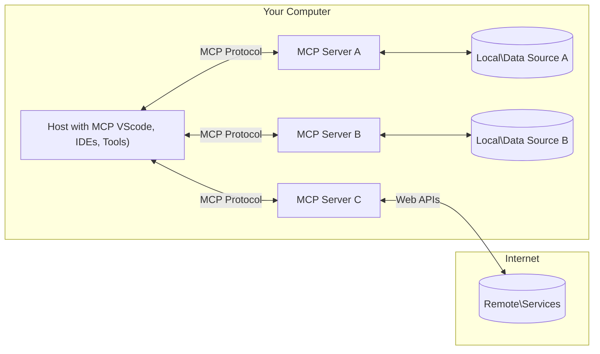

<!--
CO_OP_TRANSLATOR_METADATA:
{
  "original_hash": "355b12a5970c5c9e6db0bee970c751ba",
  "translation_date": "2025-07-13T16:13:22+00:00",
  "source_file": "01-CoreConcepts/README.md",
  "language_code": "id"
}
-->
# 📖 Konsep Inti MCP: Menguasai Model Context Protocol untuk Integrasi AI

[Model Context Protocol (MCP)](https://github.com/modelcontextprotocol) adalah kerangka kerja standar yang kuat untuk mengoptimalkan komunikasi antara Large Language Models (LLM) dengan alat eksternal, aplikasi, dan sumber data. Panduan yang dioptimalkan untuk SEO ini akan membahas konsep inti MCP, memastikan Anda memahami arsitektur client-server, komponen penting, mekanisme komunikasi, dan praktik terbaik implementasinya.

## Ikhtisar

Pelajaran ini mengeksplorasi arsitektur dasar dan komponen yang membentuk ekosistem Model Context Protocol (MCP). Anda akan mempelajari arsitektur client-server, komponen utama, dan mekanisme komunikasi yang mendukung interaksi MCP.

## 👩‍🎓 Tujuan Pembelajaran Utama

Di akhir pelajaran ini, Anda akan:

- Memahami arsitektur client-server MCP.
- Mengidentifikasi peran dan tanggung jawab Hosts, Clients, dan Servers.
- Menganalisis fitur inti yang membuat MCP menjadi lapisan integrasi yang fleksibel.
- Mempelajari alur informasi dalam ekosistem MCP.
- Mendapatkan wawasan praktis melalui contoh kode dalam .NET, Java, Python, dan JavaScript.

## 🔎 Arsitektur MCP: Pandangan Mendalam

Ekosistem MCP dibangun berdasarkan model client-server. Struktur modular ini memungkinkan aplikasi AI berinteraksi dengan alat, basis data, API, dan sumber daya kontekstual secara efisien. Mari kita uraikan arsitektur ini ke dalam komponen utamanya.

Pada dasarnya, MCP mengikuti arsitektur client-server di mana aplikasi host dapat terhubung ke beberapa server:



- **MCP Hosts**: Program seperti VSCode, Claude Desktop, IDE, atau alat AI yang ingin mengakses data melalui MCP
- **MCP Clients**: Klien protokol yang menjaga koneksi 1:1 dengan server
- **MCP Servers**: Program ringan yang masing-masing menyediakan kemampuan spesifik melalui Model Context Protocol yang distandarisasi
- **Sumber Data Lokal**: File, basis data, dan layanan di komputer Anda yang dapat diakses dengan aman oleh server MCP
- **Layanan Jarak Jauh**: Sistem eksternal yang tersedia melalui internet dan dapat dihubungkan oleh server MCP melalui API.

Protokol MCP adalah standar yang terus berkembang, Anda dapat melihat pembaruan terbaru pada [spesifikasi protokol](https://modelcontextprotocol.io/specification/2025-06-18/)

### 1. Hosts

Dalam Model Context Protocol (MCP), Hosts memegang peran penting sebagai antarmuka utama tempat pengguna berinteraksi dengan protokol. Hosts adalah aplikasi atau lingkungan yang memulai koneksi dengan server MCP untuk mengakses data, alat, dan prompt. Contoh Hosts termasuk integrated development environments (IDE) seperti Visual Studio Code, alat AI seperti Claude Desktop, atau agen khusus yang dibuat untuk tugas tertentu.

**Hosts** adalah aplikasi LLM yang memulai koneksi. Mereka:

- Menjalankan atau berinteraksi dengan model AI untuk menghasilkan respons.
- Memulai koneksi dengan server MCP.
- Mengelola alur percakapan dan antarmuka pengguna.
- Mengontrol izin dan batasan keamanan.
- Menangani persetujuan pengguna untuk berbagi data dan eksekusi alat.

### 2. Clients

Clients adalah komponen penting yang memfasilitasi interaksi antara Hosts dan server MCP. Clients bertindak sebagai perantara, memungkinkan Hosts mengakses dan memanfaatkan fungsi yang disediakan oleh server MCP. Mereka berperan penting dalam memastikan komunikasi lancar dan pertukaran data yang efisien dalam arsitektur MCP.

**Clients** adalah penghubung dalam aplikasi host. Mereka:

- Mengirim permintaan ke server dengan prompt/instruksi.
- Melakukan negosiasi kemampuan dengan server.
- Mengelola permintaan eksekusi alat dari model.
- Memproses dan menampilkan respons kepada pengguna.

### 3. Servers

Servers bertanggung jawab menangani permintaan dari client MCP dan memberikan respons yang sesuai. Mereka mengelola berbagai operasi seperti pengambilan data, eksekusi alat, dan pembuatan prompt. Servers memastikan komunikasi antara client dan Hosts berjalan efisien dan andal, menjaga integritas proses interaksi.

**Servers** adalah layanan yang menyediakan konteks dan kemampuan. Mereka:

- Mendaftarkan fitur yang tersedia (sumber daya, prompt, alat)
- Menerima dan menjalankan panggilan alat dari client
- Menyediakan informasi kontekstual untuk meningkatkan respons model
- Mengembalikan output ke client
- Mempertahankan status selama interaksi jika diperlukan

Servers dapat dikembangkan oleh siapa saja untuk memperluas kemampuan model dengan fungsi khusus.

### 4. Fitur Server

Server dalam Model Context Protocol (MCP) menyediakan blok bangunan dasar yang memungkinkan interaksi kaya antara client, host, dan model bahasa. Fitur-fitur ini dirancang untuk meningkatkan kemampuan MCP dengan menawarkan konteks terstruktur, alat, dan prompt.

Server MCP dapat menawarkan salah satu fitur berikut:

#### 📑 Resources

Resources dalam Model Context Protocol (MCP) mencakup berbagai jenis konteks dan data yang dapat digunakan oleh pengguna atau model AI. Ini meliputi:

- **Data Kontekstual**: Informasi dan konteks yang dapat dimanfaatkan pengguna atau model AI untuk pengambilan keputusan dan pelaksanaan tugas.
- **Basis Pengetahuan dan Repositori Dokumen**: Koleksi data terstruktur dan tidak terstruktur, seperti artikel, manual, dan makalah penelitian, yang menyediakan wawasan dan informasi berharga.
- **File dan Basis Data Lokal**: Data yang disimpan secara lokal di perangkat atau dalam basis data, dapat diakses untuk pemrosesan dan analisis.
- **API dan Layanan Web**: Antarmuka dan layanan eksternal yang menawarkan data dan fungsi tambahan, memungkinkan integrasi dengan berbagai sumber daya dan alat online.

Contoh resource bisa berupa skema basis data atau file yang dapat diakses seperti berikut:

```text
file://log.txt
database://schema
```

### 🤖 Prompts

Prompts dalam Model Context Protocol (MCP) mencakup berbagai template dan pola interaksi yang telah ditentukan sebelumnya untuk mempermudah alur kerja pengguna dan meningkatkan komunikasi. Ini meliputi:

- **Pesan dan Alur Kerja Berbasis Template**: Pesan dan proses yang sudah terstruktur untuk memandu pengguna melalui tugas dan interaksi tertentu.
- **Pola Interaksi yang Telah Ditentukan**: Urutan tindakan dan respons standar yang memfasilitasi komunikasi yang konsisten dan efisien.
- **Template Percakapan Khusus**: Template yang dapat disesuaikan untuk jenis percakapan tertentu, memastikan interaksi yang relevan dan sesuai konteks.

Template prompt dapat terlihat seperti ini:

```markdown
Generate a product slogan based on the following {{product}} with the following {{keywords}}
```

#### ⛏️ Tools

Tools dalam Model Context Protocol (MCP) adalah fungsi yang dapat dijalankan oleh model AI untuk melakukan tugas tertentu. Tools ini dirancang untuk meningkatkan kemampuan model AI dengan menyediakan operasi yang terstruktur dan dapat diandalkan. Aspek utama meliputi:

- **Fungsi yang dapat dijalankan oleh model AI**: Tools adalah fungsi yang dapat dipanggil oleh model AI untuk melaksanakan berbagai tugas.
- **Nama dan Deskripsi Unik**: Setiap tool memiliki nama yang khas dan deskripsi rinci yang menjelaskan tujuan dan fungsinya.
- **Parameter dan Output**: Tools menerima parameter tertentu dan mengembalikan output terstruktur, memastikan hasil yang konsisten dan dapat diprediksi.
- **Fungsi Diskrit**: Tools menjalankan fungsi diskrit seperti pencarian web, perhitungan, dan kueri basis data.

Contoh tool dapat terlihat seperti ini:

```typescript
server.tool(
  "GetProducts",
  {
    pageSize: z.string().optional(),
    pageCount: z.string().optional()
  }, () => {
    // return results from API
  }
)
```

## Fitur Client

Dalam Model Context Protocol (MCP), client menawarkan beberapa fitur utama kepada server, meningkatkan fungsionalitas dan interaksi dalam protokol. Salah satu fitur penting adalah Sampling.

### 👉 Sampling

- **Perilaku Agen yang Diinisiasi Server**: Client memungkinkan server untuk memulai tindakan atau perilaku tertentu secara otonom, meningkatkan kemampuan dinamis sistem.
- **Interaksi Rekursif dengan LLM**: Fitur ini memungkinkan interaksi rekursif dengan large language models (LLM), memungkinkan pemrosesan tugas yang lebih kompleks dan iteratif.
- **Permintaan Penyelesaian Model Tambahan**: Server dapat meminta penyelesaian tambahan dari model, memastikan respons yang lengkap dan relevan secara kontekstual.

## Alur Informasi dalam MCP

Model Context Protocol (MCP) mendefinisikan alur informasi terstruktur antara host, client, server, dan model. Memahami alur ini membantu menjelaskan bagaimana permintaan pengguna diproses dan bagaimana alat serta data eksternal diintegrasikan ke dalam respons model.

- **Host Memulai Koneksi**  
  Aplikasi host (seperti IDE atau antarmuka chat) membuat koneksi ke server MCP, biasanya melalui STDIO, WebSocket, atau transport lain yang didukung.

- **Negosiasi Kemampuan**  
  Client (yang tertanam di host) dan server bertukar informasi tentang fitur, alat, sumber daya, dan versi protokol yang didukung. Ini memastikan kedua pihak memahami kemampuan yang tersedia untuk sesi tersebut.

- **Permintaan Pengguna**  
  Pengguna berinteraksi dengan host (misalnya memasukkan prompt atau perintah). Host mengumpulkan input ini dan meneruskannya ke client untuk diproses.

- **Penggunaan Resource atau Tool**  
  - Client dapat meminta konteks atau sumber daya tambahan dari server (seperti file, entri basis data, atau artikel basis pengetahuan) untuk memperkaya pemahaman model.
  - Jika model menentukan bahwa sebuah tool diperlukan (misalnya untuk mengambil data, melakukan perhitungan, atau memanggil API), client mengirim permintaan pemanggilan tool ke server, dengan menyebutkan nama tool dan parameter.

- **Eksekusi Server**  
  Server menerima permintaan resource atau tool, menjalankan operasi yang diperlukan (seperti menjalankan fungsi, kueri basis data, atau mengambil file), dan mengembalikan hasil ke client dalam format terstruktur.

- **Pembuatan Respons**  
  Client mengintegrasikan respons server (data resource, output tool, dll.) ke dalam interaksi model yang sedang berlangsung. Model menggunakan informasi ini untuk menghasilkan respons yang komprehensif dan relevan secara kontekstual.

- **Penyajian Hasil**  
  Host menerima output akhir dari client dan menyajikannya kepada pengguna, sering kali mencakup teks yang dihasilkan model serta hasil dari eksekusi tool atau pencarian resource.

Alur ini memungkinkan MCP mendukung aplikasi AI yang canggih, interaktif, dan sadar konteks dengan menghubungkan model secara mulus dengan alat dan sumber data eksternal.

## Detail Protokol

MCP (Model Context Protocol) dibangun di atas [JSON-RPC 2.0](https://www.jsonrpc.org/), menyediakan format pesan standar dan bahasa-agnostik untuk komunikasi antara host, client, dan server. Dasar ini memungkinkan interaksi yang andal, terstruktur, dan dapat diperluas di berbagai platform dan bahasa pemrograman.

### Fitur Utama Protokol

MCP memperluas JSON-RPC 2.0 dengan konvensi tambahan untuk pemanggilan tool, akses resource, dan manajemen prompt. MCP mendukung berbagai lapisan transport (STDIO, WebSocket, SSE) dan memungkinkan komunikasi yang aman, dapat diperluas, dan bahasa-agnostik antar komponen.

#### 🧢 Protokol Dasar

- **Format Pesan JSON-RPC**: Semua permintaan dan respons menggunakan spesifikasi JSON-RPC 2.0, memastikan struktur konsisten untuk pemanggilan metode, parameter, hasil, dan penanganan kesalahan.
- **Koneksi Stateful**: Sesi MCP mempertahankan status di antara beberapa permintaan, mendukung percakapan berkelanjutan, akumulasi konteks, dan manajemen resource.
- **Negosiasi Kemampuan**: Saat pengaturan koneksi, client dan server bertukar informasi tentang fitur yang didukung, versi protokol, alat, dan resource yang tersedia. Ini memastikan kedua pihak memahami kemampuan masing-masing dan dapat menyesuaikan.

#### ➕ Utilitas Tambahan

Berikut beberapa utilitas dan ekstensi protokol yang disediakan MCP untuk meningkatkan pengalaman pengembang dan memungkinkan skenario lanjutan:

- **Opsi Konfigurasi**: MCP memungkinkan konfigurasi dinamis parameter sesi, seperti izin alat, akses resource, dan pengaturan model, yang disesuaikan untuk setiap interaksi.
- **Pelacakan Progres**: Operasi yang berjalan lama dapat melaporkan pembaruan progres, memungkinkan antarmuka pengguna yang responsif dan pengalaman pengguna yang lebih baik selama tugas kompleks.
- **Pembatalan Permintaan**: Client dapat membatalkan permintaan yang sedang berjalan, memungkinkan pengguna menghentikan operasi yang tidak lagi diperlukan atau terlalu lama.
- **Pelaporan Kesalahan**: Pesan dan kode kesalahan standar membantu mendiagnosis masalah, menangani kegagalan dengan baik, dan memberikan umpan balik yang dapat ditindaklanjuti kepada pengguna dan pengembang.
- **Logging**: Baik client maupun server dapat mengeluarkan log terstruktur untuk audit, debugging, dan pemantauan interaksi protokol.

Dengan memanfaatkan fitur protokol ini, MCP memastikan komunikasi yang kuat, aman, dan fleksibel antara model bahasa dan alat atau sumber data eksternal.

### 🔐 Pertimbangan Keamanan

Implementasi MCP harus mematuhi beberapa prinsip keamanan utama untuk memastikan interaksi yang aman dan dapat dipercaya:

- **Persetujuan dan Kontrol Pengguna**: Pengguna harus memberikan persetujuan eksplisit sebelum data diakses atau operasi dilakukan. Mereka harus memiliki kontrol jelas atas data yang dibagikan dan tindakan yang diizinkan, didukung oleh antarmuka pengguna yang intuitif untuk meninjau dan menyetujui aktivitas.

- **Privasi Data**: Data pengguna hanya boleh diakses dengan persetujuan eksplisit dan harus dilindungi dengan kontrol akses yang tepat. Implementasi MCP harus mencegah transmisi data tanpa izin dan memastikan privasi terjaga selama semua interaksi.

- **Keamanan Alat**: Sebelum memanggil alat apa pun, persetujuan eksplisit pengguna diperlukan. Pengguna harus memahami fungsi setiap alat dengan jelas, dan batasan keamanan yang kuat harus diterapkan untuk mencegah eksekusi alat yang tidak diinginkan atau berbahaya.

Dengan mengikuti prinsip-prinsip ini, MCP memastikan kepercayaan, privasi, dan keamanan pengguna terjaga di seluruh interaksi protokol.

## Contoh Kode: Komponen Utama

Berikut contoh kode dalam beberapa bahasa pemrograman populer yang menggambarkan cara mengimplementasikan komponen server MCP dan alat utama.

### Contoh .NET: Membuat Server MCP Sederhana dengan Tools

Berikut contoh kode .NET praktis yang menunjukkan cara mengimplementasikan server MCP sederhana dengan alat kustom. Contoh ini memperlihatkan cara mendefinisikan dan mendaftarkan alat, menangani permintaan, dan menghubungkan server menggunakan Model Context Protocol.

```csharp
using System;
using System.Threading.Tasks;
using ModelContextProtocol.Server;
using ModelContextProtocol.Server.Transport;
using ModelContextProtocol.Server.Tools;

public class WeatherServer
{
    public static async Task Main(string[] args)
    {
        // Create an MCP server
        var server = new McpServer(
            name: "Weather MCP Server",
            version: "1.0.0"
        );
        
        // Register our custom weather tool
        server.AddTool<string, WeatherData>("weatherTool", 
            description: "Gets current weather for a location",
            execute: async (location) => {
                // Call weather API (simplified)
                var weatherData = await GetWeatherDataAsync(location);
                return weatherData;
            });
        
        // Connect the server using stdio transport
        var transport = new StdioServerTransport();
        await server.ConnectAsync(transport);
        
        Console.WriteLine("Weather MCP Server started");
        
        // Keep the server running until process is terminated
        await Task.Delay(-1);
    }
    
    private static async Task<WeatherData> GetWeatherDataAsync(string location)
    {
        // This would normally call a weather API
        // Simplified for demonstration
        await Task.Delay(100); // Simulate API call
        return new WeatherData { 
            Temperature = 72.5,
            Conditions = "Sunny",
            Location = location
        };
    }
}

public class WeatherData
{
    public double Temperature { get; set; }
    public string Conditions { get; set; }
    public string Location { get; set; }
}
```

### Contoh Java: Komponen Server MCP

Contoh ini menunjukkan server MCP dan pendaftaran alat yang sama seperti contoh .NET di atas, tetapi diimplementasikan dalam Java.

```java
import io.modelcontextprotocol.server.McpServer;
import io.modelcontextprotocol.server.McpToolDefinition;
import io.modelcontextprotocol.server.transport.StdioServerTransport;
import io.modelcontextprotocol.server.tool.ToolExecutionContext;
import io.modelcontextprotocol.server.tool.ToolResponse;

public class WeatherMcpServer {
    public static void main(String[] args) throws Exception {
        // Create an MCP server
        McpServer server = McpServer.builder()
            .name("Weather MCP Server")
            .version("1.0.0")
            .build();
            
        // Register a weather tool
        server.registerTool(McpToolDefinition.builder("weatherTool")
            .description("Gets current weather for a location")
            .parameter("location", String.class)
            .execute((ToolExecutionContext ctx) -> {
                String location = ctx.getParameter("location", String.class);
                
                // Get weather data (simplified)
                WeatherData data = getWeatherData(location);
                
                // Return formatted response
                return ToolResponse.content(
                    String.format("Temperature: %.1f°F, Conditions: %s, Location: %s", 
                    data.getTemperature(), 
                    data.getConditions(), 
                    data.getLocation())
                );
            })
            .build());
        
        // Connect the server using stdio transport
        try (StdioServerTransport transport = new StdioServerTransport()) {
            server.connect(transport);
            System.out.println("Weather MCP Server started");
            // Keep server running until process is terminated
            Thread.currentThread().join();
        }
    }
    
    private static WeatherData getWeatherData(String location) {
        // Implementation would call a weather API
        // Simplified for example purposes
        return new WeatherData(72.5, "Sunny", location);
    }
}

class WeatherData {
    private double temperature;
    private String conditions;
    private String location;
    
    public WeatherData(double temperature, String conditions, String location) {
        this.temperature = temperature;
        this.conditions = conditions;
        this.location = location;
    }
    
    public double getTemperature() {
        return temperature;
    }
    
    public String getConditions() {
        return conditions;
    }
    
    public String getLocation() {
        return location;
    }
}
```

### Contoh Python: Membangun Server MCP

Dalam contoh ini kami menunjukkan cara membangun server MCP di Python. Anda juga diperlihatkan dua cara berbeda untuk membuat alat.

```python
#!/usr/bin/env python3
import asyncio
from mcp.server.fastmcp import FastMCP
from mcp.server.transports.stdio import serve_stdio

# Create a FastMCP server
mcp = FastMCP(
    name="Weather MCP Server",
    version="1.0.0"
)

@mcp.tool()
def get_weather(location: str) -> dict:
    """Gets current weather for a location."""
    # This would normally call a weather API
    # Simplified for demonstration
    return {
        "temperature": 72.5,
        "conditions": "Sunny",
        "location": location
    }

# Alternative approach using a class
class WeatherTools:
    @mcp.tool()
    def forecast(self, location: str, days: int = 1) -> dict:
        """Gets weather forecast for a location for the specified number of days."""
        # This would normally call a weather API forecast endpoint
        # Simplified for demonstration
        return {
            "location": location,
            "forecast": [
                {"day": i+1, "temperature": 70 + i, "conditions": "Partly Cloudy"}
                for i in range(days)
            ]
        }

# Instantiate the class to register its tools
weather_tools = WeatherTools()

# Start the server using stdio transport
if __name__ == "__main__":
    asyncio.run(serve_stdio(mcp))
```

### Contoh JavaScript: Membuat Server MCP

Contoh ini menunjukkan pembuatan server MCP dalam JavaScript dan cara mendaftarkan dua alat terkait cuaca.

```javascript
// Using the official Model Context Protocol SDK
import { McpServer } from "@modelcontextprotocol/sdk/server/mcp.js";
import { StdioServerTransport } from "@modelcontextprotocol/sdk/server/stdio.js";
import { z } from "zod"; // For parameter validation

// Create an MCP server
const server = new McpServer({
  name: "Weather MCP Server",
  version: "1.0.0"
});

// Define a weather tool
server.tool(
  "weatherTool",
  {
    location: z.string().describe("The location to get weather for")
  },
  async ({ location }) => {
    // This would normally call a weather API
    // Simplified for demonstration
    const weatherData = await getWeatherData(location);
    
    return {
      content: [
        { 
          type: "text", 
          text: `Temperature: ${weatherData.temperature}°F, Conditions: ${weatherData.conditions}, Location: ${weatherData.location}` 
        }
      ]
    };
  }
);

// Define a forecast tool
server.tool(
  "forecastTool",
  {
    location: z.string(),
    days: z.number().default(3).describe("Number of days for forecast")
  },
  async ({ location, days }) => {
    // This would normally call a weather API
    // Simplified for demonstration
    const forecast = await getForecastData(location, days);
    
    return {
      content: [
        { 
          type: "text", 
          text: `${days}-day forecast for ${location}: ${JSON.stringify(forecast)}` 
        }
      ]
    };
  }
);

// Helper functions
async function getWeatherData(location) {
  // Simulate API call
  return {
    temperature: 72.5,
    conditions: "Sunny",
    location: location
  };
}

async function getForecastData(location, days) {
  // Simulate API call
  return Array.from({ length: days }, (_, i) => ({
    day: i + 1,
    temperature: 70 + Math.floor(Math.random() * 10),
    conditions: i % 2 === 0 ? "Sunny" : "Partly Cloudy"
  }));
}

// Connect the server using stdio transport
const transport = new StdioServerTransport();
server.connect(transport).catch(console.error);

console.log("Weather MCP Server started");
```

Contoh JavaScript ini menunjukkan cara membuat client MCP yang terhubung ke server, mengirim prompt, dan memproses respons termasuk panggilan alat yang dilakukan.

## Keamanan dan Otorisasi
MCP mencakup beberapa konsep dan mekanisme bawaan untuk mengelola keamanan dan otorisasi sepanjang protokol:

1. **Kontrol Izin Alat**:  
  Klien dapat menentukan alat mana yang diizinkan digunakan oleh model selama sesi berlangsung. Ini memastikan hanya alat yang secara eksplisit diotorisasi yang dapat diakses, mengurangi risiko operasi yang tidak diinginkan atau tidak aman. Izin dapat dikonfigurasi secara dinamis berdasarkan preferensi pengguna, kebijakan organisasi, atau konteks interaksi.

2. **Autentikasi**:  
  Server dapat meminta autentikasi sebelum memberikan akses ke alat, sumber daya, atau operasi sensitif. Ini bisa melibatkan API key, token OAuth, atau skema autentikasi lainnya. Autentikasi yang tepat memastikan hanya klien dan pengguna terpercaya yang dapat memanggil kemampuan sisi server.

3. **Validasi**:  
  Validasi parameter diterapkan untuk semua pemanggilan alat. Setiap alat mendefinisikan tipe, format, dan batasan yang diharapkan untuk parameternya, dan server memvalidasi permintaan yang masuk sesuai dengan itu. Ini mencegah input yang salah format atau berbahaya mencapai implementasi alat dan membantu menjaga integritas operasi.

4. **Pembatasan Laju (Rate Limiting)**:  
  Untuk mencegah penyalahgunaan dan memastikan penggunaan sumber daya server yang adil, server MCP dapat menerapkan pembatasan laju untuk pemanggilan alat dan akses sumber daya. Pembatasan laju dapat diterapkan per pengguna, per sesi, atau secara global, dan membantu melindungi dari serangan denial-of-service atau konsumsi sumber daya yang berlebihan.

Dengan menggabungkan mekanisme ini, MCP menyediakan fondasi yang aman untuk mengintegrasikan model bahasa dengan alat dan sumber data eksternal, sekaligus memberikan kontrol yang detail kepada pengguna dan pengembang atas akses dan penggunaan.

## Pesan Protokol

Komunikasi MCP menggunakan pesan JSON terstruktur untuk memfasilitasi interaksi yang jelas dan dapat diandalkan antara klien, server, dan model. Jenis pesan utama meliputi:

- **Permintaan Klien**  
  Dikirim dari klien ke server, pesan ini biasanya berisi:
  - Prompt atau perintah pengguna
  - Riwayat percakapan sebagai konteks
  - Konfigurasi alat dan izin
  - Metadata tambahan atau informasi sesi

- **Respons Model**  
  Dikembalikan oleh model (melalui klien), pesan ini berisi:
  - Teks yang dihasilkan atau penyelesaian berdasarkan prompt dan konteks
  - Instruksi pemanggilan alat opsional jika model menentukan alat perlu dipanggil
  - Referensi ke sumber daya atau konteks tambahan jika diperlukan

- **Permintaan Alat**  
  Dikirim dari klien ke server saat sebuah alat perlu dijalankan. Pesan ini mencakup:
  - Nama alat yang akan dipanggil
  - Parameter yang dibutuhkan oleh alat (divalidasi sesuai skema alat)
  - Informasi kontekstual atau pengenal untuk melacak permintaan

- **Respons Alat**  
  Dikembalikan oleh server setelah menjalankan alat. Pesan ini menyediakan:
  - Hasil eksekusi alat (data terstruktur atau konten)
  - Kesalahan atau informasi status jika pemanggilan alat gagal
  - Opsional, metadata tambahan atau log terkait eksekusi

Pesan-pesan terstruktur ini memastikan setiap langkah dalam alur kerja MCP jelas, dapat dilacak, dan dapat diperluas, mendukung skenario lanjutan seperti percakapan multi-putaran, penggabungan alat, dan penanganan kesalahan yang kuat.

## Poin Penting

- MCP menggunakan arsitektur klien-server untuk menghubungkan model dengan kemampuan eksternal
- Ekosistem terdiri dari klien, host, server, alat, dan sumber data
- Komunikasi dapat dilakukan melalui STDIO, SSE, atau WebSockets
- Alat adalah unit dasar fungsi yang diekspos ke model
- Protokol komunikasi terstruktur memastikan interaksi yang konsisten

## Latihan

Rancang sebuah alat MCP sederhana yang berguna di bidang Anda. Tentukan:
1. Nama alat tersebut
2. Parameter apa yang akan diterimanya
3. Output apa yang akan dihasilkannya
4. Bagaimana model dapat menggunakan alat ini untuk menyelesaikan masalah pengguna


---

## Selanjutnya

Selanjutnya: [Chapter 2: Security](../02-Security/README.md)

**Penafian**:  
Dokumen ini telah diterjemahkan menggunakan layanan terjemahan AI [Co-op Translator](https://github.com/Azure/co-op-translator). Meskipun kami berupaya untuk mencapai akurasi, harap diperhatikan bahwa terjemahan otomatis mungkin mengandung kesalahan atau ketidakakuratan. Dokumen asli dalam bahasa aslinya harus dianggap sebagai sumber yang sahih. Untuk informasi penting, disarankan menggunakan terjemahan profesional oleh manusia. Kami tidak bertanggung jawab atas kesalahpahaman atau penafsiran yang keliru yang timbul dari penggunaan terjemahan ini.