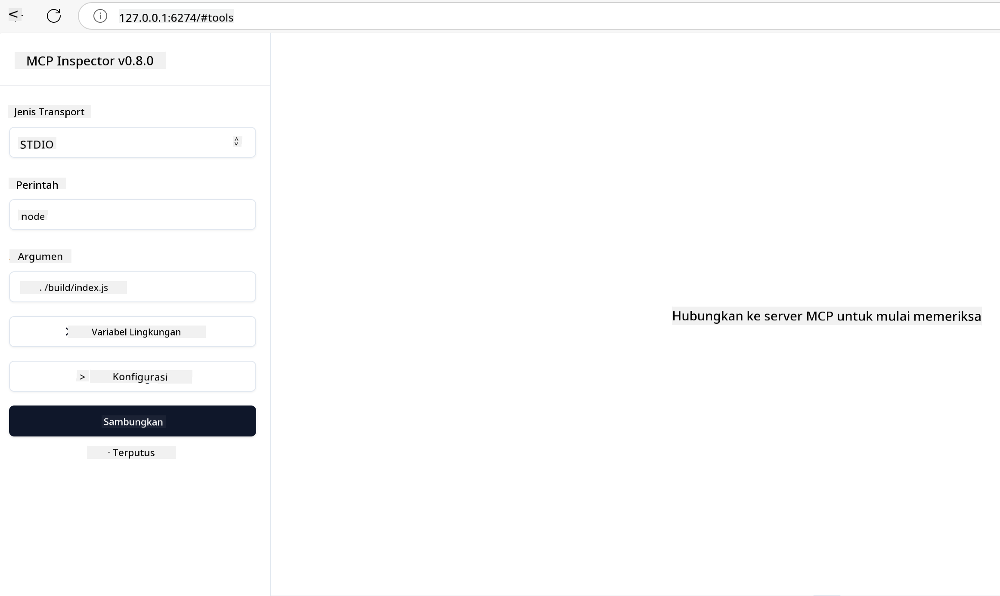
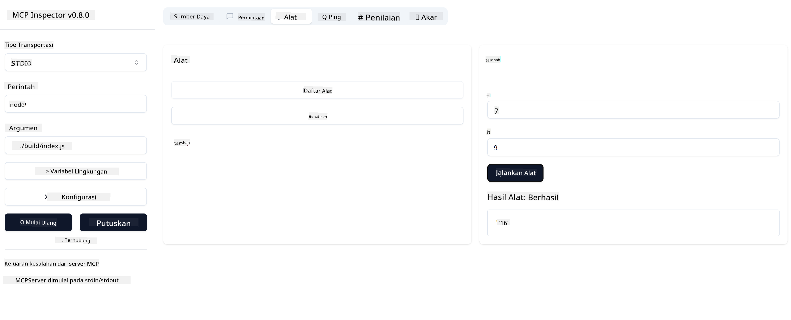

<!--
CO_OP_TRANSLATOR_METADATA:
{
  "original_hash": "5331ffd328a54b90f76706c52b673e27",
  "translation_date": "2025-05-17T08:46:20+00:00",
  "source_file": "03-GettingStarted/01-first-server/README.md",
  "language_code": "id"
}
-->
# Memulai dengan MCP

Selamat datang di langkah pertama Anda dengan Model Context Protocol (MCP)! Apakah Anda baru mengenal MCP atau ingin memperdalam pemahaman Anda, panduan ini akan memandu Anda melalui pengaturan dan proses pengembangan yang penting. Anda akan menemukan bagaimana MCP memungkinkan integrasi yang mulus antara model AI dan aplikasi, serta belajar bagaimana mempersiapkan lingkungan Anda dengan cepat untuk membangun dan menguji solusi yang didukung MCP.

> TLDR; Jika Anda membangun aplikasi AI, Anda tahu bahwa Anda dapat menambahkan alat dan sumber daya lainnya ke LLM (large language model) Anda, untuk membuat LLM lebih berpengetahuan. Namun, jika Anda menempatkan alat dan sumber daya tersebut di server, aplikasi dan kemampuan server dapat digunakan oleh klien mana pun dengan/tanpa LLM.

## Gambaran Umum

Pelajaran ini memberikan panduan praktis tentang pengaturan lingkungan MCP dan membangun aplikasi MCP pertama Anda. Anda akan belajar cara mengatur alat dan kerangka kerja yang diperlukan, membangun server MCP dasar, membuat aplikasi host, dan menguji implementasi Anda.

Model Context Protocol (MCP) adalah protokol terbuka yang menstandarkan cara aplikasi menyediakan konteks ke LLM. Anggaplah MCP seperti port USB-C untuk aplikasi AI - ia menyediakan cara standar untuk menghubungkan model AI ke berbagai sumber data dan alat.

## Tujuan Pembelajaran

Pada akhir pelajaran ini, Anda akan dapat:

- Menyiapkan lingkungan pengembangan untuk MCP dalam C#, Java, Python, TypeScript, dan JavaScript
- Membangun dan menerapkan server MCP dasar dengan fitur khusus (sumber daya, prompt, dan alat)
- Membuat aplikasi host yang terhubung ke server MCP
- Menguji dan men-debug implementasi MCP

## Menyiapkan Lingkungan MCP Anda

Sebelum Anda mulai bekerja dengan MCP, penting untuk mempersiapkan lingkungan pengembangan Anda dan memahami alur kerja dasar. Bagian ini akan memandu Anda melalui langkah-langkah pengaturan awal untuk memastikan awal yang mulus dengan MCP.

### Prasyarat

Sebelum terjun ke pengembangan MCP, pastikan Anda memiliki:

- **Lingkungan Pengembangan**: Untuk bahasa pilihan Anda (C#, Java, Python, TypeScript, atau JavaScript)
- **IDE/Editor**: Visual Studio, Visual Studio Code, IntelliJ, Eclipse, PyCharm, atau editor kode modern lainnya
- **Pengelola Paket**: NuGet, Maven/Gradle, pip, atau npm/yarn
- **Kunci API**: Untuk layanan AI apa pun yang Anda rencanakan untuk digunakan dalam aplikasi host Anda

## Struktur Server MCP Dasar

Server MCP biasanya mencakup:

- **Konfigurasi Server**: Pengaturan port, autentikasi, dan pengaturan lainnya
- **Sumber Daya**: Data dan konteks yang tersedia untuk LLM
- **Alat**: Fungsionalitas yang dapat dipanggil oleh model
- **Prompt**: Template untuk menghasilkan atau menyusun teks

Berikut adalah contoh sederhana dalam TypeScript:

```typescript
import { Server, Tool, Resource } from "@modelcontextprotocol/typescript-server-sdk";

// Create a new MCP server
const server = new Server({
  port: 3000,
  name: "Example MCP Server",
  version: "1.0.0"
});

// Register a tool
server.registerTool({
  name: "calculator",
  description: "Performs basic calculations",
  parameters: {
    expression: {
      type: "string",
      description: "The math expression to evaluate"
    }
  },
  handler: async (params) => {
    const result = eval(params.expression);
    return { result };
  }
});

// Start the server
server.start();
```

Dalam kode di atas kita:

- Mengimpor kelas yang diperlukan dari MCP TypeScript SDK.
- Membuat dan mengkonfigurasi instance server MCP baru.
- Mendaftarkan alat kustom (`calculator`) dengan fungsi penangan.
- Memulai server untuk mendengarkan permintaan MCP yang masuk.

## Pengujian dan Debugging

Sebelum Anda mulai menguji server MCP Anda, penting untuk memahami alat yang tersedia dan praktik terbaik untuk debugging. Pengujian yang efektif memastikan server Anda berperilaku seperti yang diharapkan dan membantu Anda dengan cepat mengidentifikasi dan menyelesaikan masalah. Bagian berikut menguraikan pendekatan yang direkomendasikan untuk memvalidasi implementasi MCP Anda.

MCP menyediakan alat untuk membantu Anda menguji dan men-debug server Anda:

- **Alat Inspector**, antarmuka grafis ini memungkinkan Anda untuk terhubung ke server Anda dan menguji alat, prompt, dan sumber daya Anda.
- **curl**, Anda juga dapat terhubung ke server Anda menggunakan alat baris perintah seperti curl atau klien lain yang dapat membuat dan menjalankan perintah HTTP.

### Menggunakan MCP Inspector

[MCP Inspector](https://github.com/modelcontextprotocol/inspector) adalah alat pengujian visual yang membantu Anda:

1. **Menemukan Kemampuan Server**: Mendeteksi secara otomatis sumber daya, alat, dan prompt yang tersedia
2. **Menguji Eksekusi Alat**: Mencoba parameter yang berbeda dan melihat tanggapan secara real-time
3. **Melihat Metadata Server**: Memeriksa info server, skema, dan konfigurasi

```bash
# ex TypeScript, installing and running MCP Inspector
npx @modelcontextprotocol/inspector node build/index.js
```

Ketika Anda menjalankan perintah di atas, MCP Inspector akan meluncurkan antarmuka web lokal di browser Anda. Anda dapat melihat dasbor yang menampilkan server MCP terdaftar Anda, alat yang tersedia, sumber daya, dan prompt. Antarmuka ini memungkinkan Anda untuk secara interaktif menguji eksekusi alat, memeriksa metadata server, dan melihat tanggapan secara real-time, memudahkan untuk memvalidasi dan men-debug implementasi server MCP Anda.

Berikut adalah tangkapan layar dari apa yang dapat terlihat:


## Masalah Pengaturan Umum dan Solusinya

| Masalah | Solusi yang Mungkin |
|---------|---------------------|
| Koneksi ditolak | Periksa apakah server berjalan dan port benar |
| Kesalahan eksekusi alat | Tinjau validasi parameter dan penanganan kesalahan |
| Kegagalan autentikasi | Verifikasi kunci API dan izin |
| Kesalahan validasi skema | Pastikan parameter sesuai dengan skema yang ditentukan |
| Server tidak dapat dimulai | Periksa konflik port atau ketergantungan yang hilang |
| Kesalahan CORS | Konfigurasikan header CORS yang tepat untuk permintaan lintas asal |
| Masalah autentikasi | Verifikasi validitas token dan izin |

## Pengembangan Lokal

Untuk pengembangan dan pengujian lokal, Anda dapat menjalankan server MCP langsung di mesin Anda:

1. **Mulai proses server**: Jalankan aplikasi server MCP Anda
2. **Konfigurasi jaringan**: Pastikan server dapat diakses pada port yang diharapkan
3. **Hubungkan klien**: Gunakan URL koneksi lokal seperti `http://localhost:3000`

```bash
# Example: Running a TypeScript MCP server locally
npm run start
# Server running at http://localhost:3000
```

## Membangun Server MCP Pertama Anda

Kita telah membahas [Konsep Inti](/01-CoreConcepts/README.md) dalam pelajaran sebelumnya, sekarang saatnya untuk mempraktikkan pengetahuan tersebut.

### Apa yang dapat dilakukan server

Sebelum kita mulai menulis kode, mari kita ingatkan diri kita tentang apa yang dapat dilakukan server:

Server MCP dapat, misalnya:

- Mengakses file dan basis data lokal
- Terhubung ke API jarak jauh
- Melakukan perhitungan
- Terintegrasi dengan alat dan layanan lainnya
- Menyediakan antarmuka pengguna untuk interaksi

Bagus, sekarang kita tahu apa yang bisa kita lakukan untuk itu, mari kita mulai coding.

## Latihan: Membuat server

Untuk membuat server, Anda perlu mengikuti langkah-langkah ini:

- Instal MCP SDK.
- Buat proyek dan siapkan struktur proyek.
- Tulis kode server.
- Uji server.

### -1- Instal SDK

Ini sedikit berbeda tergantung pada runtime pilihan Anda, jadi pilih salah satu runtime di bawah ini:

Generative AI dapat menghasilkan teks, gambar, dan bahkan kode.
Anda dilatih dengan data hingga Oktober 2023.

### -2- Buat proyek

Sekarang setelah Anda menginstal SDK Anda, mari buat proyek berikutnya:

### -3- Buat file proyek

### -4- Buat kode server

### -5- Menambahkan alat dan sumber daya

Tambahkan alat dan sumber daya dengan menambahkan kode berikut:

### -6 Kode akhir

Mari kita tambahkan kode terakhir yang kita butuhkan agar server dapat dimulai:

### -7- Uji server

Mulai server dengan perintah berikut:

### -8- Jalankan menggunakan inspector

Inspector adalah alat yang hebat yang dapat memulai server Anda dan memungkinkan Anda berinteraksi dengannya sehingga Anda dapat menguji bahwa server berfungsi. Mari kita mulai:

> [!NOTE]
> mungkin terlihat berbeda di bidang "command" karena berisi perintah untuk menjalankan server dengan runtime spesifik Anda

Anda harus melihat antarmuka pengguna berikut:



1. Hubungkan ke server dengan memilih tombol Connect
   Setelah Anda terhubung ke server, Anda sekarang harus melihat yang berikut:

   

1. Pilih "Tools" dan "listTools", Anda harus melihat "Add" muncul, pilih "Add" dan isi nilai parameter.

   Anda harus melihat tanggapan berikut, yaitu hasil dari alat "add":

   

Selamat, Anda telah berhasil membuat dan menjalankan server pertama Anda!

### SDK Resmi

MCP menyediakan SDK resmi untuk berbagai bahasa:
- [C# SDK](https://github.com/modelcontextprotocol/csharp-sdk) - Dikelola bersama dengan Microsoft
- [Java SDK](https://github.com/modelcontextprotocol/java-sdk) - Dikelola bersama dengan Spring AI
- [TypeScript SDK](https://github.com/modelcontextprotocol/typescript-sdk) - Implementasi resmi TypeScript
- [Python SDK](https://github.com/modelcontextprotocol/python-sdk) - Implementasi resmi Python
- [Kotlin SDK](https://github.com/modelcontextprotocol/kotlin-sdk) - Implementasi resmi Kotlin
- [Swift SDK](https://github.com/modelcontextprotocol/swift-sdk) - Dikelola bersama dengan Loopwork AI
- [Rust SDK](https://github.com/modelcontextprotocol/rust-sdk) - Implementasi resmi Rust

## Poin Penting

- Menyiapkan lingkungan pengembangan MCP mudah dilakukan dengan SDK khusus bahasa
- Membangun server MCP melibatkan pembuatan dan pendaftaran alat dengan skema yang jelas
- Pengujian dan debugging sangat penting untuk implementasi MCP yang andal

## Contoh

- [Java Calculator](../samples/java/calculator/README.md)
- [.Net Calculator](../../../../03-GettingStarted/samples/csharp)
- [JavaScript Calculator](../samples/javascript/README.md)
- [TypeScript Calculator](../samples/typescript/README.md)
- [Python Calculator](../../../../03-GettingStarted/samples/python)

## Tugas

Buat server MCP sederhana dengan alat pilihan Anda:
1. Implementasikan alat dalam bahasa pilihan Anda (.NET, Java, Python, atau JavaScript).
2. Definisikan parameter input dan nilai pengembalian.
3. Jalankan alat inspector untuk memastikan server berfungsi seperti yang diinginkan.
4. Uji implementasi dengan berbagai input.

## Solusi

[Solusi](./solution/README.md)

## Sumber Daya Tambahan

- [Repositori GitHub MCP](https://github.com/microsoft/mcp-for-beginners)

## Apa Selanjutnya

Selanjutnya: [Memulai dengan Klien MCP](/03-GettingStarted/02-client/README.md)

**Penafian**:  
Dokumen ini telah diterjemahkan menggunakan layanan terjemahan AI [Co-op Translator](https://github.com/Azure/co-op-translator). Meskipun kami berusaha untuk memberikan terjemahan yang akurat, harap diingat bahwa terjemahan otomatis mungkin mengandung kesalahan atau ketidakakuratan. Dokumen asli dalam bahasa aslinya harus dianggap sebagai sumber yang berwenang. Untuk informasi yang penting, disarankan menggunakan terjemahan manusia profesional. Kami tidak bertanggung jawab atas kesalahpahaman atau salah tafsir yang timbul dari penggunaan terjemahan ini.