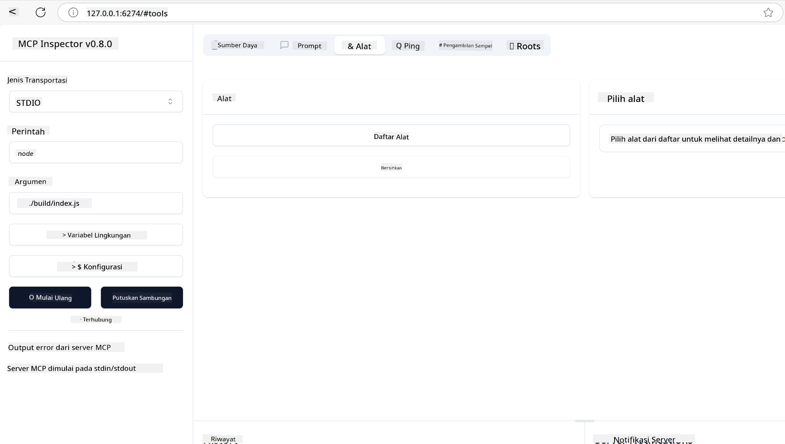
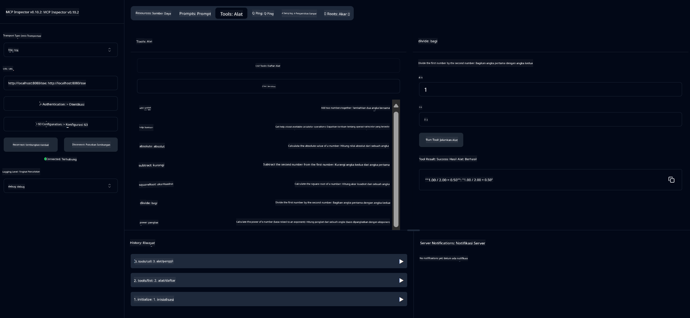
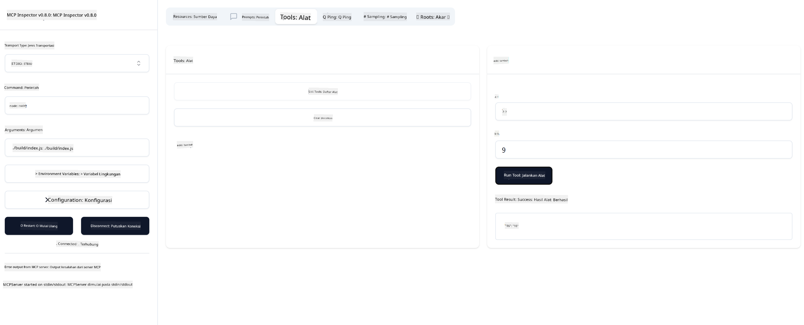

<!--
CO_OP_TRANSLATOR_METADATA:
{
  "original_hash": "ec11ee93f31fdadd94facd3e3d22f9e6",
  "translation_date": "2025-09-09T22:03:52+00:00",
  "source_file": "03-GettingStarted/01-first-server/README.md",
  "language_code": "id"
}
-->
# Memulai dengan MCP

Selamat datang di langkah pertama Anda dengan Model Context Protocol (MCP)! Baik Anda baru mengenal MCP atau ingin memperdalam pemahaman Anda, panduan ini akan membantu Anda melalui proses pengaturan dan pengembangan yang penting. Anda akan menemukan bagaimana MCP memungkinkan integrasi yang mulus antara model AI dan aplikasi, serta belajar cara cepat menyiapkan lingkungan untuk membangun dan menguji solusi berbasis MCP.

> TLDR; Jika Anda membangun aplikasi AI, Anda tahu bahwa Anda dapat menambahkan alat dan sumber daya lain ke LLM (large language model) untuk membuat LLM lebih cerdas. Namun, jika Anda meletakkan alat dan sumber daya tersebut di server, kemampuan aplikasi dan server dapat digunakan oleh klien mana pun dengan/atau tanpa LLM.

## Ikhtisar

Pelajaran ini memberikan panduan praktis tentang cara menyiapkan lingkungan MCP dan membangun aplikasi MCP pertama Anda. Anda akan belajar cara menyiapkan alat dan kerangka kerja yang diperlukan, membangun server MCP dasar, membuat aplikasi host, dan menguji implementasi Anda.

Model Context Protocol (MCP) adalah protokol terbuka yang menstandarkan cara aplikasi menyediakan konteks untuk LLM. Pikirkan MCP seperti port USB-C untuk aplikasi AI - ini menyediakan cara standar untuk menghubungkan model AI ke berbagai sumber data dan alat.

## Tujuan Pembelajaran

Pada akhir pelajaran ini, Anda akan dapat:

- Menyiapkan lingkungan pengembangan untuk MCP dalam C#, Java, Python, TypeScript, dan Rust
- Membangun dan menerapkan server MCP dasar dengan fitur khusus (sumber daya, prompt, dan alat)
- Membuat aplikasi host yang terhubung ke server MCP
- Menguji dan memperbaiki implementasi MCP

## Menyiapkan Lingkungan MCP Anda

Sebelum mulai bekerja dengan MCP, penting untuk mempersiapkan lingkungan pengembangan Anda dan memahami alur kerja dasar. Bagian ini akan memandu Anda melalui langkah-langkah pengaturan awal untuk memastikan awal yang lancar dengan MCP.

### Prasyarat

Sebelum memulai pengembangan MCP, pastikan Anda memiliki:

- **Lingkungan Pengembangan**: Untuk bahasa pilihan Anda (C#, Java, Python, TypeScript, atau Rust)
- **IDE/Editor**: Visual Studio, Visual Studio Code, IntelliJ, Eclipse, PyCharm, atau editor kode modern lainnya
- **Package Managers**: NuGet, Maven/Gradle, pip, npm/yarn, atau Cargo
- **API Keys**: Untuk layanan AI apa pun yang Anda rencanakan untuk digunakan dalam aplikasi host Anda

## Struktur Dasar Server MCP

Server MCP biasanya mencakup:

- **Konfigurasi Server**: Pengaturan port, autentikasi, dan pengaturan lainnya
- **Sumber Daya**: Data dan konteks yang tersedia untuk LLM
- **Alat**: Fungsionalitas yang dapat dipanggil oleh model
- **Prompt**: Template untuk menghasilkan atau menyusun teks

Berikut adalah contoh sederhana dalam TypeScript:

```typescript
import { McpServer, ResourceTemplate } from "@modelcontextprotocol/sdk/server/mcp.js";
import { StdioServerTransport } from "@modelcontextprotocol/sdk/server/stdio.js";
import { z } from "zod";

// Create an MCP server
const server = new McpServer({
  name: "Demo",
  version: "1.0.0"
});

// Add an addition tool
server.tool("add",
  { a: z.number(), b: z.number() },
  async ({ a, b }) => ({
    content: [{ type: "text", text: String(a + b) }]
  })
);

// Add a dynamic greeting resource
server.resource(
  "file",
  // The 'list' parameter controls how the resource lists available files. Setting it to undefined disables listing for this resource.
  new ResourceTemplate("file://{path}", { list: undefined }),
  async (uri, { path }) => ({
    contents: [{
      uri: uri.href,
      text: `File, ${path}!`
    }]
  })
);

// Add a file resource that reads the file contents
server.resource(
  "file",
  new ResourceTemplate("file://{path}", { list: undefined }),
  async (uri, { path }) => {
    let text;
    try {
      text = await fs.readFile(path, "utf8");
    } catch (err) {
      text = `Error reading file: ${err.message}`;
    }
    return {
      contents: [{
        uri: uri.href,
        text
      }]
    };
  }
);

server.prompt(
  "review-code",
  { code: z.string() },
  ({ code }) => ({
    messages: [{
      role: "user",
      content: {
        type: "text",
        text: `Please review this code:\n\n${code}`
      }
    }]
  })
);

// Start receiving messages on stdin and sending messages on stdout
const transport = new StdioServerTransport();
await server.connect(transport);
```

Dalam kode di atas kita:

- Mengimpor kelas yang diperlukan dari SDK MCP TypeScript.
- Membuat dan mengonfigurasi instance server MCP baru.
- Mendaftarkan alat khusus (`calculator`) dengan fungsi handler.
- Memulai server untuk mendengarkan permintaan MCP yang masuk.

## Pengujian dan Debugging

Sebelum Anda mulai menguji server MCP Anda, penting untuk memahami alat yang tersedia dan praktik terbaik untuk debugging. Pengujian yang efektif memastikan server Anda berperilaku seperti yang diharapkan dan membantu Anda dengan cepat mengidentifikasi serta menyelesaikan masalah. Bagian berikut menguraikan pendekatan yang direkomendasikan untuk memvalidasi implementasi MCP Anda.

MCP menyediakan alat untuk membantu Anda menguji dan memperbaiki server Anda:

- **Inspector tool**, antarmuka grafis ini memungkinkan Anda terhubung ke server dan menguji alat, prompt, dan sumber daya Anda.
- **curl**, Anda juga dapat terhubung ke server menggunakan alat baris perintah seperti curl atau klien lain yang dapat membuat dan menjalankan perintah HTTP.

### Menggunakan MCP Inspector

[MCP Inspector](https://github.com/modelcontextprotocol/inspector) adalah alat pengujian visual yang membantu Anda:

1. **Menemukan Kemampuan Server**: Secara otomatis mendeteksi sumber daya, alat, dan prompt yang tersedia
2. **Menguji Eksekusi Alat**: Mencoba berbagai parameter dan melihat respons secara real-time
3. **Melihat Metadata Server**: Memeriksa info server, skema, dan konfigurasi

```bash
# ex TypeScript, installing and running MCP Inspector
npx @modelcontextprotocol/inspector node build/index.js
```

Saat Anda menjalankan perintah di atas, MCP Inspector akan meluncurkan antarmuka web lokal di browser Anda. Anda dapat melihat dashboard yang menampilkan server MCP yang terdaftar, alat, sumber daya, dan prompt yang tersedia. Antarmuka memungkinkan Anda menguji eksekusi alat secara interaktif, memeriksa metadata server, dan melihat respons real-time, sehingga memudahkan validasi dan debugging implementasi server MCP Anda.

Berikut adalah tangkapan layar tentang bagaimana tampilannya:



## Masalah Pengaturan Umum dan Solusinya

| Masalah | Solusi yang Mungkin |
|---------|---------------------|
| Koneksi ditolak | Periksa apakah server berjalan dan port sudah benar |
| Kesalahan eksekusi alat | Tinjau validasi parameter dan penanganan kesalahan |
| Kegagalan autentikasi | Verifikasi API keys dan izin |
| Kesalahan validasi skema | Pastikan parameter sesuai dengan skema yang ditentukan |
| Server tidak mulai | Periksa konflik port atau dependensi yang hilang |
| Kesalahan CORS | Konfigurasikan header CORS yang tepat untuk permintaan lintas asal |
| Masalah autentikasi | Verifikasi validitas token dan izin |

## Pengembangan Lokal

Untuk pengembangan dan pengujian lokal, Anda dapat menjalankan server MCP langsung di mesin Anda:

1. **Mulai proses server**: Jalankan aplikasi server MCP Anda
2. **Konfigurasi jaringan**: Pastikan server dapat diakses di port yang diharapkan
3. **Hubungkan klien**: Gunakan URL koneksi lokal seperti `http://localhost:3000`

```bash
# Example: Running a TypeScript MCP server locally
npm run start
# Server running at http://localhost:3000
```

## Membangun Server MCP Pertama Anda

Kami telah membahas [Konsep Inti](/01-CoreConcepts/README.md) dalam pelajaran sebelumnya, sekarang saatnya menerapkan pengetahuan tersebut.

### Apa yang dapat dilakukan server

Sebelum kita mulai menulis kode, mari kita ingat apa yang dapat dilakukan server:

Server MCP dapat, misalnya:

- Mengakses file dan database lokal
- Terhubung ke API jarak jauh
- Melakukan perhitungan
- Berintegrasi dengan alat dan layanan lain
- Menyediakan antarmuka pengguna untuk interaksi

Bagus, sekarang kita tahu apa yang bisa kita lakukan, mari kita mulai coding.

## Latihan: Membuat server

Untuk membuat server, Anda perlu mengikuti langkah-langkah berikut:

- Instal SDK MCP.
- Buat proyek dan atur struktur proyek.
- Tulis kode server.
- Uji server.

### -1- Membuat proyek

#### TypeScript

```sh
# Create project directory and initialize npm project
mkdir calculator-server
cd calculator-server
npm init -y
```

#### Python

```sh
# Create project dir
mkdir calculator-server
cd calculator-server
# Open the folder in Visual Studio Code - Skip this if you are using a different IDE
code .
```

#### .NET

```sh
dotnet new console -n McpCalculatorServer
cd McpCalculatorServer
```

#### Java

Untuk Java, buat proyek Spring Boot:

```bash
curl https://start.spring.io/starter.zip \
  -d dependencies=web \
  -d javaVersion=21 \
  -d type=maven-project \
  -d groupId=com.example \
  -d artifactId=calculator-server \
  -d name=McpServer \
  -d packageName=com.microsoft.mcp.sample.server \
  -o calculator-server.zip
```

Ekstrak file zip:

```bash
unzip calculator-server.zip -d calculator-server
cd calculator-server
# optional remove the unused test
rm -rf src/test/java
```

Tambahkan konfigurasi lengkap berikut ke file *pom.xml* Anda:

```xml
<?xml version="1.0" encoding="UTF-8"?>
<project xmlns="http://maven.apache.org/POM/4.0.0"
    xmlns:xsi="http://www.w3.org/2001/XMLSchema-instance"
    xsi:schemaLocation="http://maven.apache.org/POM/4.0.0 http://maven.apache.org/xsd/maven-4.0.0.xsd">
    <modelVersion>4.0.0</modelVersion>
    
    <!-- Spring Boot parent for dependency management -->
    <parent>
        <groupId>org.springframework.boot</groupId>
        <artifactId>spring-boot-starter-parent</artifactId>
        <version>3.5.0</version>
        <relativePath />
    </parent>

    <!-- Project coordinates -->
    <groupId>com.example</groupId>
    <artifactId>calculator-server</artifactId>
    <version>0.0.1-SNAPSHOT</version>
    <name>Calculator Server</name>
    <description>Basic calculator MCP service for beginners</description>

    <!-- Properties -->
    <properties>
        <java.version>21</java.version>
        <maven.compiler.source>21</maven.compiler.source>
        <maven.compiler.target>21</maven.compiler.target>
    </properties>

    <!-- Spring AI BOM for version management -->
    <dependencyManagement>
        <dependencies>
            <dependency>
                <groupId>org.springframework.ai</groupId>
                <artifactId>spring-ai-bom</artifactId>
                <version>1.0.0-SNAPSHOT</version>
                <type>pom</type>
                <scope>import</scope>
            </dependency>
        </dependencies>
    </dependencyManagement>

    <!-- Dependencies -->
    <dependencies>
        <dependency>
            <groupId>org.springframework.ai</groupId>
            <artifactId>spring-ai-starter-mcp-server-webflux</artifactId>
        </dependency>
        <dependency>
            <groupId>org.springframework.boot</groupId>
            <artifactId>spring-boot-starter-actuator</artifactId>
        </dependency>
        <dependency>
         <groupId>org.springframework.boot</groupId>
         <artifactId>spring-boot-starter-test</artifactId>
         <scope>test</scope>
      </dependency>
    </dependencies>

    <!-- Build configuration -->
    <build>
        <plugins>
            <plugin>
                <groupId>org.springframework.boot</groupId>
                <artifactId>spring-boot-maven-plugin</artifactId>
            </plugin>
            <plugin>
                <groupId>org.apache.maven.plugins</groupId>
                <artifactId>maven-compiler-plugin</artifactId>
                <configuration>
                    <release>21</release>
                </configuration>
            </plugin>
        </plugins>
    </build>

    <!-- Repositories for Spring AI snapshots -->
    <repositories>
        <repository>
            <id>spring-milestones</id>
            <name>Spring Milestones</name>
            <url>https://repo.spring.io/milestone</url>
            <snapshots>
                <enabled>false</enabled>
            </snapshots>
        </repository>
        <repository>
            <id>spring-snapshots</id>
            <name>Spring Snapshots</name>
            <url>https://repo.spring.io/snapshot</url>
            <releases>
                <enabled>false</enabled>
            </releases>
        </repository>
    </repositories>
</project>
```

#### Rust

```sh
mkdir calculator-server
cd calculator-server
cargo init
```

### -2- Menambahkan dependensi

Sekarang proyek Anda telah dibuat, mari tambahkan dependensi berikutnya:

#### TypeScript

```sh
# If not already installed, install TypeScript globally
npm install typescript -g

# Install the MCP SDK and Zod for schema validation
npm install @modelcontextprotocol/sdk zod
npm install -D @types/node typescript
```

#### Python

```sh
# Create a virtual env and install dependencies
python -m venv venv
venv\Scripts\activate
pip install "mcp[cli]"
```

#### Java

```bash
cd calculator-server
./mvnw clean install -DskipTests
```

#### Rust

```sh
cargo add rmcp --features server,transport-io
cargo add serde
cargo add tokio --features rt-multi-thread
```

### -3- Membuat file proyek

#### TypeScript

Buka file *package.json* dan ganti kontennya dengan yang berikut untuk memastikan Anda dapat membangun dan menjalankan server:

```json
{
  "name": "calculator-server",
  "version": "1.0.0",
  "main": "index.js",
  "type": "module",
  "scripts": {
    "start": "tsc && node ./build/index.js",
    "build": "tsc && node ./build/index.js"
  },
  "keywords": [],
  "author": "",
  "license": "ISC",
  "description": "A simple calculator server using Model Context Protocol",
  "dependencies": {
    "@modelcontextprotocol/sdk": "^1.16.0",
    "zod": "^3.25.76"
  },
  "devDependencies": {
    "@types/node": "^24.0.14",
    "typescript": "^5.8.3"
  }
}
```

Buat file *tsconfig.json* dengan konten berikut:

```json
{
  "compilerOptions": {
    "target": "ES2022",
    "module": "Node16",
    "moduleResolution": "Node16",
    "outDir": "./build",
    "rootDir": "./src",
    "strict": true,
    "esModuleInterop": true,
    "skipLibCheck": true,
    "forceConsistentCasingInFileNames": true
  },
  "include": ["src/**/*"],
  "exclude": ["node_modules"]
}
```

Buat direktori untuk kode sumber Anda:

```sh
mkdir src
touch src/index.ts
```

#### Python

Buat file *server.py*

```sh
touch server.py
```

#### .NET

Instal paket NuGet yang diperlukan:

```sh
dotnet add package ModelContextProtocol --prerelease
dotnet add package Microsoft.Extensions.Hosting
```

#### Java

Untuk proyek Java Spring Boot, struktur proyek dibuat secara otomatis.

#### Rust

Untuk Rust, file *src/main.rs* dibuat secara default saat Anda menjalankan `cargo init`. Buka file tersebut dan hapus kode default.

### -4- Membuat kode server

#### TypeScript

Buat file *index.ts* dan tambahkan kode berikut:

```typescript
import { McpServer, ResourceTemplate } from "@modelcontextprotocol/sdk/server/mcp.js";
import { StdioServerTransport } from "@modelcontextprotocol/sdk/server/stdio.js";
import { z } from "zod";
 
// Create an MCP server
const server = new McpServer({
  name: "Calculator MCP Server",
  version: "1.0.0"
});
```

Sekarang Anda memiliki server, tetapi belum banyak berfungsi, mari kita perbaiki.

#### Python

```python
# server.py
from mcp.server.fastmcp import FastMCP

# Create an MCP server
mcp = FastMCP("Demo")
```

#### .NET

```csharp
using Microsoft.Extensions.DependencyInjection;
using Microsoft.Extensions.Hosting;
using Microsoft.Extensions.Logging;
using ModelContextProtocol.Server;
using System.ComponentModel;

var builder = Host.CreateApplicationBuilder(args);
builder.Logging.AddConsole(consoleLogOptions =>
{
    // Configure all logs to go to stderr
    consoleLogOptions.LogToStandardErrorThreshold = LogLevel.Trace;
});

builder.Services
    .AddMcpServer()
    .WithStdioServerTransport()
    .WithToolsFromAssembly();
await builder.Build().RunAsync();

// add features
```

#### Java

Untuk Java, buat komponen inti server. Pertama, modifikasi kelas aplikasi utama:

*src/main/java/com/microsoft/mcp/sample/server/McpServerApplication.java*:

```java
package com.microsoft.mcp.sample.server;

import org.springframework.ai.tool.ToolCallbackProvider;
import org.springframework.ai.tool.method.MethodToolCallbackProvider;
import org.springframework.boot.SpringApplication;
import org.springframework.boot.autoconfigure.SpringBootApplication;
import org.springframework.context.annotation.Bean;
import com.microsoft.mcp.sample.server.service.CalculatorService;

@SpringBootApplication
public class McpServerApplication {

    public static void main(String[] args) {
        SpringApplication.run(McpServerApplication.class, args);
    }
    
    @Bean
    public ToolCallbackProvider calculatorTools(CalculatorService calculator) {
        return MethodToolCallbackProvider.builder().toolObjects(calculator).build();
    }
}
```

Buat layanan kalkulator *src/main/java/com/microsoft/mcp/sample/server/service/CalculatorService.java*:

```java
package com.microsoft.mcp.sample.server.service;

import org.springframework.ai.tool.annotation.Tool;
import org.springframework.stereotype.Service;

/**
 * Service for basic calculator operations.
 * This service provides simple calculator functionality through MCP.
 */
@Service
public class CalculatorService {

    /**
     * Add two numbers
     * @param a The first number
     * @param b The second number
     * @return The sum of the two numbers
     */
    @Tool(description = "Add two numbers together")
    public String add(double a, double b) {
        double result = a + b;
        return formatResult(a, "+", b, result);
    }

    /**
     * Subtract one number from another
     * @param a The number to subtract from
     * @param b The number to subtract
     * @return The result of the subtraction
     */
    @Tool(description = "Subtract the second number from the first number")
    public String subtract(double a, double b) {
        double result = a - b;
        return formatResult(a, "-", b, result);
    }

    /**
     * Multiply two numbers
     * @param a The first number
     * @param b The second number
     * @return The product of the two numbers
     */
    @Tool(description = "Multiply two numbers together")
    public String multiply(double a, double b) {
        double result = a * b;
        return formatResult(a, "*", b, result);
    }

    /**
     * Divide one number by another
     * @param a The numerator
     * @param b The denominator
     * @return The result of the division
     */
    @Tool(description = "Divide the first number by the second number")
    public String divide(double a, double b) {
        if (b == 0) {
            return "Error: Cannot divide by zero";
        }
        double result = a / b;
        return formatResult(a, "/", b, result);
    }

    /**
     * Calculate the power of a number
     * @param base The base number
     * @param exponent The exponent
     * @return The result of raising the base to the exponent
     */
    @Tool(description = "Calculate the power of a number (base raised to an exponent)")
    public String power(double base, double exponent) {
        double result = Math.pow(base, exponent);
        return formatResult(base, "^", exponent, result);
    }

    /**
     * Calculate the square root of a number
     * @param number The number to find the square root of
     * @return The square root of the number
     */
    @Tool(description = "Calculate the square root of a number")
    public String squareRoot(double number) {
        if (number < 0) {
            return "Error: Cannot calculate square root of a negative number";
        }
        double result = Math.sqrt(number);
        return String.format("√%.2f = %.2f", number, result);
    }

    /**
     * Calculate the modulus (remainder) of division
     * @param a The dividend
     * @param b The divisor
     * @return The remainder of the division
     */
    @Tool(description = "Calculate the remainder when one number is divided by another")
    public String modulus(double a, double b) {
        if (b == 0) {
            return "Error: Cannot divide by zero";
        }
        double result = a % b;
        return formatResult(a, "%", b, result);
    }

    /**
     * Calculate the absolute value of a number
     * @param number The number to find the absolute value of
     * @return The absolute value of the number
     */
    @Tool(description = "Calculate the absolute value of a number")
    public String absolute(double number) {
        double result = Math.abs(number);
        return String.format("|%.2f| = %.2f", number, result);
    }

    /**
     * Get help about available calculator operations
     * @return Information about available operations
     */
    @Tool(description = "Get help about available calculator operations")
    public String help() {
        return "Basic Calculator MCP Service\n\n" +
               "Available operations:\n" +
               "1. add(a, b) - Adds two numbers\n" +
               "2. subtract(a, b) - Subtracts the second number from the first\n" +
               "3. multiply(a, b) - Multiplies two numbers\n" +
               "4. divide(a, b) - Divides the first number by the second\n" +
               "5. power(base, exponent) - Raises a number to a power\n" +
               "6. squareRoot(number) - Calculates the square root\n" + 
               "7. modulus(a, b) - Calculates the remainder of division\n" +
               "8. absolute(number) - Calculates the absolute value\n\n" +
               "Example usage: add(5, 3) will return 5 + 3 = 8";
    }

    /**
     * Format the result of a calculation
     */
    private String formatResult(double a, String operator, double b, double result) {
        return String.format("%.2f %s %.2f = %.2f", a, operator, b, result);
    }
}
```

**Komponen opsional untuk layanan siap produksi:**

Buat konfigurasi startup *src/main/java/com/microsoft/mcp/sample/server/config/StartupConfig.java*:

```java
package com.microsoft.mcp.sample.server.config;

import org.springframework.boot.CommandLineRunner;
import org.springframework.context.annotation.Bean;
import org.springframework.context.annotation.Configuration;

@Configuration
public class StartupConfig {
    
    @Bean
    public CommandLineRunner startupInfo() {
        return args -> {
            System.out.println("\n" + "=".repeat(60));
            System.out.println("Calculator MCP Server is starting...");
            System.out.println("SSE endpoint: http://localhost:8080/sse");
            System.out.println("Health check: http://localhost:8080/actuator/health");
            System.out.println("=".repeat(60) + "\n");
        };
    }
}
```

Buat controller kesehatan *src/main/java/com/microsoft/mcp/sample/server/controller/HealthController.java*:

```java
package com.microsoft.mcp.sample.server.controller;

import org.springframework.http.ResponseEntity;
import org.springframework.web.bind.annotation.GetMapping;
import org.springframework.web.bind.annotation.RestController;
import java.time.LocalDateTime;
import java.util.HashMap;
import java.util.Map;

@RestController
public class HealthController {
    
    @GetMapping("/health")
    public ResponseEntity<Map<String, Object>> healthCheck() {
        Map<String, Object> response = new HashMap<>();
        response.put("status", "UP");
        response.put("timestamp", LocalDateTime.now().toString());
        response.put("service", "Calculator MCP Server");
        return ResponseEntity.ok(response);
    }
}
```

Buat handler exception *src/main/java/com/microsoft/mcp/sample/server/exception/GlobalExceptionHandler.java*:

```java
package com.microsoft.mcp.sample.server.exception;

import org.springframework.http.HttpStatus;
import org.springframework.http.ResponseEntity;
import org.springframework.web.bind.annotation.ExceptionHandler;
import org.springframework.web.bind.annotation.RestControllerAdvice;

@RestControllerAdvice
public class GlobalExceptionHandler {

    @ExceptionHandler(IllegalArgumentException.class)
    public ResponseEntity<ErrorResponse> handleIllegalArgumentException(IllegalArgumentException ex) {
        ErrorResponse error = new ErrorResponse(
            "Invalid_Input", 
            "Invalid input parameter: " + ex.getMessage());
        return new ResponseEntity<>(error, HttpStatus.BAD_REQUEST);
    }

    public static class ErrorResponse {
        private String code;
        private String message;

        public ErrorResponse(String code, String message) {
            this.code = code;
            this.message = message;
        }

        // Getters
        public String getCode() { return code; }
        public String getMessage() { return message; }
    }
}
```

Buat banner khusus *src/main/resources/banner.txt*:

```text
_____      _            _       _             
 / ____|    | |          | |     | |            
| |     __ _| | ___ _   _| | __ _| |_ ___  _ __ 
| |    / _` | |/ __| | | | |/ _` | __/ _ \| '__|
| |___| (_| | | (__| |_| | | (_| | || (_) | |   
 \_____\__,_|_|\___|\__,_|_|\__,_|\__\___/|_|   
                                                
Calculator MCP Server v1.0
Spring Boot MCP Application
```

#### Rust

Tambahkan kode berikut ke bagian atas file *src/main.rs*. Ini mengimpor pustaka dan modul yang diperlukan untuk server MCP Anda.

```rust
use rmcp::{
    handler::server::{router::tool::ToolRouter, tool::Parameters},
    model::{ServerCapabilities, ServerInfo},
    schemars, tool, tool_handler, tool_router,
    transport::stdio,
    ServerHandler, ServiceExt,
};
use std::error::Error;
```

Server kalkulator akan menjadi server sederhana yang dapat menambahkan dua angka. Mari buat struct untuk mewakili permintaan kalkulator.

```rust
#[derive(Debug, serde::Deserialize, schemars::JsonSchema)]
pub struct CalculatorRequest {
    pub a: f64,
    pub b: f64,
}
```

Selanjutnya, buat struct untuk mewakili server kalkulator. Struct ini akan menyimpan router alat, yang digunakan untuk mendaftarkan alat.

```rust
#[derive(Debug, Clone)]
pub struct Calculator {
    tool_router: ToolRouter<Self>,
}
```

Sekarang, kita dapat mengimplementasikan struct `Calculator` untuk membuat instance baru dari server dan mengimplementasikan handler server untuk menyediakan informasi server.

```rust
#[tool_router]
impl Calculator {
    pub fn new() -> Self {
        Self {
            tool_router: Self::tool_router(),
        }
    }
}

#[tool_handler]
impl ServerHandler for Calculator {
    fn get_info(&self) -> ServerInfo {
        ServerInfo {
            instructions: Some("A simple calculator tool".into()),
            capabilities: ServerCapabilities::builder().enable_tools().build(),
            ..Default::default()
        }
    }
}
```

Terakhir, kita perlu mengimplementasikan fungsi utama untuk memulai server. Fungsi ini akan membuat instance dari struct `Calculator` dan melayani melalui input/output standar.

```rust
#[tokio::main]
async fn main() -> Result<(), Box<dyn Error>> {
    let service = Calculator::new().serve(stdio()).await?;
    service.waiting().await?;
    Ok(())
}
```

Server sekarang siap untuk menyediakan informasi dasar tentang dirinya. Selanjutnya, kita akan menambahkan alat untuk melakukan penjumlahan.

### -5- Menambahkan alat dan sumber daya

Tambahkan alat dan sumber daya dengan menambahkan kode berikut:

#### TypeScript

```typescript
server.tool(
  "add",
  { a: z.number(), b: z.number() },
  async ({ a, b }) => ({
    content: [{ type: "text", text: String(a + b) }]
  })
);

server.resource(
  "greeting",
  new ResourceTemplate("greeting://{name}", { list: undefined }),
  async (uri, { name }) => ({
    contents: [{
      uri: uri.href,
      text: `Hello, ${name}!`
    }]
  })
);
```

Alat Anda mengambil parameter `a` dan `b` dan menjalankan fungsi yang menghasilkan respons dalam bentuk:

```typescript
{
  contents: [{
    type: "text", content: "some content"
  }]
}
```

Sumber daya Anda diakses melalui string "greeting" dan mengambil parameter `name` serta menghasilkan respons serupa dengan alat:

```typescript
{
  uri: "<href>",
  text: "a text"
}
```

#### Python

```python
# Add an addition tool
@mcp.tool()
def add(a: int, b: int) -> int:
    """Add two numbers"""
    return a + b


# Add a dynamic greeting resource
@mcp.resource("greeting://{name}")
def get_greeting(name: str) -> str:
    """Get a personalized greeting"""
    return f"Hello, {name}!"
```

Dalam kode di atas kita telah:

- Mendefinisikan alat `add` yang mengambil parameter `a` dan `p`, keduanya integer.
- Membuat sumber daya bernama `greeting` yang mengambil parameter `name`.

#### .NET

Tambahkan ini ke file Program.cs Anda:

```csharp
[McpServerToolType]
public static class CalculatorTool
{
    [McpServerTool, Description("Adds two numbers")]
    public static string Add(int a, int b) => $"Sum {a + b}";
}
```

#### Java

Alat telah dibuat pada langkah sebelumnya.

#### Rust

Tambahkan alat baru di dalam blok `impl Calculator`:

```rust
#[tool(description = "Adds a and b")]
async fn add(
    &self,
    Parameters(CalculatorRequest { a, b }): Parameters<CalculatorRequest>,
) -> String {
    (a + b).to_string()
}
```

### -6- Kode akhir

Mari tambahkan kode terakhir yang kita butuhkan agar server dapat mulai:

#### TypeScript

```typescript
// Start receiving messages on stdin and sending messages on stdout
const transport = new StdioServerTransport();
await server.connect(transport);
```

Berikut adalah kode lengkapnya:

```typescript
// index.ts
import { McpServer, ResourceTemplate } from "@modelcontextprotocol/sdk/server/mcp.js";
import { StdioServerTransport } from "@modelcontextprotocol/sdk/server/stdio.js";
import { z } from "zod";

// Create an MCP server
const server = new McpServer({
  name: "Calculator MCP Server",
  version: "1.0.0"
});

// Add an addition tool
server.tool(
  "add",
  { a: z.number(), b: z.number() },
  async ({ a, b }) => ({
    content: [{ type: "text", text: String(a + b) }]
  })
);

// Add a dynamic greeting resource
server.resource(
  "greeting",
  new ResourceTemplate("greeting://{name}", { list: undefined }),
  async (uri, { name }) => ({
    contents: [{
      uri: uri.href,
      text: `Hello, ${name}!`
    }]
  })
);

// Start receiving messages on stdin and sending messages on stdout
const transport = new StdioServerTransport();
server.connect(transport);
```

#### Python

```python
# server.py
from mcp.server.fastmcp import FastMCP

# Create an MCP server
mcp = FastMCP("Demo")


# Add an addition tool
@mcp.tool()
def add(a: int, b: int) -> int:
    """Add two numbers"""
    return a + b


# Add a dynamic greeting resource
@mcp.resource("greeting://{name}")
def get_greeting(name: str) -> str:
    """Get a personalized greeting"""
    return f"Hello, {name}!"

# Main execution block - this is required to run the server
if __name__ == "__main__":
    mcp.run()
```

#### .NET

Buat file Program.cs dengan konten berikut:

```csharp
using Microsoft.Extensions.DependencyInjection;
using Microsoft.Extensions.Hosting;
using Microsoft.Extensions.Logging;
using ModelContextProtocol.Server;
using System.ComponentModel;

var builder = Host.CreateApplicationBuilder(args);
builder.Logging.AddConsole(consoleLogOptions =>
{
    // Configure all logs to go to stderr
    consoleLogOptions.LogToStandardErrorThreshold = LogLevel.Trace;
});

builder.Services
    .AddMcpServer()
    .WithStdioServerTransport()
    .WithToolsFromAssembly();
await builder.Build().RunAsync();

[McpServerToolType]
public static class CalculatorTool
{
    [McpServerTool, Description("Adds two numbers")]
    public static string Add(int a, int b) => $"Sum {a + b}";
}
```

#### Java

Kelas aplikasi utama Anda yang lengkap harus terlihat seperti ini:

```java
// McpServerApplication.java
package com.microsoft.mcp.sample.server;

import org.springframework.ai.tool.ToolCallbackProvider;
import org.springframework.ai.tool.method.MethodToolCallbackProvider;
import org.springframework.boot.SpringApplication;
import org.springframework.boot.autoconfigure.SpringBootApplication;
import org.springframework.context.annotation.Bean;
import com.microsoft.mcp.sample.server.service.CalculatorService;

@SpringBootApplication
public class McpServerApplication {

    public static void main(String[] args) {
        SpringApplication.run(McpServerApplication.class, args);
    }
    
    @Bean
    public ToolCallbackProvider calculatorTools(CalculatorService calculator) {
        return MethodToolCallbackProvider.builder().toolObjects(calculator).build();
    }
}
```

#### Rust

Kode akhir untuk server Rust harus terlihat seperti ini:

```rust
use rmcp::{
    ServerHandler, ServiceExt,
    handler::server::{router::tool::ToolRouter, tool::Parameters},
    model::{ServerCapabilities, ServerInfo},
    schemars, tool, tool_handler, tool_router,
    transport::stdio,
};
use std::error::Error;

#[derive(Debug, serde::Deserialize, schemars::JsonSchema)]
pub struct CalculatorRequest {
    pub a: f64,
    pub b: f64,
}

#[derive(Debug, Clone)]
pub struct Calculator {
    tool_router: ToolRouter<Self>,
}

#[tool_router]
impl Calculator {
    pub fn new() -> Self {
        Self {
            tool_router: Self::tool_router(),
        }
    }
    
    #[tool(description = "Adds a and b")]
    async fn add(
        &self,
        Parameters(CalculatorRequest { a, b }): Parameters<CalculatorRequest>,
    ) -> String {
        (a + b).to_string()
    }
}

#[tool_handler]
impl ServerHandler for Calculator {
    fn get_info(&self) -> ServerInfo {
        ServerInfo {
            instructions: Some("A simple calculator tool".into()),
            capabilities: ServerCapabilities::builder().enable_tools().build(),
            ..Default::default()
        }
    }
}

#[tokio::main]
async fn main() -> Result<(), Box<dyn Error>> {
    let service = Calculator::new().serve(stdio()).await?;
    service.waiting().await?;
    Ok(())
}
```

### -7- Menguji server

Mulai server dengan perintah berikut:

#### TypeScript

```sh
npm run build
```

#### Python

```sh
mcp run server.py
```

> Untuk menggunakan MCP Inspector, gunakan `mcp dev server.py` yang secara otomatis meluncurkan Inspector dan menyediakan token sesi proxy yang diperlukan. Jika menggunakan `mcp run server.py`, Anda perlu memulai Inspector secara manual dan mengonfigurasi koneksi.

#### .NET

Pastikan Anda berada di direktori proyek Anda:

```sh
cd McpCalculatorServer
dotnet run
```

#### Java

```bash
./mvnw clean install -DskipTests
java -jar target/calculator-server-0.0.1-SNAPSHOT.jar
```

#### Rust

Jalankan perintah berikut untuk memformat dan menjalankan server:

```sh
cargo fmt
cargo run
```

### -8- Menjalankan menggunakan inspector

Inspector adalah alat yang hebat yang dapat memulai server Anda dan memungkinkan Anda berinteraksi dengannya sehingga Anda dapat menguji apakah server berfungsi. Mari kita mulai:

> [!NOTE]
> Mungkin terlihat berbeda di bidang "command" karena berisi perintah untuk menjalankan server dengan runtime spesifik Anda.

#### TypeScript

```sh
npx @modelcontextprotocol/inspector node build/index.js
```

atau tambahkan ke *package.json* Anda seperti ini: `"inspector": "npx @modelcontextprotocol/inspector node build/index.js"` lalu jalankan `npm run inspector`

Python membungkus alat Node.js yang disebut inspector. Dimungkinkan untuk memanggil alat tersebut seperti ini:

```sh
mcp dev server.py
```

Namun, alat ini tidak mengimplementasikan semua metode yang tersedia pada alat tersebut sehingga disarankan untuk menjalankan alat Node.js secara langsung seperti di bawah ini:

```sh
npx @modelcontextprotocol/inspector mcp run server.py
```

Jika Anda menggunakan alat atau IDE yang memungkinkan Anda mengonfigurasi perintah dan argumen untuk menjalankan skrip, pastikan untuk mengatur `python` di bidang `Command` dan `server.py` sebagai `Arguments`. Ini memastikan skrip berjalan dengan benar.

#### .NET

Pastikan Anda berada di direktori proyek Anda:

```sh
cd McpCalculatorServer
npx @modelcontextprotocol/inspector dotnet run
```

#### Java

Pastikan server kalkulator Anda berjalan
Kemudian jalankan inspector:

```cmd
npx @modelcontextprotocol/inspector
```

Di antarmuka web inspector:

1. Pilih "SSE" sebagai jenis transportasi
2. Atur URL ke: `http://localhost:8080/sse`
3. Klik "Connect"


**Anda sekarang terhubung ke server**
**Bagian pengujian server Java telah selesai**

Bagian selanjutnya adalah tentang berinteraksi dengan server.

Anda seharusnya melihat antarmuka pengguna berikut:


1. Hubungkan ke server dengan memilih tombol Connect  
   Setelah Anda terhubung ke server, Anda seharusnya melihat tampilan berikut:

   

1. Pilih "Tools" dan "listTools", Anda seharusnya melihat "Add" muncul, pilih "Add" dan isi nilai parameter.

   Anda seharusnya melihat respons berikut, yaitu hasil dari alat "add":

   

Selamat, Anda telah berhasil membuat dan menjalankan server pertama Anda!

#### Rust

Untuk menjalankan server Rust dengan MCP Inspector CLI, gunakan perintah berikut:

```sh
npx @modelcontextprotocol/inspector cargo run --cli --method tools/call --tool-name add --tool-arg a=1 b=2
```

### SDK Resmi

MCP menyediakan SDK resmi untuk berbagai bahasa:

- [C# SDK](https://github.com/modelcontextprotocol/csharp-sdk) - Dikelola bersama dengan Microsoft
- [Java SDK](https://github.com/modelcontextprotocol/java-sdk) - Dikelola bersama dengan Spring AI
- [TypeScript SDK](https://github.com/modelcontextprotocol/typescript-sdk) - Implementasi resmi TypeScript
- [Python SDK](https://github.com/modelcontextprotocol/python-sdk) - Implementasi resmi Python
- [Kotlin SDK](https://github.com/modelcontextprotocol/kotlin-sdk) - Implementasi resmi Kotlin
- [Swift SDK](https://github.com/modelcontextprotocol/swift-sdk) - Dikelola bersama dengan Loopwork AI
- [Rust SDK](https://github.com/modelcontextprotocol/rust-sdk) - Implementasi resmi Rust

## Poin Penting

- Menyiapkan lingkungan pengembangan MCP mudah dilakukan dengan SDK khusus bahasa
- Membangun server MCP melibatkan pembuatan dan pendaftaran alat dengan skema yang jelas
- Pengujian dan debugging sangat penting untuk implementasi MCP yang andal

## Contoh

- [Java Calculator](../samples/java/calculator/README.md)
- [.Net Calculator](../../../../03-GettingStarted/samples/csharp)
- [JavaScript Calculator](../samples/javascript/README.md)
- [TypeScript Calculator](../samples/typescript/README.md)
- [Python Calculator](../../../../03-GettingStarted/samples/python)
- [Rust Calculator](../../../../03-GettingStarted/samples/rust)

## Tugas

Buat server MCP sederhana dengan alat pilihan Anda:

1. Implementasikan alat dalam bahasa pilihan Anda (.NET, Java, Python, TypeScript, atau Rust).
2. Definisikan parameter input dan nilai keluaran.
3. Jalankan alat inspeksi untuk memastikan server berfungsi sebagaimana mestinya.
4. Uji implementasi dengan berbagai input.

## Solusi

[Solusi](./solution/README.md)

## Sumber Daya Tambahan

- [Membangun Agen menggunakan Model Context Protocol di Azure](https://learn.microsoft.com/azure/developer/ai/intro-agents-mcp)
- [Remote MCP dengan Azure Container Apps (Node.js/TypeScript/JavaScript)](https://learn.microsoft.com/samples/azure-samples/mcp-container-ts/mcp-container-ts/)
- [.NET OpenAI MCP Agent](https://learn.microsoft.com/samples/azure-samples/openai-mcp-agent-dotnet/openai-mcp-agent-dotnet/)

## Selanjutnya

Selanjutnya: [Memulai dengan MCP Clients](../02-client/README.md)

---

**Penafian**:  
Dokumen ini telah diterjemahkan menggunakan layanan penerjemahan AI [Co-op Translator](https://github.com/Azure/co-op-translator). Meskipun kami berusaha untuk memberikan hasil yang akurat, harap diketahui bahwa terjemahan otomatis mungkin mengandung kesalahan atau ketidakakuratan. Dokumen asli dalam bahasa aslinya harus dianggap sebagai sumber yang otoritatif. Untuk informasi yang bersifat kritis, disarankan menggunakan jasa penerjemahan profesional oleh manusia. Kami tidak bertanggung jawab atas kesalahpahaman atau penafsiran yang keliru yang timbul dari penggunaan terjemahan ini.