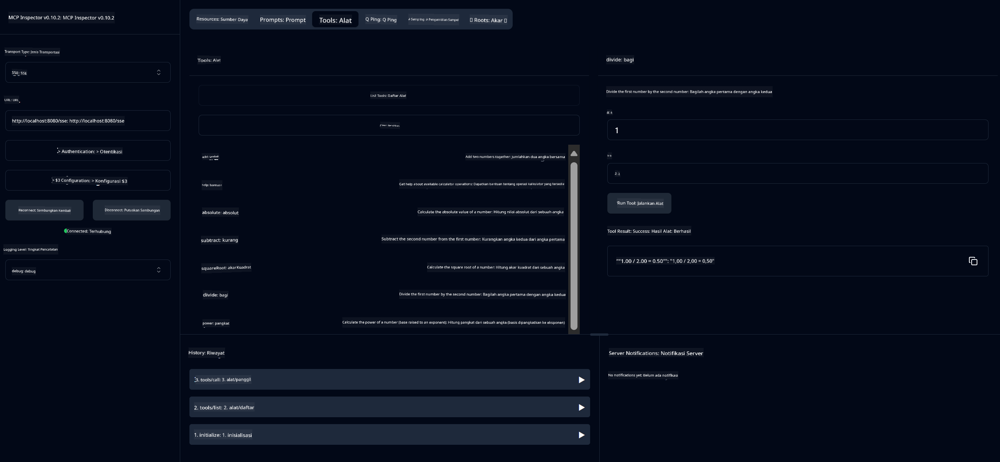

<!--
CO_OP_TRANSLATOR_METADATA:
{
  "original_hash": "ed9cab32cc67c12d8969b407aa47100a",
  "translation_date": "2025-07-13T17:55:38+00:00",
  "source_file": "03-GettingStarted/01-first-server/solution/java/README.md",
  "language_code": "id"
}
-->
# Basic Calculator MCP Service

Layanan ini menyediakan operasi kalkulator dasar melalui Model Context Protocol (MCP) menggunakan Spring Boot dengan transport WebFlux. Ini dirancang sebagai contoh sederhana untuk pemula yang belajar tentang implementasi MCP.

Untuk informasi lebih lanjut, lihat dokumentasi referensi [MCP Server Boot Starter](https://docs.spring.io/spring-ai/reference/api/mcp/mcp-server-boot-starter-docs.html).


## Menggunakan Layanan

Layanan ini menyediakan endpoint API berikut melalui protokol MCP:

- `add(a, b)`: Menjumlahkan dua angka
- `subtract(a, b)`: Mengurangi angka kedua dari angka pertama
- `multiply(a, b)`: Mengalikan dua angka
- `divide(a, b)`: Membagi angka pertama dengan angka kedua (dengan pengecekan nol)
- `power(base, exponent)`: Menghitung pangkat sebuah angka
- `squareRoot(number)`: Menghitung akar kuadrat (dengan pengecekan angka negatif)
- `modulus(a, b)`: Menghitung sisa pembagian
- `absolute(number)`: Menghitung nilai mutlak

## Dependensi

Proyek ini membutuhkan dependensi utama berikut:

```xml
<dependency>
    <groupId>org.springframework.ai</groupId>
    <artifactId>spring-ai-starter-mcp-server-webflux</artifactId>
</dependency>
```

## Membangun Proyek

Bangun proyek menggunakan Maven:
```bash
./mvnw clean install -DskipTests
```

## Menjalankan Server

### Menggunakan Java

```bash
java -jar target/calculator-server-0.0.1-SNAPSHOT.jar
```

### Menggunakan MCP Inspector

MCP Inspector adalah alat yang berguna untuk berinteraksi dengan layanan MCP. Untuk menggunakannya dengan layanan kalkulator ini:

1. **Instal dan jalankan MCP Inspector** di jendela terminal baru:
   ```bash
   npx @modelcontextprotocol/inspector
   ```

2. **Akses UI web** dengan mengklik URL yang ditampilkan oleh aplikasi (biasanya http://localhost:6274)

3. **Konfigurasikan koneksi**:
   - Atur tipe transport ke "SSE"
   - Atur URL ke endpoint SSE server yang sedang berjalan: `http://localhost:8080/sse`
   - Klik "Connect"

4. **Gunakan alatnya**:
   - Klik "List Tools" untuk melihat operasi kalkulator yang tersedia
   - Pilih alat dan klik "Run Tool" untuk menjalankan operasi



**Penafian**:  
Dokumen ini telah diterjemahkan menggunakan layanan terjemahan AI [Co-op Translator](https://github.com/Azure/co-op-translator). Meskipun kami berupaya untuk mencapai akurasi, harap diingat bahwa terjemahan otomatis mungkin mengandung kesalahan atau ketidakakuratan. Dokumen asli dalam bahasa aslinya harus dianggap sebagai sumber yang sahih. Untuk informasi penting, disarankan menggunakan terjemahan profesional oleh manusia. Kami tidak bertanggung jawab atas kesalahpahaman atau penafsiran yang keliru yang timbul dari penggunaan terjemahan ini.