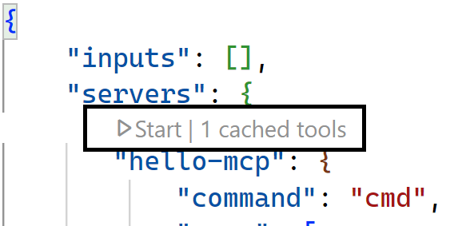
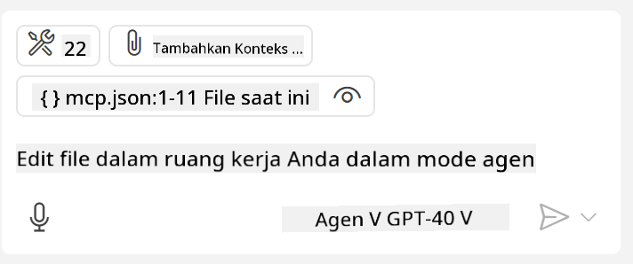
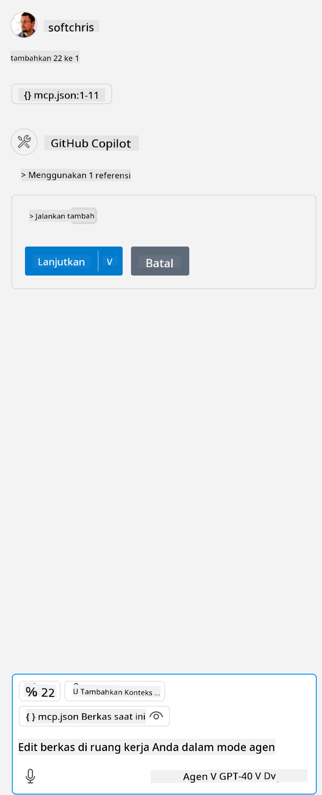

<!--
CO_OP_TRANSLATOR_METADATA:
{
  "original_hash": "c37fabfbc0dcbc9a4afb6d17e7d3be9f",
  "translation_date": "2025-05-17T11:12:28+00:00",
  "source_file": "03-GettingStarted/04-vscode/README.md",
  "language_code": "id"
}
-->
Mari kita bahas lebih lanjut tentang bagaimana kita menggunakan antarmuka visual di bagian selanjutnya.


## Pendekatan 

Berikut adalah cara kita mendekati ini pada tingkat tinggi:

- Konfigurasi file untuk menemukan MCP Server kita.
- Memulai/Menghubungkan ke server tersebut untuk melihat daftar kemampuannya.
- Menggunakan kemampuan tersebut melalui antarmuka obrolan GitHub Copilot.

Bagus, sekarang kita memahami alurnya, mari kita coba menggunakan MCP Server melalui Visual Studio Code melalui sebuah latihan.

## Latihan: Menggunakan server

Dalam latihan ini, kita akan mengonfigurasi Visual Studio Code untuk menemukan MCP server Anda sehingga dapat digunakan dari antarmuka obrolan GitHub Copilot.

### -0- Langkah awal, aktifkan penemuan MCP Server

Anda mungkin perlu mengaktifkan penemuan MCP Servers.

1. Pergi ke `File -> Preferences -> Settings` in Visual Studio Code.

1. Search for "MCP" and enable `chat.mcp.discovery.enabled` di file settings.json.

### -1- Buat file konfigurasi

Mulailah dengan membuat file konfigurasi di root proyek Anda, Anda akan memerlukan file bernama MCP.json dan menempatkannya di folder bernama .vscode. Seharusnya terlihat seperti ini:

```text
.vscode
|-- mcp.json
```

Selanjutnya, mari kita lihat bagaimana kita dapat menambahkan entri server.

### -2- Konfigurasi server

Tambahkan konten berikut ke *mcp.json*:

```json
{
    "inputs": [],
    "servers": {
       "hello-mcp": {
           "command": "cmd",
           "args": [
               "/c", "node", "<absolute path>\\build\\index.js"
           ]
       }
    }
}
```

Berikut adalah contoh sederhana bagaimana memulai server yang ditulis dalam Node.js, untuk runtime lainnya tunjukkan perintah yang tepat untuk memulai server menggunakan `command` and `args`.

### -3- Memulai server

Sekarang setelah Anda menambahkan entri, mari kita mulai server:

1. Temukan entri Anda di *mcp.json* dan pastikan Anda menemukan ikon "play":

    

1. Klik ikon "play", Anda harus melihat ikon alat di obrolan GitHub Copilot meningkatkan jumlah alat yang tersedia. Jika Anda mengklik ikon alat tersebut, Anda akan melihat daftar alat yang terdaftar. Anda dapat mencentang/menyilang setiap alat tergantung apakah Anda ingin GitHub Copilot menggunakannya sebagai konteks: 

  

1. Untuk menjalankan alat, ketikkan prompt yang Anda tahu akan sesuai dengan deskripsi salah satu alat Anda, misalnya prompt seperti ini "tambahkan 22 ke 1":

  

  Anda harus melihat respons mengatakan 23.

## Tugas

Coba tambahkan entri server ke file *mcp.json* Anda dan pastikan Anda dapat memulai/menghentikan server. Pastikan Anda juga dapat berkomunikasi dengan alat di server Anda melalui antarmuka obrolan GitHub Copilot.

## Solusi

[Solusi](./solution/README.md)

## Kesimpulan Penting

Kesimpulan dari bab ini adalah sebagai berikut:

- Visual Studio Code adalah klien yang hebat yang memungkinkan Anda menggunakan beberapa MCP Servers dan alat mereka.
- Antarmuka obrolan GitHub Copilot adalah cara Anda berinteraksi dengan server.
- Anda dapat meminta pengguna untuk memasukkan seperti kunci API yang dapat diteruskan ke MCP Server saat mengonfigurasi entri server di file *mcp.json*.

## Contoh 

- [Kalkulator Java](../samples/java/calculator/README.md)
- [Kalkulator .Net](../../../../03-GettingStarted/samples/csharp)
- [Kalkulator JavaScript](../samples/javascript/README.md)
- [Kalkulator TypeScript](../samples/typescript/README.md)
- [Kalkulator Python](../../../../03-GettingStarted/samples/python) 

## Sumber Daya Tambahan

- [Dokumentasi Visual Studio](https://code.visualstudio.com/docs/copilot/chat/mcp-servers)

## Selanjutnya

- Selanjutnya: [Membuat SSE Server](/03-GettingStarted/05-sse-server/README.md)

**Penafian**:  
Dokumen ini telah diterjemahkan menggunakan layanan penerjemahan AI [Co-op Translator](https://github.com/Azure/co-op-translator). Meskipun kami berusaha untuk mencapai ketepatan, harap diingat bahwa terjemahan otomatis mungkin mengandung kesalahan atau ketidakakuratan. Dokumen asli dalam bahasa aslinya harus dianggap sebagai sumber yang otoritatif. Untuk informasi yang penting, disarankan untuk menggunakan jasa penerjemahan manusia profesional. Kami tidak bertanggung jawab atas kesalahpahaman atau penafsiran yang salah yang timbul dari penggunaan terjemahan ini.