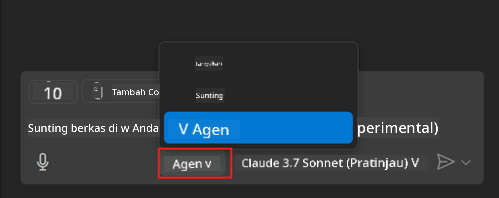
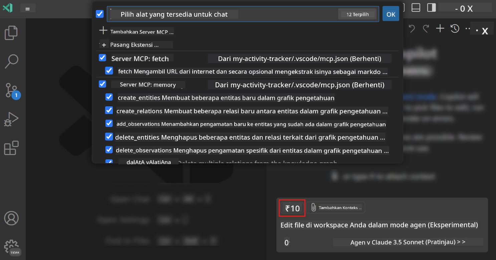
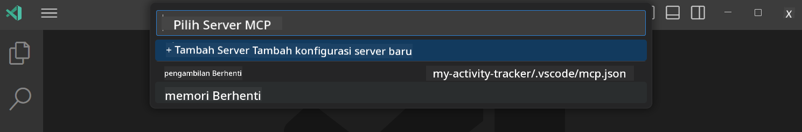
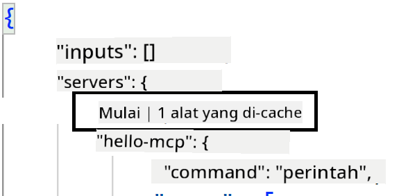
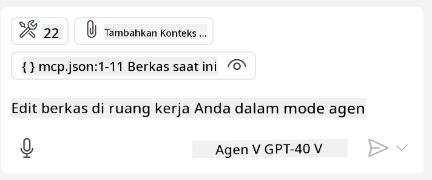

<!--
CO_OP_TRANSLATOR_METADATA:
{
  "original_hash": "d940b5e0af75e3a3a4d1c3179120d1d9",
  "translation_date": "2025-08-26T18:04:04+00:00",
  "source_file": "03-GettingStarted/04-vscode/README.md",
  "language_code": "id"
}
-->
# Menggunakan Server dari GitHub Copilot dalam Mode Agen

Visual Studio Code dan GitHub Copilot dapat berfungsi sebagai klien dan menggunakan MCP Server. Mengapa kita ingin melakukannya, Anda mungkin bertanya? Nah, itu berarti fitur apa pun yang dimiliki MCP Server sekarang dapat digunakan langsung dari dalam IDE Anda. Bayangkan Anda menambahkan, misalnya, server MCP GitHub, ini akan memungkinkan Anda mengontrol GitHub melalui perintah berbasis prompt alih-alih mengetik perintah tertentu di terminal. Atau bayangkan hal lain secara umum yang dapat meningkatkan pengalaman pengembang Anda, semuanya dikendalikan oleh bahasa alami. Sekarang Anda mulai melihat keuntungannya, bukan?

## Gambaran Umum

Pelajaran ini membahas cara menggunakan Visual Studio Code dan mode Agen GitHub Copilot sebagai klien untuk MCP Server.

## Tujuan Pembelajaran

Pada akhir pelajaran ini, Anda akan dapat:

- Menggunakan MCP Server melalui Visual Studio Code.
- Menjalankan fitur seperti alat melalui GitHub Copilot.
- Mengonfigurasi Visual Studio Code untuk menemukan dan mengelola MCP Server Anda.

## Penggunaan

Anda dapat mengontrol MCP Server Anda dengan dua cara berbeda:

- Antarmuka pengguna, Anda akan melihat bagaimana ini dilakukan nanti di bab ini.
- Terminal, dimungkinkan untuk mengontrol hal-hal dari terminal menggunakan eksekusi `code`:

  Untuk menambahkan MCP Server ke profil pengguna Anda, gunakan opsi baris perintah --add-mcp, dan berikan konfigurasi server JSON dalam bentuk {\"name\":\"server-name\",\"command\":...}.

  ```
  code --add-mcp "{\"name\":\"my-server\",\"command\": \"uvx\",\"args\": [\"mcp-server-fetch\"]}"
  ```

### Tangkapan Layar





Mari kita bahas lebih lanjut tentang bagaimana kita menggunakan antarmuka visual di bagian berikutnya.

## Pendekatan

Berikut adalah pendekatan yang perlu kita ambil secara garis besar:

- Konfigurasikan file untuk menemukan MCP Server kita.
- Jalankan/Koneksikan ke server tersebut untuk melihat daftar fiturnya.
- Gunakan fitur tersebut melalui antarmuka Chat GitHub Copilot.

Bagus, sekarang kita memahami alurnya, mari kita coba menggunakan MCP Server melalui Visual Studio Code melalui sebuah latihan.

## Latihan: Menggunakan Server

Dalam latihan ini, kita akan mengonfigurasi Visual Studio Code untuk menemukan MCP Server Anda sehingga dapat digunakan melalui antarmuka Chat GitHub Copilot.

### -0- Langkah Awal, aktifkan penemuan MCP Server

Anda mungkin perlu mengaktifkan penemuan MCP Server.

1. Buka `File -> Preferences -> Settings` di Visual Studio Code.

1. Cari "MCP" dan aktifkan `chat.mcp.discovery.enabled` di file settings.json.

### -1- Buat file konfigurasi

Mulailah dengan membuat file konfigurasi di root proyek Anda, Anda memerlukan file bernama MCP.json dan menempatkannya di folder bernama .vscode. File tersebut seharusnya terlihat seperti ini:

```text
.vscode
|-- mcp.json
```

Selanjutnya, mari kita lihat bagaimana kita dapat menambahkan entri server.

### -2- Konfigurasikan server

Tambahkan konten berikut ke *mcp.json*:

```json
{
    "inputs": [],
    "servers": {
       "hello-mcp": {
           "command": "node",
           "args": [
               "build/index.js"
           ]
       }
    }
}
```

Contoh sederhana di atas menunjukkan cara memulai server yang ditulis dalam Node.js, untuk runtime lain tunjukkan perintah yang sesuai untuk memulai server menggunakan `command` dan `args`.

### -3- Jalankan server

Sekarang setelah Anda menambahkan entri, mari kita jalankan server:

1. Temukan entri Anda di *mcp.json* dan pastikan Anda menemukan ikon "play":

    

1. Klik ikon "play", Anda akan melihat ikon alat di GitHub Copilot Chat menambah jumlah alat yang tersedia. Jika Anda mengklik ikon alat tersebut, Anda akan melihat daftar alat yang terdaftar. Anda dapat mencentang/menghapus centang setiap alat tergantung apakah Anda ingin GitHub Copilot menggunakannya sebagai konteks:

  

1. Untuk menjalankan alat, ketik prompt yang Anda tahu akan cocok dengan deskripsi salah satu alat Anda, misalnya prompt seperti ini "tambahkan 22 ke 1":

  

  Anda akan melihat respons yang mengatakan 23.

## Tugas

Cobalah menambahkan entri server ke file *mcp.json* Anda dan pastikan Anda dapat memulai/menghentikan server. Pastikan Anda juga dapat berkomunikasi dengan alat di server Anda melalui antarmuka Chat GitHub Copilot.

## Solusi

[Solusi](./solution/README.md)

## Poin Penting

Poin-poin penting dari bab ini adalah sebagai berikut:

- Visual Studio Code adalah klien yang hebat yang memungkinkan Anda menggunakan beberapa MCP Server dan alatnya.
- Antarmuka Chat GitHub Copilot adalah cara Anda berinteraksi dengan server.
- Anda dapat meminta input dari pengguna seperti kunci API yang dapat diteruskan ke MCP Server saat mengonfigurasi entri server di file *mcp.json*.

## Contoh

- [Kalkulator Java](../samples/java/calculator/README.md)
- [Kalkulator .Net](../../../../03-GettingStarted/samples/csharp)
- [Kalkulator JavaScript](../samples/javascript/README.md)
- [Kalkulator TypeScript](../samples/typescript/README.md)
- [Kalkulator Python](../../../../03-GettingStarted/samples/python)

## Sumber Daya Tambahan

- [Dokumentasi Visual Studio](https://code.visualstudio.com/docs/copilot/chat/mcp-servers)

## Apa Selanjutnya

- Selanjutnya: [Membuat Server stdio](../05-stdio-server/README.md)

---

**Penafian**:  
Dokumen ini telah diterjemahkan menggunakan layanan penerjemahan AI [Co-op Translator](https://github.com/Azure/co-op-translator). Meskipun kami berusaha untuk memberikan hasil yang akurat, harap diingat bahwa terjemahan otomatis mungkin mengandung kesalahan atau ketidakakuratan. Dokumen asli dalam bahasa aslinya harus dianggap sebagai sumber yang otoritatif. Untuk informasi yang bersifat kritis, disarankan menggunakan jasa penerjemahan profesional oleh manusia. Kami tidak bertanggung jawab atas kesalahpahaman atau penafsiran yang keliru yang timbul dari penggunaan terjemahan ini.