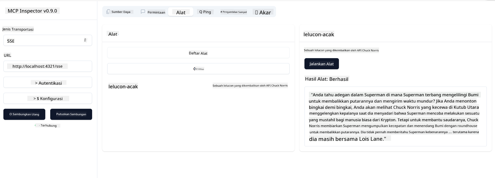

<!--
CO_OP_TRANSLATOR_METADATA:
{
  "original_hash": "0a8086dc4bf89448f83e7936db972c42",
  "translation_date": "2025-05-17T11:39:56+00:00",
  "source_file": "03-GettingStarted/05-sse-server/README.md",
  "language_code": "id"
}
-->
Sekarang setelah kita mengetahui lebih banyak tentang SSE, mari kita buat server SSE berikutnya.

## Latihan: Membuat Server SSE

Untuk membuat server kita, kita perlu mengingat dua hal:

- Kita perlu menggunakan server web untuk mengekspos endpoint untuk koneksi dan pesan.
- Bangun server kita seperti biasanya dengan alat, sumber daya, dan prompt saat kita menggunakan stdio.

### -1- Buat instance server

Untuk membuat server kita, kita menggunakan jenis yang sama seperti dengan stdio. Namun, untuk transportasi, kita perlu memilih SSE.

Mari tambahkan rute yang diperlukan berikutnya.

### -2- Tambahkan rute

Mari tambahkan rute berikutnya yang menangani koneksi dan pesan yang masuk:

Mari tambahkan kemampuan ke server berikutnya.

### -3- Menambahkan kemampuan server

Sekarang kita sudah mendefinisikan semua yang spesifik untuk SSE, mari tambahkan kemampuan server seperti alat, prompt, dan sumber daya.

Kode lengkap Anda harus terlihat seperti ini:

Bagus, kita memiliki server yang menggunakan SSE, mari kita coba berikutnya.

## Latihan: Debugging Server SSE dengan Inspector

Inspector adalah alat yang bagus yang kita lihat di pelajaran sebelumnya [Membuat server pertama Anda](/03-GettingStarted/01-first-server/README.md). Mari kita lihat apakah kita bisa menggunakan Inspector bahkan di sini:

### -1- Menjalankan inspector

Untuk menjalankan inspector, Anda harus memiliki server SSE yang berjalan, jadi mari kita lakukan itu berikutnya:

1. Jalankan server

1. Jalankan inspector

    > ![NOTE]
    > Jalankan ini di jendela terminal terpisah dari server yang sedang berjalan. Juga perhatikan, Anda perlu menyesuaikan perintah di bawah ini agar sesuai dengan URL tempat server Anda berjalan.

    ```sh
    npx @modelcontextprotocol/inspector --cli http://localhost:8000/sse --method tools/list
    ```

    Menjalankan inspector terlihat sama di semua runtime. Perhatikan bagaimana kita alih-alih melewati jalur ke server kita dan perintah untuk memulai server, kita malah melewati URL tempat server berjalan dan kita juga menentukan rute `/sse`.

### -2- Mencoba alat

Hubungkan server dengan memilih SSE di droplist dan isi bidang url tempat server Anda berjalan, misalnya http:localhost:4321/sse. Sekarang klik tombol "Connect". Seperti sebelumnya, pilih untuk daftar alat, pilih alat dan berikan nilai input. Anda harus melihat hasil seperti di bawah ini:



Bagus, Anda dapat bekerja dengan inspector, mari kita lihat bagaimana kita dapat bekerja dengan Visual Studio Code berikutnya.

## Tugas

Cobalah membangun server Anda dengan lebih banyak kemampuan. Lihat [halaman ini](https://api.chucknorris.io/) untuk misalnya menambahkan alat yang memanggil API, Anda memutuskan seperti apa server tersebut. Selamat bersenang-senang :)

## Solusi

[Solusi](./solution/README.md) Berikut adalah solusi yang mungkin dengan kode yang berfungsi.

## Kesimpulan Utama

Kesimpulan dari bab ini adalah sebagai berikut:

- SSE adalah transportasi kedua yang didukung selain stdio.
- Untuk mendukung SSE, Anda perlu mengelola koneksi dan pesan yang masuk menggunakan kerangka kerja web.
- Anda dapat menggunakan Inspector dan Visual Studio Code untuk mengonsumsi server SSE, seperti server stdio. Perhatikan bagaimana sedikit berbeda antara stdio dan SSE. Untuk SSE, Anda perlu memulai server secara terpisah dan kemudian menjalankan alat inspector Anda. Untuk alat inspector, ada juga beberapa perbedaan bahwa Anda perlu menentukan URL.

## Contoh

- [Java Calculator](../samples/java/calculator/README.md)
- [.Net Calculator](../../../../03-GettingStarted/samples/csharp)
- [JavaScript Calculator](../samples/javascript/README.md)
- [TypeScript Calculator](../samples/typescript/README.md)
- [Python Calculator](../../../../03-GettingStarted/samples/python)

## Sumber Daya Tambahan

- [SSE](https://developer.mozilla.org/en-US/docs/Web/API/Server-sent_events)

## Apa Selanjutnya

- Selanjutnya: [Memulai dengan AI Toolkit untuk VSCode](/03-GettingStarted/06-aitk/README.md)

**Penafian**:  
Dokumen ini telah diterjemahkan menggunakan layanan penerjemah AI [Co-op Translator](https://github.com/Azure/co-op-translator). Meskipun kami berusaha untuk akurasi, harap diketahui bahwa terjemahan otomatis mungkin mengandung kesalahan atau ketidakakuratan. Dokumen asli dalam bahasa aslinya harus dianggap sebagai sumber yang berwenang. Untuk informasi yang penting, disarankan untuk menggunakan terjemahan manusia profesional. Kami tidak bertanggung jawab atas kesalahpahaman atau salah tafsir yang timbul dari penggunaan terjemahan ini.